+++
title = "關於我"
description = "Hugo, the world's fastest framework for building websites"
date = "2024-01-01"
aliases = ["about-us", "about-hugo", "contact"]
author = "Hugo Authors"
+++

<ul>
    <li style="--accent-color:#41516C">
        
2005-10

        
北榮急診訓練

        
住院醫師生活，就是住在醫院旁邊，上班瘋狂接病人、下班躺平睡覺。自己買的車，大概就是一個月開一次，放停車場會放到電瓶沒電這樣😅
        感謝北榮四年精實的訓練，讓我出去闖趟江湖時，不會害怕。

    </li>
    <li style="--accent-color:#FBCA3E">
        
2010-7

        
離開北榮，下鄉囉-竹榮

        
來到竹東榮民醫院服務，台68線的尾端的一間地區醫院。內、外科的病患數接近1:1。院內有許多院貓可以餵食，可是被某長官認為會傳染疾病，都給抓走關籠了。很有印象的幾件事包括了，眼鏡蛇來我家門口、竹東客家市場好吃美食，以及去樂山雷達站幫忙開診。

    </li>
    <li style="--accent-color:#E24A68">
        
2011-12

        
離開竹榮，來去東部行醫-玉榮

        
在東部大概待了約4年。這邊常常會自嘲，好山、好水，好無聊。但東部的泥土，真的會黏人。這裡的天空、空氣，就是和其他地方不一樣。一種很舒服，想要一直待下去的感覺。晚上只要走出戶外，就可以看到滿天星斗。玉里大西瓜、玉里麵、池上大坡池、富里稻草、台東鹿野。每次只要一休假，不是往南就是往北開去探險，享受大自然美景。謝謝東部四年來給我一輩子的好回憶。

    </li>
    <li style="--accent-color:#1B5F8C">
        
2015-10

        
陽交大附醫

        
為了讓兩位小孩接受體制外的教育，再度離開了熟悉的環境，踏上了陌生的旅途。買了人生中的第一間房。田中央農舍。也經歷過好幾次大颱風，中間的酸甜苦辣，我已經不知道該如何言語了。只能感謝上天，珍惜現在擁有的一切。離現在2024已經過了第七個年頭，有時會想想，自己還有多少年能覺得急診這個職業，可以繼續往下走呢?

    </li>
    <li style="--accent-color:#4CADAD">
        
2024

        
待續

        
會有另外一條道路出現，等我走過去嗎?

    </li>
</ul>

眼鏡蛇來我家事件，請見[此篇](https://agoodbear.github.io/post/erlife-post-1/)

---

# <mark>熊專長與證書</mark>

中華民國醫師

中華民國急診專科醫師

ACLS instructor

SSI Open Water Diver(OWD)

EMC2 Emergency Medicine Cardiology Course

超音波輔助之急性疼痛處置工作坊-基礎與進階研習證書

# <mark>斜槓熊生</mark>

# <mark>熊得獎紀錄</mark>

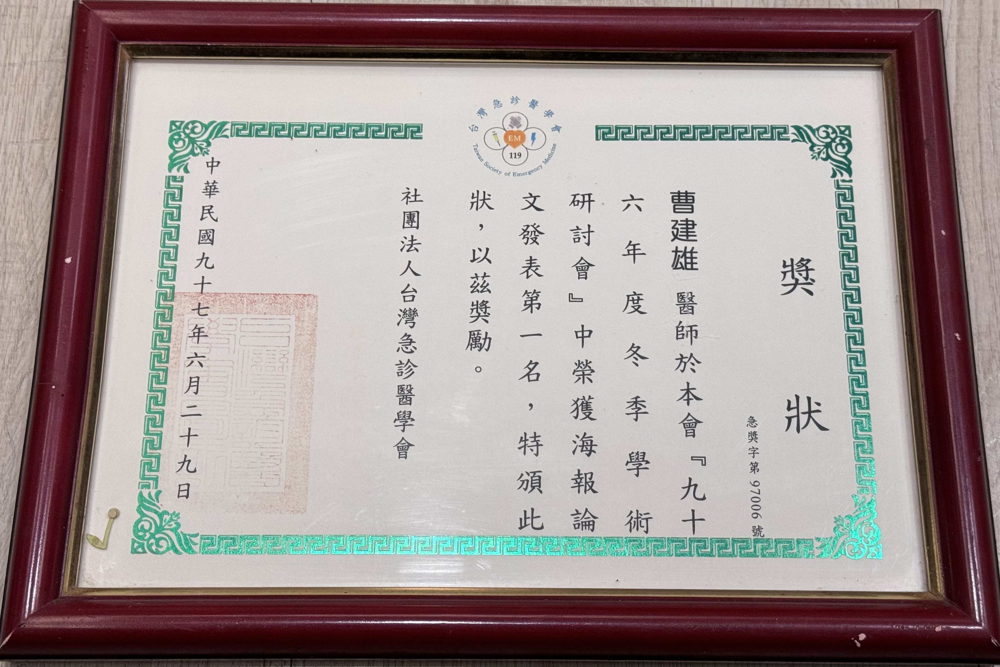

# <mark>熊の創作與翻譯</mark>

1. [Non-compressibility ratio of sonography in deep venous thrombosis.](https://pubmed.ncbi.nlm.nih.gov/21093823/) **Tsao JH**, Tseng CY, Chuang JL, Chen YC, Huang HH, Chou YH, Tiu CM, Yen DH.J Chin Med Assoc. 2010 Nov;73(11):563-7. doi: 10.1016/S1726-490z1(10)70124-6.PMID: 21093823 Free article.

2. [Atrioventricular conduction abnormality and hyperchloremic metabolic acidosis in toluene sniffing.](https://pubmed.ncbi.nlm.nih.gov/21982470/) **Tsao JH**, Hu YH, How CK, Chern CH, Hung-Tsang Yen D, Huang CI.J Formos Med Assoc. 2011 Oct;110(10):652-4. doi: 10.1016/j.jfma.2011.08.008. Epub 2011 Sep 9.PMID: 21982470 Free article.

3. [Embolic occlusion of the aorta caused by cardiac myxoma.](https://pubmed.ncbi.nlm.nih.gov/20189704/) **Tsao JH**, Lo HC, How CK, Yen DH, Huang CI.Resuscitation. 2010 May;81(5):511. doi: 10.1016/j.resuscitation.2010.01.026. Epub 2010 Mar 1.PMID: 20189704 No abstract available.

4. 協助ECG大師[Emre Aslanger](https://twitter.com/AslangerE)翻譯**OMI Toolbox(繁體中文版)**

Andrid版本: [下載連結](https://play.google.com/store/apps/details?id=com.adriva.cardio)

iOS版本: [下載連結](https://apps.apple.com/us/app/omi-toolbox/id6443695985?itsct=apps_box_link&itscg=30200) (台灣的Apple store不行下載，需要改到US/UK/Turkiye)

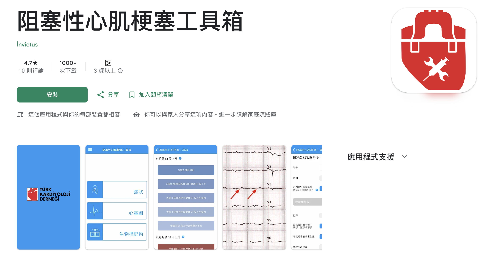

5. 急診醫學(第二版)-胸痛章節

# <mark>電視熊專輯</mark>

<iframe width="900" height="500" src="https://www.youtube.com/embed/HIEWV2O3iYg?si=CaO98MSaxV05KBje" title="YouTube video player" frameborder="0" allow="accelerometer; autoplay; clipboard-write; encrypted-media; gyroscope; picture-in-picture; web-share" allowfullscreen></iframe>

---

<iframe width="900" height="500" src="https://www.youtube.com/embed/nW5l2Bwy024?si=ZH-2_C9hRggtmta6" title="YouTube video player" frameborder="0" allow="accelerometer; autoplay; clipboard-write; encrypted-media; gyroscope; picture-in-picture; web-share" allowfullscreen></iframe>

---

<iframe width="900" height="500" src="https://www.youtube.com/embed/aO9wVYo5bj4?si=UJJMwQU8Aj78x-un" title="YouTube video player" frameborder="0" allow="accelerometer; autoplay; clipboard-write; encrypted-media; gyroscope; picture-in-picture; web-share" allowfullscreen></iframe>

---

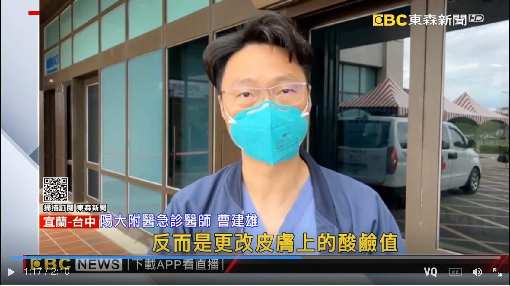

[1分10秒出現XD](https://tw.tv.yahoo.com/%E8%A1%9D%E6%B5%AA%E5%A5%B3%E5%AD%A9%E8%90%BD%E6%B5%B7%E7%8C%9B%E5%88%BA%E7%97%9B-%E4%B8%8A%E5%B2%B8%E6%89%8B%E8%85%95%E8%85%AB%E7%97%9B-%E5%87%B6%E6%89%8B%E6%98%AF%E6%B0%B4%E6%AF%8D-073531868.html)

---

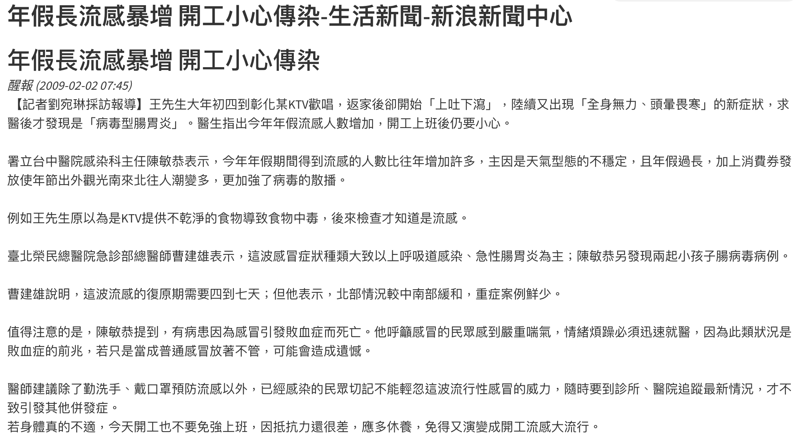

---

# <mark>講師熊系列</mark>

## <mark style="background-color: lightblue">2020/7 醫學資訊的利用(北區聯合住院醫師訓練)</mark> 

 

---

## <mark style="background-color: lightblue">2021 外傷超音波應用-外傷進階教育</mark>

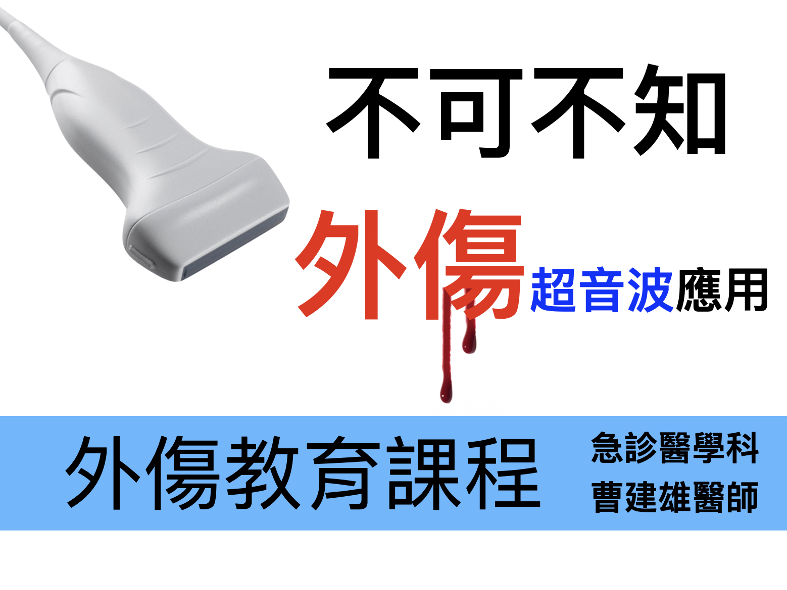

---

## <mark style="background-color: lightblue">2021/11/23 新光醫院演講</mark>

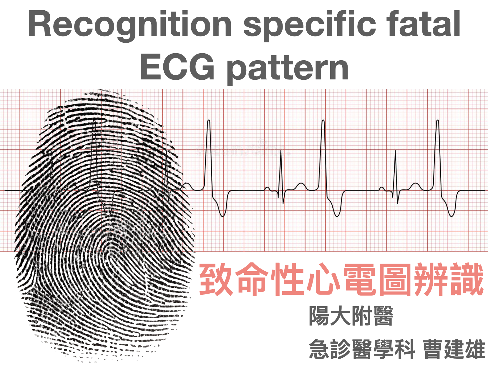

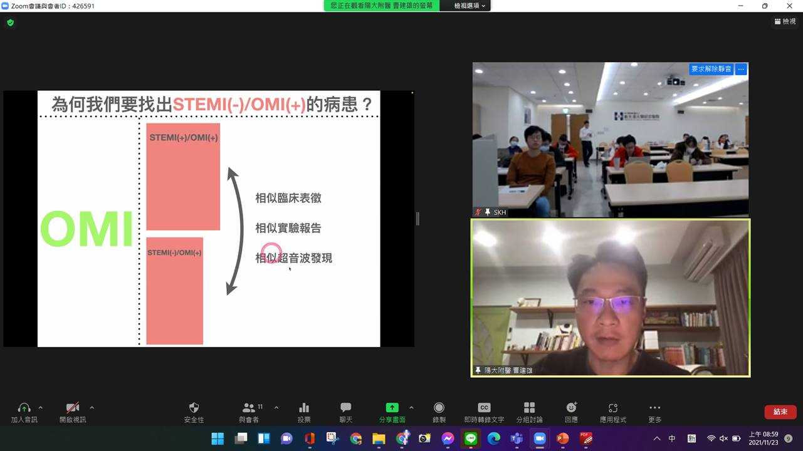

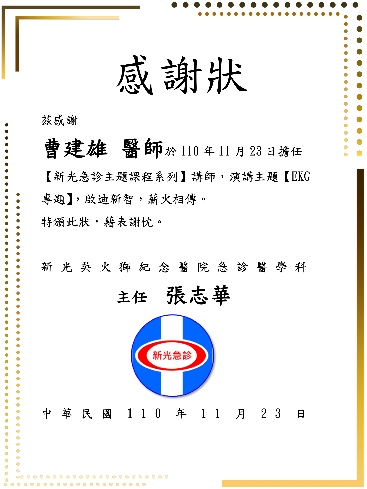

---

## <mark style="background-color: lightblue">2022/10/20 北榮急診住院醫師教學</mark>

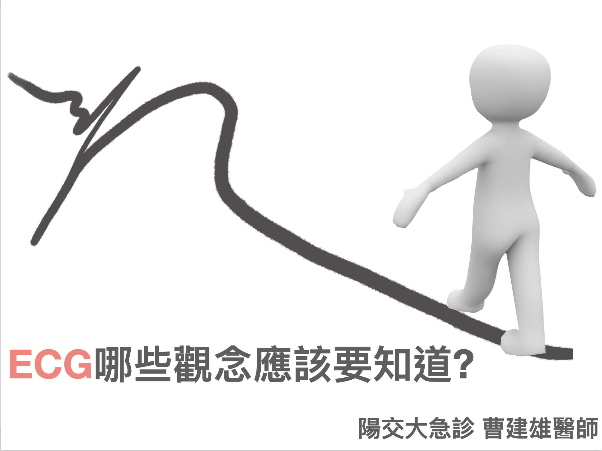

---

## <mark style="background-color: lightblue">2022/10/27 大林慈濟ECG專題講座</mark>

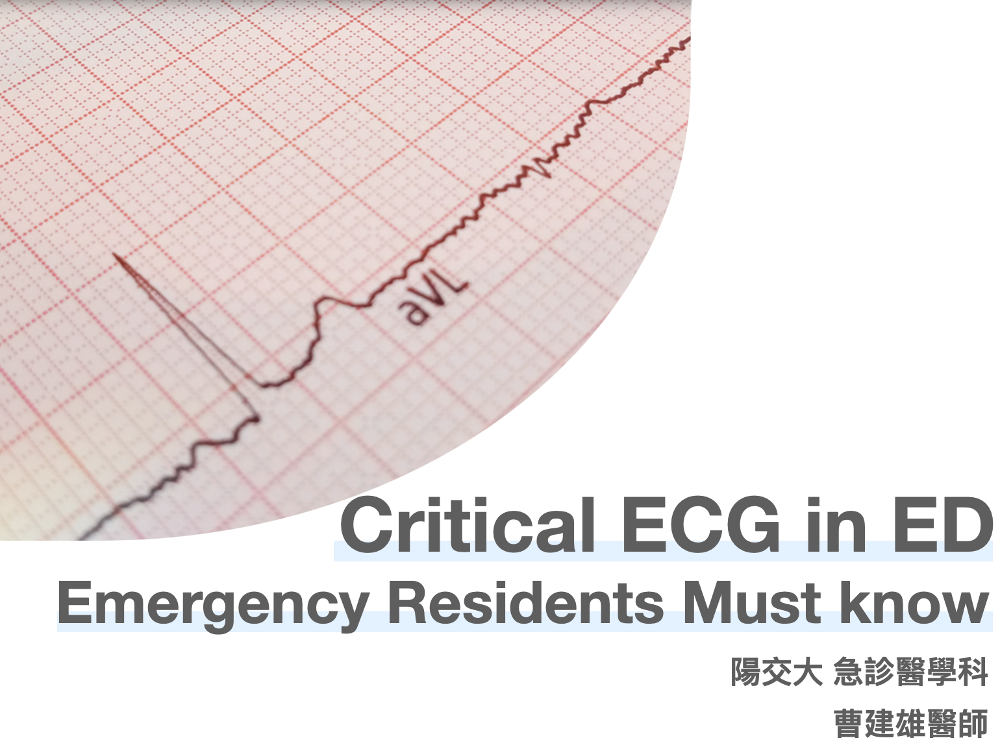

---

## <mark style="background-color: lightblue">2023-10-6 EMT-P心電圖工作坊</mark>

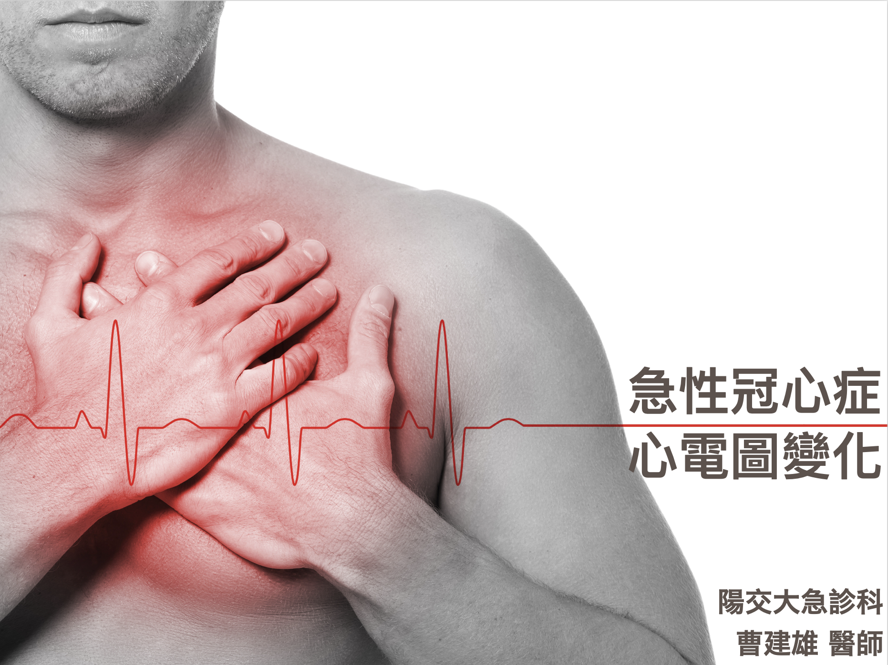

# <mark>攝影熊眼</mark>










