#### **A 67-year-old woman whose chief complaint is that she suddenly passed out while exercising just now.**

There are lots of causes of syncope, but **the final common pathway is an interruption of cerebral blood flow for about 10 seconds** [^1].

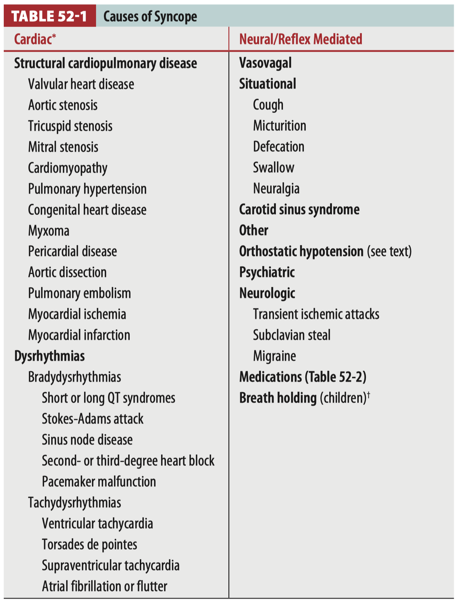

The table above comes from Auntie Tintinalli's pillow (yes, the Tintinalli textbook) [^1].

The most common causes of syncope are vasovagal (21%), cardiac (10%), orthostatic (9%), medication related (7%), neurologic (4%), and unknown (37%).

**The diagnosis matters, because each diagnostic category carries its own prognostic risk**. For example, cardiac syncope doubles the risk of death, neurologic syncope increases the risk of death by 50%, and syncope of unknown cause increases the risk of death by 30% [^1].

Treatment of syncope depends on the diagnosis. For example, in a patient suspected of drug-induced syncope, the offending drug should be stopped.

#### What Auntie Tintinalli wrote: **the final common pathway is an interruption of cerebral blood flow for about 10 seconds**

But some arrhythmias don't stop the heart for 10 seconds, right? So why the syncope?

That's because during an arrhythmia, cardiac function can be significantly impaired, causing a sudden, drastic drop in cardiac output, which in turn affects blood supply to the brain. The blood pumped by one heart has to supply so many vital organs throughout the body. When overall cardiac output falls a lot, of course much less blood reaches the brain too, to the point that cerebral blood flow is almost cut off.

Also, seizure and syncope are easy to mix up. Syncope is sometimes mistaken for a seizure attack, but they're two different conditions. Both can involve body jerking, but their causes are different.

To tell them apart, you can use the history, symptoms before and after the episode, and witness accounts. For example, if the patient has a history of epilepsy, has an aura (like hallucinations), or is confused or has muscle soreness afterward, it's more likely a seizure. On the other hand, if the patient felt nauseated and broke into a cold sweat before the episode, it's more likely vasovagal (the most common type of fainting). Witness accounts, such as whether the patient had head turning or abnormal posturing, and how long it took to regain consciousness afterward, also help.

After a seizure attack, patients usually go through a period of confusion, the **postictal state**, which can last anywhere from a few minutes to a few hours. In contrast, recovery of consciousness after syncope is usually faster; patients are typically fully alert within seconds to minutes.

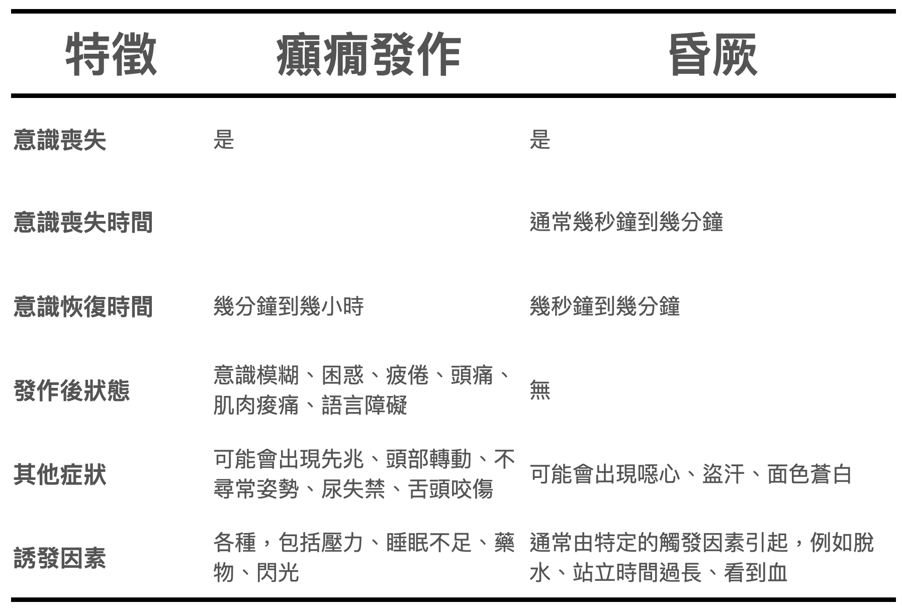

Also, **this ACEP article says that when evaluating syncope, Step 1 is to distinguish syncope from seizure** [^2]

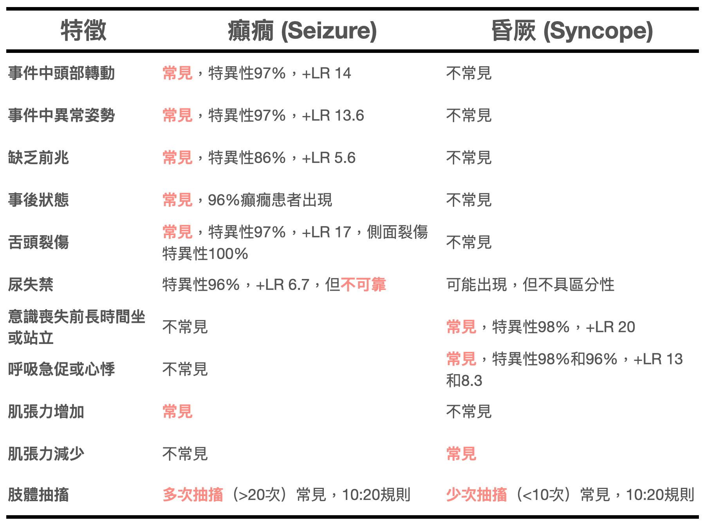

One thing worth pointing out from the article, possibly a common clinical pitfall: urinary incontinence. According to one review, its specificity for seizure reached 96%, but later studies found it isn't reliable [^2]!!!

---

### Back to the main topic~~

Whether it's syncope or a seizure attack, **the ECG is a very important tool for rapid assessment**.

Amal Mattu often says in his ECG Weekly lectures that you should get an ECG in both of these situations.

The 2017 ACC/AHA Guideline for the Evaluation and Management of Patients with Syncope states that **for syncope, the initial history, physical exam, and ECG are all Class I recommendations** (see the table below) [^3].

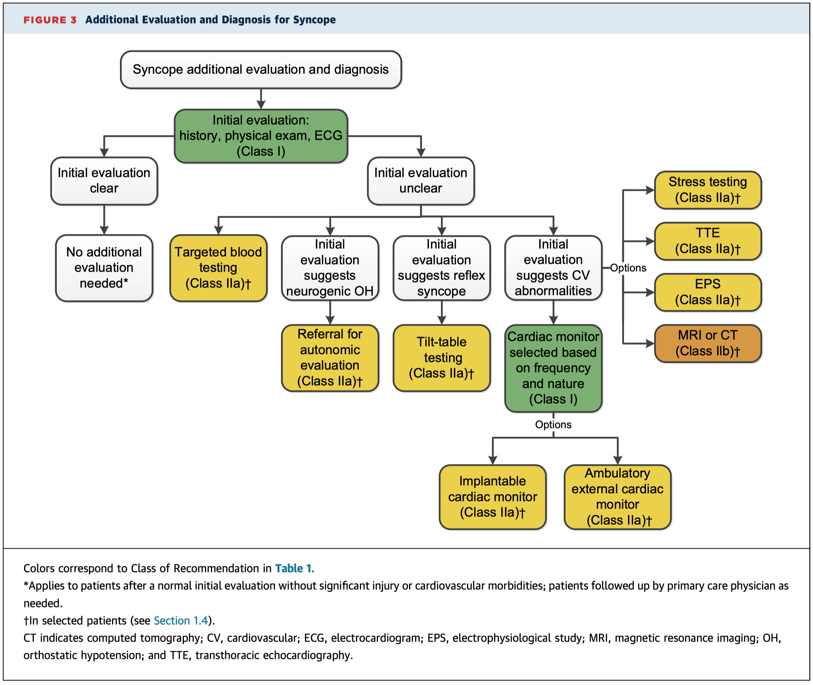

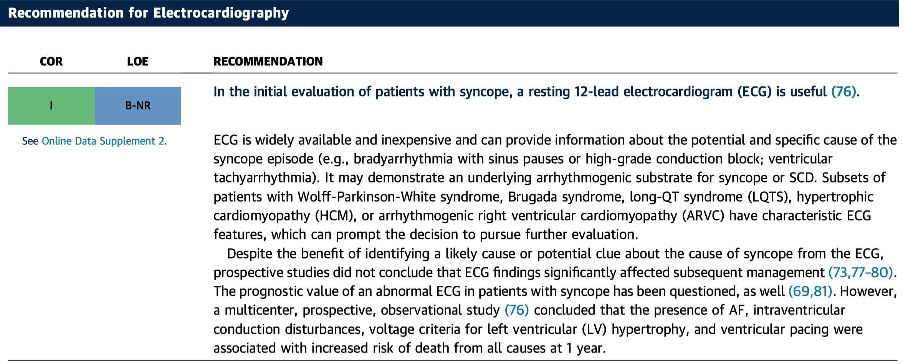

#### **Here's this 67-year-old patient's ECG on arrival:**

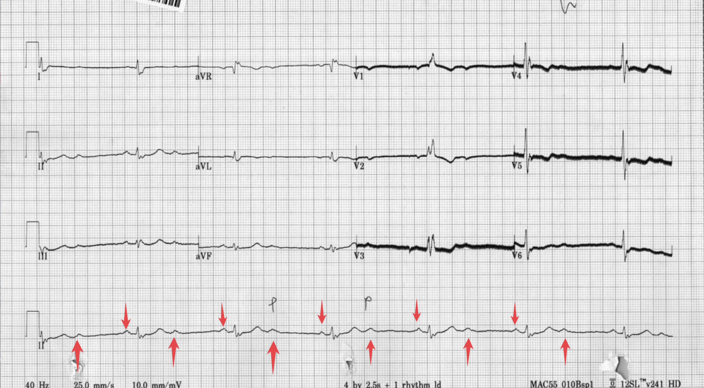

**Rate:** 42 bpm

**Rhythm:** SR, but with extra P waves ➔ you can see another P wave after the T wave. **This P isn't immediately followed by a QRS, meaning the atrial impulse went down but didn't make it to the ventricle; the conduction just dropped**

- The PP intervals are all regular. This is a classic 2:1 AVB

**Axis:** normal axis

**Interval:** No QT prolong

**Ischemia:** RBBB pattern, but no ST deviation seen

But the J point here seems to sit on the isoelectric baseline. Be careful.

**Careful about what?**

#### **First let me go off on a tangent: how do you assess for OMI (Occlusion MI) in LBBB and RBBB?**

- #### **Assessing LBBB for OMI ➔ use these three:**

  - Criteria A of the Sgarbossa criteria
  - Criteria B of the Sgarbossa criteria
  - Dr. Smith's modification of the original criteria C into the Modified Sgarbossa criteria

- #### **Assessing RBBB for OMI:**

  - Dr. Smith has said on his blog that RBBB shouldn't have any discordant ST deviation, except that V1-V3 can have discordant STD (up to 1 mm), which is normal. Also, the lateral leads shouldn't have any STE [^4]
  - Generally an RBBB pattern shows rsR'. As long as the R' on the right is taller than the r on the left, discordant STD tends to show up. If you find there's no discordant STD, you should worry instead about whether some force is pulling the STD up flat to the isoelectric baseline or up into minimal STE (**meaning a possible septal-ant. MI**)

  #### **Bottom line: you shouldn't see any STE in RBBB. This is something Amal Mattu says in lecture all the time!!!! Write it down~~**

  **So careful about what?**

  This patient's ER arrival ECG is an RBBB pattern with rsR'. You'd expect to see STD, but the J point sits on the isoelectric baseline.

  So keep in mind: if this patient really does have ACS S/S, OMI has to go on the DDx.

  ---

  Before getting to what happened to the patient next, let's talk about what the ECG can actually do for us in syncope.

  I mentioned earlier that cardiac syncope accounts for 10% of all possible causes of syncope. Not a lot, but not a little either [^1].

  #### **So what are the key things to look for on the ECG?**

  First, let's look at the mnemonics out there, and then we'll pull it all together.

  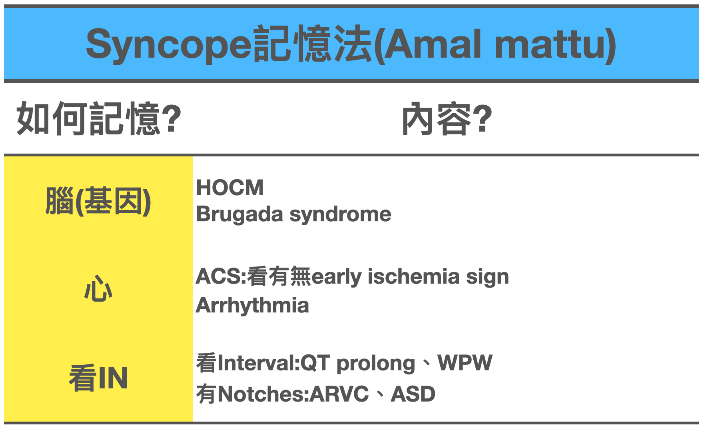

  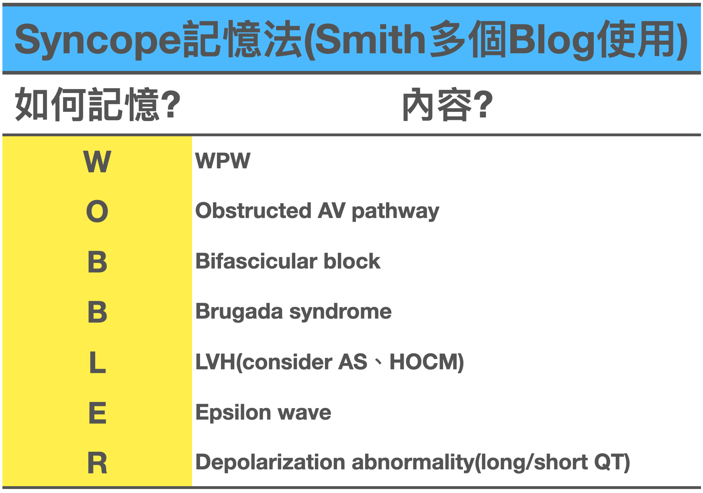

  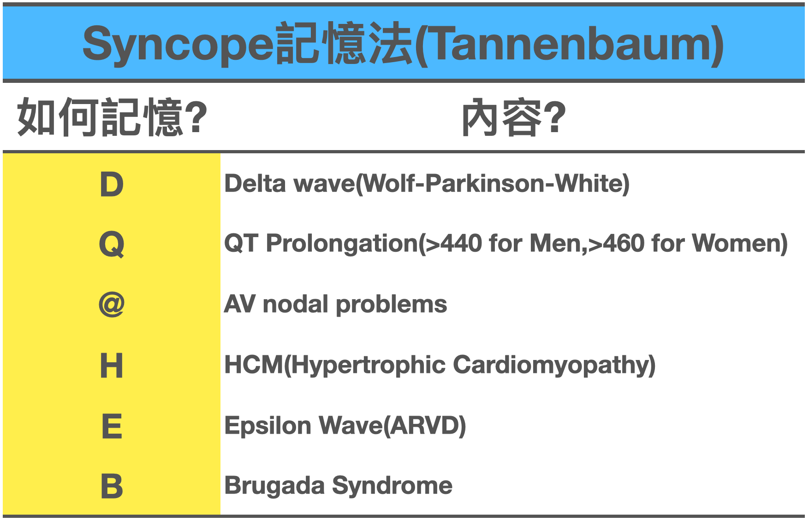

  The three tables above are commonly used syncope mnemonics.

  Memorize whichever one you like best!

  #### **Personally, I'm used to the first one, Amal Mattu's mnemonic.**

  So the explanations below are all based on the first one.

  ---

  #### <mark>**Brain (genetic problems) ➔ the way I remember it is: diseases that may be genetic**</mark>

  - **HOCM**

    - Mostly male

    - high voltage

    - Has deep narrow Q waves (especially lateral leads & inf.leads)

  - **Brugada syndrome**

    - Coved STE with TWI in V1-V2 like the figure below (**burn this ECG pattern into your brain**)

    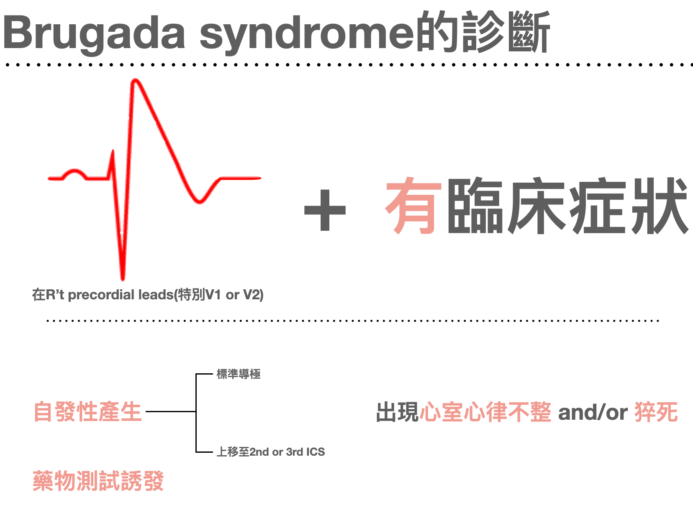

#### <mark>**Heart ➔ the way I remember it is: diseases that may be cardiac (Amal Mattu often calls this category a no brainer, the one you know without even thinking)**</mark>

- **ACS ➔ look for early ischemia signs**
- **Arrhythmia ➔ fast, slow, irregular, any of these arrhythmias can make a patient pass out**

#### <mark>**Look at the intervals ➔ check for abnormal intervals**</mark>

- **Look at the QT interval (QT prolong)** ➔ especially **QTc >500 ms**, which can go into TdP and make the patient pass out
- **Look for a short PR interval** ➔ the WPW triad includes: short PR interval, delta wave, wide QRS. If you see WPW + tachycardia, that's WPW syndrome; when the rhythm is Af, you get the famous Af+WPW, which puts the patient in an unstable state.

**A classic exam question: in Af+WPW, which drugs can't you give?** (**Giving them blocks the AV node even more, so all the conduction from the Af firing chaotically all over the atrium goes down the accessory pathway. Because the accessory pathway's refractory period is very short, it lets a lot of the atrial firing conduct down, and the ventricle can't take it and goes into Vf**)

1. adenosine, amiodarone
2. beta blocker
3. CCB
4. digoxin

#### <mark>**Look at the notches ➔ check for abnormal notches**</mark>

- **ARVC**
  - Lots of PVCs
  - May have LBBB type VT
  - **TWI in V1-3 (sensitive, 80% have it)**
  - **Epsilon wave (figure below) in any of V1-3 (specific, <1/3 of people have it)**

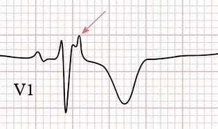

{}

1. The epsilon wave is a small positive deflection hidden in the terminal part of the QRS
2. It's mainly caused by ARVC, because **the RV myocytes are extensively replaced by fat, so only a few myocytes are left. That delays RV excitation, producing a small wiggle during the ST segment on the ECG**
3. It can also be seen in posterior OMI, RVMI, infiltration disease, sarcoidosis
4. **This wave is easiest to see in V1, V2** (mostly in leads V1~V4)

{}

Source for the key points above [^5]

#### **A joke Amal Mattu tells when he talks about the epsilon wave.**

He says that once at a talk, someone in the audience asked him how to tell an Osborn J wave from an epsilon wave.

Amal answered: with a thermometer.

- **ASD**
  - **Crochetage sign** in the inf.leads ➔ a notch on the R wave in the inf.leads

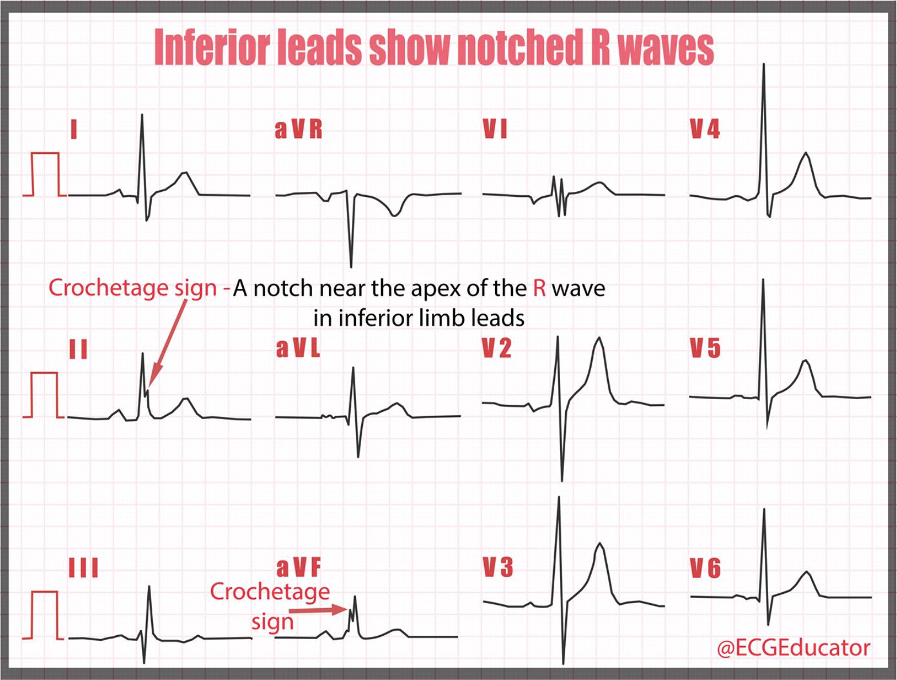

This article [^6] describes the key points about the crochetage sign:

#### **Atrial Septal Defect (ASD)**

- Two weeks after ASD repair surgery, the crochetage sign disappeared in about 50% of patients.
- **In 27% of ASD patients, all three inf.leads showed the crochetage sign.**
- **In 73% of ASD patients, at least one inf. lead showed the crochetage sign.**

The crochetage sign may also be seen in VSD and PS (pulmonary stenosis).

To sum up, these eight major cardiac causes that can lead to syncope all have to be actively ruled out once you've done the post-syncope ECG.

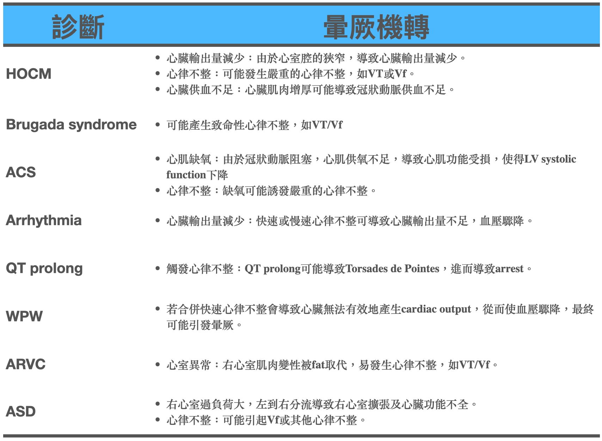

## **Back to the case**

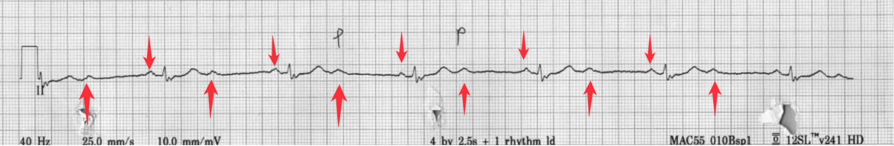

I pulled out the long lead II from the ER arrival ECG.

**This is 2:1 AVB. You can't call it Mobitz type 1, and you can't call it Mobitz type 2 either. Because the P wave after the T wave isn't followed by another QRS, you can't tell whether the relationship between P and QRS is getting progressively longer, or whether it's a fixed PR interval followed by a P wave with no QRS**

Let me go back to the most basic classification, which people often get confused about.

#### **AV block can be divided into these three categories:**

- 1st degree AVB
- 2nd degree AVB ➔ which can be further divided into these four
  1. Mobitz type 1
  2. Mobitz type 2
  3. 2:1 AVB ➔ yep, 2:1 AVB falls under the 2nd degree AVB category
  4. High grade AVB (≧3:1) ➔ also called high grade 2nd degree AVB
- 3rd degree AVB

In 2:1 AVB, distinguishing whether it's Mobitz type 1 or type 2 behavior has **important clinical significance** [^7].

Type 1 Mobitz behavior means a conduction delay in the AV node, with a lower likelihood of progressing to complete heart block.

Type 2 Mobitz behavior is more sinister, suggesting disease below the AV node, and may need a PPM.

Of course we can use prolonged ECG monitoring to see if we can catch at least two consecutive QRSs and the P-QRS relationship after them.

One key point here: having both Mobitz type 1 and type 2 in the same patient is very, very rare.

So you don't really need to worry about type 1 and type 2 alternating.

#### **So can you tell whether a 2:1 AVB leans more toward type 1 or type 2 behavior?**

<iframe width="560" height="315" src="https://www.youtube.com/embed/kmeHqJaoc3c?si=6Y0orW24WA5K65v3" title="YouTube video player" frameborder="0" allow="accelerometer; autoplay; clipboard-write; encrypted-media; gyroscope; picture-in-picture; web-share" referrerpolicy="strict-origin-when-cross-origin" allowfullscreen></iframe>

In this ECG60 YT link, there's a table you can refer to, below.

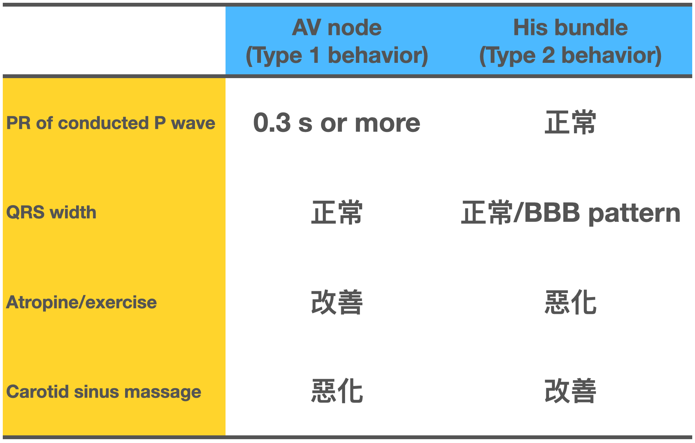

**Let me explain the third and fourth points in more detail; it makes them easier to understand and remember** [^7].

`First, the SA node and AV node are both very sensitive to sympathetic and parasympathetic (vagal) stimulation.`

`Then, below the AV node (His bundle), sympathetic influence dominates.`

Parasympathetic inhibition from atropine or sympathetic stimulation from exercise usually improves AV node conduction and Mobitz type 1 AVB.

In contrast, the increase in heart rate caused by these maneuvers (atropine/exercise) worsens Mobitz type 2 AVB, or has no effect.

Carotid sinus massage increases the vagal effect on the SA node and AV node and worsens Mobitz type 1 AVB. In Mobitz type 2 AVB, this maneuver improves conduction, or has no effect as the heart rate slows. That's mainly because this part of the conduction system (the His bundle) is less affected by the vagus and mainly controlled by the sympathetic system.

Why does doing carotid sinus massage in Mobitz type 2 AVB, which slows the heart rate, improve type 2 conduction? Because the slower rate may give the conduction system below the AV node more time to complete conduction (**more time to take it slow XD**).

## **Back to the case**

Four hours later, a follow-up ECG was done, below.

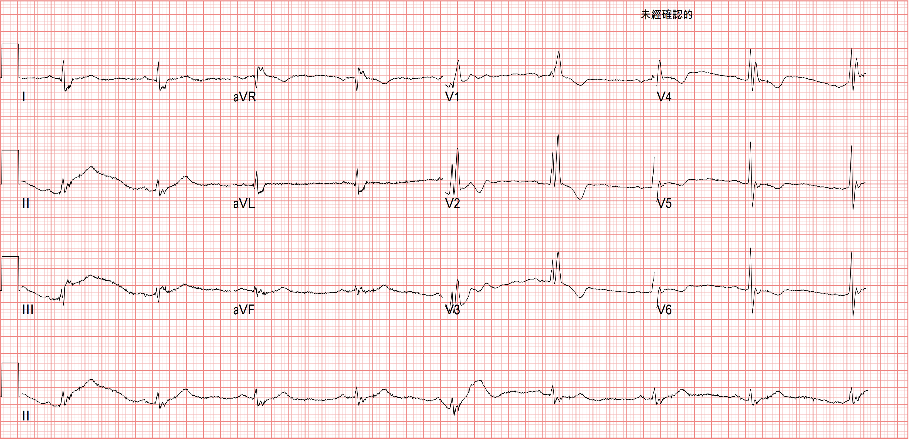

Looks like the 2:1 AVB is gone.

Not long after, the patient said she felt like she was about to pass out again.

The ECG monitor showed the following strip.

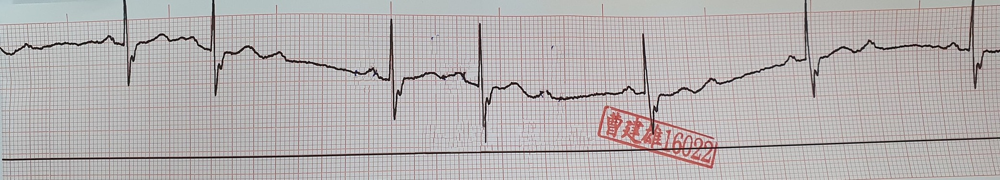

### **Got you!!!!!!**

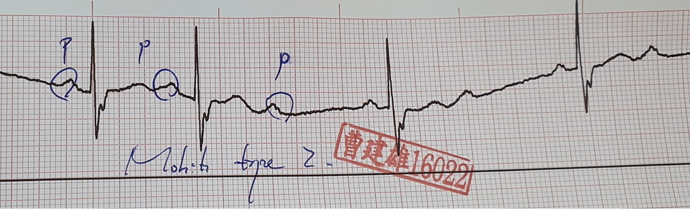

Finally two consecutive QRSs. Comparing the P-QRS relationship, you can tell the patient's 2:1 AVB was actually Mobitz type 2 behavior.

The CV man then took her for a PPM~~

## **Key learning points:**

1. For further evaluation of syncope, the history, physical exam, and ECG are all Class I recommendations, strongly recommended
2. How do you tell seizure from syncope (**note that urinary incontinence isn't reliable**)? (Step 1 in evaluating syncope is distinguishing whether it's a seizure)
3. How do you assess for OMI in RBBB/LBBB?
4. What do you look for on the ECG in cardiac syncope?
5. Faced with 2:1 AVB, how do you tell type 1 from type 2 behavior?

## **References:**

[^1]:Amazon.com: Tintinalli's Emergency Medicine: A Comprehensive Study Guide, 9th Edition: 9781405296434: Tintinalli, Judith E., Ma, O. John, Yealy, Donald, Meckler, Garth D., Stapczynski, J. Stephan, Cline, David M., Thomas, Stephen H. - [link](https://www.amazon.com/Tintinallis-Emergency-Medicine-Comprehensive-Study/dp/1260019934)
[^2]:Best Practices for Emergency Department Syncope Risk Assessment - ACEP Now - [link](https://www.acepnow.com/article/best-practices-for-emergency-department-syncope-risk-assessment/?singlepage=1)
[^3]:Shen, W.-K., Sheldon, R. S., Benditt, D. G., Cohen, M. I., Forman, D. E., Goldberger, Z. D., Grubb, B. P., Hamdan, M. H., Krahn, A. D., Link, M. S., Olshansky, B., Raj, S. R., Sandhu, R. K., Sorajja, D., Sun, B. C., & Yancy, C. W. (2017). 2017 ACC/AHA/HRS Guideline for the Evaluation and Management of Patients With Syncope: A Report of the American College of Cardiology/American Heart Association Task Force on Clinical Practice Guidelines and the Heart Rhythm Society. __Journal of the American College of Cardiology__, __70__(5), e39–e110. https://doi.org/10.1016/j.jacc.2017.03.003
[^4]:Dr. Smith's ECG Blog: If there is high suspicion for ischemia, do serial EKGs and pay attention to them! - [link](https://hqmeded-ecg.blogspot.com/2009/01/if-there-is-high-suspicion-for-ischemia.html)
[^5]:Epsilon Wave • LITFL Medical Blog • ECG Library Basics - [link](https://litfl.com/epsilon-wave-ecg-library/)
[^6]:Heller, J., Hagège, A. A., Besse, B., Desnos, M., Marie, F. N., & Guerot, C. (1996). “Crochetage” (notch) on R wave in inferior limb leads: a new independent electrocardiographic sign of atrial septal defect. __Journal of the American College of Cardiology__, __27__(4), 877–882. https://doi.org/10.1016/0735-1097(95)00554-4
[^7]:Amazon.com: ECG Core Curriculum: 9780071785211: Zimmerman, Franklin H.: P.251 - [link](https://www.amazon.com/ECG-Core-Curriculum-Franklin-Zimmerman/dp/0071785213)
