Let me share a Case a colleague had the day before yesterday. What I find interesting isn't what the diagnosis turned out to be, but how it was handled, which once again shows that emergency medicine is a specialty that walks on thin ice.

A 41-year-old woman arrived pale, short of breath, and tachycardic, in a cold sweat all over. She said she'd had surgery for adenomyosis at another hospital a week earlier. The vaginal bleeding after surgery had already stopped. She had also been transfused at the other hospital, after becoming anemic down to Hgb 4.0.

From arrival to collapse took less than 30 minutes.

She said she couldn't catch her breath...... her saturation kept dropping. Then she lost her vital signs.

She was rushed into the resuscitation room.

CPR started..... epinephrine..... intubation. The full package, all at once.

## 41 years old, in the ED less than 30 minutes. Whatever it takes, we're dragging her back from death's door.

All four ED physicians on shift crammed into the resuscitation room.

After a short while, ROSC

We called CVS, hoping to get ECMO in first to buy some time for workup.

CVS wanted the CT done first to see what was going on.

A colleague scanned the heart with echo: no PEF.

Her vital signs were still unstable

#### Call CVS again to get ECMO on first, then go to CT? Or CT first and figure it out after?

But she wasn't stable enough to give us that second option.

If we went to CT first to see what was going on, I figured she'd come back from CT with CPR as the only road left.

Her saturation still wouldn't come up, and it looked like she was about to slip away again.

I took a look with the echo too. There really was no fluid. But the RV was dilated, and the LV was moving pretty well.

After a few of us talked it over, we switched the Chest CTA from looking for aortic dissection to looking for pulmonary embolism.

The post-ROSC ECG is below

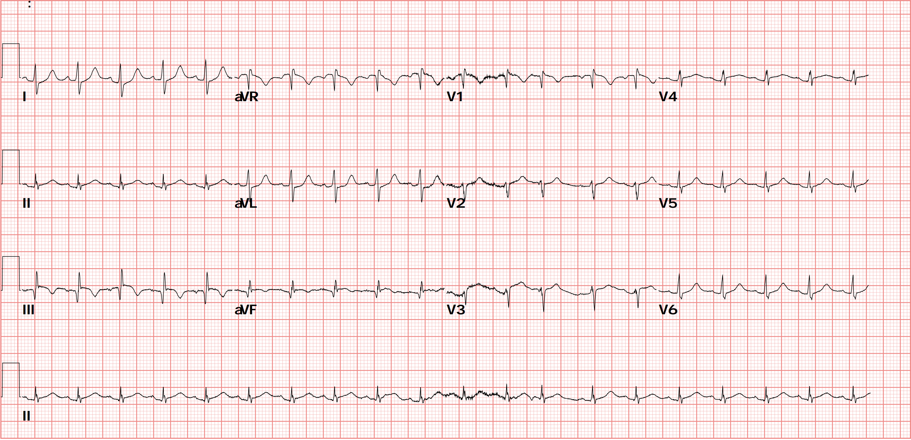

⭐️Rate:120 bpm

⭐️Rhythm:Sinus rhythm? I have some doubts, because the P wave in Lead II seems smaller than in Lead I.

<mark>**True sinus rhythm:**</mark>

- Upright P waves in Lead I/II/aVF
- The P wave amplitude in Lead II should be larger than in Lead I
- A real true sinus P wave is biphasic (up then down) in V1, not upright.

There's one key point to watch here.

If we find that the P wave in Lead I > the P wave in Lead II, besides thinking it isn't coming from the sinus node, we also have to think of possible LA/LL reversal

If it really is LA/LL reversal, you'll see the following ECG findings: (**Flip it around: when you see 1 and 2 below, put LA/LL reversal on the DDx**)

1. Lead III completely inverted (P, QRS, T all negative) ➔ **watch out here, this can be misread as a pseudo S1Q3T3!!**
2. P wave in Lead I > Lead II

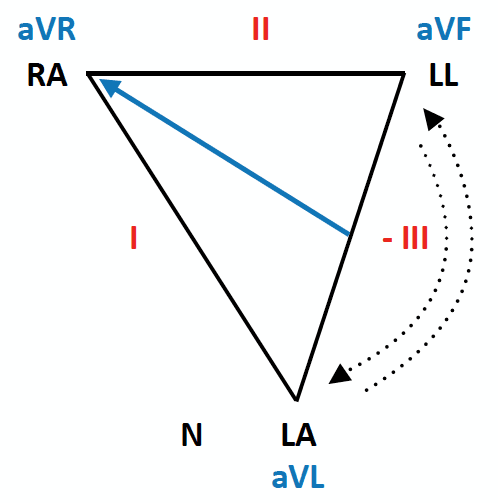

<mark>**Based on Fig.2 ➔ how should you read the limb leads when there's LA/LL reversal?**</mark>

- III becomes inverted
- I/II swap
- aVL/aVF swap
- aVR stays the same

A bit complicated, huh～～

<mark>**Don't worry. Just remember: when the P wave in Lead I > the P wave in Lead II, and you also see Q3T3 ➔ make sure LA/LL reversal is on your DDx**</mark>

Also note that <mark>**S1Q3T3 is neither a specific nor a sensitive ECG finding for PE**</mark>.

What that sentence means: don't diagnose PE just because you see S1Q3T3, and no S1Q3T3 doesn't mean it isn't PE. (**Say it out loud three times and you'll know what I'm talking about. If you still don't get it, say it ten times**)

Let's look at another one: the PE ECG findings Amal mattu shows all the time

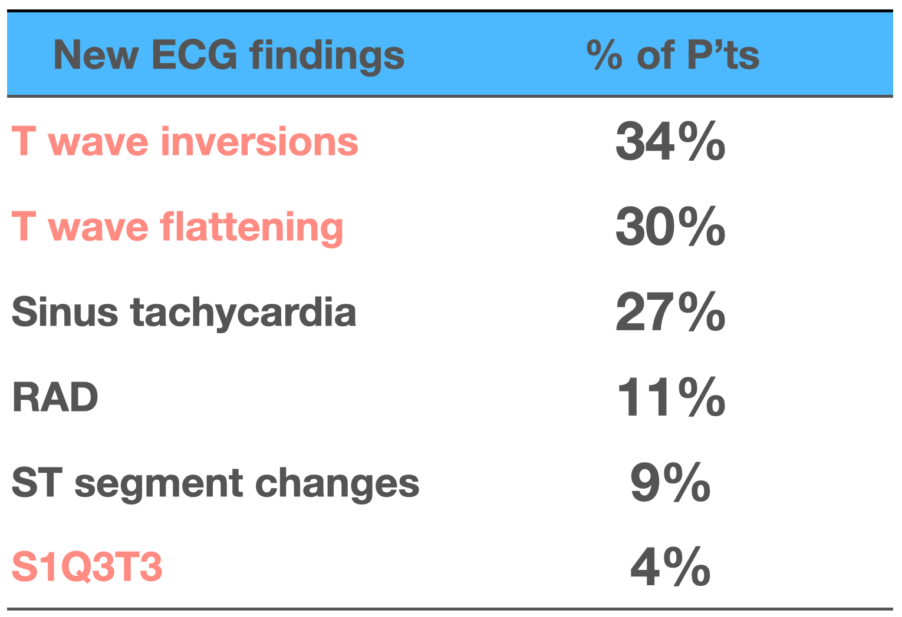

**S1Q3T3 really doesn't show up that often. Don't worship it like a sacred ancestral tablet~~**

Instead, T wave changes in the precordial leads (RV strain changes) are the more common PE ECG findings.

Sinus tachycardia shows up often too. It's not required for diagnosing PE, but a relatively fast heart rate is a common finding (**usually taken as >90 bpm**), and you'd expect it in significant PE.

⭐️Axis is still a normal axis, but with a deep S wave in I. A normal Lead I usually doesn't have an obvious S wave. A deeper S wave in lead I suggests the axis may have clockwise rotation.

⭐️Interval: no QT prolong

⭐️Ischemia

There's minimal STE in Lead III/aVF, with reciprocal STD change in Lead I/aVL.

**So could this be an inf.OMI?** 

Oh oh~~ now this gets a bit tricky.

Earlier we mentioned this ECG might be LA/LL reversal.

If this ROSC ECG really is LA/LL reversal, what should it actually look like?

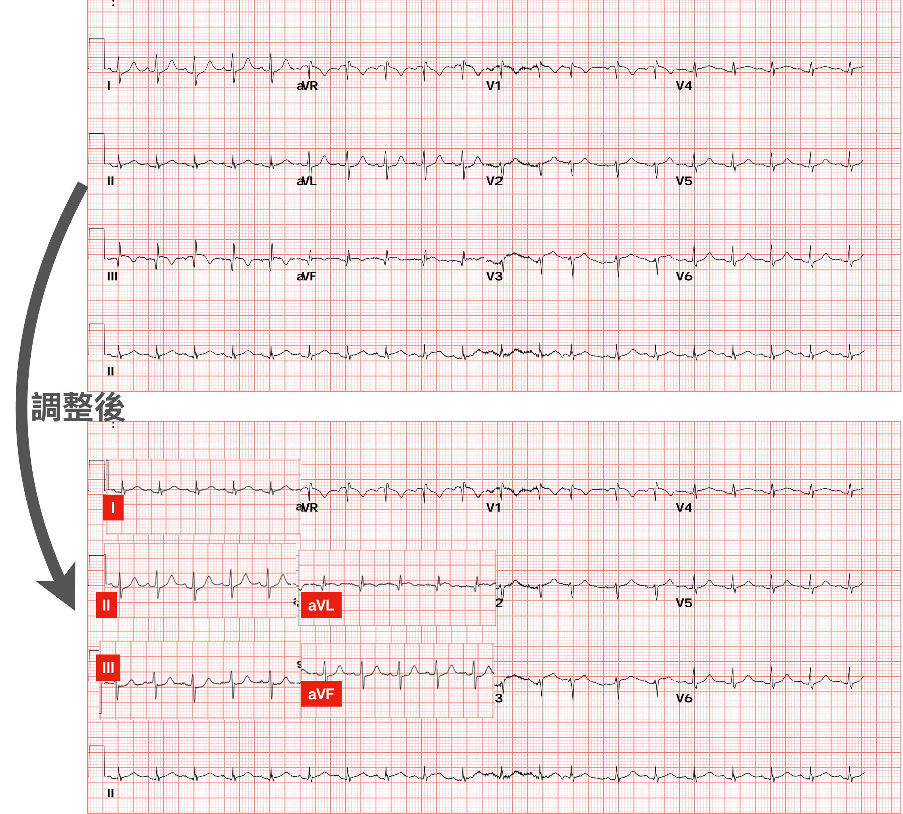

Swap I and II, swap aVL/aVF, flip Lead III completely

What we originally thought was an inf.OMI is actually a proximal LAD problem.

In other words, if there's a real proximal LAD problem in the high lateral wall, LA/LL reversal (the electrodes put on wrong) can make us misread it as an inf.OMI, meaning we might think it's the RCA. [If you're interested, have a look at this similar case](https://www.facebook.com/groups/468956816612362/permalink/2719579244883430)

#### <mark>**So once more, the key points about LA/LL reversal:**</mark>

1. Consider it when the P wave in I > the P wave in II
2. There may be a pseudo Q3T3
3. If there is an occluded artery, it may make us call the culprit lesion wrong (of course, once the CV man goes in, all three arteries get looked at anyway, and calling the wrong culprit lesion from the ECG happens all the time in this business XD)

<mark>**One more interesting thing: Qr wave in V1**</mark>

First let's look at what Amal mattu says about the ECG findings of PE in his book Electrocardiography in Emergency, Acute, and Critical Care [^1]

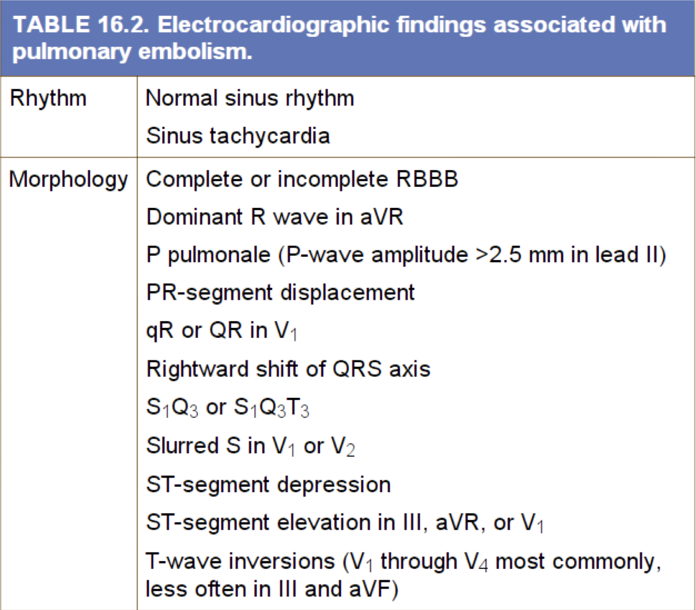

**The table above mentions qR or QR in V1**

I kept wondering at the time why it shows up at all?

Let's look at this picture first

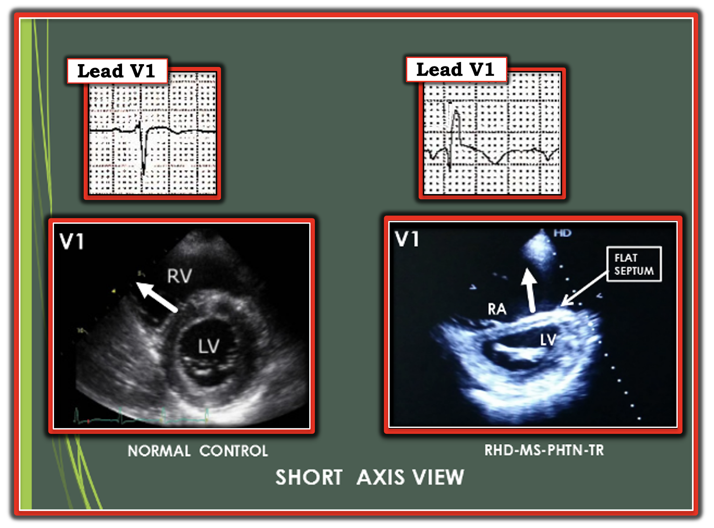

The bottom is the echo PSAX view. The left one is normal; in the right PSAX view, a dilated RV has flattened the Septum, making the LV form a D sign.

Electrical conduction in the septum normally fires from the left side of the septum to the right. So under normal conditions, V1 sees conduction coming straight toward it, and an Upright R wave appears first. But if the septum is deformed (D sign+), the depolarization still goes from the left side of the septum to the right, but its direction changes. The vector no longer points straight at V1; it points somewhat away from V1. So V1 sees a downward Q wave, which is Qr in V1.

**Now let's look at a 2003 paper in the European Heart Journal** [^2]

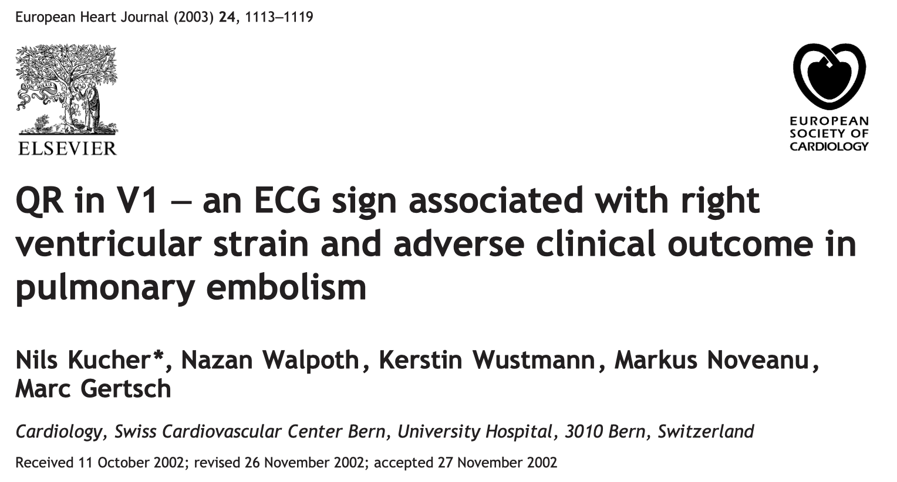

Below is an ECG example from the paper

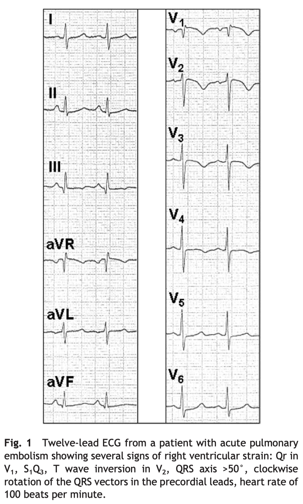

This paper enrolled 151 patients with suspected PE, with ECGs read by two observers. Of these 151, 75 were confirmed PE and also had echo, plus TnI and pro-BNP levels.

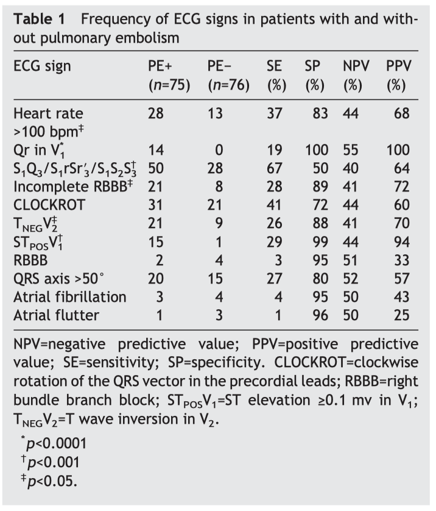

The table above shows that **Qr in V1 and STposV1 (meaning STE≧0.1 mV in V1) have very high specificity (100%/99%), and their PPV (positive predictive value) is also very high (100%/94%)**.

- **Very high specificity means these features rarely show up in patients without pulmonary embolism, so they carry strong diagnostic specificity.**
- **Very high PPV means that if these features show up, it's almost certainly pulmonary embolism**

On top of that, **in this study Qr in V1 was the strongest independent predictor of RV dysfunction**.

#### <mark>**Mini-conclusion:**</mark>

1. Qr in V1 has very high specificity for PE but not high sensitivity ➔ **meaning it's not common, but when it shows up, think about whether it's PE**
2. Qr in V1 also independently predicts right ventricular dysfunction ➔ **meaning if it shows up, watch out for possible RV dysfunction**

# <u>The case continues🚶‍♂️‍➡️</u>

Before she even got to the CT room to prove the PE..... the ECG monitor started showing Bradycardia

No pulse...... PEA!!!!!!

Push epinephrine, start another round of CPR

**The ECMO team isn't here yet. Do we push rTPA 50 mg first?**

### But if we push it, will she bleed and bleed when ECMO goes in later, with serious complications?

While we were hesitating, the ECMO team rolled into the resuscitation room pushing machines big and small.

My colleague decided to wait for ECMO first.

Once on ECMO, we'd bought time for workup.

Off to the CT room

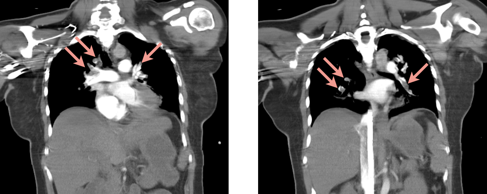

**Extensive bilateral pulmonary embolism**

I don't think the diagnosis is the point.

### <u>Because there was plenty of evidence pointing to pulmonary embolism:</u>

**ECG findings:**

- Qr in V1, sinus tachycardia, deep S wave in I (though not sure whether there was LA/LL reversal)

**Echo findings:**

- No pericardial effusion, RV dilated, LV actually moving pretty well after the first ROSC

#### <mark>I think the crux is deciding when it's the right time to push rTPA</mark>

- She collapsed again, so push rTPA, it's a Hail Mary at this point. It can't get any worse, because this is already the worst it gets
- But if we push rTPA and then need to put her on ECMO, what then? When CVS is putting her on ECMO and she keeps bleeding, are they going to be rolling their eyes the whole time~~~~

Don't push, and she probably has no chance of surviving. Push, and she dies of ECMO complications.

Writing this, I just got a cold shiver all over again.

### Emergency medicine is a specialty born to walk the world on thin ice.

Stick your neck out and you get the blade; pull it back and you get the blade too. Either way, you're getting cut.

No wonder we can't recruit residents anymore........

Any residents interested in emergency medicine who'd like a little excitement in their lives: come to National Yang Ming Chiao Tung University Hospital. We still have one resident spot open. The phase 2 medical building is under construction right now, with a total cost of NT$6 billion. (**Sorry, let me sneak in a little sponsored plug here, our department hasn't had a resident in a long time😅**)

End of sponsored plug.

---

**I think when it's right to push rTPA depends on how fast CVS can get to the ED XD** ( <mark>**provided there's enough evidence to strongly suspect PE, or PE is already confirmed**</mark> )

CVS not on call that day ➔ no questions asked, push rTPA

CVS on call that day ➔ can't come right away (I think they'd need to be there within 10 minutes, since putting on ECMO takes time too), push rTPA

CVS on call that day ➔ can come set it up right away, hold off on rTPA

---

I'm sure plenty of colleagues out there run into this exact scenario too.

Is there any literature that tells us whether giving rTPA first, then putting the patient on ECMO, is a definite no?

My colleague asked our CVS, and our CVS answered:

**Not recommended, unless ECMO backup can't be available immediately. <mark>CVS: the considerations are whether the patient has another diagnosis, and the bleeding problem after going on ECMO</mark>**

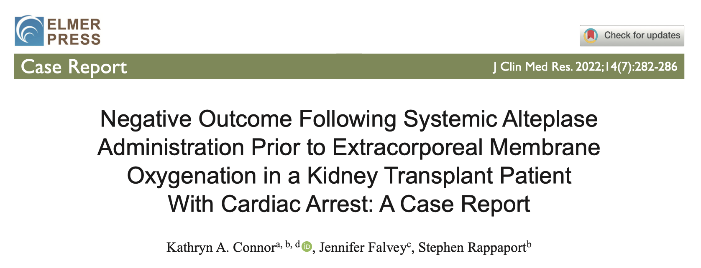

**This is a 2022 case report** [^3]

It describes a kidney transplant patient in cardiac arrest who died after getting rTPA before ECMO. After surgery the patient developed chest pain and shortness of breath, then collapsed; after rTPA for suspected pulmonary embolism, the condition worsened and required ECMO, but the patient ultimately died, **with the final cause of death being acute myocardial infarction with extensive retroperitoneal hemorrhage**. The report highlights the importance of considering ECMO before rTPA in patients at high bleeding risk, and raises the possibility of going on ECMO first before the diagnosis of pulmonary embolism is established.

-  **Bear's take:** **This applies even more to patients at high bleeding risk (for example, patients who recently had major surgery)**. Compare that with our case: she'd had adenomyosis surgery at another hospital just a week earlier. If rTPA had gone in first, the bleeding risk really would have been very high.
  - Before you give it, calm down, think through the rTPA checklist, and go over it once more for any contraindication. **Don't just try to be the hero, you might end up the zero instead**. [The rTPA package insert is here](https://www1.ndmctsgh.edu.tw/pharm/Home/GetInsertCFile?id=005ACT03)
- When a patient collapses for no clear reason and there isn't much evidence pointing to pulmonary embolism, if you want to give rTPA, you'd better have cardiomegaly yourself first (**a big heart**😅). Otherwise, wait for ECMO support, buy time, and then work up and rule out other problems.

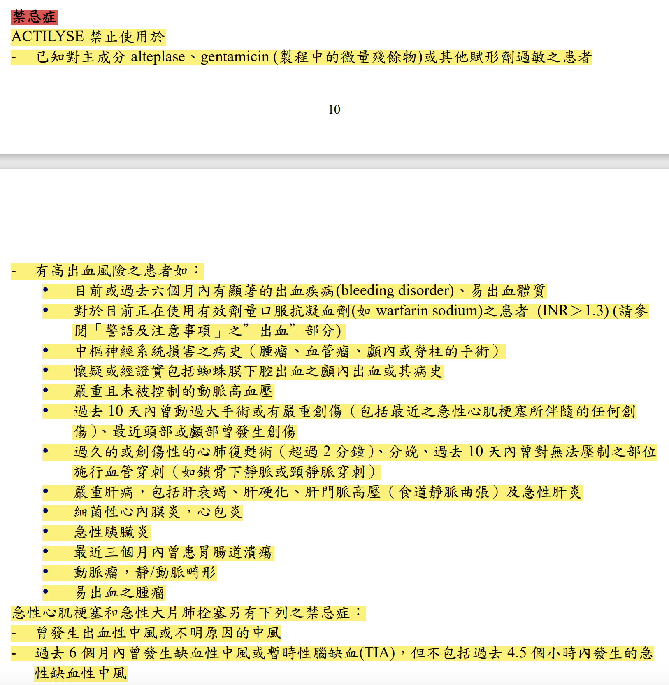

**Now let's look at a paper from ICM, August 2024**[^4]

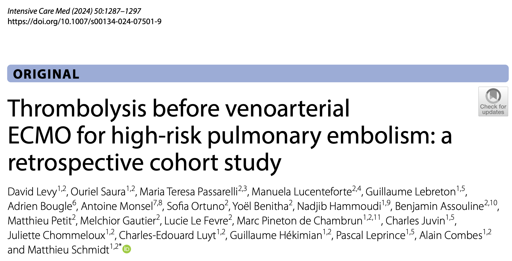

This study compared **patients on VA-ECMO for pulmonary embolism (PE), looking at whether prior rTPA affected their short- and long-term outcomes**.

The patients were split into two groups: those who did not get rTPA before VA-ECMO (T- group: Thrombolysis-) and those who went on VA-ECMO after rTPA failed (T+ group: Thrombolysis+)

T- group: 41 patients

T+ group: 31 patients

For bleeding events, this paper used the GUSTO (Global Utilization of Streptokinase and TPA for Occluded Arteries) classification to define them:

- **GUSTO 1**: severe or life-threatening bleeding, such as intracranial hemorrhage or hemorrhagic shock causing hemodynamic instability.
- **GUSTO 2**: moderate bleeding requiring transfusion.
- **GUSTO 3**: other bleeding events that don't require transfusion or cause hemodynamic instability.

> The results showed <mark>**no significant difference between the two groups in the rate of GUSTO ≦ 2 bleeding events (including moderate to severe bleeding)**</mark> (59% vs 61%, p=1)
>
> **<mark>No significant difference between the two groups in intracranial hemorrhage</mark>** (T- group 10% vs. T+ group 3%, p=0.38)
>
> **<mark>No significant difference between the two groups in transfusion requirements</mark>** (no significant difference in red cell, plasma, or platelet transfusion volumes)

Although earlier studies have suggested that rTPA before ECMO may increase bleeding risk, <mark>**this study shows that in high-risk PE patients on ECMO, whether they got rTPA beforehand does not significantly affect the rate of major bleeding events**</mark>

The study stresses that while bleeding events are still common in high-risk PE patients on VA-ECMO, prior rTPA does not significantly increase bleeding risk

This means that even if the patient has already had rTPA, VA-ECMO is still a viable treatment option and shouldn't be ruled out over bleeding concerns

To sum up: although high-risk PE patients on ECMO still carry a bleeding risk, the results show that getting rTPA before ECMO does not significantly increase the rate of major bleeding events. So <mark>**when considering VA-ECMO for a high-risk PE patient, don't exclude patients who have already had rTPA out of worry about bleeding**</mark>.

---

### Let's see what UpToDate recommends[^5][^6]:

- #### <mark>PE diagnosis not yet established</mark>

  - In **patients with high suspicion of PE (with enough evidence, e.g., bedside echo), if hemodynamically unstable ➔ rTPA is recommended**, rather than empiric anticoagulant or no treatment	
  - If suspicion for PE is low to moderate but the patient is hemodynamically unstable ➔ empiric anticoagulant agents are recommended, rTPA is not

- #### <mark>PE diagnosis established</mark>

  - **No rTPA contraindication, with refractory hypotension** ➔ **rTPA is recommended, followed by anticoagulant agents**. Anticoagulant agents alone are not recommended
    - **Definition of Refractory hypotension ➔ systolic BP <90 mmHg, requiring vasopressors, or a drop in systolic BP of ≥40 mmHg from baseline after resuscitation, lasting 15 minutes**
    - It's recommended to start the UFH infusion only after the aPTT falls below twice the upper limit of normal, to avoid increasing bleeding risk.
  - For patients with an rTPA contraindication, **catheter-directed or surgical embolectomy is recommended rather than observation**

- #### <mark>PE patients already in CPR, or with high suspicion of PE</mark>

  - **Patients in CPR — rTPA should not be given routinely in cardiac arrest. However, in patients with cardiac arrest (or peri-cardiac arrest) suspected to be caused by pulmonary embolism, whether to give it as a potentially lifesaving measure can be considered case by case.**
    - **Case series show that when cardiac arrest is due to suspected or confirmed acute pulmonary embolism, rTPA during CPR has some success**
    - **In a retrospective study, 23 patients with PEA from confirmed massive pulmonary embolism got a reduced dose of 50 mg, 50 mg rTPA IV push over 2 minutes, and achieved return of spontaneous circulation (ROSC) within 2 to 15 minutes**
  - **rTPA dose** ➔ if the patient is already in CPR or about to need CPR, **a 50 mg IV bolus over 2 minutes is more practical**. If the patient is **not in cardiac arrest, give 100 mg over 2 hours**. **<mark>If there's still no ROSC after the 50 mg bolus over 2 minutes, you can repeat 50 mg after another 15 minutes</mark>**

- **V-A ECMO can be used as monotherapy or as a bridge to definitive treatment (e.g., surgical embolectomy or catheter-directed therapy)**. **VA-ECMO can also be used as the initial strategy when rTPA for massive PE is contraindicated**.

---

Putting it all together: when we strongly suspect PE (not yet confirmed by Chest CTA, but echo/ECG has findings and the clinical scenario is highly suspicious: long-haul flight, recent major surgery, recent bed rest, cancer history, etc.), or PE is already confirmed, and the patient suddenly collapses or is about to collapse, we can call CVS to put the patient on ECMO as a bridge to further treatment. If CVS is coming but taking too long, don't delay the rTPA 50 mg bolus either. According to the ICM paper, moderate/severe bleeding events didn't go up significantly. So don't be afraid that giving rTPA and then going on ECMO will increase moderate/severe bleeding events.

On the other hand, if we don't strongly suspect PE as the cause of the collapse, rTPA shouldn't be given.

# Key takeaways:

1. ECG findings of Sinus rhythm
2. Which ECG findings should make you consider LA/LL reversal? Possible pseudo Q3T3 and misreading of the Culprit lesion
3. How Qr in V1 forms and why it matters (high specificity, and an independent predictor of RV dysfunction)
4. Does giving rTPA and then going on ECMO increase moderate/severe bleeding events?
5. What does UpToDate recommend for cardiac arrest caused by PE?

# References:

[^1]: Amazon.com: Electrocardiography in Emergency, Acute, and Critical Care: 9781732748606: Amal Mattu, MD, FACEP, Jeffrey A. Tabas, MD, FACEP, William Brady, MD, FACEP, FAAEM: Books - [link](https://www.amazon.com/-/zh_TW/Electrocardiography-Emergency-Acute-Critical-Care/dp/1732748608/ref=sr_1_2?crid=G4RY5NKYZH4G&dib=eyJ2IjoiMSJ9.iIao38mBSS2JSxFb5wkPkKujnyPsMGcQV2j8ReJyu78UAWpZbC7kwk6v0k2mQzkMExcSj1BzSFfsaAMM8Mi46F6-NyzETx72g2dvSykfXNKpS1P0OOrrLoizDP4xG546eUntwQ5uqbg_oOsy68COPguYZYxqhr_0mg4H9-ppQcqEJ-huJkWw2WTz7aWXoiRk2uEf3et9j7dU2q9L4Z-KvNoaZ8TaOg_mz_4OMLnOUFI.AnhmYxm2qSPN7i5V3wY5ByLerCRk3C0hkuHJHwxCqkQ&dib_tag=se&keywords=amal+mattu&qid=1735603621&sprefix=amal+mattu%2Caps%2C292&sr=8-2)
[^2]: QR in V1 – an ECG sign associated with right ventricular strain and adverse clinical outcome in pulmonary embolism | European Heart Journal | Oxford Academic - [link](https://academic.oup.com/eurheartj/article-abstract/24/12/1113/447648?redirectedFrom=fulltext&login=false)
[^3]: Negative Outcome Following Systemic Alteplase Administration Prior to Extracorporeal Membrane Oxygenation in a Kidney Transplant Patient With Cardiac Arrest: A Case Report | Connor | Journal of Clinical Medicine Research - [link](https://www.jocmr.org/index.php/JOCMR/article/view/4744/25893592)
[^4]: Thrombolysis before venoarterial ECMO for high-risk pulmonary embolism: a retrospective cohort study - PubMed - [link](https://pubmed.ncbi.nlm.nih.gov/38913095/)
[^5]: Treatment, prognosis, and follow-up of acute pulmonary embolism in adults - UpToDate - [link](https://www.uptodate.com/contents/treatment-prognosis-and-follow-up-of-acute-pulmonary-embolism-in-adults?search=pulmonary embolism&source=search_result&selectedTitle=1~150&usage_type=default&display_rank=1#H20)
[^6]: Approach to thrombolytic (fibrinolytic) therapy in acute pulmonary embolism: Patient selection and administration - UpToDate - [link](https://www.uptodate.com/contents/approach-to-thrombolytic-fibrinolytic-therapy-in-acute-pulmonary-embolism-patient-selection-and-administration?sectionName=HEMODYNAMICALLY UNSTABLE PATIENTS (HIGH-RISK PULMONARY EMBOLISM)&search=pulmonary embolism&topicRef=8265&anchor=H613644316&source=see_link#H22)
