I vaguely remember one day back when I was an R3 resident covering the resuscitation room. An OHCA patient came in.

The resus room being packed was one thing. A level 1 patient gets a spot no matter what.

Halfway through the resuscitation, the family arrived..... and started wailing the patient's name at the foot of the bed.

And then.....

The family member collapsed at the foot of the bed, no strength on the right side........

I was totally dumbfounded. Besides WTF, there was literally no bed left in the resus room to lie anyone down. And just like that we had one more level 1 patient. 😭

---

Today's patient was kind of the same story.

A 50-year-old man. His nephew has autism and was running all over the house on Lunar New Year's Eve. It was getting on everyone's nerves.

He stepped in to stop his autistic nephew.

Yelling at the kid got this middle-aged guy more and more worked up too.

Less than half an hour later, he started having chest tightness....... and then a whole crowd of people brought him to our hospital.

**The patient arrived about half an hour before shift change**

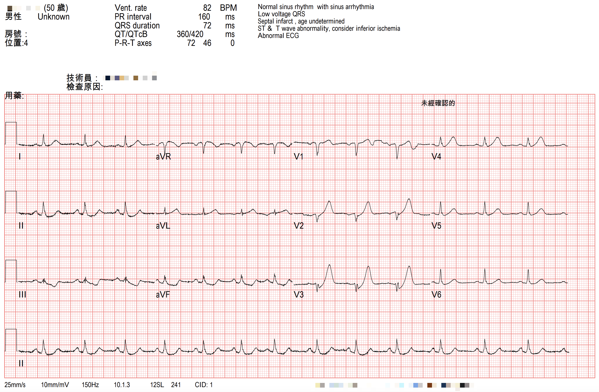

At handoff, the previous doctor told me the ECG looked a bit off. They thought there was mild STD in the inf. leads, and the T wave in V3 was a little tall

They pulled up the ECG to show me (Fig.1).

### **I told them this is definitely an MI. The artery is occluded.**

I finished handoff quickly.

Never mind **this year's Nian beast that doesn't play fair** (in past years the Nian beast mostly played fair~~ on New Year's Eve, 1800-2100, the ED is supposed to clear out to zero). The stack of unseen charts on the desk kept piling up.

First I took care of the patient I'd already triaged as level 1 in my head.

I asked the nurse practitioner to send the ECG to the on-call CV man.

Then I went to the bedside to see the patient... he looked uncomfortable (pained expression).

The family next to him were trying to make him laugh, figuring he was just too angry and that's why his chest felt bad. It'd pass in a bit.

He said not long after getting angry, his chest started feeling tight. And it radiated to the L't arm.

I told him the ECG looked like a heart attack and he might need a cardiac cath.

### **Patient: Nah, no need~~ I'll be fine after some rest. It can't be that serious**

I then walked over to the nurse practitioner to ask what the on-call CV had said.

The NP said CV replied that these were probably old ECG changes

Hmm. When I heard that, I was dumbfounded all over again.

I thought, no way~~ **that is not the answer you're supposed to give**

### **The answer should have been: OK, activate the cath lab!!!**

I knew exactly what CV meant by *old ECG changes*.

This patient had a stent placed before.

Old ECG changes presumably meant PRWP, with Q waves in V1-V3

But **this ECG was full of *acute* changes**.

### Let's break down this ECG

---

Rate:78 bpm

Rhythm: sinus rhythm

Axis: normal axis

Interval: QTc(420 ms)

Ischemia:

### First, the limb leads

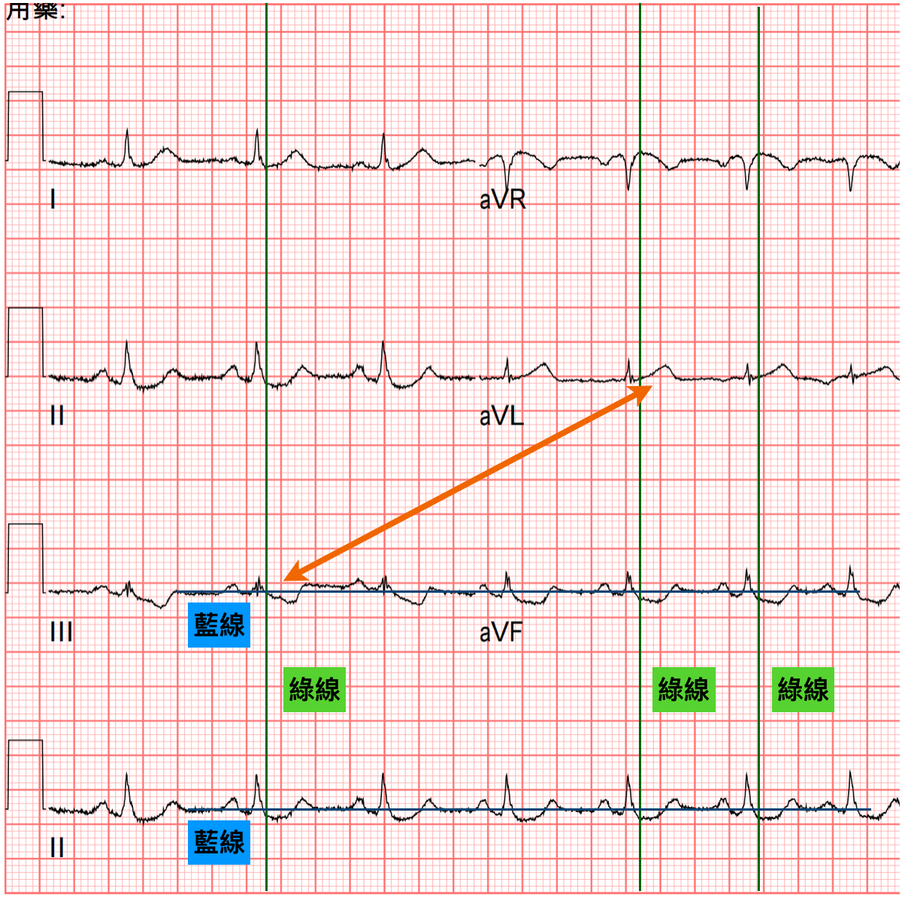

The **green line** marks the J point, and the horizontal **blue line** is the baseline

You can see minimal STD in both II and aVF, and in III the J point almost sits right on the baseline.

III/aVF have obvious TWI.

The ST segment in aVL is straight. <mark>**Generally, an ST segment that is convex or straight leans toward ischemic change. A concave one leans toward a normal change**</mark>(**of course, this isn't absolute**)

### Here are, once again, ECG master Dr. Jerry Jones's two key points on reciprocal STD:

1. **Over time, reciprocal STD change may become more obvious than the STE**
2. **Reciprocal STD change caused by ACO (acute coronary occlusion) may be seen before the STE on the opposite side shows up (meaning it appears earlier)**

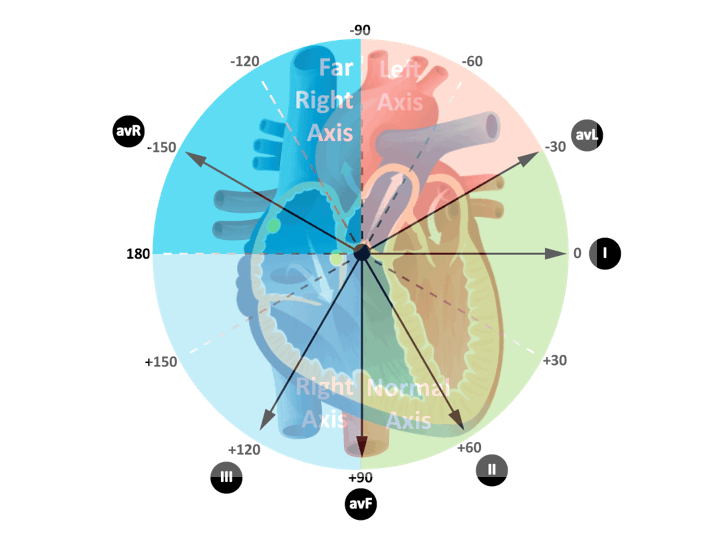

In the frontal plane of the limb leads, the lead opposite aVL that comes closest to being directly opposite is III (just 30° short of facing it head-on). So when aVL develops an ischemic change, III is the lead where reciprocal STD change will be most obvious.

Unfortunately, though, **aVL is actually the lead where ST elevation is hardest to see. Why?**

Because aVL sits almost at 90° to the path of electrical conduction, so the QRS amplitude is small, and when the QRS amplitude isn't big enough, ST elevation won't be obvious.

That's why <mark>**high lateral MI gets missed a lot**</mark>.

If it gets missed a lot, what do we do?

**Use the reciprocal STD change in the opposite leads to help read it**.

How so?

I/aVL of the high lateral wall are nearly perpendicular to the axis, so the QRS is small and the STE isn't obvious. But we can check the opposite leads for reciprocal changes like STD or TWI.

The other point is that reciprocal change may become more obvious than the STE over time ➔ which is great. The STE in I/aVL of the high lateral wall isn't obvious anyway, and it's not easy for it to reach STE > 1 mm and meet STEMI criteria, but <mark>**the reciprocal STD on the opposite side will be obvious, and that raises our suspicion**</mark>, something wrong~~

**You can see exactly this in Fig.1 (obvious TWI in III/aVF, but almost no STE at all in aVL; the only problem there is the straight-pattern ST segment)**

I recommend **Dr. Jerry Jones's new book** here: [Getting Acquainted With Ischemia and Infarction: Ischemia is NOT an Infarction!](https://www.amazon.com/-/zh_TW/Jerry-Jones-ebook/dp/B0CW18V2LR/ref=sr_1_3?dib=eyJ2IjoiMSJ9.Z_ZRWuHQadKiia4sjb4RxR4c9JrwiXJDjh7P-yE4v3WLca3WT-dGUmYcZzQ6ssAhcoeVsNxlSiikHgRyv6051FA43GQxkIFco34tLfbcFJPktKvRB6L7mViCzDvIuWf86gxYJLqe00mU56JbdWLJ3gWKwCpgvZ2aaIur9bLpFu5FGtULs_Fdvb0RBIQO6WAI-3ZSuJByYUsklYL2diVbLANs8EmJMOjQpBMEg1fLvBk.m1ZdQPOYaz7c-tI58xvi_88WDqaESw_XV7lPP5-2UBQ&dib_tag=se&qid=1738386360&refinements=p_27%3AJerry+W.+Jones&s=books&sr=1-3&text=Jerry+W.+Jones)

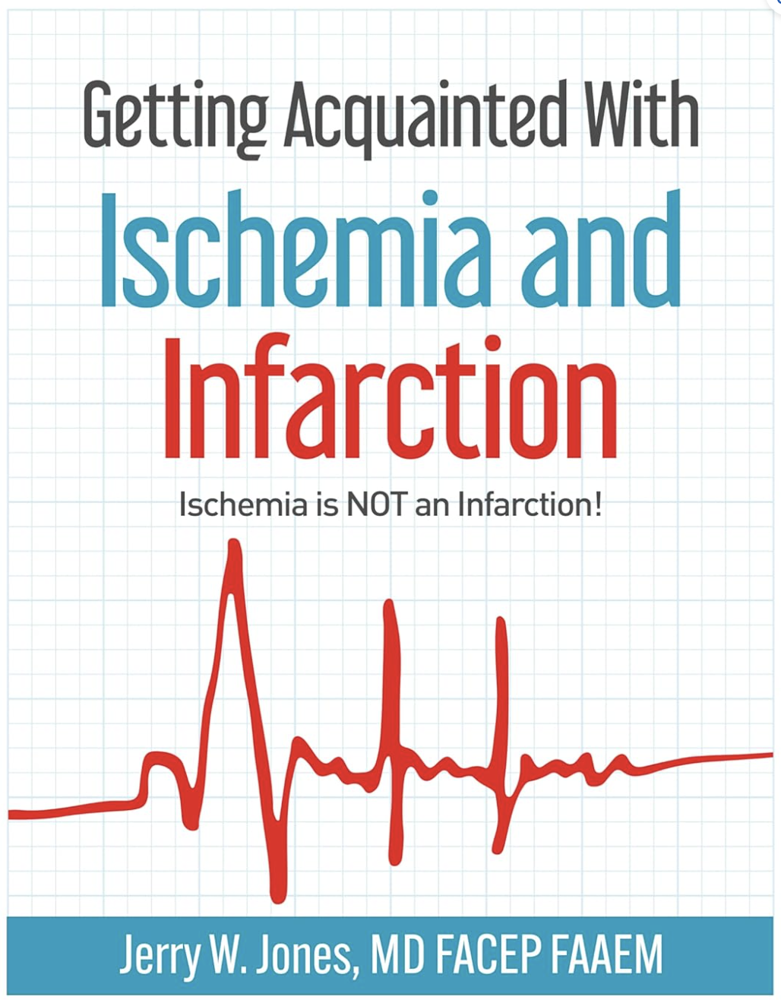

There's a chapter in it on reciprocal change too.

You can also hear this property of reciprocal change described in this podcast, where the author of Current ECG interviews Jones [^9]

### **Extending the concept**

<mark>**So which other leads share this concept of reciprocal pairs?**</mark>

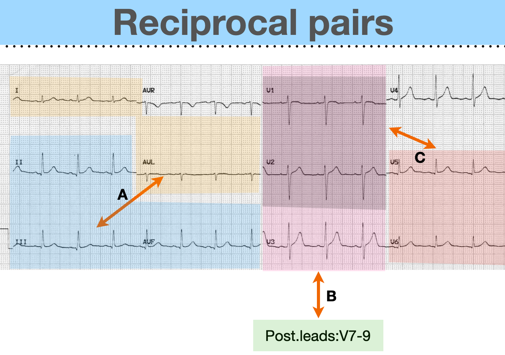

#### ⭐️Pair A: MI in the high lateral leads and the inf. leads ➔ reciprocal pairs of each other (**the most obvious leads here are III/aVL**)

- Quick tip: sometimes STD/TWI in aVL is an early ischemic sign of an early inf.wall STEMI, and that's read by using the property of reciprocal change. Hang on to this tip and your ECG reading will be different from everyone else's, with that feeling of seeing it coming~~ (this feeling is addictive, seriously!!!)

#### ⭐️Pair B: MI in the septal wall/ant. wall and the post. leads ➔ reciprocal pairs of each other (**the most obvious lead here is V2**)

- Because a 12-lead ECG doesn't routinely include post. leads, the reciprocal leads for an MI in the LV septal wall/ant. wall sit where the post. wall is. That is, V7-9.
- Remember that great study by Dr. Smith and his team? In <mark>**patients with ACS symptoms, if the maximal STD in the precordial leads falls in V1-4, it has 97% specificity for OMI, and 96% needed emergent cardiac cath**</mark>. [^1] . This study also rests on the basis that when a post. wall MI happens, reciprocal change shows up in V1-V4.
- Quick tip: Dr. Smith has reminded us many times on his ECG blog: <mark>**a very flat ST segment, downsloping STD, or shelf-like STD in V2 must be considered post. OMI until proven otherwise**</mark>.

#### ➔<u>What does a very flat V2 look like?</u>

Let's look at this post on X

<blockquote class="twitter-tweet">
45 y.o male Smoker, chest pain 3 hours. BP 160/110mHg. Inferior OMI?<a href="https://twitter.com/BrooksWalsh?ref_src=twsrc%5Etfw">@BrooksWalsh</a> <a href="https://twitter.com/ecgrhythms?ref_src=twsrc%5Etfw">@ecgrhythms</a> <a href="https://twitter.com/ECGfan?ref_src=twsrc%5Etfw">@ECGfan</a> <a href="https://twitter.com/smithECGBlog?ref_src=twsrc%5Etfw">@smithECGBlog</a> <a href="https://twitter.com/EM_RESUS?ref_src=twsrc%5Etfw">@EM_RESUS</a> <a href="https://twitter.com/drharikrishrau?ref_src=twsrc%5Etfw">@drharikrishrau</a> <a href="https://t.co/8JWoWfMl7h">pic.twitter.com/8JWoWfMl7h</a>
&mdash; Dr Razi (@DrRazi4) <a href="https://twitter.com/DrRazi4/status/1610281417954725888?ref_src=twsrc%5Etfw">January 3, 2023</a></blockquote> 

#### ➔<u>What does V2 with shelf-like STD look like?</u> (STD shaped like a horizontal shelf) [^2]

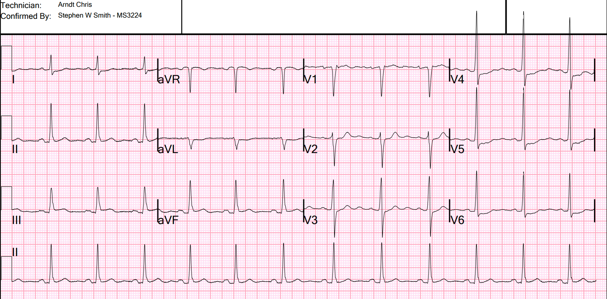

#### ➔<u>What does a downsloping V2 look like?</u> [^3]

#### ⭐️Pair C: V1-2 and V5-6, which is the so-called precordial Swirl sign [^5] .

- <mark>**ECG pattern: STE and/or HATW in V1-2 + STD and/or TWI in V5-6**</mark>
- V1-2 and V5-6 are reciprocal to each other, indicating a septal MI ➔ this means LAD OMI, usually proximal to the first septal perforators [^4]
- But <mark>**this sign needs to be DDx'd from LVH, LBBB, and subendocardial ischemia**</mark>

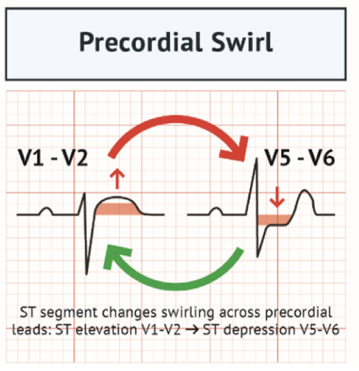

#### Finally done with the left half of Fig.1 XD

#### Next up, the right half of Fig.1 (precordial leads)

---

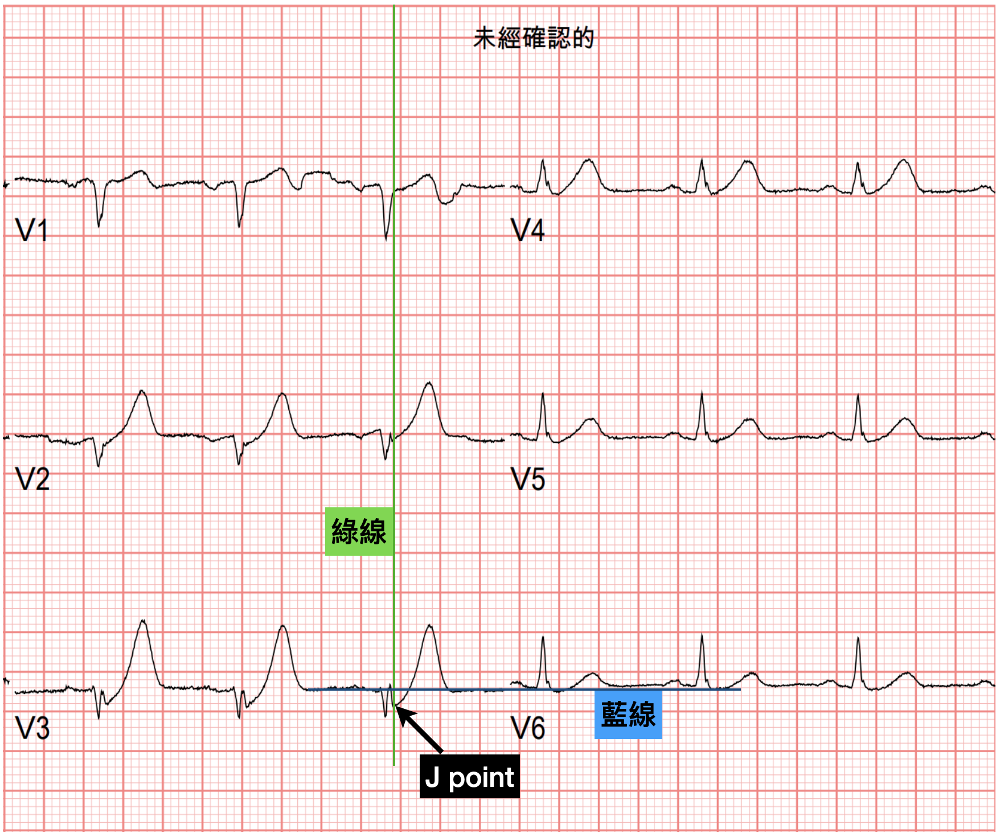

What's clearly wrong in the precordial leads is HATW (Hyperacute T wave) in V2-V4

Especially **the large T waves in V2-3 are definitely abnormal HATW**.

That said, **HATW currently has no clear definition**. I say it's there, you say it isn't... it really comes down to personal experience. Once you've seen enough, you get a feel for it XD

But putting it that way makes it hard to pass down through teaching.

So when teaching HATW, Amal Mattu stresses: <mark>**if the QRS can fit inside the T wave that follows it, that T wave is abnormal**</mark>

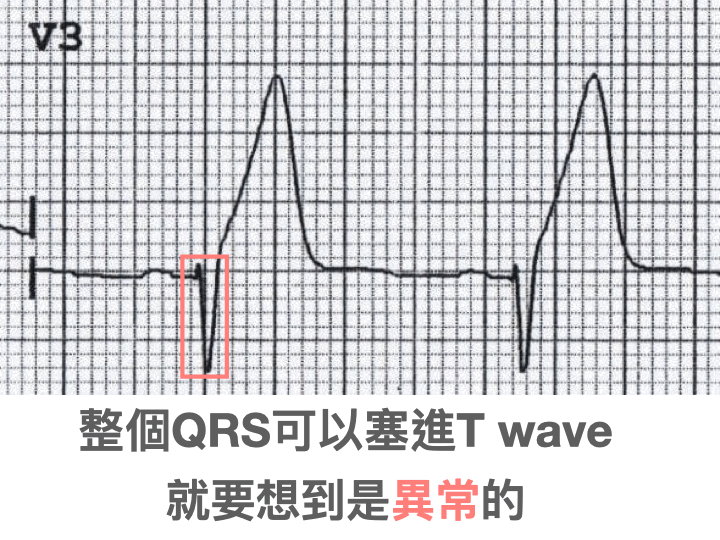

The table (Fig.8) in <mark>**the 2022 American College of Cardiology expert consensus on managing acute chest pain in the ED (2022 ACC Expert Consensus Decision Pathway on the Evaluation and Disposition of Acute Chest Pain in the Emergency Department)**</mark> [^6] stresses that **HATW is a STEMI equivalent** ➡ but **the table says to do serial ECGs, not go straight to cath lab activation ➡ mainly because quite a few HATW turn out to be caused by other (non-ischemic) reasons, such as high voltage or LVH, LBBB, a young person, or hyper-K, etc.** [^7] .

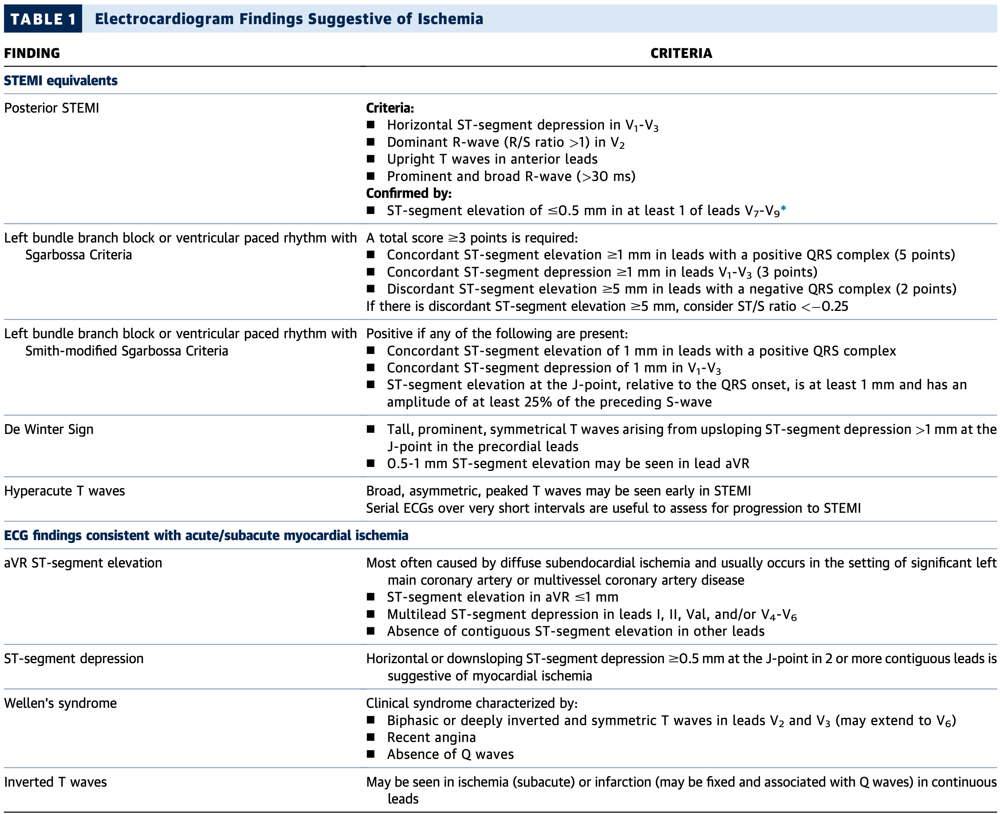

But this patient's precordial leads didn't just show HATW. In fact, **V2 and V3 look like de Winter's T waves**.

<mark>**In 2008, de Winter published a paper in NEJM describing a new sign that can indicate a proximal LAD occlusion**</mark> [^8]

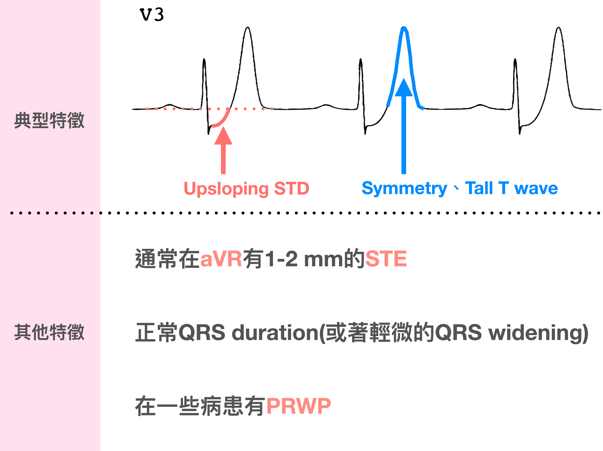

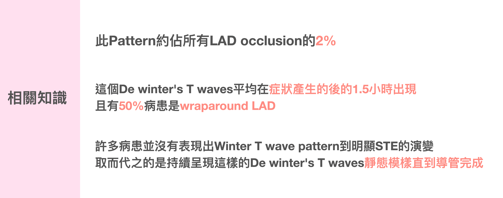

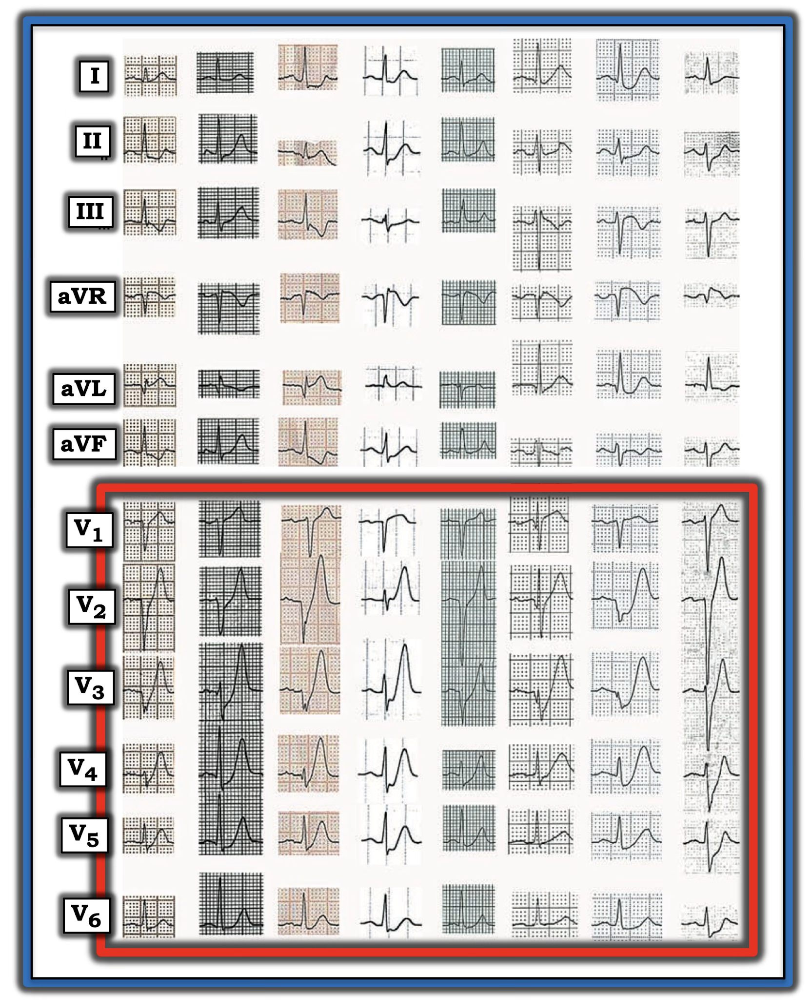

Fig.9 shows the ECGs of the 8 de Winter's T wave cases listed in that original NEJM paper. Look at them a few more times to lock in the impression. Burn this ECG pattern into your brain.

Next time you run into it, the moment you see the ECG, *Got you* will pop up in your head. Your reading experience goes up another level.

---

One ECG, and I've gone on about this and that. A bit much XD

Back to this case~~

When I heard the CV man say this ECG looked like old changes, I was dumbfounded inside.

But I also know full well this is the real-world response.

Not every CV man will buy what you think is an OMI ECG finding.

When someone doesn't buy it, what do you do?

Find more evidence to back up your read, to prove that the ECG you're looking at is truly a problem ECG.

Fig.10 is the echo I scanned on the patient. Clearly the ant. wall/part of the septal wall is barely moving.

Then I talked to the CV man myself. I explained to CV that the patient had typical ACS symptoms, the ECG showed de Winter's T waves with HATW across V2-4, and the inf. leads showed reciprocal change from a high lateral wall MI. A proximal LAD occlusion was highly likely.

In the end the CV man agreed with me, and the patient went for cath

**CAG report:** <mark>**CAD with TVD s/p PCI at LAD-P, 100% instent restenosis**</mark>

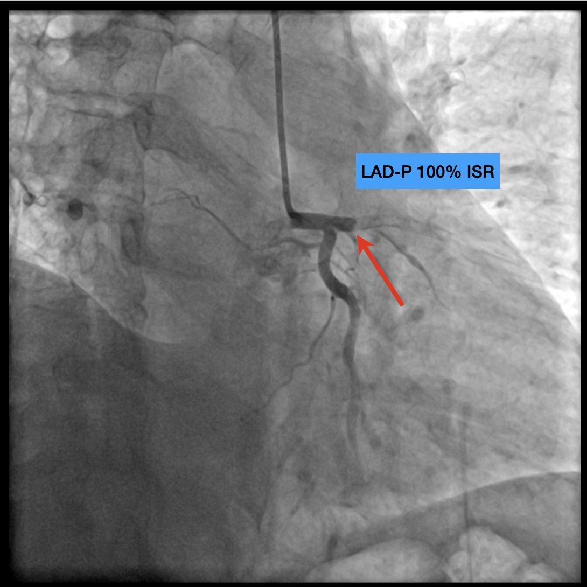

# Key learning points:

1. The two key properties of reciprocal change
2. What are the reciprocal pairs?
3. What is the precordial Swirl sign? What conditions to DDx it from
4. What kind of V2 should make you worry about post. OMI?
5. Under what conditions is HATW definitely abnormal?
6. The ECG pattern of de Winter's T waves

# References:

[^1]: Ischemic ST‐Segment Depression Maximal in V1–V4 (Versus V5–V6) of Any Amplitude Is Specific for Occlusion Myocardial Infarction (Versus Nonocclusive Ischemia) | Journal of the American Heart Association - [link](https://www.ahajournals.org/doi/10.1161/JAHA.121.022866)
[^2]: Dr. Smith's ECG Blog: 50 year old with acute chest pain, with ‘normal’ ECG and falling troponin - [link](https://hqmeded-ecg.blogspot.com/2023/04/50-year-old-with-acute-chest-pain-with.html)
[^3]: Dr. Smith's ECG Blog: Can you treat Non-STEMI with thrombolytics if it is OMI (Occlusion MI)? Of course! - [link](https://hqmeded-ecg.blogspot.com/2024/11/can-you-treat-non-stemi-with.html)
[^4]: Dr. Smith's ECG Blog: A 50 year old with chest pain? What is going on? By Emre Aslanger. - [link](https://hqmeded-ecg.blogspot.com/2022/09/the-pathophysiology-based-term-omi.html)
[^5]: ECG Patterns of Occlusion Myocardial Infarction: A Narrative Review - Annals of Emergency Medicine - [link](https://www.annemergmed.com/article/S0196-0644(24)01250-2/fulltext)
[^6]: 2022 ACC Expert Consensus Decision Pathway on the Evaluation and Disposition of Acute Chest Pain in the Emergency Department: A Report of the American College of Cardiology Solution Set Oversight Committee | Journal of the American College of Cardiology - [link](https://www.jacc.org/doi/abs/10.1016/j.jacc.2022.08.750)
[^7]: Hyperacute T Waves: Distinguishing Early MI from Other Big T Wave Abnormalities – ECG Weekly - [link](https://ecgweekly.com/weekly-workout/hyperacute-t-waves-distinguishing-early-mi-from-other-big-t-wave-abnormalities/)
[^8]: A New ECG Sign of Proximal LAD Occlusion | New England Journal of Medicine - [link](https://www.nejm.org/doi/full/10.1056/NEJMc0804737)
[^9]: Current ECG Podcast: Ep.39 - ST Elevation is NOT Infarction - [link](https://currentecg.libsyn.com/website/ep39-st-elevation-is-not-infarction)
