Here's an interesting ECG to share.

An 82-year-old man, complaining of chest pain since the morning, cold sweating, and mild shortness of breath

Yesterday a colleague sent it to me and asked whether <strong>it was a STEMI</strong>.

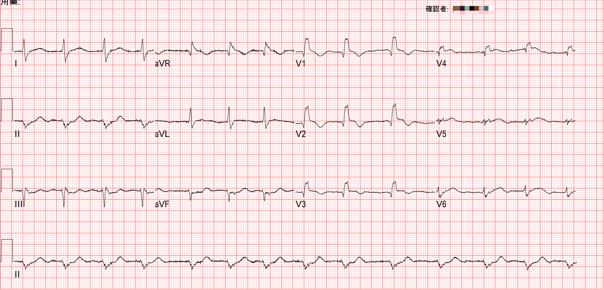

<strong>I said yes.</strong>

<mark><strong>But to be more precise, I should have said: this patient doesn't meet STEMI criteria, but has an OMI (Occlusion MI) ➔ the vessel is occluded.</strong></mark>

---

<strong>But it clearly doesn't meet STEMI criteria~~ so why is the vessel occluded?</strong>

### If we look at it through the original ACS classification

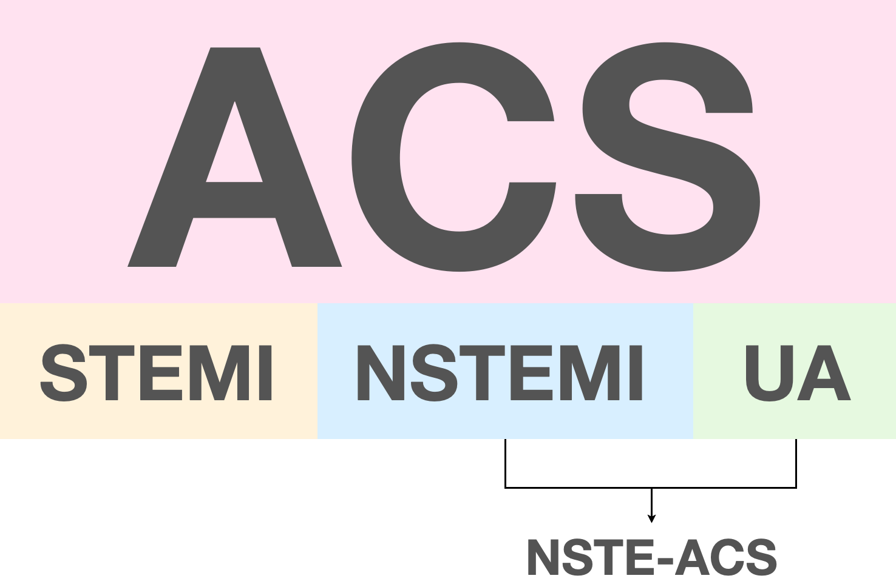

Just because a patient doesn't meet STEMI criteria doesn't settle it; if it's an NSTEMI, that means the patient's vessel is still blocked, causing an NSTE "MI"

So no STE really does not mean the patient isn't having a myocardial infarction.

#### <mark>So how sensitive are STEMI criteria for catching MI patients?</mark>

This article [^1] describes that if you apply STEMI criteria to the initial ED ECG to diagnose any occlusion (meaning OMI), the sensitivity is only 21%.

What does that mean? It means <strong>possibly as many as 80% of OMI patients can't be diagnosed with OMI using STEMI criteria</strong>.

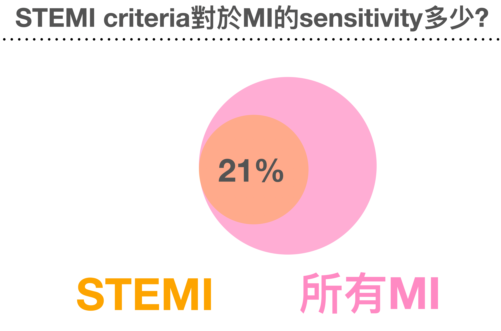

So what do we do? We may have to combine follow-up echo, serial ECGs, troponin values, and the patient's clinical symptoms to make the AMI diagnosis.

---

#### OK, let me read today's ECG

Rate:84 bpm

Rhythm:irregular, RBBB (qR wave in V1-4) pattern, LAFB

Axis:Extreme axis deviation

Interval:No QT prolong

<mark><strong>Ischemia:</strong></mark>

Let's look carefully at the 12-lead ECG to see if there's an ischemic change anywhere. Chest leads first

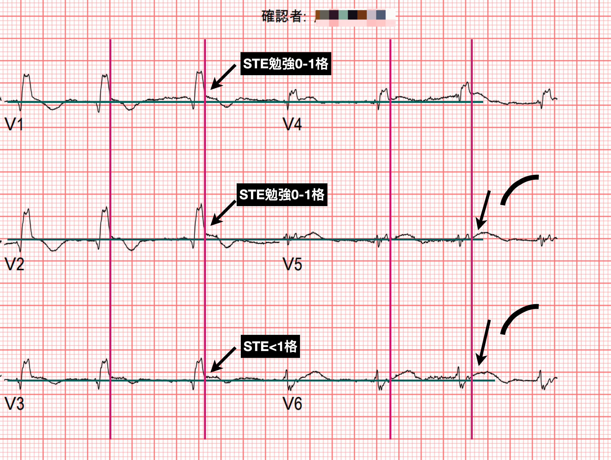

Dark green is the baseline; the dark red vertical line is the end of the QRS.

You can see the STE in V1/V2 barely gets close to 1 small box, and the STE in V3 is less than one box. V4 should be less than 0.5 box, and V5/V6 are both about on the baseline

V1-V3 here are a problem. Let me explain.

With a BBB (bundle branch block), it's genuinely hard to assess an ECG for AMI.

Luckily, if the ECG is LBBB, we have the <strong>Sgarbossa criteria</strong> and <strong>Dr.Smith's modified Sgarbossa criteria C(MSC)</strong> to back up the diagnosis strongly.

### <mark><strong>So if MI shows up with RBBB, how do we call it?</strong></mark>

First we need some basic background knowledge [^3]

<u>In BBB, because conduction down the bundle branch is blocked, depolarization is abnormal, so naturally the repolarization on the ECG also shows abnormal changes</u>. <mark><strong>These abnormal changes fall into two types:</strong></mark>

1. <strong>Primary repolarization</strong>: pathologic problems in the myocardial cells themselves, such as ischemia, hypoxia, acidemia, drug toxicity, electrolyte abnormalities, etc.
2. <strong>Secondary repolarization</strong>: normal abnormal changes (<strong>Chinese is so wonderfully profound, foreigners surely won't understand what on earth I'm writing XD</strong>)

#### <mark>Fig.4 is a <strong>typical RBBB ECG shape in V1</strong>, and there are some basics (<u><strong>typical normal changes</strong></u>) we need to understand</mark> [^3]

- Repolarization starts right at the J point, not after the J point
- The J point is usually on or below the baseline (STD of no more than 1 mm is acceptable). Any STD over 1 mm has to make you consider ischemic changes from primary repolarization
- From the J point, the baseline immediately slopes downward, forming an inverted T wave
- Between the J point and the nadir of the T wave, there's a subtle upward convexity. This is an important feature of secondary repolarization abnormality. It's usually very small, and it shows up very frequently.

<strong>These secondary repolarization findings in RBBB are commonly seen in V1/aVR, and occasionally in III</strong>. In LBBB, by contrast, you see these changes in I/aVL/V5/V6 but not in V1; instead, V1 shows an exaggerated mirror image of the V5, V6 secondary repolarization (<strong>exaggerated reciprocal of this secondary repolarization abnormality</strong>), including J point elevation.

Now that we've seen the typical normal changes, <mark><strong>let's look at what abnormal changes from primary repolarization (e.g., caused by ischemia) might look like</strong></mark>

<mark><strong>How do we make sense of these four abnormal changes? You really only need to look at what the normal changes are. From that, you can work out that every change in the figure above is abnormal.</strong></mark>

⭐️< 1mm of STD is called normal discordant STD (appropriate discordant), but over 1 mm it's called excessive discordant, and then you have to consider ischemia.

So what situation produces excessive discordant STD? It may be a concomitant post. wall MI. That's why the J point gets pulled down in V1-3, forming deeper STD.

So <mark><strong>post. wall MI with RBBB is very challenging to diagnose</strong></mark>. RBBB can normally have STD in V1-3 to begin with, and diagnosing a post. wall MI is exactly the question you have to consider when there's STD in V1-3. The two overlap in STD, one normal and one abnormal. How do you tell them apart? It's what I said above: <strong>STD that is too deep needs to be considered</strong> [^4]. Here's an example.

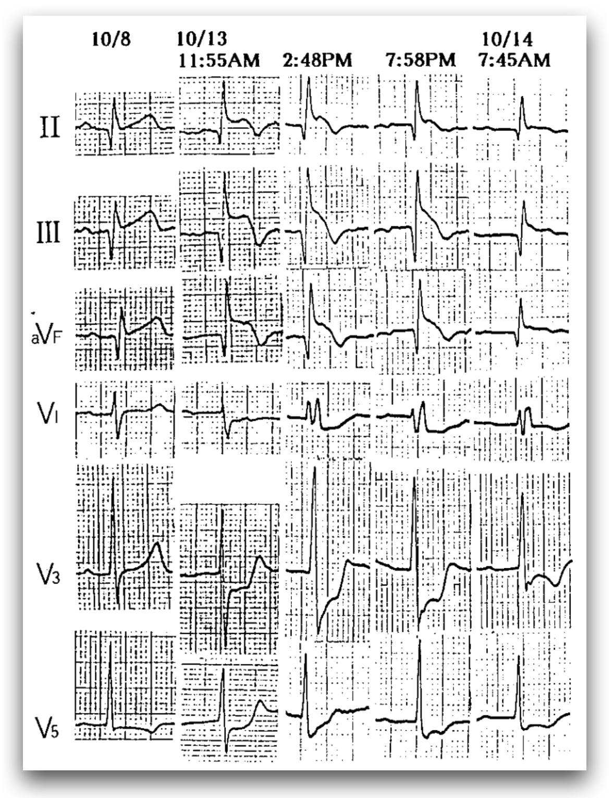

Fig.6 is an example from the article [^4]. You can see that when this patient's AMI began, there was inf. lead STE, along with R't precordial lead STD (post. wall MI). The ECG at <strong>2:48 PM</strong> starts to show an RBBB pattern, and you can see obvious excessive discordant STD in V3.

⭐️Also, in the R't precordial leads where you'd expect ST segment downsloping with TWI, if you see an upright T wave, you also need to watch out for ischemia

⭐️The rsR' of RBBB, especially with the R' on the right, is often accompanied by < 1 mm of STD; but if you don't see STD, you also need to be suspicious of possible ischemia

⭐️If the ST segment has a plateau shape rather than downsloping, or the T wave after it is symmetric rather than asymmetric, you also have to be careful.

### <mark><strong>What does the literature say about when to suspect an occluded vessel in the setting of RBBB?</strong> [^2]</mark>

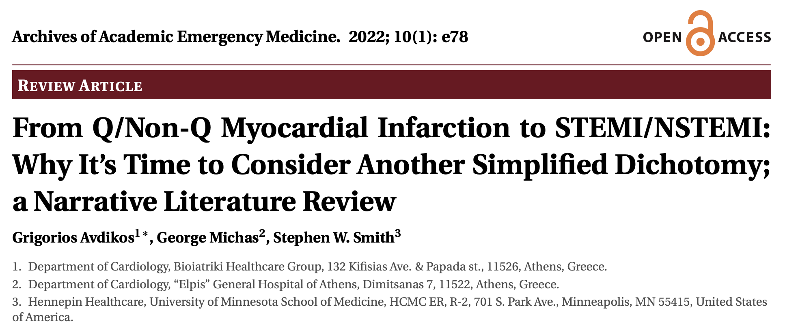

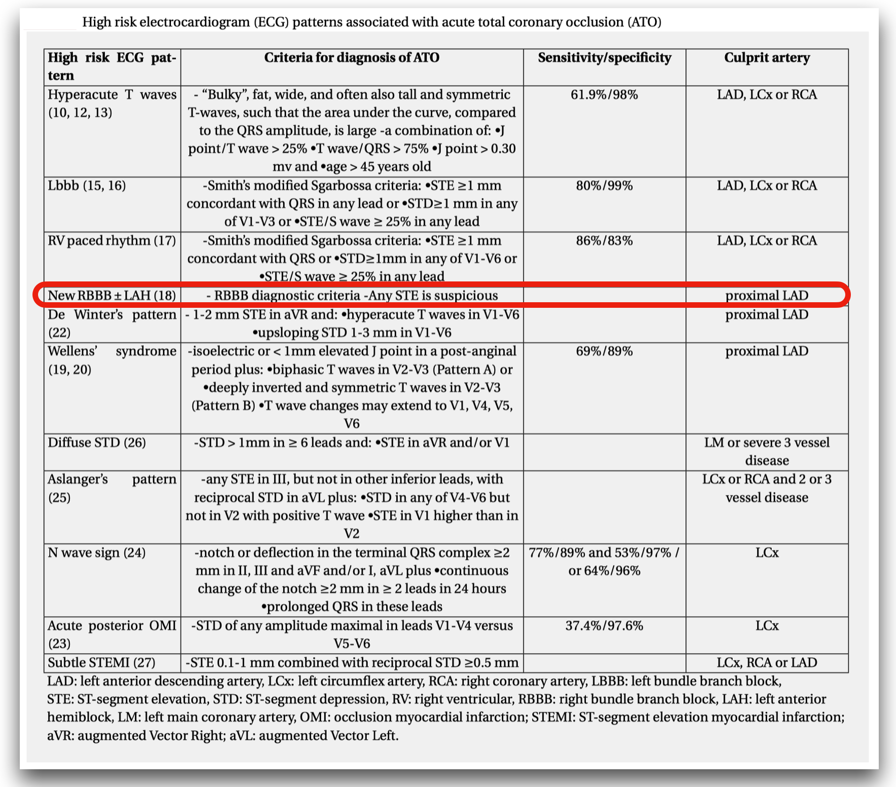

This review article lays out all the high-risk ECG patterns that may indicate ATO (acute total occlusion).

<mark><strong>With RBBB, any STE has to make you consider an occluded vessel.</strong></mark> The IRA is the proximal LAD.

<strong>Dr.Smith</strong> has also said that <strong>with RBBB, there shouldn't be discordant ST deviation (exception: V2/V3 can have < 1 mm of discordant STD)</strong> [^5]

The ECG master <strong>Amal Mattu</strong> has also said in many teaching sessions that RBBB can't have any ST deviation (<strong>even minimal STE in V1~V3 should worry you</strong>), and ICRBBB follows the same rule [^6]

In addition, <mark><strong>the 2017 ESC STEMI Guideline makes the following recommendations for patients with RBBB</strong></mark> [^7] :

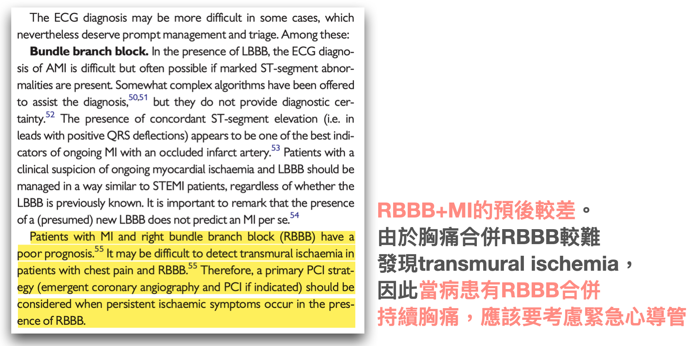

### <mark><u>A quick summary of when RBBB should make you consider ischemia</u>:</mark>

1. With RBBB (especially V1-V3), there shouldn't be any discordant ST deviation ➔ <strong>even minimal STE means you have to consider ischemia</strong>
2. V1-V3 can show discordant STD, but if there's excessive discordant STD (> 1mm of STD), you have to consider ischemia
3. If the leads where secondary repolarization ECG findings are commonly seen (aVR/V1-3, III) show different ECG findings, you have to consider ischemia (see Fig.5)
4. Even if you don't understand the three ECG changes above, and whatever the ECG looks like (if it goes into VT/Vf, you'd at least shock it, right XD), RBBB with ongoing chest pain means you have to consider ischemia

RBBB with AMI is a bit complicated; it's not like LBBB/PPM, where you just apply the Sgarbossa criteria and modified Sgarbossa criteria.

But as long as you have a rough understanding that BBB has so-called secondary repolarization ECG changes, then whenever the leads that commonly show secondary repolarization changes show something different, think of possible primary repolarization ECG changes (such as ischemia).

<strong>If you want the even more brainless rote version: any ST deviation in RBBB (except STD < 1mm in V1-3) means think ischemia.</strong>

## The case continues~~

We're not done reading it yet XD

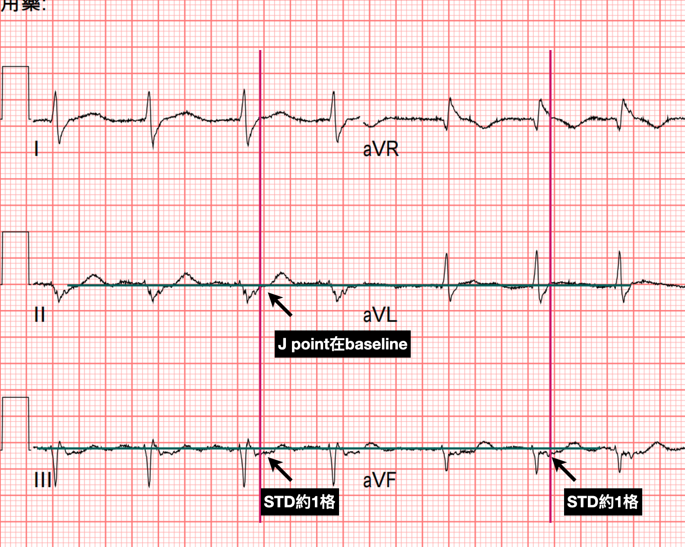

In this patient's limb leads, the J point in II is above the baseline, and III/aVF show about 1 small box of STD

This is <strong>reciprocal STD change</strong> of the high lateral leads. It tells us the likely cause is <strong>occlusion of a more proximal part of the LAD (proximal LAD)</strong>.

Also, <mark><strong>if it's a new RBBB, you can guess the LAD as the culprit lesion first. Why?</strong></mark>

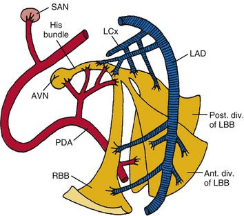

<strong>The RBB is supplied mainly by the septal branches of the LAD, with a smaller part from collateral supply (from the RCA or LCx) (depending on whether it's R't dominant or L't dominant), so honestly, the RBB actually has a dual blood supply</strong>.

So when RBBB shows up, guess LAD occlusion first.

What other situation produces a new RBBB?

Yep, it's pulmonary embar... sorry, tongue got twisted, pulmonary embolism!!!

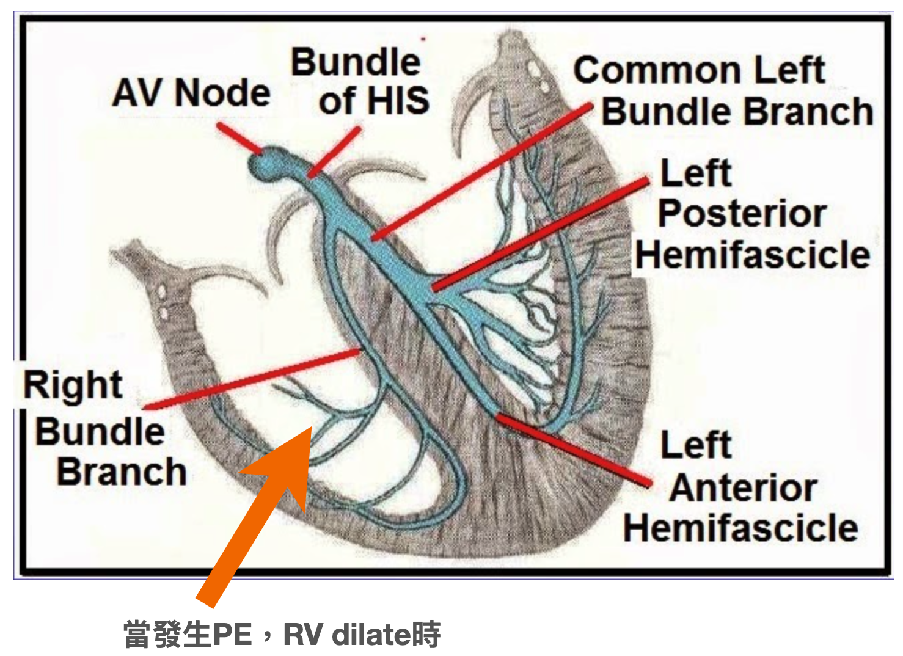

The pul. trunk gets blocked, causing RV dilation; when the RV dilates, it stretches the RBB inside the septum, causing ischemia and producing RBBB

Also, mortality of new RBBB in STEMI is higher than new LBBB in STEMI. And bifascicular block in STEMI has the highest mortality ➡ usually RBBB+LAFB, because the LAFB is thinner and less tolerant of ischemia, so it often gets injured too

In other words: <mark><strong>STEMI with new RBBB or bifascicular block is a high-risk group</strong>, especially <strong>RBBB + LAFB</strong></mark>, and you have to strongly suspect an extensive anterior wall MI (LAD occlusion).

Because <strong>LAD occlusion with RBBB+LAFB</strong> carries a very high risk of death. In this article, the authors believe <strong>at least 20-50% will go into cardiogenic shock or cardiac arrest before PCI</strong>  [^8] .

## The case continues~~

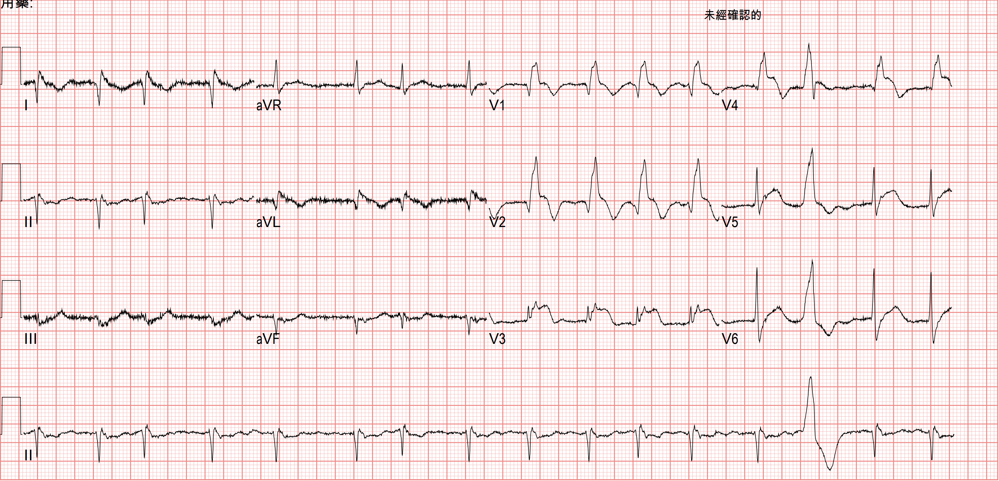

My colleague felt the ECG in Fig.1 was a bit off, but because it didn't clearly meet STEMI criteria, they chose to wait for the TnI. The initial TnI came back normal, so they waited for the second follow-up cardiac enzymes + F/U ECG (<strong>4 hours later</strong>).

<strong>Thinking back to what I said above about LAD occlusion with RBBB+LAFB, with this ECG pattern 20-50% go into cardiogenic shock or cardiac arrest before PCI. Thank goodness nothing in particular happened to the patient during those 4 hours (cold sweat 🥶)</strong>

With the F/U ECG, there was no doubt at all: CV got called.

<strong>CAG: LAD-M total occlusion</strong>

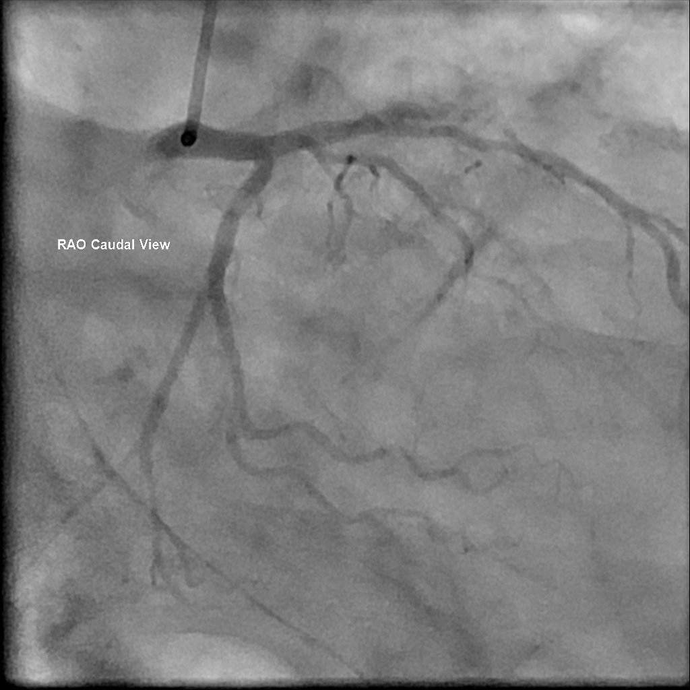

There's one more little trick for recognizing this ECG pattern that I have to mention.

<mark><strong>RBBB+LAFB with AMI very commonly shows downsloping STE ➔ the chance of seeing it is very, very, very high (important things get said three times), it's practically the rule rather than the exception!!!!</strong></mark>

ECGs with this pattern are sometimes not easy to recognize, and once you miss it, it's easy to put the patient in danger (collapse in the ED).

Here's an ECG example from this post [^9]

Sometimes we read ECGs too fast and not carefully. Then it's easy to call it just RBBB+LAFB, without realizing <strong>this one is absolutely an RBBB+STEMI (a one-film diagnosis you could put on an exam)</strong>.

So what do we do?

# Key takeaways:

1. How sensitive are STEMI criteria for catching MI?
2. What are primary & secondary repolarization in BBB?
3. What is the normal secondary repolarization of classic RBBB in V1?
4. What ECG patterns might primary repolarization take in RBBB?
5. When should RBBB make you suspect an occluded vessel? (What do the literature and the ECG masters say?)
6. How do you diagnose a post. MI with RBBB?
7. Which vessel supplies the RBB?
8. AMI with RBBB+LAFB has very high mortality; possibly close to half of patients go into shock or cardiac arrest before PCI
9. AMI with RBBB+LAFB almost always shows downsloping STE (this look is easy to miss) ➔ look at it a few more times and burn this ECG pattern into your brain

# References:

[^1]: McLaren, J. T. T., Meyers, H. P., Smith, S. W., & Chartier, L. B. (2021). From STEMI to occlusion MI: paradigm shift and ED quality improvement. __Canadian Journal of Emergency Medicine__, s43678-021-00255-z. https://doi.org/10.1007/s43678-021-00255-z ↩
[^2]: Avdikos, G., Michas, G., & Smith, S. W. (n.d.). __From Q/Non-Q Myocardial Infarction to STEMI/NSTEMI: Why It’s Time to Consider Another Simplified Dichotomy; a Narrative Literature Review__.
[^3]: Amazon.com: Getting Acquainted With Ischemia and Infarction: Ischemia is NOT an Infarction! eBook : Jones, Jerry: Books - [link](https://www.amazon.com/-/zh_TW/Jerry-Jones-ebook/dp/B0CW18V2LR/ref=pd_ybh_a_d_sccl_7/138-7781813-6954223?pd_rd_w=P0YKd&content-id=amzn1.sym.67f8cf21-ade4-4299-b433-69e404eeecf1&pf_rd_p=67f8cf21-ade4-4299-b433-69e404eeecf1&pf_rd_r=RR04AK6T4592NZBXC9RQ&pd_rd_wg=QIesY&pd_rd_r=33fce024-00e1-4049-839d-91dd63332d5a&pd_rd_i=B0CW18V2LR&psc=1)
[^4]: Okabe, M., Nomoto, J., Fukuda, K., Arakawa, K., & Kikuchi, M. (1997). Right bundle block in a patient with acute posterior myocardial infarction. __Japanese Circulation Journal__, __61__(1), 78–81. https://doi.org/10/cxsqtc
[^5]: Dr. Smith's ECG Blog: If there is high suspicion for ischemia, do serial EKGs and pay attention to them! - [link](https://hqmeded-ecg.blogspot.com/2009/01/if-there-is-high-suspicion-for-ischemia.html)
[^6]:  EMS ECGs: hypothermia emergencies, accelerated idioventricular rhythm (AIVR), and so much more! – ECG Weekly - [link](https://ecgweekly.com/weekly-workout/ems-ecgs-hypothermia-emergencies-accelerated-idioventricular-rhythm-aivr-and-so-much-more/)
[^7]: 2017 ESC Guidelines for the management of acute myocardial infarction in patients presenting with ST-segment elevation | European Heart Journal | Oxford Academic - [link](https://academic.oup.com/eurheartj/article/39/2/119/4095042)
[^8]: Dr. Smith's ECG Blog: Cardiac Arrest at the airport, with an easy but important ECG for everyone to recognize - [link](https://hqmeded-ecg.blogspot.com/2021/09/arrest-at-airport-with-easy-but.html)
[^9]: Dr. Smith's ECG Blog: What is the Diagnosis in this 70-something with Chest Pain? - [link](https://hqmeded-ecg.blogspot.com/2019/07/level-of-training-does-not-well-predict.html)
