Today let's walk through this case and look at **what to do when a patient having an MI develops today's rhythm.**

An 86-year-old woman brought in by ambulance. Found collapsed by the roadside, chief complaint chest pain.

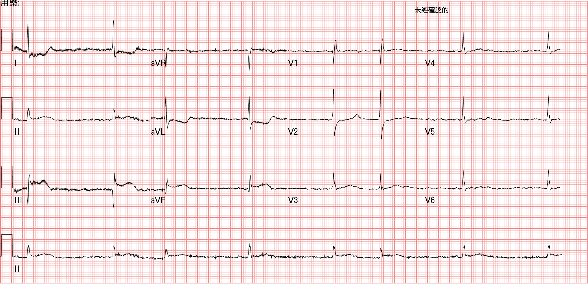

On this one you can clearly see STE in the inf. leads with reciprocal STD in aVL/I. Put together with her clinical symptoms, it's highly likely an inf.wall STEMI (**Fig.1**).

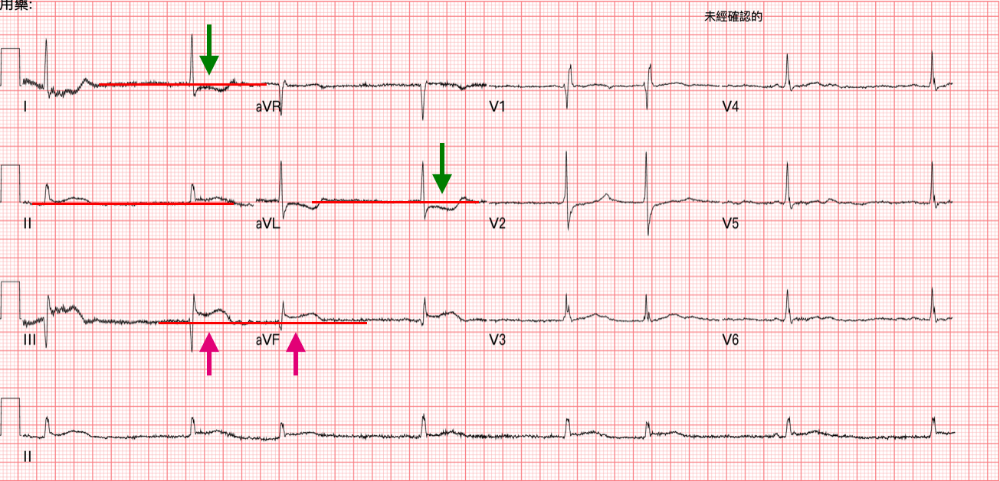

See an inf.wall STEMI, and the reflex is to get a R't side ECG (**Fig.2**).

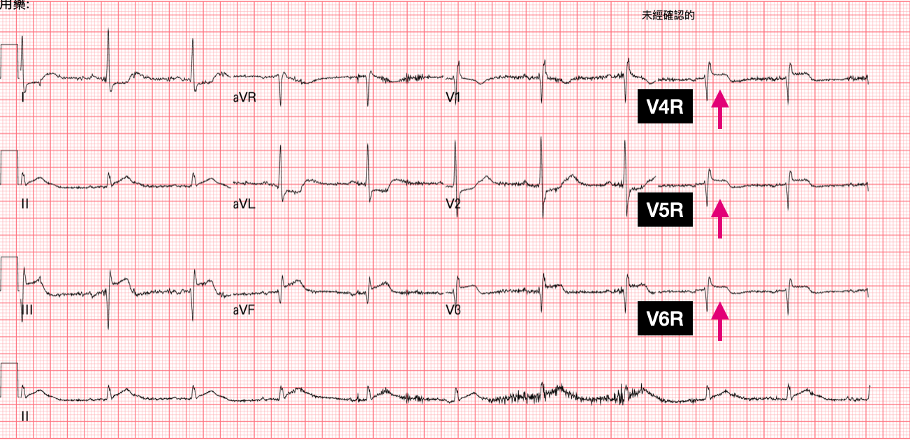

Fig.1 was at 07:46 and Fig.2 at 08:02, about 16 minutes apart.

You can see that on the R't side ECG, the STE in the inf. leads is more obvious, and the reciprocal STD in aVL/I on the opposite side is more obvious too. (Dynamic STTC+)

### ❤️**First question: in an inf.wall STEMI, why look at a R't side ECG too, and which leads should you look at?**

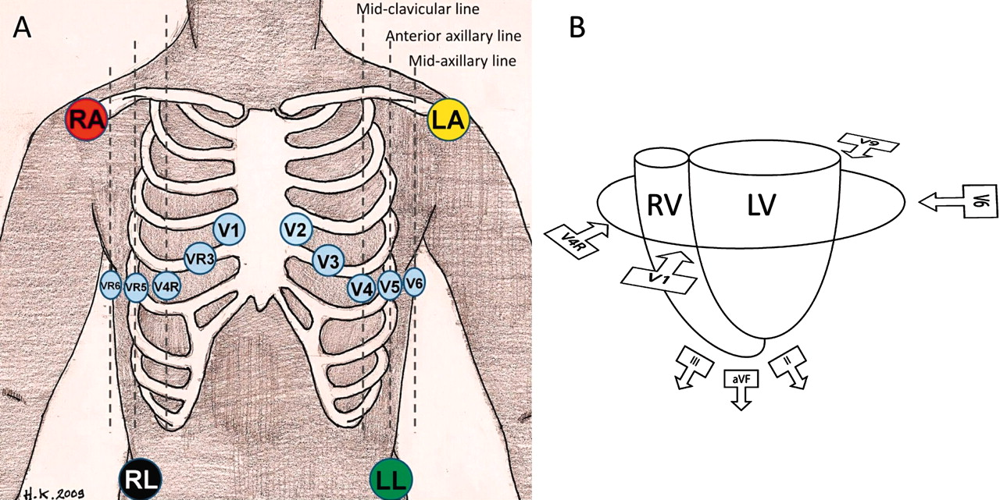

Straight to the point: in an inf.wall STEMI, the reason to add a R't side ECG is to look for RVMI.

The fun thing about ECGs is that if the current of injury from damaged myocardium heads toward the direction a lead is looking from, the lead in that direction should show STE.

So look: V4R sits practically right on the RV. It's there to see whether the RV is involved, in other words whether there's RVMI (**Fig.3, right side**).

If there is RVMI, the treatment is different.

So in the standard 12-lead ECG, is there any lead that looks directly at the RV?

Basically no, but V1 comes close.

That also means we can't rule out RVMI with a 12-lead ECG ➜ since V1 is the lead closest to the RV (**Fig.3, right side**), when there's STE in V1 but not in the other ant. leads, plus chest pain with an inf.wall STEMI ➜ in that scenario you should strongly suspect RVMI.

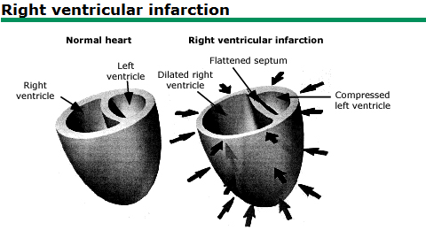

Fig.4 <mark>**This is an old-as-dirt figure from UpToDate, but it's one that really makes it click.**<mark>

In RVMI, the RV dilates and fluid builds up inside it. The septum then gets pushed to the left, so the cardiac output the LV pumps out drops. That's why blood pressure tends to fall.
<mark>**The way to handle it is to give fluids first**<mark>. Hold off on preload-reducing drugs like NTG.

Because NTG dilates the veins ➜ more blood pools in the veins ➜ venous return ⬇︎, so even less blood reaches the LV, and hypotension is more likely.

Giving fluids forces a bit more blood back to the LV so it has something to pump out.

#### So on the R't side ECG, of V3R-V6R, which lead is best for assessing RVMI?

On the R't side ECG, <mark>**the best single lead for assessing RVMI is V4R**<mark> ➜ <mark>**STE ≧1 mm can reach 100% sensitivity and over 90% predictive accuracy for RVMI**<mark> [^1]

V3R, V5R, and V6R generally perform worse diagnostically than V4R, or are only used as an adjunct.

One more bit of ECG trivia: within 12 hours of ACS S/S, in 50% of cases with RV involvement, the STE changes on the R't side ECG disappear [^2].

### ❤️**Second question: does giving NTG to an RVMI patient always cause hypotension?**

In RVMI, because RV contractility is poor, cardiac output depends heavily on adequate preload. So when you give preload-reducing drugs (morphine, lasix, NTG), severe hypotension can occur. That's always been our established concept.
And **for a long time the ACC/AHA Guidelines explicitly listed NTG as a contraindication in RVMI patients, said NTG must be used with caution in inf.wall STEMI patients, and said you must get a R't side ECG to assess for concomitant RVMI** [^3].

Sometimes we use pathophysiology like this to explain a medical phenomenon, and only later find out the human body is a lot more complicated than we thought. That kind of explanation may be too simple.

Early on, **a small study was published in 1989**: a retrospective observational study of 40 patients with inf.wall MI. It reported that close to 50% of the patients who received nitrates developed hypotension, and those inf.wall MI patients who became hypotensive had RV involvement on their ECGs. But **the doses and routes given in this study weren't consistent. Evidence that weak still got written into the guidelines** [^4].

There's also a larger study, published in **Prehospital Emergency Care in 2016** [^5]. It split STEMI into two groups:

- STEMI inferior
- STEMI other territory

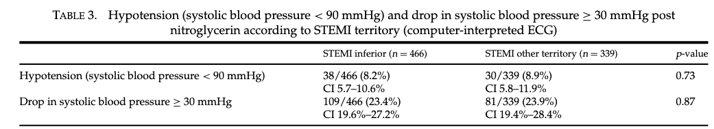

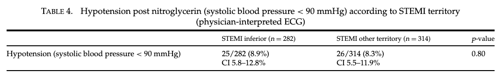

The first is grouping by computer interpretation; the second is grouping after interpretation by emergency physicians.

<mark>**Whichever way they were grouped, there was no difference between STEMI inferior and STEMI other territory in hypotension after NTG**<mark>.

If they had only used computer interpretation without a second grouping by emergency physicians, it would be easy to fall into the illusion that maybe computer misreads were why we couldn't see a difference. So they added the grouping after emergency physician interpretation. That makes the point stronger: even when the ECG is read "more correctly," inferior STEMI still isn't more prone to NTG-induced hypotension.

Also, in this paper, STE in III > II and STE in V1 were taken as evidence of RV involvement (in other words, treated as RVMI).

The authors also noted that <mark>**patients with both of those ECG features for RVMI didn't develop noticeably more hypotension after NTG either**<mark>.

The most important takeaway from this paper: <mark>**with stable blood pressure and the conditions for giving NTG met, STEMI inferior is no more likely than other STEMIs to drop into clinically significant hypotension from NTG.**<mark>

And if you don't have a R't side ECG to help decide whether there's RVMI, are there any clues on the 12-lead ECG alone that tell you there's RVMI?

There are (**Fig.7**)!!!

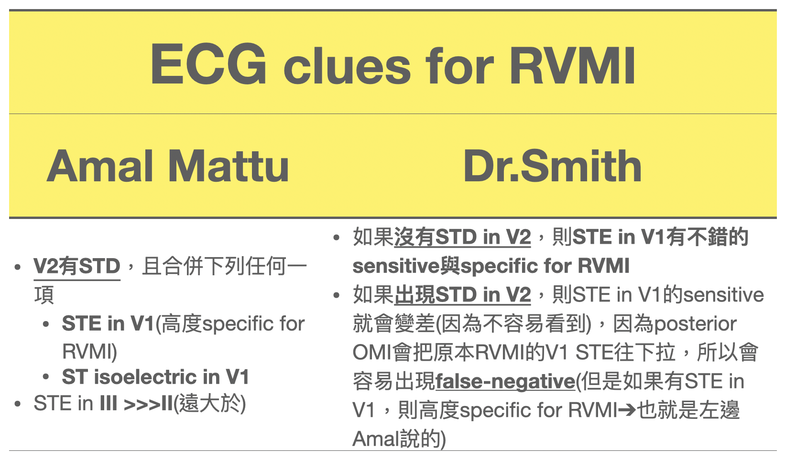

### ↩️Back to case

In the ED, the patient's rhythm suddenly changed!!!!!!!

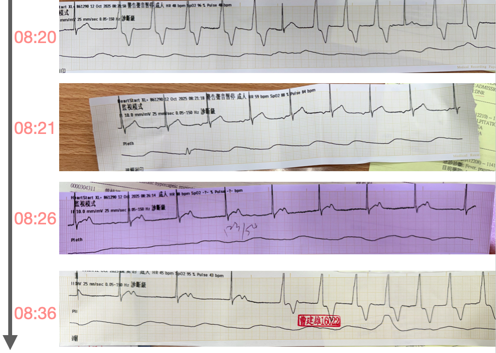

The rhythm suddenly changes. What do you do? Don't panic!

**Check responsiveness, call for help, CABD~~**

Grandma~ Grandma, does it still hurt now?

Patient: Nope~ now it hurts less.

Grandma can still talk, which means it doesn't hurt as much!

So what happened on Fig.8 ➜ the 08:20 ECG?

To name this rhythm, you first need to know **what a ventricular rhythm is**. It's when ventricular pacemaker cells fire. Because the impulse doesn't travel the normal conduction system, conduction is slower, so when ventricular pacemaker cells fire, the QRS is wide.

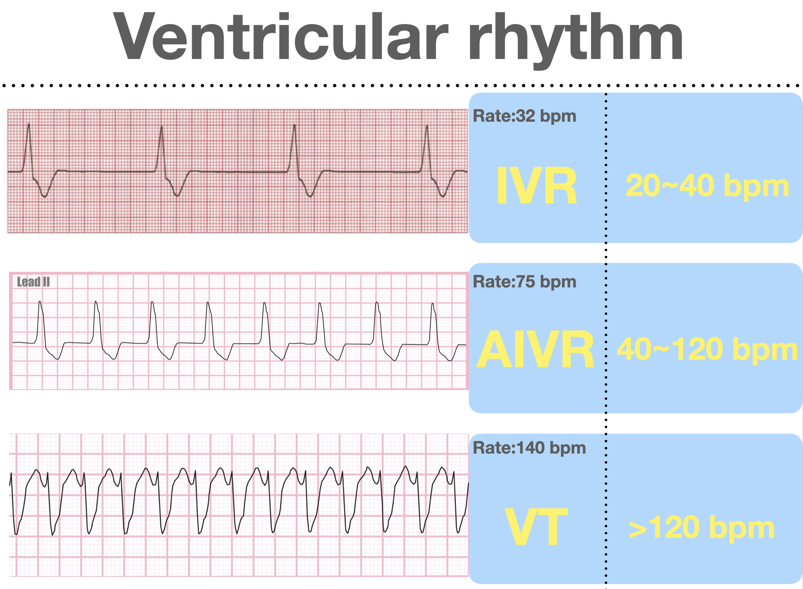

**Fig.9 shows three ventricular rhythms**.

Way, way back when I was a very, very junior doctor taking the ACLS course, the instructor had us memorize what IVR (idioventricular rhythm) looks like. Honestly, back then I just memorized it blindly: an ECG with this shape, we call it IVR. I had pretty much no idea what it actually meant.

#### **When we see no P waves, and a regular, monomorphic, wide QRS like this:**

**If the rate is 20-40 bpm, we call it IVR**

**If the rate is 40-120 bpm, we call it AIVR**

**If the rate is >120 bpm, we call it VT**

<mark>**AIVR is a common reperfusion rhythm. Reperfusion means there was just an MI, and now the vessel is open.**<mark>

Opened by rtPA, opened by PCI, or opened spontaneously, whichever way it opened, it's reperfusion. And that can produce a reperfusion rhythm.

AIVR is one of them.

There's also TWI (T wave inversion), whether biphasic TWI or deep TWI ➜ which is what's often called Wellens' syndrome. This is also a sign of reperfusion (reperfusion TWI).

But careful: **TWI while symptomatic means reciprocal change**.

A very common example is inf.wall STEMI with STD/TWI in aVL; here the STD/TWI represents reciprocal change.

Likewise, high lateral wall MI with STD/TWI in III; here the STD/TWI represents reciprocal change.

<mark>**This part may be a little hard to follow, so put simply:**<mark>

- If, with ACS S/S, the T wave was originally upright, and later, once the patient has no ACS S/S (or is improving), that upright T wave turns into TWI ➜ that means the territory supplied by that lead has reperfused (reperfusion) (**Fig.10**)
  - In Fig.10 the **posterior reperfusion T wave is upright (very special!!!)**, because it mirrors TWI of the posterior wall, which shows up in the ant. leads as a tall T wave
- If, with ACS S/S, a lead that should have an upright T wave shows TWI instead, use lightning-fast hands to check the opposite lead for STE, because this TWI/STD is very likely reciprocal change (**Fig.11**)
  - aVL➜III
  - III➜aVL
  - V6➜V1

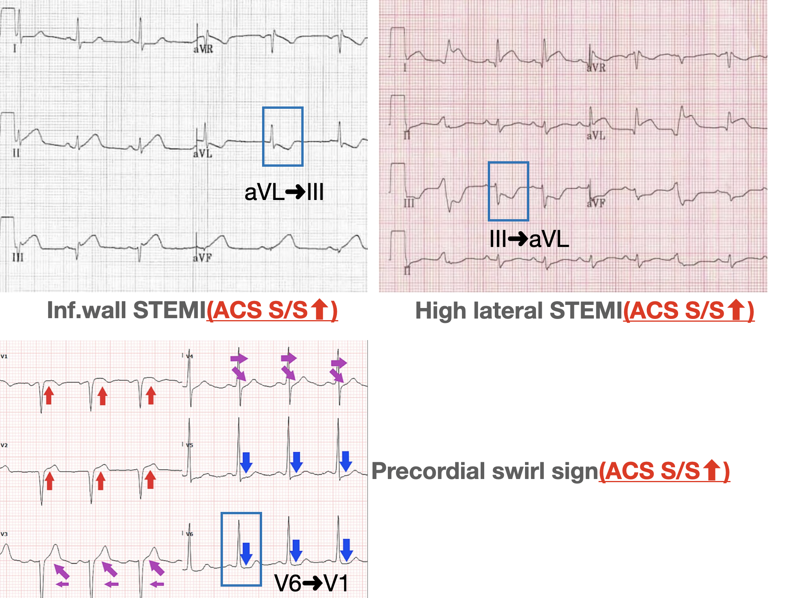

So the rhythm on Fig.8 at 08:20 looks roughly between 65-75 bpm. Wide QRS, no obvious P waves.

#### This is AIVR

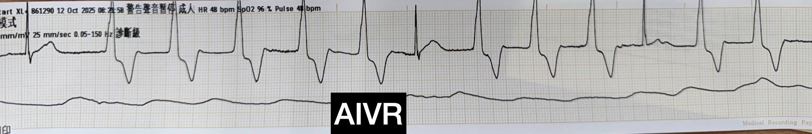

Grandma's ACS S/S were easing too.

I added the patient's symptoms at the time onto Fig.8.

#### **A few key points we can learn from this patient:**

1. The patient developed AIVR, which means reperfusion, which means the vessel opened (**could be fully or partially open**➜ at 08:36 there was AIVR again, but she was still symptomatic)
2. AIVR is a good sign, but it doesn't mean the vessel won't close again (re-occlusion). In Fig.12 you can see that not long after, the patient had ACS S/S again, and the AIVR disappeared
3. Even with AIVR, the speed of cath lab activation can't stop. Straight to the cath lab, please 🙏!!!!
   - Dr. Smith's ECG blog also points out in this post that **sometimes rescue collaterals can develop quite quickly, and a small amount of retrograde perfusion is enough to cause ECG changes**. That's why you **don't use reperfusion ECG findings as a reason to delay the cath** [^10].

#### Finally, a bit more background on AIVR

**How many PVCs in a row does it take to count as AIVR?**

- You need <mark>**≧3 PVCs in a row, at a rate between 40-120 bpm, to call it AIVR**<mark> [^6]

The rate range for AIVR actually **hasn't been standardized**. **You can refer to these four definitions:**

- **40~120 bpm**➡**Amal's definition (<u>I personally like using Amal's definition: round numbers, easy to remember</u>)**
  - Generally, VT is rarely 120 bpm; it's mostly >130-140 bpm
- 50~110 bpm ➡ the definition in this article [^7]
- 50-120 bpm, the definition on LITFL [^8]
- 60~110 bpm, the definition on ECG interpretation [^9]

### ❤️**Third question: you recognize AIVR and know the vessel is open. So what?**

When I teach students AIVR, besides the basic definition, I also explain that there's a **potential crisis** hiding in here.

Especially for ECG beginners, or a young R, a resident taking CCU call for the first time, an R on their first shift in the ED resus room: any of them could run into this crisis.

I just said AIVR is defined as 40-120 bpm.

Let's pose a question. Say you're a doctor on your first CCU call.

Half an hour ago, the CV chief resident told you, hey, junior~~

I just took an inf.wall STEMI patient. I already opened it in the cath lab and put a stent in the RCA. The patient will come up to the CCU for you to take over shortly.

The patient arrives in the CCU, and not long after, the rhythm starts to change.

#### If the AIVR right now is 60 a minute, would you recognize it as AIVR?

#### If the AIVR right now is 115 a minute, would you still recognize it as AIVR?

The chief just told you this patient is an inf.wall STEMI, and now there's a wide QRS tachycardia (115 bpm). **Would there be just the tiniest flicker of a thought in your head:**

### Is this.....VT?

**What happens if we treat AIVR as VT?**

I usually explain AIVR with an analogy.

An AMI is massive damage to the heart. When reperfusion happens, the heart has just been through an AMI, so the heart's computer has crashed.

Reperfusion is the heart's computer rebooting.

While the heart is rebooting, the SA node/AV node haven't recovered function yet, so they aren't firing at all.

At that point only the ventricular pacemaker cells are firing. This is **the heart's last candle flame**. **This firing is a good sign**; it's the only thing supplying cardiac output during the reboot.

<mark>**If we treat AIVR as VT and shock it or give drugs, we snuff out that last candle flame**<mark>

SA node not working

AV node not working

And the ventricular pacemaker cells **got taken out by us too XD**

#### <mark>**All the heart can do is flatline..................................................Remember this, remember this!!!**<mark>

When you see AIVR, tie your own hands. Don't pick up the paddles, don't order any antiarrhythmics. <mark>**Usually after 5-10 minutes the SA node starts firing again, overrides the AIVR, and sinus rhythm comes back**<mark>

<mark>**So to recognize AIVR, besides using the rate for a rough assessment, you also need to look at it together with the patient's clinical picture. (This is a big key point!!!)**<mark>

The ECG interpretation post also says the AIVR rate range isn't that clear-cut or absolute.
It's not that a heart rate of 121 bpm must be VT and definitely can't be AIVR.
Ken grauer mentions in this post that there's a <mark>**gray zone: between 110-130 bpm**<mark> [^9]
In other words, **at rates in this gray zone, you can wait and see. If it's not affecting vital signs, you can consider observing first. Don't rush to intervene**.

**So when the clinical setting is a fresh MI, followed by a wide QRS rhythm (Rate: 40-120 bpm), think AIVR.**

**The main treatment strategy is: don't shock / don't use antiarrhythmics**

Unless you suspect VT or there's severe hemodynamic instability. Then the direction of treatment is to restore a faster sinus rate (for example, helping relieve ischemia, **giving atropine to block vagal (parasympathetic) tone**, etc.), letting the sinus take back control from the ventricular focus, rather than messing with the ventricular rhythm itself [^11].

### ↩️**Back to case**

The patient then went to the cath lab.

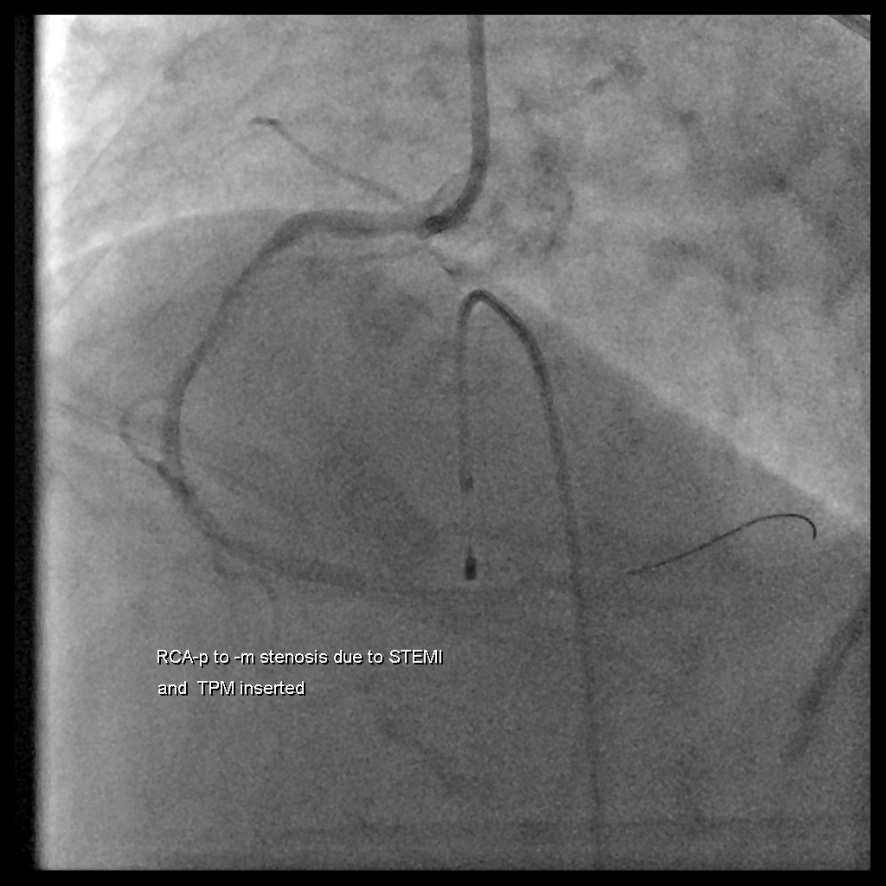

**CAG report:Acute STEMI (IRA: RCA) with cardiogenic shock and bradycardia, CAD with 1-vessel disease (RCA-M: 100% acute total occlusion) s/p primary PCI with BMS*1 (Meril NEXGEN 2.75X32mm) over RCA-P to -M**

## Key learning points:

1. Which lead on the R't side ECG is most valuable?
2. Without a R't side ECG, how do you use the 12 leads to guess there may be concomitant RVMI?
3. Why get a R't side ECG?
4. Does RVMI always mean you can't use NTG?
5. AIVR vs. VT
6. What's the treatment strategy for AIVR?
7. Even with AIVR, a reperfusion rhythm, still don't delay the cath
8. Reperfusion TWI vs. reciprocal change

## References:

[^1]:  Right Ventricular Myocardial Infarction - StatPearls - NCBI Bookshelf | ncbi.nlm.nih.gov [link](https://www.ncbi.nlm.nih.gov/books/NBK431048/)
[^2]: Levis, J. (2016). ECG Diagnosis: Right Ventricular Myocardial Infarction. __The Permanente Journal__. https://doi.org/10.7812/TPP/16-105
[^3]: Wilkinson-Stokes, M., Betson, J., & Sawyer, S. (2023). Adverse events from nitrate administration during right ventricular myocardial infarction: a systematic review and meta-analysis. __Emergency Medicine Journal__, __40__(2), 108–113. https://doi.org/10/gqz57d
[^4]: Ferguson JJ, Diver DJ, Boldt M, et al. Significance of nitroglycerin-induced hypotension with inferior wall acute myocardial infarction. __Am J Cardiol__.1989;64:311–4.
[^5]: Robichaud, L., Ross, D., Proulx, M.-H., Légaré, S., Vacon, C., Xue, X., & Segal, E. (2016). Prehospital Nitroglycerin Safety in Inferior ST Elevation Myocardial Infarction. __Prehospital Emergency Care__, __20__(1), 76–81. https://doi.org/10/gmsvrq
[^6]: Article: Accelerated Idioventricular Rhythm: Background, Pathophysiology, Etiology | [emedicine.medscape.com](https://emedicine.medscape.com/article/150074-overview?utm_source=chatgpt.com&form=fpf)
[^7]: Gildea, T. H., & Levis, J. T. (2018). ECG Diagnosis: Accelerated Idioventricular Rhythm. __The Permanente Journal__, __22__. https://doi.org/10.7812/TPP/17-173
[^8]: Article: Accelerated Idioventricular Rhythm (AIVR) | Life in the Fast Lane • [LITFL](https://litfl.com/accelerated-idioventricular-rhythm-aivr/)
[^9]: Article: ECG Blog #108 (Ventricular Rhythms - AIVR - VT) | [ecg-interpretation.blogspot.com](https://ecg-interpretation.blogspot.com/2015/04/ecg-blog-108-ventricular-rhythms-aivr-vt.html)
[^10]: Dr. Smith's ECG Blog: 46 year old with chest pain develops a wide complex rhythm -- see many examples - [link](https://hqmeded-ecg.blogspot.com/2024/08/46-year-old-with-chest-pain-develops.html)
[^11]: Riera, A. R. P., Barros, R. B., de Sousa, F. D., & Baranchuk, A. (2010). Accelerated Idioventricular Rhythm: History and Chronology of the Main Discoveries. __Indian Pacing and Electrophysiology Journal__, __10__(1), 40–48. https://pmc.ncbi.nlm.nih.gov/articles/PMC2803604/
