Today we're looking at a really interesting case. There's a lot to learn from these ECGs.

59-year-old man, came to the ED on Lunar New Year's Day.
He told me the chest pain had been going on for 3-4 days, sometimes radiating to his back.
Tonight it went through to his back, bad enough that he broke out in a cold sweat

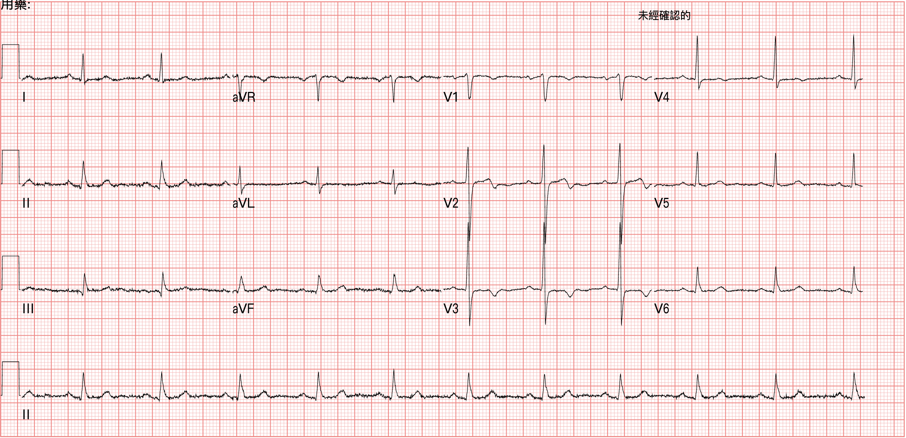

Rate: 66 bpm

Rhythm: SR

Axis: normal axis

Interval: QTc ➔444

Ischemia: no leads meeting STEMI criteria

But a few leads look kind of off

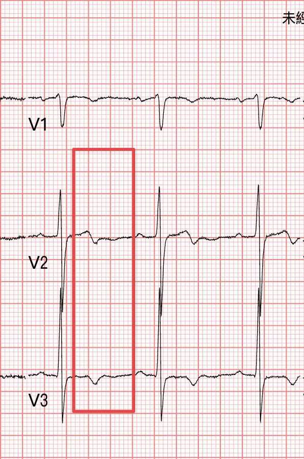

TWI in V2-V3

What does this make you think of?

Break it down a bit more: V2-V3 are R't precordial leads

To sum up: TWI in the R't precordial leads. What conditions do this?

### A few conditions you have to think of:

1. Wellens' syndrome
2. Pulmonary embolism
3. Juvenile TWI
4. RBBB
5. Brugada syndrome
6. ARVC
7. RVH

These are the possibilities that pop into my head first

Once you've fished every DDx out like a needle from the ocean floor, your brain has to rank them fast by which is most likely.

#### <strong>The ones that can kill people go to the front of the line. That's how I like to rank them</strong>

Wellens' syndrome

Pulmonary embolism

Brugada syndrome

are always the three I want to rule out first

If you want to know more about TWI in the R't precordial leads, take a look here [^1]

### How do you tell ACS Wellens' syndrome apart from PE?  [^2]

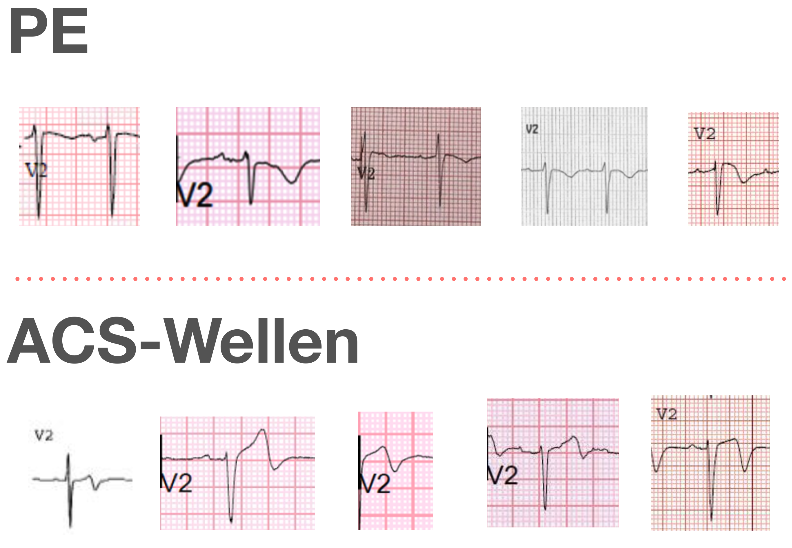

I've written about this before. I'll go over it again in more detail anyway, partly as a review for myself.

#### <strong>⭐️What kind of V2~V3 ECG morphology leans toward RV strain (if the ECG has an RBBB pattern, the morphology below doesn't apply)</strong>

- Usually bigger S wave than R wave
- Usually J point isoelectric or J point elevated, followed by upwardly convex STE and then TWI ➜ meaning PE's TWI looks different from the TWI of [[Wellens' wave]] (<strong>look at the ECG morphology in Fig.2</strong>)
  - <strong>The TWI of PE</strong> is convex STE that then curves down like a roller coaster
  - <strong>The TWI of ACS-Wellens</strong> drops off steeply, sharper
- Usually some STD in V4~6, and the inf. leads will also have TWI

#### <strong>⭐️Wellens' syndrome is an ECG recorded pain-free after an episode of chest pain (after coronary reperfusion, symptoms should drop off noticeably) ➜ if you see TWI but the patient still has ongoing discomfort, think about other DDx</strong>

- When you see TWI, first check how the patient's symptoms are, then check whether the prior ECG had this TWI ➜ if symptoms have resolved and the old ECG didn't have this change, first consider that it may be a reperfusion rhythm (<strong>just had an MI, but it's open now</strong> ➜ say it with me one more time: when you see Wellens' syndrome, the most basic concept is <strong>just had an MI, but it's open now</strong>)

#### <strong>⭐️ACO rarely comes with tachycardia, especially after reperfusion, unless the patient is already in cardiogenic shock (Poor LV function)</strong>

- But in PE, sinus tachycardia is very common

OK, that covers Wellens and PE. So does it look like Brugada? Not at all. Cross that DDx right off.

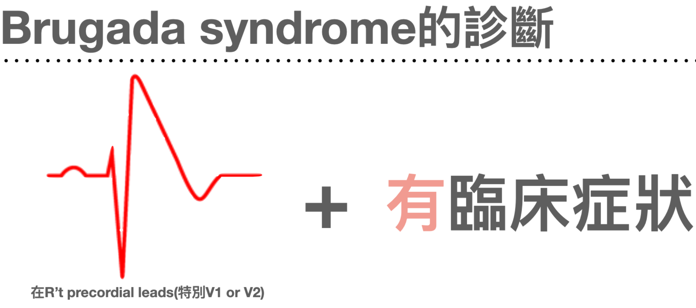

## <strong>❤️Case continued</strong>

Because the pain ran from his anterior chest through to his back, bad enough to make him break out in a cold sweat, I still ordered a Chest CTA even though the D-dimer was normal. No aortic dissection.

First cardiac enzyme: <0.1 (normal)

Second cardiac enzyme: 0.17 (flagged red), just a hair over (at our hospital >0.16 gets flagged red)

In between, the patient got one sublingual NTG, and actually, during ED observation he never had any symptoms at all

I handed off at shift change, and the attending who took over sent the patient home.

Honestly, thinking about it, if the patient had still been mine, I probably would have sent him home too.

No prior ECG, symptoms completely resolved, and it was the second day of Lunar New Year, peak patient volume.

I remember checking on his symptoms partway through, and he kept saying he had none; he was convinced it was a pulled muscle.

This is really scary: <strong>when we're busy, it's easy to get pulled along by what the patient tells us.</strong>

<strong>Fine, you've got no symptoms, and you say it feels like a pulled muscle. Then go home. The ED is packed wall to wall, so go home.</strong> I bet that's exactly what my brain would have been thinking at the time XD

<strong>But..... but, how do you explain a TnI that's already flagged red, even if it's still not high?</strong>

### First, there are some facts we have to know

<mark><strong>A normal first cardiac enzyme in the ED is very common in MI patients.</strong></mark>

<mark><strong>A first ED ECG with no visible abnormality doesn't mean the patient isn't having an MI</strong></mark>. <strong>(Of course, it's also possible you just didn't spot it XD. Please keep coming back to this site to read ECGs and stay safe😅)</strong>

#### Let's look at the basic definition of Wellens' syndrome as LITFL explains it: [^3]

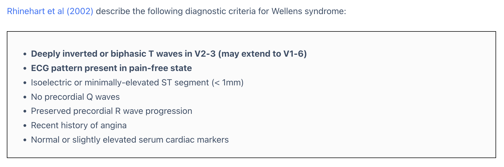

#### Key points:

- Deeply TWI or biphasic TWI in V2-3 (may extend across V1-V6) 
  - Remember: AIVR and TWI can both be reperfusion rhythms 

- <strong>This TWI shows up while pain free</strong> (<strong>big point!!!</strong>)
- <strong>No Q waves in the precordial leads</strong> (<strong>big point!!!</strong>)
  - Because Q waves mean the MI has already been going on for a while, which doesn't fit the definition of just had an MI, open now

- R wave progression is still preserved
  - In other words, if there's PRWP (poor RWP), it means there may also have been an MI for a little while, which is why R wave progression is lost

- Normal or <strong>mildly elevated biomarkers</strong>

## <strong>❤️Case continued</strong>

So based on ECG morphology and the relevant biomarkers, this case should count as Wellens' syndrome.
Going by the 2018 fourth definition of MI (Fourth Universal Definition of Myocardial Infarction 2018)
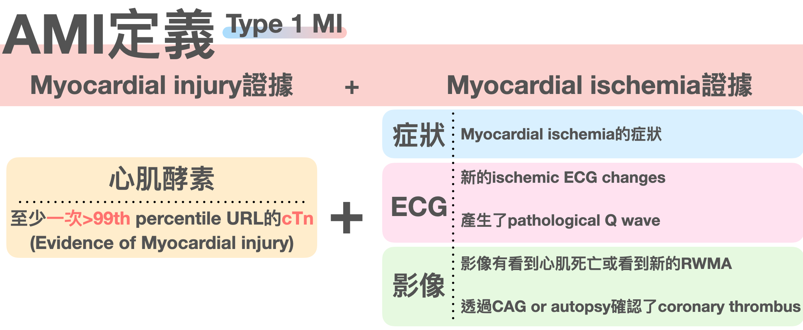

<mark><strong>The definition of Type 1 MI is evidence of myocardial injury (Biomarker+) + evidence of myocardial ischemia (symptoms/ECG/imaging, any one of the three)</strong></mark>

So this patient should actually have been diagnosed with AMI

By the definition of ACS, it should be NSTEMI, because the biomarker was already abnormal.

I think I learned something here.

Of course, every AMI patient's situation is different.

There are just cases like this: if you look carefully, he does in fact meet the definition of AMI. But the second TnI is one of those borderline-high ones, symptoms have already resolved, the patient says it feels like muscle pain, and the ED is exploding with patients at that moment.

The patient wants to go home. Do you let him go?

#### Next time I run into this situation, I'll think long and hard about it.

Why?

#### Let's follow what happened to the patient next

As soon as he walked out the ED door, he said he caught a blast of cold wind. His chest started hurting again

So he came right back to the ED

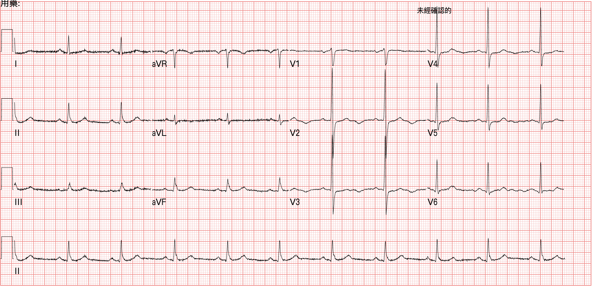

What I find really interesting about this one is a few things.
First, the obvious TWI from a few hours ago seems to have disappeared.
Second........ an inverted U wave actually showed up
OH~~My God!!! I've been looking for a case like this for so long and never come across one XD

### Let's go through these interesting points one at a time

The TWI is gone, replaced by an upright T wave, and this ECG was done during chest pain. So this is what we often call <strong>pseudonormalization of T wave</strong>

What does that mean? It means the TWI represented reperfusion (just opened), but now he's in pain again and the TWI has turned into an upright T wave (occluded again now)

Of course, if symptoms persist, this T wave may turn into HATW (hyperacute T wave) a few hours later

The second thing is the inverted U wave

What is that?

Let's take a look first

About 30 minutes later, the patient was in severe pain, through to his back, bad enough to break out in a cold sweat
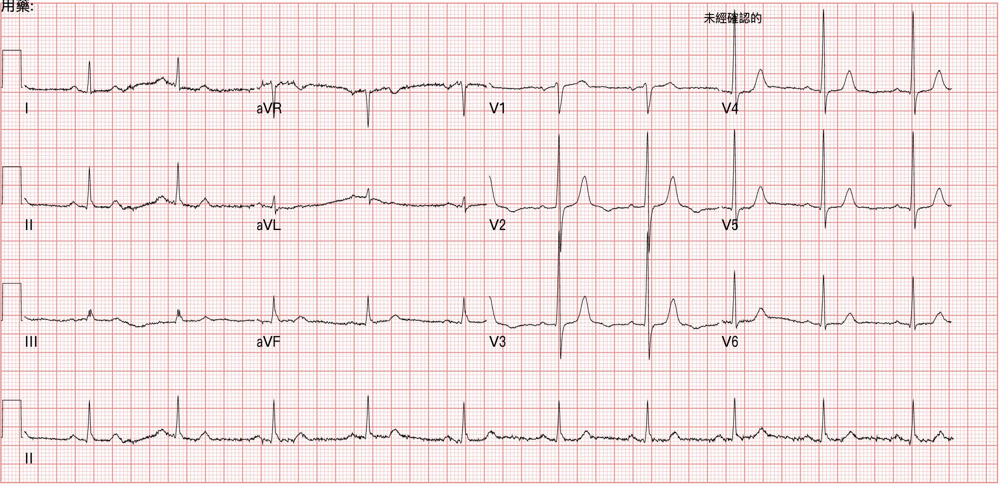

On this one the T waves are taller, and the inverted U wave is more obvious than on the first ECG of the return visit

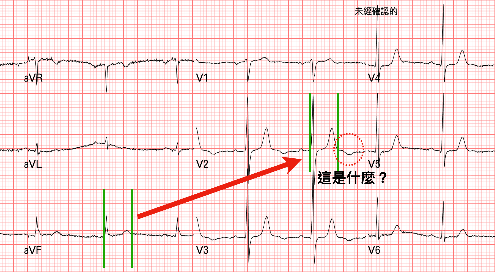

I've enlarged Fig.7 a bit so we can look

### To diagnose an inverted U wave, there's one hurdle first.

That is, you <strong>have to first distinguish whether this is really an inverted U wave, or the terminal T wave inversion of a biphasic T wave</strong>

Simple. Let's look at Fig.8 and first find a QT interval that's fairly obvious and clear cut. In Fig.8 the QT interval in aVF is very obvious, so mark it out

Move it over to the spot where you can't tell whether it's an inverted U wave or the terminal part of a biphasic T wave inversion.

The QT interval means from the start of Q to the end of the T wave.

So if you suspect it's the terminal part of a biphasic T wave inversion, the green QT interval should include the downward dip on the red dashed line.

But it doesn't. <strong>The downward dip on the red dashed line is not inside the QT interval</strong>.

So <strong>the red dashed one is the inverted U wave</strong>.

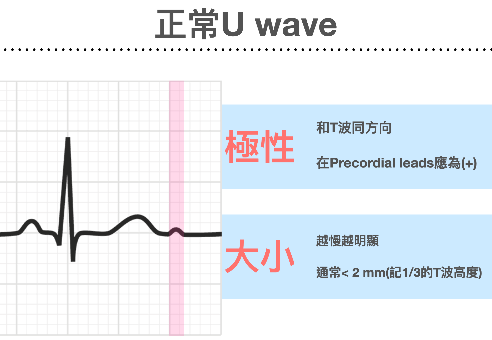

<strong>A normal U wave goes in the same direction as the T wave (concordant)</strong>, and it isn't prominent.

But <strong>the slower the heart rate, the more obvious the U wave gets</strong>

It's also commonly seen in the lateral leads, and a normal U wave is about 10% of the T wave's height

There's one more clinical situation where the U wave gets very obvious, and that's <strong>Hypokalemia</strong>

In <mark><strong>severe hypokalemia, the U wave becomes very obvious, so the T and U fuse together into a T-U wave, which causes QT prolongation</strong></mark>, mainly because the prominent U wave gets counted in.

Here's one of my own cases

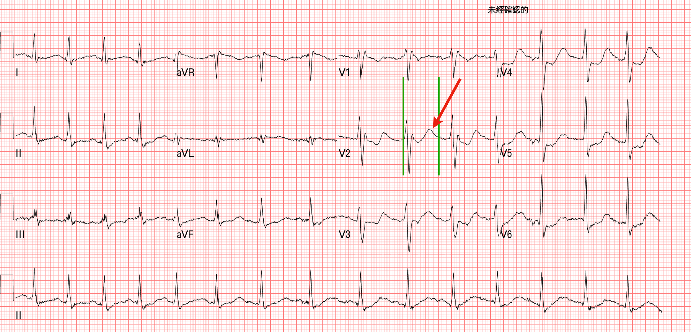

36-year-old man, came to the ED with generalized weakness and vomiting

The green is the QT interval as we'd normally measure it, clearly more than 1/2 the RR interval: QT prolongation

The T wave here is also called a down-up T wave (down first, then up), which is the classic ECG morphology of hypokalemia

The biphasic TWI we usually talk about is up first, then down; there's no down-then-up version. You have to know this. Don't mix them up.

The red arrows in Fig.9 are the prominent upright U waves caused by hypokalemia

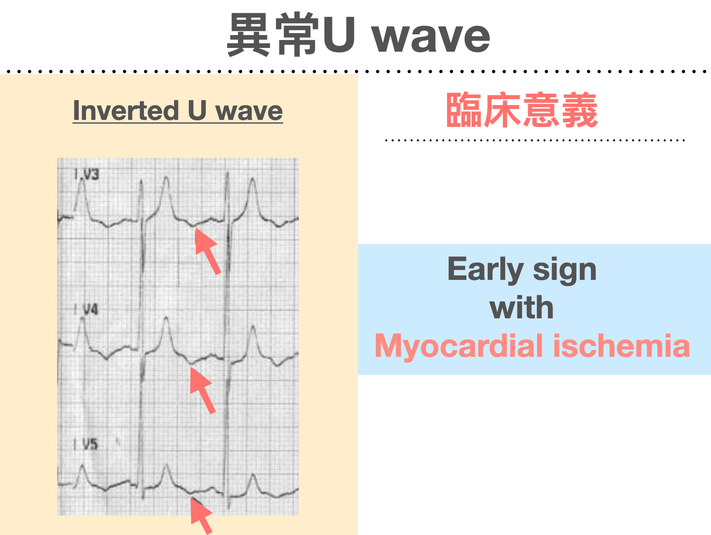

OK, so what's the clinical significance of an inverted U wave? It may be an <strong>early sign with myocardial ischemia</strong>

First let's look at this 2005 paper [^4]






It contains this point ➜ <mark><strong>U wave inversion may appear hours before the ECG changes of MI develop</strong></mark>.

### So if we run into an inverted U wave, how do we handle it and what's the next step?

I asked Gemini Pro to tidy up what I'd written about Inverted U wave in my own Roam research notes and present it as a chart. Looks way better~~

In it, <mark><strong>(-) U wave ➜ means Inverted U wave, not that no U wave formed</strong></mark>

Simply put, <mark><strong>Inverted U wave, like HATW, can show up earlier, before STE appears. It also leans more toward an LAD lesion</strong></mark>

Amal Mattu also talked about inverted U wave in this episode of ECG Weekly; if you're interested, go check it out [^5]

So cool~~

## <strong>❤️Case continued</strong>

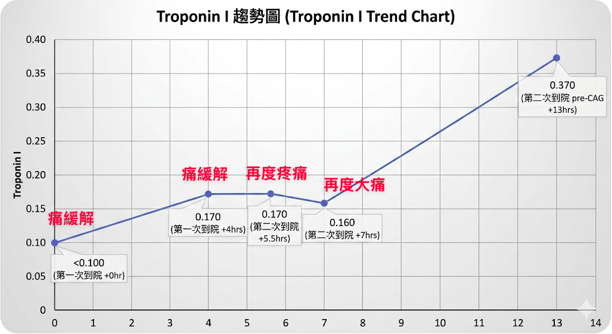

The second time, he'd only just walked out of the ED when the pain started again, and not long after that it got even worse.
The TnI at these points was really only a little high, about the same as the first visit.

At Fig.7 it was the second return plus worse pain, and the T waves in V2/V3 on the ECG were taller. So we consulted the CV man

The CV man's reply: wait for the blood results.

But the blood result, as in Fig.12, was 0.16. The CV man told us to decide for ourselves whether to admit the patient to the ward or the ICU

The excitement wasn't over yet~~

At a little after 6 a.m., the patient had another bout of severe pain.
Because he was on an ECG monitor at the time,
the nurse saw the monitor was abnormal again and printed the ECG strips from that moment to show me

Whoa~~

This isn't a simple PVC. This is an abnormal ischemic PVC

Let me explain

I've written before, in this post, that a PVC can be the little guy that saves the day [^6]. I'll borrow a bit of that content here.

VPCs originate in the ventricles. <strong>Like LBBB, VPCs have discordant ST segments, so when you see excessive discordant STE or concordant STE, be careful</strong>. There's no evidence that the MSC can be applied to VPCs the way it is to LBBB. But based on Stephen Smith's experience, <strong>this rule works very similarly for VPCs as for LBBB, though it's a bit less specific</strong> [^7]

### Let's review. <mark>Modified Sgarbossa criteria (MSC)</mark> can be applied to patients with LBBB/PPM. <strong>The criteria are:</strong>

1. Concordant STE (> 1 mm) in any lead
2. Concordant STD (> 1 mm) in V1-V3 (just one lead is enough) → for PPM, it extends to V1-V6
3. Excessive discordant in any lead (STE/S >0.25 or STD/R >0.3)

#### <strong>One thing to note here: stop using Criteria C of the Sgarbossa criteria (i.e., Discordant STE >5 mm) → it has a high chance of false positives and isn't specific, which is why Smith published the MSC in Ann Emerg Med in 2012 to replace Criteria C and fix this problem.</strong>

With the MSC, using 0.25 as the cutoff gets sensitivity to 80% and specificity to 99% (these figures come from the 2015 validation study[^meyers2015]). Using 0.3 may drop sensitivity to 64%, and you'd end up missing a lot of AMIs.

<strong>Heads up: even though Dr. Smith's MSC uses 0.25 as the cut off point, look at the figure above: at STE/S >0.2 you should already be suspecting AMI!!!!!!!!!!</strong>






## <strong>❤️Case continued</strong>

Let's work out roughly what the STE/S is in this case. About 0.7

<strong>This is an ischemic pattern PVC</strong>

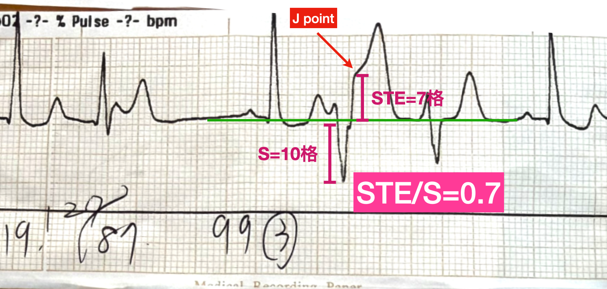

Originally I'd admitted the patient to a general ward, but after seeing this ischemic pattern PVC, I switched his bed straight to the CV-ICU
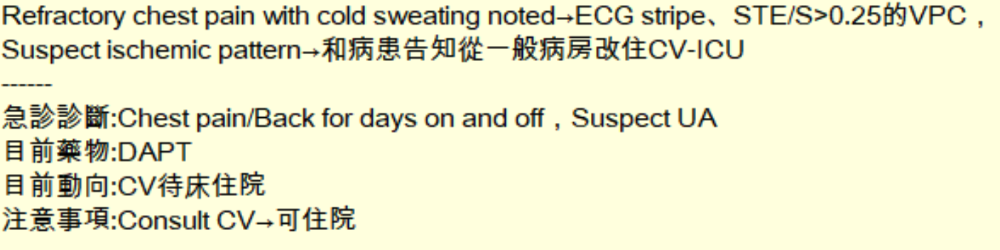

He went up and had a CAG that same morning:
CAG report ➜ LAD:  <strong>pLAD critical lesion, plaque rupture with thrombus formation and 95% stenosis</strong>, impaired TIMI flow; dLAD        discrete lesion with 70% stenosis

This case taught me a lot, including that the clinical significance of Wellens' syndrome is a high risk of extension ant.wall MI over the next few days to few weeks. We saw it in the ER, and sending the patient home really does carry a real risk, because, yes, seeing Wellens' waves means the patient has already reperfused (the vessel is open).

But....... <mark><strong>nobody knows at all when it will re-occlude</strong></mark>.

In this case we drew blood over and over, the biomarker stayed stuck in the same place, the CAG showed the pLAD almost completely occluded, the TnI barely moved over time, and not a single ECG met STEMI criteria.

It confirms yet again what the ECG master Ken Grauer says: if a patient has ACS S/S, you have to rule out ACS no matter what. The ECG/Biomarker may both be normal.

That's exactly why the ESC 2020 NSTEMI guideline keeps saying that refractory chest pain (<strong>regardless of ECG/biomarker</strong>) is one of the indications for CAG within 2 hours

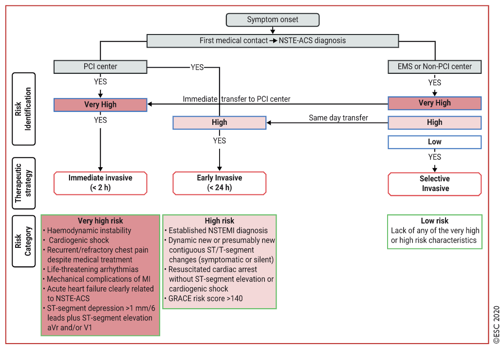

On top of that, this case let me collect ECGs of an inverted U wave and an abnormal ischemic pattern PVC~~ so happy🥳🥳🥳

{}

1. The definition of Wellens' syndrome, and the risk of re-occlusion
2. What is Pseudonormalization of T wave?
3. What is an Inverted U wave? What's its clinical significance? How to use the QT interval to help diagnose an inverted U wave
4. Can a PVC also diagnose myocardial ischemia? What kind of PVC should raise your guard

{}

## References:

[^1]: Amal Mattu’s ECG Case of the Week – August 8, 2022 – ECG Weekly - [link](https://ecgweekly.com/2022/08/amal-mattus-ecg-case-of-the-week-august-8-2022/)
[^2]: Dr. Smith's ECG Blog: A crashing patient with an abnormal ECG that you must recognize - [link](http://hqmeded-ecg.blogspot.com/2018/03/a-crashing-patient-with-abnormal-ecg.html)
[^3]: Article: Wellens Syndrome | Life in the Fast Lane • LITFL [link](https://litfl.com/wellens-syndrome-ecg-library/)
[^4]: Reinig, M. G., Harizi, R., & Spodick, D. H. (2005). Electrocardiographic T- and U-Wave Discordance. __Annals of Noninvasive Electrocardiology__, __10__(1), 41–46. https://doi.org/10/d2xxd2
[^5]: Amal Mattu’s ECG Case of the Week – January 16, 2023 – ECG Weekly - [link](https://ecgweekly.com/2023/01/amal-mattus-ecg-case-of-the-week-january-16-2023/)
[^6]: Article: Can a VPC be the little soldier who wins the battle? | ER Bear's Heart Notes | ER Bear's Heart Notes [link](https://agoodbear.com/post/medium-6cdf5d600a1c/)
[^7]: Dr. Smith’s ECG Blog: Hyperacute T-waves and Concordant ST Elevation seen in PVCs only — [link](http://hqmeded-ecg.blogspot.com/2018/10/hyperacute-t-waves-and-concordant-st.html) [↩︎](https://agoodbear.com/post/medium-6cdf5d600a1c/#fnref:1) [↩︎](https://agoodbear.com/post/medium-6cdf5d600a1c/#fnref1:1)
[^meyers2015]: Meyers HP, Limkakeng AT, Jaffa EJ, Patel A, Theiling BJ, Rezaie SR, Stewart T, Zhuang C, Pera VK, Smith SW. Validation of the modified Sgarbossa criteria for acute coronary occlusion in the setting of left bundle branch block: A retrospective case-control study. *American Heart Journal*. 2015;170(6):1255-1264. PMID: 26678648. DOI: 10.1016/j.ahj.2015.09.005
