今天我們來看一個很有趣的個案。心電圖有很多可以學習的地方。

59歲男性，大年初一來急診就醫。
這病患和我說胸痛已經痛了3-4天了，偶爾痛到後背。
今晚痛到後背，痛到冒冷汗

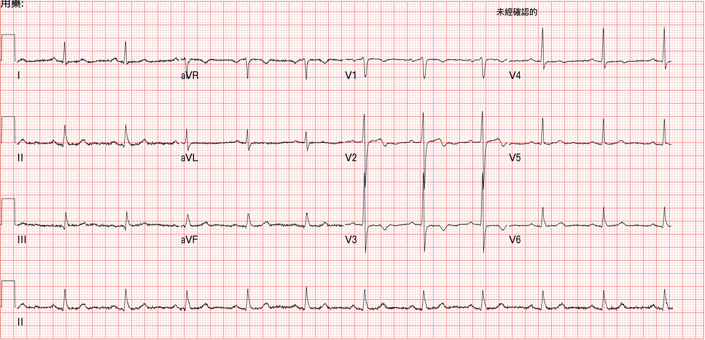

Rate: 66 bpm

Rhythm: SR

Axis: noram axis

Interval: QTc ➔444

Ischemia: 沒有看到符合STEMI criteria的leads

但是有幾個leads，看起來怪怪的

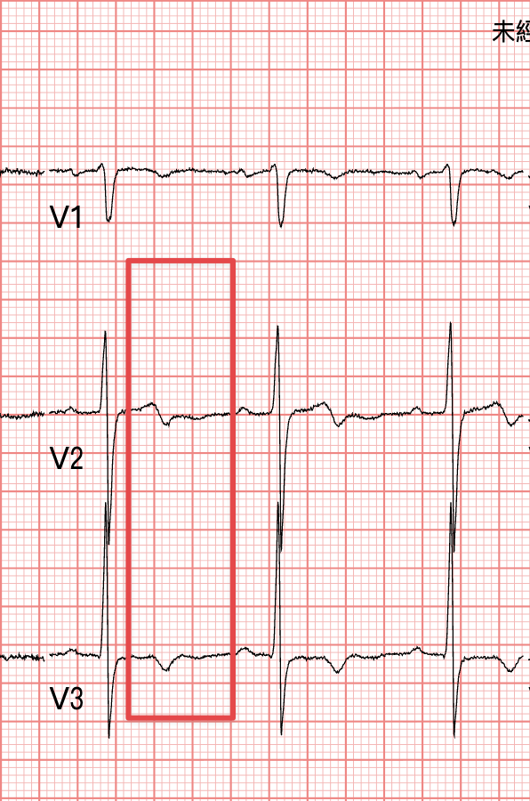

V2-V3出現TWI

這讓你想到什麼?

再拆解一下，V2-V3是在R't precordial leads

統整一下，R't precordial leads出現TWI，有哪些狀況會如此?

### 必須想到的有幾個情況:

1. Wellens' syndrome
2. Pulmonary embolism
3. Juvenile TWI
4. RBBB
5. Brugada syndrome
6. ARVC
7. RVH

這是我腦袋瓜會第一時間想到的可能性

當海底撈針似的把所有DDx撈出來，腦中就要迅速排出哪一個最有可能。

#### **會死人翹辮子的往前排，是我習慣排列的方式**

Wellens' syndrome

Pulmonary embolism

Brugada syndrome

總是我會想優先排除的三個

想知道更多R't precordial leads TWI相關知識可以看看這邊 [^1]

### ACS的Wellens' syndrome和PE要怎麼區分呢?  [^2]

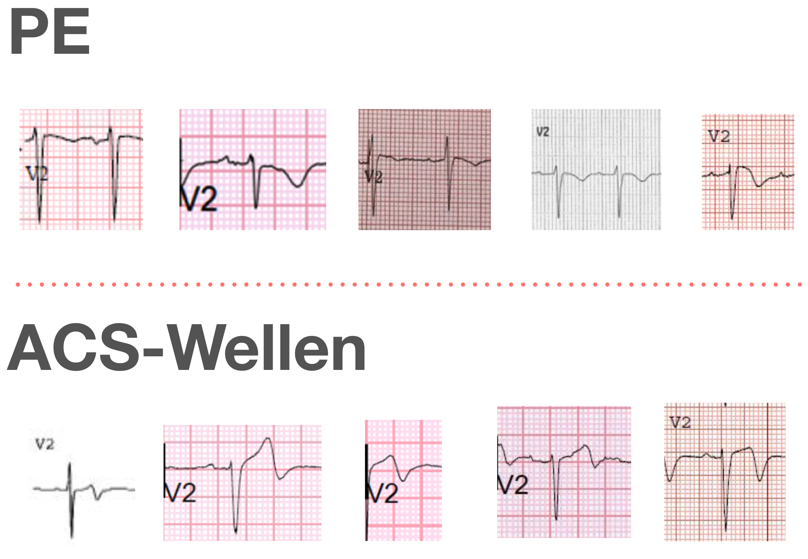

這部分之前有寫過。還是再詳細講一次，一方面自己順便複習一次。

#### ⭐️怎麼樣的V2~V3 ECG morphology偏向RV strain**(如果ECG形成RBBB，以下morphology不適用)** 

- 通常bigger S wave than R wave
- 通常J point isoelectric 或 J point elevated，接著凸向上STE然後TWI➜指PE的TWI和[[Wellens' wave]]的TWI長得不一樣(**看Fig.2的ECG morphology**)
  - **PE的TWI**是convex STE，然後像雲霄飛車彎向下
  - **ACS-Wellen的TWI**是陡降，比較sharp
- 通常some STD in V4~6和inf.lead也會TWI

#### ⭐️Wellens' syndrome是在一個胸痛之後，無痛狀況下做的ECG(在coronary reperfusion之後，應該會伴隨症狀明顯降低)➜如果看到TWI，但是症狀卻是持續的不舒服，要想想別的DDx

- 看到TWI，先看病患症狀如何?再看prior ECG有無此TWI➜如果症狀已緩解，且舊心電圖沒此變化，先考慮可能是reperfusion rhythm(**剛剛心肌梗塞，但是現在通了**➜請跟著再唸一遍，出現Wellens' syndrome，最基本的概念就是**剛剛心肌梗塞，但是現在通了**)

#### ⭐️ACO通常很少伴隨tachycardia，特別是reperfusion之後，除非病患已經cardiogenic shock了(Poor LV function)

- 但是在PE裡面，sinus tachycardia是很常見的狀況

好了，說完了Wellen和PE。那像不像Brugada? 根本不像，直接刪除這一個DDx

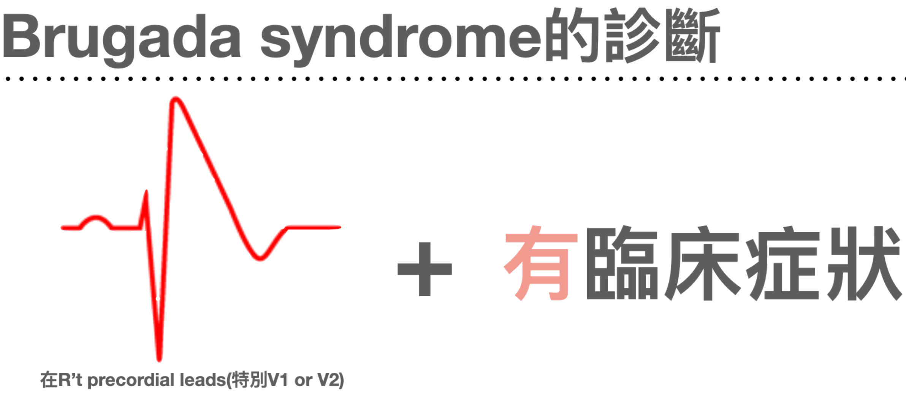

## ❤️Case個案繼續

病患因為前胸痛到後背，痛到冒冷汗。雖然D-dimer正常，我還是切了Chest CTA，沒有aortic dissection

第一次心臟酵素：<0.1(正常)

第二次心臟酵素 : 0.17(亮紅字)，超出一點點(我們家>0.16亮紅字)

中間病患含了一顆舌下NTG，其實於急診觀察中，就一直都沒有任何症狀

我交班下去，接班的主治讓病患回家。

其實，我想想，如果病患還在我手上，我應該也會讓病患回家。

沒有prior ECG、且症狀完全緩解，而且又是年初二，病患超級多的時刻。

記得中間去問病患症狀如何時，都說沒症狀，他一直覺得是肌肉拉傷。

這真的很可怕，**我們在忙的時候，很容易被病患的話語拉過去。**

**好啦，你都沒症狀了，你也說很像肌肉拉傷。那就回家吧。急診室人山人海，就回家吧。**我覺得我當下腦子一定會這樣想XD

**可是.....可是，怎麼解釋TnI已經讓紅字了，雖然還是不高。**

### 首先，我們一定要知道一些事實

<mark>**急診室第一次心臟酵素，沒有異常，這在心肌梗塞的病患很常見。**</mark>

<mark>**急診室第一張心電圖，沒看到異常，不代表病患沒有心肌梗塞**</mark>。**(當然有可能是你沒看出來XD，拜託多多來光顧本站，看心電圖，保平安😅)**

#### 我們來看看在LITFL說明Wellens' syndrome的基本定義：[^3]

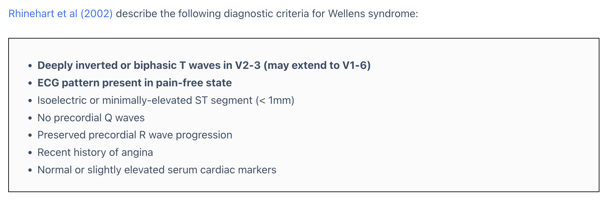

#### 重點如下：

- 出現deeply TWI or biphasic TWI in V2-3(有可能會V1-V6都extend到) 
  - 記住: AIVR和出現TWI都有可能是reperfusion rhythm 

- **這種TWI出現在pain free的狀況**(**大重點!!!**)
- **沒有出現precordial leads Q wave**(**大重點!!!**)
  - 因為出現Q wave，代表已經心肌梗塞一段時間了，就不符合剛剛心肌梗塞，現在通了的定義了

- 仍具有R wave progression
  - 也就是如果出現PRWP(poor RWP)，代表可以也出現心肌一小段時間，所以R wave progression才會不見

- 正常或**輕微的biomarker上升**

## ❤️Case個案繼續

所以這個case就ECG morphology和相關biomarker應該是算Wellens' syndrome。
就2018年的第四版心肌梗塞定義(Fourth Universal Definition of Myocardial Infarction 2018)
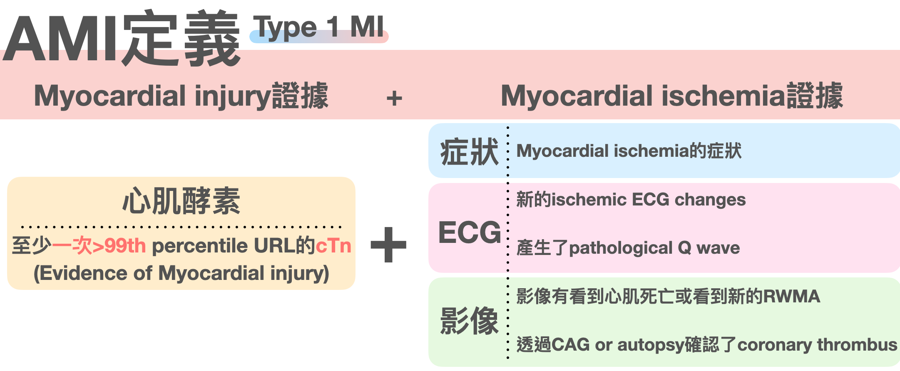

<mark>**Type 1 MI的定義就是myocardial injury證據(Biomarker+) + myocardial ischemia證據(症狀/ECG/影像，三者任一)**</mark>

所以這病人實際上應該是要診斷AMI

就ACS的定義而言，應屬NSTEMI，因為biomarker已經有問題了。

這邊我覺得學到一件事。

當然AMI的病患，每個人的狀況都不一樣。

就是有這種，你仔細去看，他的確就是符合AMI的定義。但是第二次TnI，就是這種要高不高、症狀又已經緩解，病人也說像肌肉疼痛。當下病人又爆炸多。

病人想回家，你放不放?

#### 我下次遇到這種狀況，我會考慮再三。

為何?

#### 讓我們繼續接下來的病人經歷

病患一走出急診室門口，他說他吹到了冷風。胸口又開始痛了起來

於是又返回來急診室

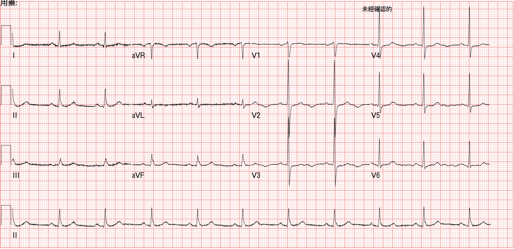

這張，我覺得很有趣的地方，有幾個地方。
第一是幾個小時前的明顯TWI，似乎不見了。
第二是........竟然出現inverted U wave
OH~~My God!!!這樣的Case我找了好久，都沒有遇到過XD

### 一個一個來講這些有趣的地方

TWI不見了，取而代之的是upright T wave，而且是胸痛的時候做的。那麼這就是我們常說的**pseudonormalization of T wave**

意思是什麼呢?意思就是，TWI代表是reperfusion(剛剛通了)，但是現在痛起來，TWI變成upright T wave(現在又阻塞了)

當然有可能症狀持續，這T wave有可能過幾個小時會變HATW(hyperacute T wave)

第二個是inverted U wave

這是什麼?

我們先來看看

大概30分鐘後，病患大痛，痛到後背，痛到冒冷汗
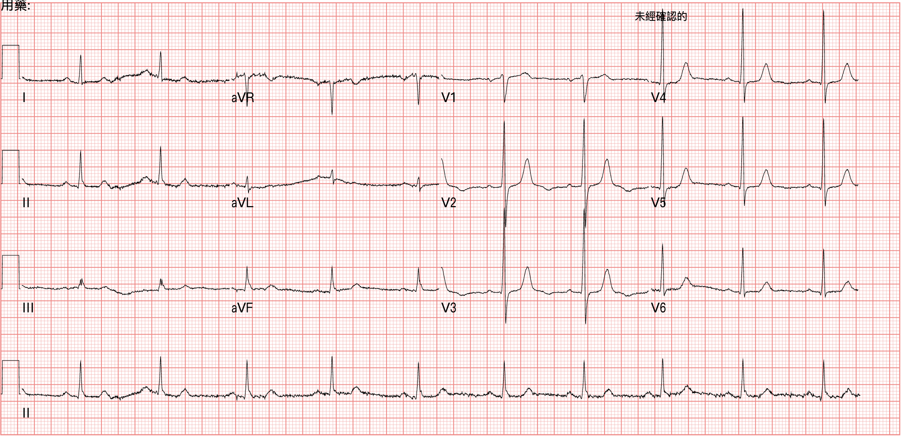

這張的T wave更高、且inverted U wave比再返診時的第一張更明顯

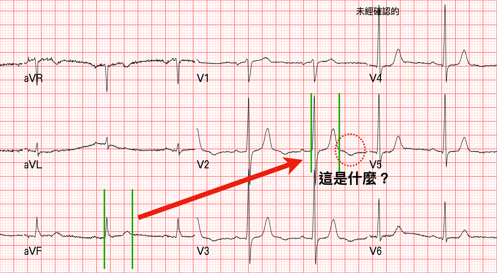

我把Fig.7放大一點來看

### 要診斷出inverted U wave，首先有一個難關。

那就是你**要先區分，這到底是inverted U wave，還是biphasic T wave的後段T wave inversion**

很簡單，我們來看看Fig.8，先找一個比較明顯clear cut的QT interval。在Fig.8 aVF的QT interval就非常明顯，畫出來

移到你覺得不知道是inverted U wave還是biphasic T wave inversion的後段地方。

QT inverval指的就是Q開始到T wave的結束。

所以如果你懷疑是biphasic T wave inversion的後段，那麼綠色距離的QT inverval應該要包含紅色虛線的向下凹處。

但是並非如此，**紅色虛線向下凹處，並不在QT inverval裡面**。

所以**紅色虛線那個就是inverted U wave**。

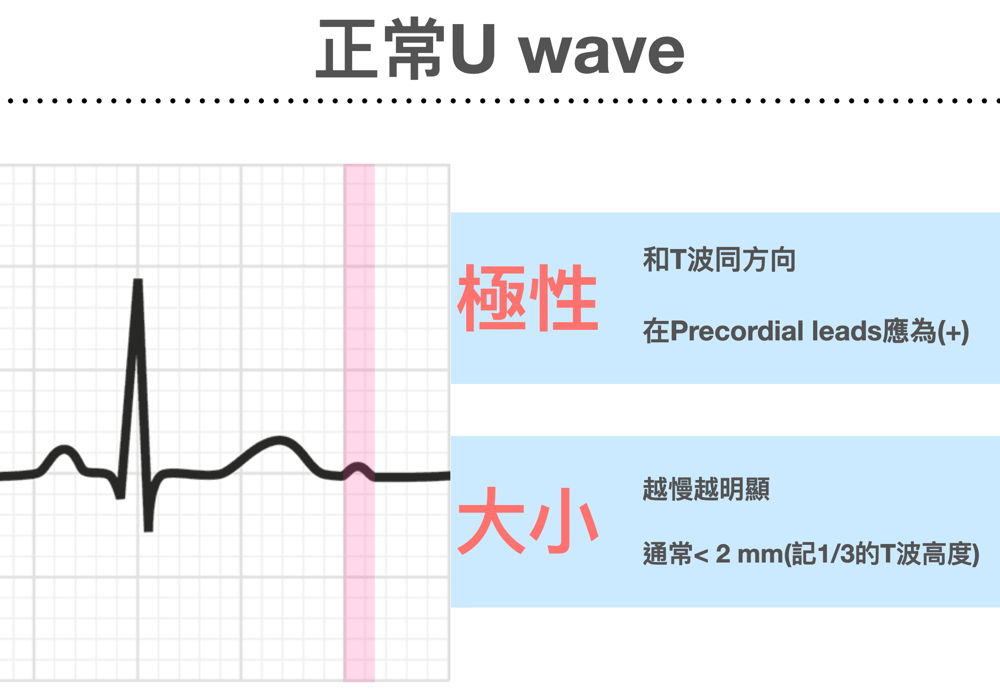

**正常的U wave和T wave同方向(concordant)**，而且不明顯。

但是當**心跳越慢時，U wave就會更明顯**

此外常見於lateral leads、正常的U wave高度大約T wave的10%

另外臨床上還有一個狀況，U wave會很明顯，那就是**Hypokalemia**時

當<mark>**嚴重低血鉀時，U wave會很明顯，因此T-U fusion在一起，形成T U wave，而導致會有QT prolong狀況**</mark>，主要是把明顯的U wave加進來了。

舉個自己的例子

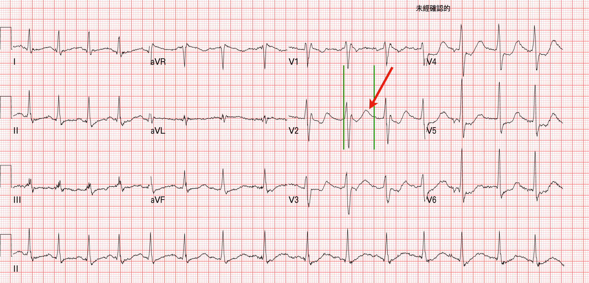

36歲男性，全身無力、嘔吐入急診

綠色是一般我們抓的QT interval，很明顯的超過1/2 RR interval，有QT prolong

這邊的T wave又稱down-up T wave(先下後上)，這是典型的低血鉀的ECG morphology

一般我們說的Biphasic TWI是先上後下，沒有在先下後上的喔。這裡一定要知道，不要搞錯了。

Fig.9的紅色箭頭就是因為低血鉀產生的明顯upright U wave

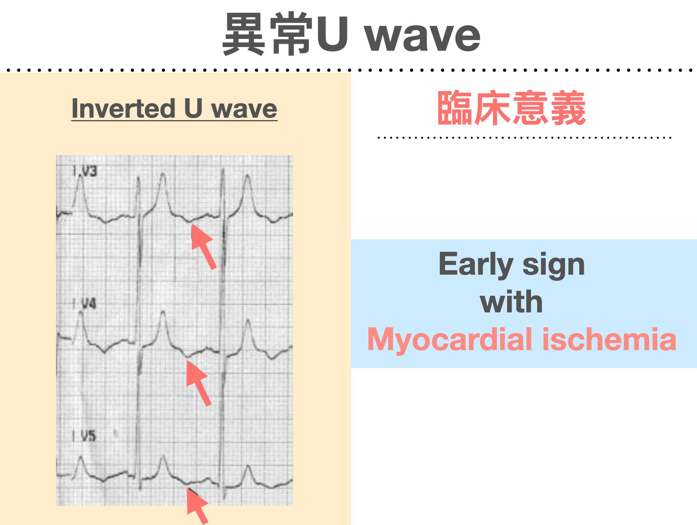

好，那麼inverted U wave代表的臨床意義是什麼?有可能是**early sign with myocardial ischemia**

先來看看這篇2005的文章 [^4]






裡面寫了這段話➜<mark>**U wave inversion有可能會在心肌梗塞產生心電圖變化的數小時前出現**</mark>。

### 那麼如果我們遇到inverted U wave要如何處理，與進行下一步驟呢?

我請Gemini Pro幫我把我的Roam research我自己寫的筆記裡面關於Inverted U wave稍微整理了一下，用圖表方式呈現。好看多了～～

裡面的<mark>**(-) U波➜指的是Inverted U wave喔，不是沒產生U wave**</mark>

簡單來說，<mark>**Inverted U wave可以像是HATW一樣，更早於STE出現之前就出現。另外會比較偏向LAD lesion**</mark>

Amal mattu在這集的ECG weekly也有提到inverted U wave，有興趣的人可以前往觀看 [^5]

So cool~~

## ❤️Case個案繼續

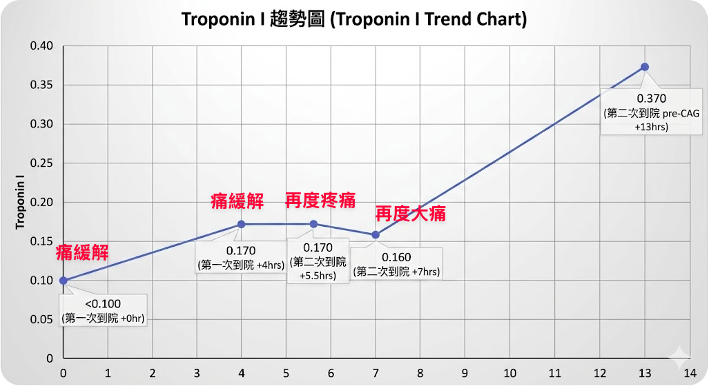

第二次因為走出急診室，剛離開沒多久又痛起來，過了沒多久又開始更痛。
這些點的TnI，其實也就是高一點點。和第一次就一差不多。

在Fig.7時是第二次回診加上更痛，且ECG的V2/V3的T wave更高。所以會診了CV man

CV man回應，等驗血的報告。

不過驗血的報告如Fig.12為0.16。CV man請我們自行決定讓病患住病房或ICU

精彩的還沒結束~~

大約早上快6點多，病患又大痛了一次。
因為病患當時on了ECG monitor
護理師看到ECG monitor又異常，印下了當時的ECG strips給我看

哇~~

這不是簡單的PVC啊，這是異常缺血的PVC

來解釋一下

我之前在這篇的內容也寫過PVC可以小兵立大功 [^6] 。我把那邊的內容稍微搬過來一下。

VPC是由心室產生的。**VPC就像LBBB一樣具有discordant ST segments，所以當excessive discordant STE或concordant STE時，就要小心**。雖然沒有證據顯示MSC可以適用VPC就像LBBB一樣。但是根據Stephen Smith的經驗，**這rule用在VPC和用在LBBB非常類似，雖然specific少一點** [^7]

### 讓我們來複習一下。<mark>Modified Sgarbossa criteria(MSC)</mark>可以應用在LBBB/PPM的病患。**Criteria如下:**

1. Concordant STE(> 1 mm) in any lead(任何一個lead)
2. Concordant STD(> 1 mm) in V1-V3(只要一個lead) →如果是PPM，則extend V1-V6都適用
3. Excessive discordant in any lead(STE/S >0.25 or STD/R >0.3)

#### **這邊要注意一點就是，不要再用Sgarbossa criteria的Criteria C(指Discordant STE >5 mm) →此false-positive的機會高，且不specificity，所以Smith才在2012在AEM出了MSC取代Criteria C，希望修正此問題。**

MSC如果抓0.25這個數值，可以讓sensitivity到80%，specificity到99%。如果抓0.3，則可能會讓sensitivity降到64%，反而錯過許多AMI。

**注意喔，雖然Dr.Smith的MSC是用0.25當cut off point，但是看看上面的圖STE/S >0.2就要懷疑AMI了!!!!!!!!!!**






## ❤️Case個案繼續

讓我們來算算這個case的STE/S大概多少? 大約0.7

**這是ischemic pattern PVC**

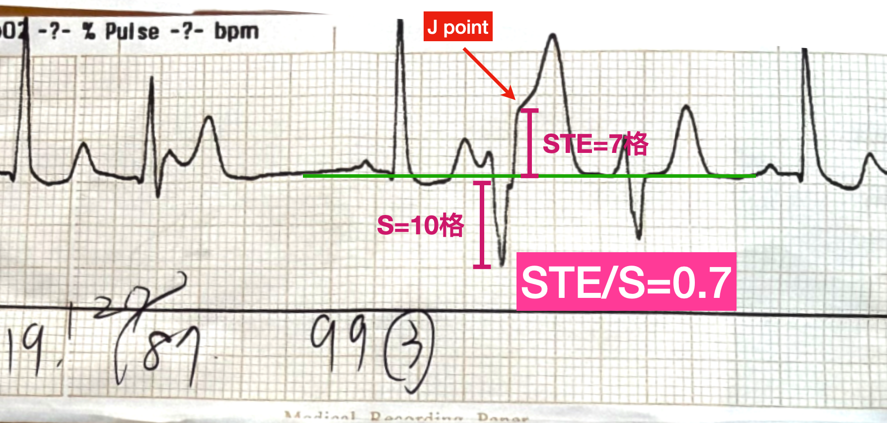

本來一開始我是將病患簽一般病房住院，後來看到這個ischemic pattern PVC，直接改床到CV-ICU住院
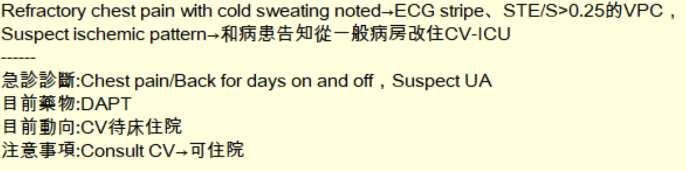

住院上去，當天早上就做了CAG:
CAG報告➜ LAD:  **pLAD critical lesion, plaque rupture with thrombus formation and 95% stenosis**, impaired TIMI flow; dLAD        discrete lesion with 70% stenosis

這個案讓我學到很多，包括Wellens' syndrome臨床上的意義是在未來幾天到幾個禮拜內有很高風險會出現extension ant.wall MI。在ER有看到了，真的放回去風險真的不小，因為雖然看到Wellens' wave，代表病患已經reperfusion(血管通了)。

但是.......<mark>**什麼時候再次re-occlusion根本沒人知道**</mark>。

這case反反覆覆的抽血，biomarker也都固定在那裡，CAG顯示pLAD幾乎要完全阻塞了，TnI經過時間累積，也根本沒啥大變動，心電圖也沒有任何符合STEMI criteria的ECG出現。

再再驗證了ECG大師Ken grauer所說的，病患具有ACS S/S，要無論如何排除ACS。ECG/Biomarker可能都會是正常的。

在ESC 2020 NSTEMI guideline裡面才一直說，refractory chest pain(**不管ECG/biomarker**)，是2個小時內做到CAG的其中一個indication

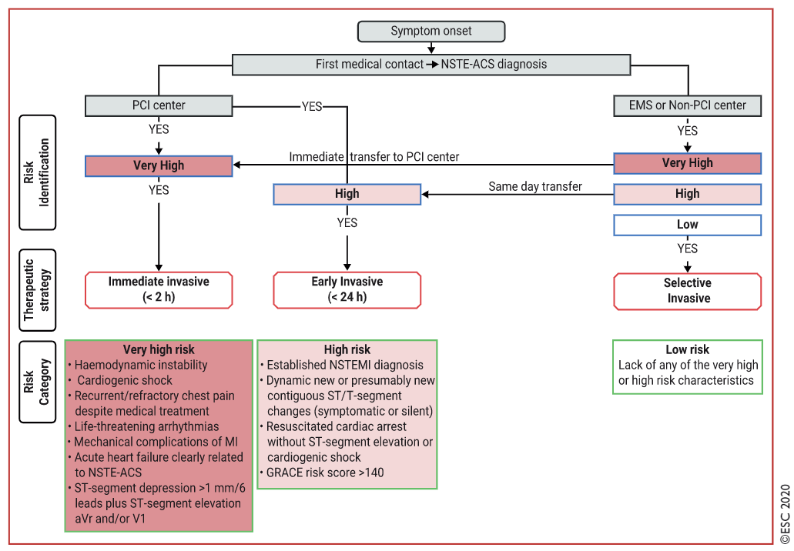

此外這個Case讓我收集到了inverted U wave和abnormal ischemic pattern PVC的個案ECG~~太開心了🥳🥳🥳

{}

1. Wellens' syndrome的定義、re-occlusion的風險
2. Pseudonormalization of T wave是什麼？
3. Inverted U wave是什麼?臨床意義在哪?如何運用QT interval來協助診斷inverted U wave
4. PVC也可以診斷myocardial ischemia嗎?怎樣的PVC要提高警覺

{}

## 參考資料:

[^1]: Amal Mattu’s ECG Case of the Week – August 8, 2022 – ECG Weekly - [link](https://ecgweekly.com/2022/08/amal-mattus-ecg-case-of-the-week-august-8-2022/)
[^2]: Dr. Smith's ECG Blog: A crashing patient with an abnormal ECG that you must recognize - [link](http://hqmeded-ecg.blogspot.com/2018/03/a-crashing-patient-with-abnormal-ecg.html)
[^3]: Article: Wellens Syndrome | Life in the Fast Lane • LITFL [link](https://litfl.com/wellens-syndrome-ecg-library/)
[^4]: Reinig, M. G., Harizi, R., & Spodick, D. H. (2005). Electrocardiographic T- and U-Wave Discordance. __Annals of Noninvasive Electrocardiology__, __10__(1), 41–46. https://doi.org/10/d2xxd2
[^5]: Amal Mattu’s ECG Case of the Week – January 16, 2023 – ECG Weekly - [link](https://ecgweekly.com/2023/01/amal-mattus-ecg-case-of-the-week-january-16-2023/)
[^6]: Article: VPC也可以小兵立大功嗎? | 急診熊心聲部落格 | 急診熊心聲部落格 [link](https://agoodbear.github.io/post/medium-6cdf5d600a1c/)
[^7]: Dr. Smith’s ECG Blog: Hyperacute T-waves and Concordant ST Elevation seen in PVCs only — [link](http://hqmeded-ecg.blogspot.com/2018/10/hyperacute-t-waves-and-concordant-st.html) [↩︎](https://agoodbear.github.io/post/medium-6cdf5d600a1c/#fnref:1) [↩︎](https://agoodbear.github.io/post/medium-6cdf5d600a1c/#fnref1:1)
