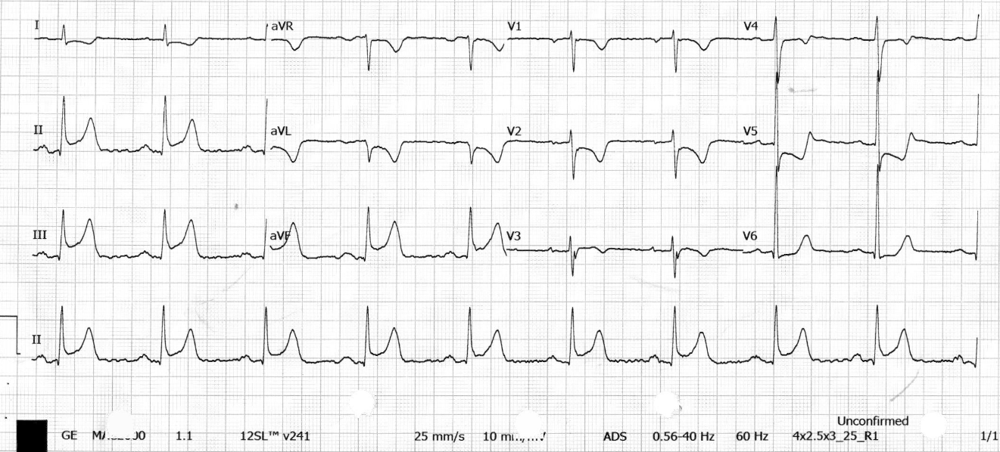



Today I want to cover two cases at once. Both of these patients started out down the ACS diagnostic path, and we treated them by the most standard protocol; but the real killer, from start to finish, was never in the coronary arteries. It was in the aorta.

At first we were treating both of them as acute coronary syndrome: one was a plain-as-day inferior STEMI, and in the other the CAG showed a total occlusion outright. In the end, the final diagnosis for both was Type A aortic dissection.

Writing up these two cases, they fell into the same trap: **aortic dissection can masquerade as myocardial infarction**. And it does a very convincing job. So convincing that the ECG in your hand and your CAG all point at the coronary arteries, and it never even crosses your mind that the real killer is in the aorta.

This post isn't about teaching you to read a beautiful STEMI. Just the opposite: it's about how, when every piece of evidence points to ACS, you still remember to put aortic dissection back into the differential before you've pushed the patient past the point of no return.

First, ask yourself a few questions. This whole post revolves around them:


- **Q1**: Why does Type A aortic dissection look like ACS? What exactly is the mechanism?
- **Q2**: If the chest CTA shows no pericardial effusion (PEF), can you safely rule out dissection?
- **Q3**: One patient can talk; the other is post-ROSC and you can't get any history at all. Where are the clues that crack each case?
- **Q4**: If you go in treating it as ACS from the start, with antiplatelets, anticoagulation, maybe even thrombolytics, what happens?


## Case 1: The one who could talk—a classic inferior STEMI

First case. This patient was awake and talking, which in theory makes it the "easier" kind.

Middle-aged man, chest pain and cold sweats starting early this morning, awake, able to tell you where it hurts. Here comes the first ECG on arrival. Take a look first: what do you see?

Look at **Fig. 1** first, going through Rate-Rhythm-Axis-Interval-Ischemia one item at a time (this is the order Ken Grauer teaches; you're less likely to miss things):


Rate: ventricular rate not fast
Rhythm: SR (but the strip in a minute is a different story)
Axis: normal axis
Interval: narrow QRS
Ischemia: ST elevation in II, III, aVF; reciprocal change in lead I and aVL; V2 also has down-sloping STD + TWI


In plain English, **this is an inferior STEMI**, and with III≧II plus the reciprocal change in aVL, the culprit points to the RCA. What you do next is add right-sided leads to see whether the RV is involved too, then call the CV man and go to the cath lab.

")

And then a 3rd degree AV block showed up (see **Fig. 3**). Inferior MI with AV block isn't strange at all, because the RCA supplies the AV node in most people; this patient was refractory to dopamine and ended up getting a TPM.

")

Look at the rhythm strip in **Fig. 3**: the P waves and the QRS complexes each go their own way and the rates don't match. That's 3rd degree (complete) AV block, AV dissociation.

Up to this point, everything is very standard. Inferior STEMI, culprit RCA, AV block, off to the cath lab. If the story ended here, this would be as textbook a case as they come.

### Back to case: on the cath table, things start to feel off

The catheter goes in, the RCA is engaged, the wire is advanced. Then they look at the RCA: a **linear vessel appearance** (the vessel looks like a thin, straight line), and they couldn't yet exclude thrombus from plaque rupture. So they did POBA from RCA-P to RCA-M first.

The result was limited effect, and the flow-limited appearance actually extended toward RCA-M. Right then, the patient became hypotensive (even with dopamine already running), kept vomiting, kept getting agitated, and they had to add norepinephrine to hold up the SBP.

Let me pause here for one line: **a culprit RCA in an inferior STEMI where POBA gets only a limited response and the flow actually gets worse—that kind of "not responding to standard treatment" picture is reason enough on its own to stop and think: is something else going on here?**

Not ready to give up, they went to IVUS. And there it was: **an intramural hematoma at RCA-M, extending up to the RCA ostium and out beyond the aortic cusp**; and in the true lumen there was no plaque rupture at all, no plaque, and no thrombus.

Now it was clear. This wasn't a thrombus of the coronary artery itself. It was a hematoma pressing in from the aorta and dissecting into the RCA ostium. They tried a cutting balloon to open an outlet and let the hematoma decompress; follow-up IVUS still showed limited effect. aortic dissection was impressed.

### Cracking the case: but the echo showed no pericardial effusion

A bedside echo was done on the spot. The result: **no pericardial effusion. But the aortic root was dilated (40mm), and there was moderate-to-severe AR**.

Note this "no PEF." A lot of people assume aortic dissection means tamponade, means effusion. Wrong. No PEF absolutely does not rule out Type A aortic dissection (more on this in Q2).

The final diagnosis: STEMI, culprit RCA, but caused by external compression from aortic dissection; Aortic dissection, type A.

<figure>
<video autoplay muted loop playsinline preload="metadata" style="max-width:100%;border-radius:8px"><source src="/images/ipic/ecg-post-17-case1-cta.mp4" type="video/mp4"></video>
<figcaption>Fig. 4. Case 1 chest CTA: confirming Type A aortic dissection.</figcaption>
</figure>

What came after was brutal: frequent pulseless VT/Vf in the OR, then ECPR, CPB, median sternotomy, pericardiectomy. The heart never managed to pump effectively, went into PEA, and in the end there was DIC and massive bleeding from the endotracheal tube.

The most important question this case leaves behind: **if we had done one more echo at the time, would the outcome have been different? Is there any way to pull the diagnosis of Type A aortic dissection earlier?** That's the core question this whole post most wants to answer. After the second case, we'll talk about it together.

## Case 2: The one with no history to get—back with ROSC, still throwing lethal rhythms

The second patient was hard in a completely different way. Case 1 could at least talk; with this one, you couldn't even ask.

The family said the patient was eating at a restaurant and suddenly collapsed. At first they thought it was choking on food, and CPR was done on scene. The patient was taken to an outside hospital and regained consciousness, but blood pressure stayed low, and the patient was transferred to us on vasopressors.

By the time the patient reached us, SBP was only in the 60-something range, and the monitor showed VT with pulse. First synchronized cardioversion at 100J; then it turned into Vf, defibrillated at 200J.

")

Look at this presentation: just got ROSC, blood pressure extremely low, still repeatedly going into ventricular arrhythmia (VT/Vf). Almost the first thing that jumps into your head is: is this an electrical storm, recurrent fatal arrhythmias from an AMI? Post-ROSC shock + VT/Vf, the most natural assumption is ACS.

So it was primary PCI. The CAG showed a LAD total occlusion, with a fistula, and at the time it was read as thrombus in the vessel itself; they even did a thrombectomy. At this point the chain of evidence was perfect: ROSC + shock + VT/Vf + a totally occluded LAD. Who wouldn't call that ACS?

### Back to case: but this was also a Type A aortic dissection

And what happened in the cath lab was actually almost identical to Case 1. At first the femoral artery puncture went smoothly and the wire reached the aortic root without any resistance; the initial angiogram showed the vessel with Kawasaki-like ectasia, causing LAD thrombus formation and acute total occlusion, so a thrombectomy was done first. **But looking closely at the angiogram, at the aortic left cusp the blood wasn't flowing smoothly into the LAD, and there was a compressed look to it**; as soon as IVUS went in, dissection was confirmed. Subsequent CT confirmed it again: Type A as well.

<figure>
<video autoplay muted loop playsinline preload="metadata" style="max-width:100%;border-radius:8px"><source src="/images/ipic/ecg-post-17-case2-cta.mp4" type="video/mp4"></video>
<figcaption>Fig. 6. Case 2 chest CTA: Type A dissection extending from the aortic root all the way down to both common iliac arteries (also involving the innominate, left common carotid, and left subclavian), with late iodine enhancement in the LAD territory—that's exactly it compressing the LAD.</figcaption>
</figure>

The most unsettling thing about this case: the patient couldn't give any history from start to finish. No tearing pain, no chest pain radiating to the back, no sudden explosive pain. All the textbook signature history of dissection is useless in a post-ROSC, intubated patient you can't talk to.

So all you can rely on is the objective stuff: what the ECG looks like, whether the hemodynamics make sense, whether the imaging adds up.

## Pulling the two cases together: why they look alike, and how to catch it earlier

We've seen both cases. Now back to the opening questions, one by one.

### Q1: Why does Type A aortic dissection look like ACS?

The key is the coronary ostium. When the intimal flap or intramural hematoma of a Type A dissection extends toward the aortic root, it most often heads toward the right coronary cusp, compressing or even dissecting into the RCA ostium. Once the RCA has malperfusion, what you see on the ECG is an inferior STEMI, often with AV block (because the RCA also supplies the AV node).

That's exactly what Case 1's IVUS let us see with our own eyes: an intramural hematoma extending from the RCA ostium out beyond the aortic cusp. This was a real moment caught on imaging in a real patient, not theory on paper.

> Remember it in one line: when Type A AD masquerades as ACS, its most classic face is "inferior STEMI + AV block," because what it's compressing is the RCA ostium.

**What about the LAD and LCX? Those too.** Whichever aortic cusp the dissection hematoma pushes into, that's the coronary ostium it compresses: the right coronary cusp compresses the RCA, the left coronary cusp compresses the LAD. Our two cases happen to be one on each side:

- The one who could talk: right coronary cusp compressing the RCA, presenting as inferior STEMI.
- The ROSC one: left coronary cusp compressing the LAD.

In terms of proportion, about 10–15% of Type A AD compress a coronary artery[^chen2013][^tong2022]. Which one? "Surgical series," meaning statistics from intraoperative and pathology findings in operated patients, mostly show more RCA (about 70%); but a larger multicenter registry found that RCA and left coronary involvement were actually roughly fifty-fifty, and the group with the left coronary compressed had higher mortality[^saito2023]. So don't assume "it's always the RCA."

**My favorite ECG blogs have all written about this too.** Dr. Smith looked at the numbers and found that OMI caused by AD is most often in the RCA, near the ostium, which is right on target for our Case 1; Amal Mattu (ECG Weekly) has also summarized that AD, through coronary malperfusion, can produce pseudo-infarction, ST deviation, even conduction block (most often the right coronary to the inferior wall), and that an ECG that looks ischemic can't be used to rule out AD.

### Q2: No PEF, so can you rule out dissection? No

**Many Type A aortic dissections have no pericardial effusion and no tamponade at all. Whether or not there's PEF cannot be used as the dividing line to rule in / rule out dissection.**

Case 1 is a living example: after dissection was highly suspected in the cath lab, a bedside echo showed no significant pericardial effusion; the later CTA also showed no significant PEF. Working backward, a bedside echo in the ED at that moment would not have seen an effusion either. The clue you could actually catch wasn't an effusion; it was a dilated aortic root plus new AR.

Remember the reasoning behind it: a big reason Type A AD so often goes downhill fast is that it ruptures into the pericardium, forming a pericardial effusion, then cardiac tamponade, and that's when the patient suddenly collapses. But that logic doesn't run in reverse. Only about 1/3 of Type A AD have a pericardial effusion; the other 2/3 have none at all; actual tamponade is even less common (about 14.4% in IRAD data spanning 25 years and 6,014 patients)[^gilon2025]. So "no PEF seen" is actually the majority. The JACC review puts it bluntly: "a normal TTE does not rule out an AAS"[^vilacosta2021].

So a focused echo should look at more than just the pericardium:

1. Is there a flap or dilatation in the aortic root / ascending aorta?
2. Is there new AR?
3. Is there PEF / tamponade (very helpful if present; its absence doesn't rule anything out)?

One more often-overlooked supporting clue I want to stress: **catching AR with auscultation + POCUS**. When a Type A AD tears into the aortic root and pulls the valve apart, you get acute AR. On auscultation it's an early diastolic, decrescendo murmur, clearest along the left sternal border (LLSB), and easiest to hear with the patient sitting up, leaning forward, breathing all the way out and holding it (but in acute severe AR the LV hasn't had time to compensate, so the murmur may be short and subtle; not hearing it doesn't rule it out either). On POCUS, use the PLAX, PSAX (aortic valve level), and apical 5-chamber / 3-chamber views with color Doppler to look for a regurgitant jet across the aortic valve back into the LV.

<iframe style="position:absolute;top:0;left:0;width:100%;height:100%;border:0" src="https://www.youtube.com/embed/hgz0zV8S2yo" title="Aortic Regurgitation — Medzcool" loading="lazy" allow="accelerometer; autoplay; clipboard-write; encrypted-media; gyroscope; picture-in-picture; web-share" allowfullscreen></iframe>

*▲ Teaching video on the heart sounds and murmur of AR (early diastolic, decrescendo murmur, clearest at the LLSB). Video source: [Medzcool — Aortic Regurgitation](https://www.youtube.com/shorts/hgz0zV8S2yo) (YouTube).*

; source: Wikimedia Commons / CardioNetworks / AMC Echolab, CC BY-SA 3.0")

### Q3: History available vs. no history: where are the clues in each?

This is exactly why I wanted to talk about these two cases together: they demonstrate two completely different paths to recognition.

**Case 1 (could talk)** started out wearing the face of inferior STEMI + AV block; history was still obtainable (though no tearing pain doesn't rule it out); the real turn came in the cath lab: linear vessel appearance, limited response to POBA / cutting balloon, IVUS showing intramural hematoma extending out beyond the aortic cusp, echo with a dilated root and AR. Lesson: when standard PCI can't open it and the response isn't what you expected, go back and consider that the culprit may not be a simple coronary lesion.

**Case 2 (ROSC, no history)** started out wearing the face of shock + VT/Vf plus a LAD total occlusion on CAG; history was completely useless; the real turn came in the cath lab: the angiogram showed blood not flowing smoothly from the aortic left cusp into the LAD, with a compressed look, and IVUS confirmed dissection. Lesson: when you can't get a history, the angio / IVUS clues on the cath table are your last line of defense.

A patient who can give a history at least gives you a chance to catch the inconsistency on history (although Case 1 reminds us that even when you can ask, the absence of classic tearing pain often misleads). But with a patient like Case 2, post-ROSC and still throwing VA, you can't even ask. At that point, if the only path in your head is "ACS → PCI," you're in a very dangerous place. **ROSC + shock + electrical instability does not necessarily equal ACS.**

### Q4: What happens if you go all the way down the ACS path?

When you treat Type A AD as ACS, here's what you do: antiplatelets (DAPT), anticoagulation, maybe even thrombolytics, the cath lab. Every one of those things is working against an aorta that's actively dissecting, and dramatically raises the bleeding risk of the open-heart surgery that comes next.

This isn't fearmongering. There are numbers:

- A single-center retrospective study from Chang Gung in Taiwan: of 385 patients sent for primary PCI on an initial impression of STEMI, 5 (1.3%) actually had Type A AD; in-hospital mortality in those 5 was as high as 40%, 80% had hypotension or shock, and 40% developed VT, which matches our two cases closely[^wang2016].
- Another study: of Type A patients who went to emergency surgery, about 16.3% (21/129) had a CAG before surgery while the dissection was still unrecognized[^peng2022]. Almost all of them had already been given antiplatelets (100% vs 0.9%); 30-day mortality was not significantly worse (4.8% vs 9.3%), but intraoperative blood loss (1900 vs 1500 mL) and chest tube drainage on postoperative day 1 (1040 vs 595 mL) were both significantly higher. That is the real price of "diagnosing it too late and putting the antiplatelets in first."

## So how do you actually "pull the diagnosis earlier"?

First, some balance, so we don't overcorrect. Dr. Smith keeps stressing pre-test probability: true STEMI / OMI is far more common than AD, and OMI caused by AD makes up only about 0.5–1.3% of STEMI (what Smith cites is exactly the Taiwanese Wang 2016 paper above[^wang2016]). So it's not that every STEMI needs AD ruled out first; it's that when there's a red flag, you take one more look.

Here it is as a practical sequence:



### Step 1: When a warning sign shows up, do a focused TTE first; don't rush everyone to CTA

Before you give the full load of antiplatelets / anticoagulation, spend 60–90 seconds on a focused TTE. The "specificity" of the warning signs below varies a lot, so look at them separately.

**Low specificity, but should raise your guard:** shock, syncope, VT or electrical instability. These are also very common in true ACS; you can't rush to CTA on them alone (that would delay the real STEMI). Their role is to "keep AD in the differential."

**Much higher specificity:** a new AR murmur, neurological symptoms (dissection can cross territories and affect brain or spinal cord perfusion; the LR+ of a focal neurologic deficit can reach 6.6–33). As for differences in pressure between the limbs or the two arms, be careful not to overestimate them. The key is to distinguish a pulse deficit (no palpable pulse) from a simple blood pressure difference:

| Sign | Diagnostic value | Source |
|---|---|---|
| Pulse deficit (no palpable pulse) | specificity 99%, LR+ about 31 | Ohle 2018[^ohle2018] |
| Pulse deficit or BP difference (the two counted together) | sensitivity 31%, LR+ 5.7 | Klompas 2002[^klompas2002] |
| Simple inter-arm SBP difference >20mmHg | OR only 2.7 (weak) | Um 2018[^um2018] |
| Focal neurologic deficit | LR+ 6.6–33 | Klompas 2002[^klompas2002] |
| Inter-arm SBP difference ≥10mmHg in the general population (no dissection) | 3.6% (general) / 11% (hypertension) | Muntner 2019[^muntner2019] |

You can see it at a glance: a pulse deficit (LR+ about 31) blows a simple blood pressure difference (OR only 2.7) out of the water. Because 3.6% to 11% of ordinary people already have an inter-arm blood pressure difference, don't get too excited when you measure "a difference of a dozen-plus mmHg" at the bedside; look at it together with pulse deficits and the pain pattern.

Others include: a strange chest pain pattern (sudden explosive pain, migrating pain); or an ECG that looks like STEMI, but the imaging / treatment response doesn't add up to "a simple single-coronary ACS." Case 1 and Case 2 were both like that: they only got turned around after reaching the cath lab, when standard treatment didn't add up.

Adding one objective tool, **ADD-RS (Aortic Dissection Detection Risk Score)**: points across three categories (high-risk history, pain features, physical exam), paired with D-dimer (often elevated in AD; a low-risk ADD-RS ≤1 plus D-dimer <500 ng/mL can help rule out[^nazerian2018]). One more reminder: troponin in AD usually doesn't rise or rises only mildly, so don't be reassured by a "normal troponin."

### Step 2: The point of the focused TTE isn't the pericardium; it's the aortic root

Look for a flap or dilatation in the aortic root, new AR, and PEF (best if present; its absence doesn't rule anything out).

### Step 3: If you're already in the cath lab, learn to pull back on the spot

These are the cath lab signals; see any one of them and switch from "finish the PCI first" to "rule out dissection first":

- linear vessel appearance (that was Case 1).
- Abnormal resistance advancing the catheter (someone described it as like walking through sludge).
- The coronary arteries look "too open," or the angiogram doesn't match the ECG / shock.
- IVUS shows intramural hematoma, and it extends out beyond the aortic cusp (the key moment in Case 1).
- Still not comfortable? On the spot, hand-inject a bolus of contrast through a pigtail catheter and shoot an aortogram to look for the intimal flap in the aorta; or just take a step back and do a bedside echo.

## Looking back

That's how we in the ED and cardiology handle chest pain: most of the time, "chest pain + STEMI = open the vessel" is right, and it has to be fast. D2B, time is muscle; we're trained to charge when we see a STEMI.

But these two patients reminded me: there's a small group of people where, the faster you go and the more faithfully you charge all the way down the ACS SOP, the harder you're pushing them off a cliff. What makes it hard is that their initial face looks almost exactly like a true STEMI.

I'm not saying rule out dissection before every STEMI. That's not practical either, and it would delay the real AMIs. What you really need to do is, when those few "something's off here" signals light up, be willing to spend 60 seconds taking one more look at the aortic root. Those 60 seconds might be the chance to pull the patient back from a different road to death.

As for "would one more echo have made a difference," I think rather than beating ourselves up, it's better to turn it into next time's reflex: when you put the probe down for that echo, you're not just looking at how the heart squeezes. You're looking at the aortic root.

## Key learning points

1. **Type A aortic dissection can mimic ACS**, and its most classic face is "inferior STEMI + AV block," because dissection often compresses or dissects into the RCA ostium; but left coronary involvement isn't rare either, so don't assume it's always the RCA.
2. **No pericardial effusion does not rule out Type A dissection.** Only about 1/3 of patients have PEF. The echo clue you really need to look for is a dilated aortic root plus new AR.
3. **A worse-than-expected response to standard STEMI treatment** (POBA / PCI won't open it, flow actually gets worse, cutting balloon doesn't help either) is the moment on the cath table when you most need to go back and think dissection.
4. **ROSC + shock + VT/Vf does not necessarily equal ACS.** In a patient you can't get a history from, give more weight to the objective clues.
5. **Dissection signals on the cath table**: linear vessel appearance, catheter resistance, angiogram inconsistent with the clinical picture, IVUS intramural hematoma extending beyond the aortic cusp.
6. **On physical exam, distinguish a pulse deficit from a simple blood pressure difference**: pulse deficit LR+ about 31, very strong; simple BP difference OR only 2.7, of limited help.
7. **If it's mistaken for ACS and antiplatelets / anticoagulation are given, perioperative bleeding risk rises significantly**. That's the real price of "diagnosing it too late."

## Further reading

- Dr. Smith's ECG Blog: [Which Chest Pain patient needs a CT scan?](https://drsmithsecgblog.com/which-patient-needs-ct-scan/), [A very elderly woman with sudden severe chest pain radiating to her back](https://drsmithsecgblog.com/a-very-elderly-woman-with-sudden-severe-chest-pain-radiating-to-her-back/)
- ECG Weekly (Amal Mattu): [ECG Findings in Aortic Dissection](https://ecgweekly.com/ecgstat/aortic-emergencies/)
- LITFL: [Acute Aortic Dissection](https://litfl.com/acute-aortic-dissection-ffs/)

[^wang2016]: Wang JL, et al. Acute type A aortic dissection presenting as STEMI referred for primary PCI. *Acta Cardiol Sin* 2016;32(3):265-72. PMID 27274166.
[^peng2022]: Peng H, et al. Impact of unintentional coronary angiography on outcomes of emergency surgery in acute type A aortic dissection. *BMC Cardiovasc Disord* 2022;22:383. PMID 36002794.
[^chen2013]: Chen YF, et al. Acute aortic dissection type A with acute coronary involvement: a novel classification. *Int J Cardiol* 2013;168(4):4063-9. PMID 23890864.
[^tong2022]: Tong G, et al. Coronary malperfusion secondary to acute type A aortic dissection: modified Neri classification. *J Clin Med* 2022;11(6):1693. PMID 35330018.
[^saito2023]: Saito Y, et al. Right versus left coronary artery involvement in type A acute aortic dissection. *Int J Cardiol* 2023;371:49-53. PMID 36257475.
[^gilon2025]: Gilon D, et al. Cardiac tamponade complicating type A acute aortic dissection: 25 years of IRAD. *JACC Adv* 2025;4(4):101632. PMID 39999651.
[^vilacosta2021]: Vilacosta I, et al. Acute aortic syndrome revisited: JACC state-of-the-art review. *J Am Coll Cardiol* 2021;78(21):2106-25. PMID 34794692.
[^klompas2002]: Klompas M. Does this patient have an acute thoracic aortic dissection? *JAMA* 2002;287(17):2262-72. PMID 11980527.
[^ohle2018]: Ohle R, et al. High risk clinical features for acute aortic dissection: a case-control study. *Acad Emerg Med* 2018;25(4):378-87. PMID 29218798.
[^um2018]: Um SW, et al. Bilateral blood pressure differential as a clinical marker for acute aortic dissection. *Emerg Med J* 2018;35(9):556-8. PMID 30021832.
[^muntner2019]: Muntner P, et al. Measurement of blood pressure in humans: AHA scientific statement. *Hypertension* 2019;73(5):e35-e66. PMID 30827125.
[^nazerian2018]: Nazerian P, et al. Diagnostic accuracy of the Aortic Dissection Detection Risk Score plus D-dimer for acute aortic syndromes: the ADvISED prospective multicenter study. *Circulation* 2018;137(3):250-258. PMID 29030346. DOI: 10.1161/CIRCULATIONAHA.117.029457

---

*This article is for medical education. Case details have been de-identified (chart numbers, dates, institutions, and the names of the treating clinicians removed). It is intended to discuss interpretation and learning points, not to evaluate any specific patient or medical management. For clinical decisions, follow the situation at hand and the latest guidelines, and consult the responsible physician.*
