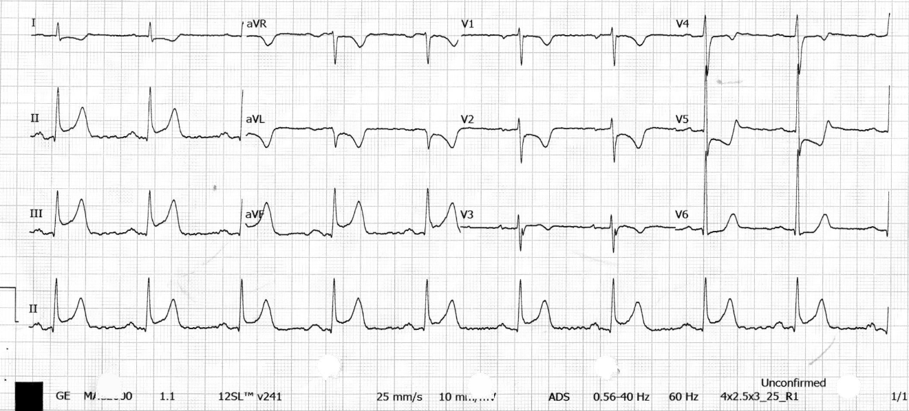
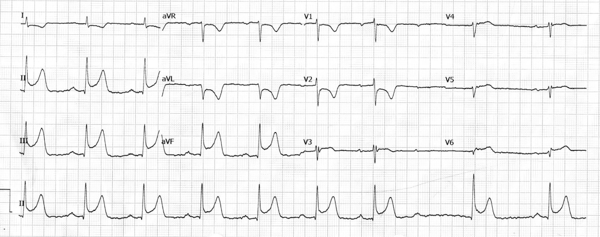
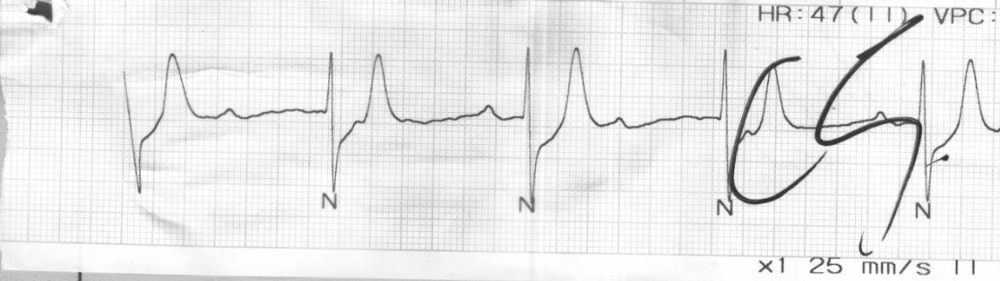
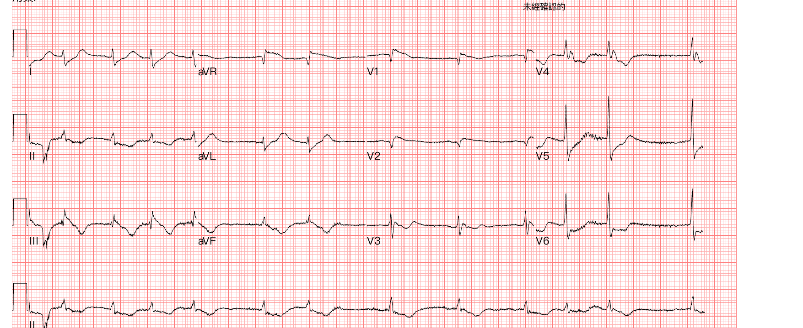
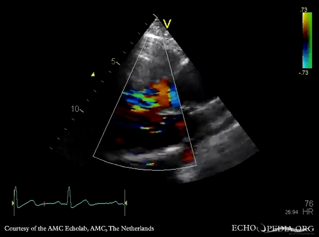



今天想一次講兩個 case。這兩個病人，一開始都走在 ACS 的診斷路上，我們也照著最標準的流程在救；但真正的兇手，從頭到尾都不在冠狀動脈，而在主動脈。

這兩個人，一開始我們都是當「急性冠心症」在救：一個是明明白白的 inferior STEMI、一個 CAG 直接看到血管 total occlusion。結果最後的診斷，兩個都是 Type A aortic dissection（A 型主動脈剝離）。

寫這兩個 case 的時候，它們踩的是同一個陷阱：**主動脈剝離，會裝成心肌梗塞**。而且裝得非常像。像到你手上的 ECG、你的 CAG，全都指著冠狀動脈，你完全不會想到真正的兇手在主動脈。

這篇不是要教你判讀一張漂亮的 STEMI。剛好相反，是要講，當所有證據都指向 ACS 的時候，怎麼在還沒把病人推向不可逆那一步之前，還記得把 aortic dissection 放回鑑別診斷裡。

先問自己幾個問題，這篇就是繞著這幾題轉：


- **Q1**：Type A aortic dissection 為什麼會長得像 ACS？機轉到底是什麼？
- **Q2**：Chest CTA 沒有 pericardial effusion（PEF），可以放心排除 dissection 嗎？
- **Q3**：一個病人能講話、一個是 ROSC 完全問不到病史，破案線索各自在哪？
- **Q4**：如果一開始就當 ACS，抗血小板、抗凝、甚至溶栓都上了，會發生什麼事？


## Case 1：會講話的那個—典型的 inferior STEMI

先看第一個。這個病人是清醒的、能講話的，照理說是「比較好辦」的那種。

中年男性，今天一早開始胸痛、冒冷汗，人是清醒的，會跟你描述哪裡痛。到院第一張 ECG 就來了。各位先看看，看到什麼？

先看 **Fig. 1**，照 Rate-Rhythm-Axis-Interval-Ischemia 一項一項看（這是 Ken Grauer 教的順序，比較不會漏東西）：


Rate: 竇性，心室率不快
Rhythm: SR（不過等下那張 strip 就變了）
Axis: normal axis
Interval: QRS 窄
Ischemia: II、III、aVF ST 抬高，lead I、aVL 出現 reciprocal change，V2 還有 down-sloping STD + TWI


翻成白話文，**這是一張 inferior STEMI**，而且 III≧II、加上 aVL 的 reciprocal，culprit 指向 RCA。該做的就是加做右側導程看有沒有右心室一起，然後 Call CV man 進導管室。

而且後來還出現了 3rd degree AV block（見 **Fig. 3**）。下壁梗塞合併房室阻滯一點都不奇怪，因為 RCA 大多也供應 AV node；這個病人 refractory 到 dopamine，最後還放了 TPM。

看 **Fig. 3** 這條 rhythm strip：P 波跟 QRS 各走各的、頻率對不上，這就是 3rd degree（complete）AV block、AV dissociation。

到這裡，一切都非常 standard。inferior STEMI、culprit RCA、AV block、進導管室。如果故事到這裡結束，這會是一個再典型不過的 case。

### Back to case：導管檯上，事情開始不對勁

導管進去，RCA 被 engage，導絲送進去。然後 RCA 一看，是 **linear vessel appearance**（血管呈一條細細直直的樣子），還沒辦法排除是不是 plaque rupture 的 thrombus。於是先 POBA 打了 RCA-P 到 RCA-M。

結果是 limited effect，而且 flow limited 的樣子還往 RCA-M 跑。就在這時，病人開始 hypotension（即使 dopamine 已經在跑了），人一直吐、一直躁動，只好再加 norepinephrine 撐住 SBP。

這裡停一句：**一條 inferior STEMI 的 culprit RCA，POBA 打了卻反應有限、flow 反而更差，這種「對標準處置沒反應」的表現，本身就值得停下來想一下：是不是還有別的東西在作怪**？

不死心，上 IVUS。一看，**intramural hematoma（壁內血腫）在 RCA-M，往上延伸到 RCA 開口、跑到 aortic cusp 外面去了**；而 true lumen 裡根本沒有 plaque rupture、沒有 plaque、也沒有 thrombus。

這下清楚了。這不是冠狀動脈自己的血栓，是從主動脈那邊壓過來、剝進 RCA 開口的血腫。cutting balloon 想放掉血腫的出口，IVUS 追蹤還是 limited effect。aortic dissection was impressed。

### 破案：可是，echo 沒有 pericardial effusion

當場做了 bedside echo。結果，**沒有 pericardial effusion。但 aortic root 是擴大的（40mm），還有 moderate-to-severe 的 AR**。

注意這個「沒有 PEF」。很多人以為主動脈剝離就會有心包填塞、就會有 effusion。錯。沒有 PEF，完全不能排除 Type A aortic dissection（後面 Q2 會展開）。

最終診斷是：STEMI，culprit RCA，但成因是 aortic dissection 造成的 external compression；Aortic dissection, type A。

<figure>
<video autoplay muted loop playsinline preload="metadata" style="max-width:100%;border-radius:8px"><source src="/images/ipic/ecg-post-17-case1-cta.mp4" type="video/mp4"></video>
<figcaption>Fig. 4. Case 1 Chest CTA：確認 Type A aortic dissection。</figcaption>
</figure>

後續很慘烈：開刀房裡 frequent pulseless VT/Vf，走 ECPR、CPB、median sternotomy、pericardiectomy，心臟始終無法有效打出，變成 PEA，最後 DIC、氣管內管大量出血。

這個 case 留下最重要的一個問題：**如果當下多做一個 echo，是不是就會有不一樣的結果？到底有沒有辦法，把 Type A aortic dissection 的診斷時間往前拉**？這也是這整篇最想回答的核心。看完第二個 case，我們一起談。

## Case 2：問不到病史的那個——ROSC 回來、還在跳致命心律

第二個病人，難的地方完全不一樣。Case 1 至少還能講話；這一個，連問都問不了。

家屬說，人在餐廳吃飯，突然就倒下去了，一度以為是食物哽塞，現場做了 CPR。送到外院，恢復了意識，但血壓一直低，靠升壓劑撐著轉來我們醫院。

到我們手上時，SBP 只有 60 幾，monitor 上是 VT with pulse。先同步電擊 100J；接著變成 Vf，再去顫 200J。

你看這個 presentation：剛 ROSC、血壓極低、還在反覆跳 ventricular arrhythmia（VT/Vf）。腦袋第一個跳出來的幾乎都是：這是不是 AMI 引起的 electrical storm、反覆的 fatal arrhythmia？ROSC 後 shock + VT/Vf，最順的假設就是 ACS。

於是走 primary PCI。CAG 看到 LAD total occlusion，還帶一個 fistula，當下的解讀是血管本身的 thrombus，甚至做了 thrombectomy。到這裡證據鏈完美：ROSC + shock + VT/Vf + 一條 total occlusion 的 LAD。誰會不當它是 ACS？

### Back to case：但這也是一個 Type A aortic dissection

而導管室裡的過程，其實跟 Case 1 如出一轍。一開始 puncture femoral artery 很順、導絲毫無阻力就到了 aortic root；initial angiogram 看到血管像 Kawasaki 的 ectasia、造成 LAD thrombus formation、acute total occlusion，所以先做了 thrombectomy。**但仔細看 angiogram，在 aortic left cusp 看到血流不是很順地流進 LAD、還帶著被壓迫的樣子**，一上 IVUS 就確定是 dissection。後續 CT 再 confirmed：一樣是 Type A。

<figure>
<video autoplay muted loop playsinline preload="metadata" style="max-width:100%;border-radius:8px"><source src="/images/ipic/ecg-post-17-case2-cta.mp4" type="video/mp4"></video>
<figcaption>Fig. 6. Case 2 Chest CTA：Type A dissection 從 aortic root 一路延伸到雙側 common iliac artery（還牽連 innominate、left common carotid、left subclavian），LAD territory 有 late iodine enhancement——正是它壓 LAD。</figcaption>
</figure>

這個 case 最不安的地方是：病人從頭到尾不能提供任何病史。沒有撕裂痛、沒有前胸痛到後背、沒有突然爆炸痛，這些教科書上 dissection 的招牌病史，在一個 ROSC、插著管、問不了話的病人身上全部失效。

所以你唯一能依靠的，只剩客觀的東西：ECG 的樣子、血流動力學合不合理、影像對不對得起來。

## 把兩個 case 收攏：為什麼像、以及怎麼提早抓

兩個 case 看完了，回來一題一題回答開頭的問題。

### Q1：Type A aortic dissection 為什麼會長得像 ACS？

關鍵在冠狀動脈開口（coronary ostium）。Type A dissection 的 intimal flap 或壁內血腫往主動脈根部延伸的時候，最常往 right coronary cusp（右冠竇）那邊跑，去壓迫、甚至剝進 RCA 開口。RCA 一旦 malperfusion，你在 ECG 上看到的就是 inferior STEMI，而且常常合併 AV block（因為 RCA 同時供應 AV node）。

這正是 Case 1 的 IVUS 親眼看到的：intramural hematoma 從 RCA 開口延伸、跑出 aortic cusp 外。這是真的在病人身上被影像抓到的一幕，不是紙上談兵。

> 一句話記起來：Type A AD 偽裝 ACS，最經典的臉就是「下壁 STEMI + AV block」，因為它壓的是 RCA 開口。

**那 LAD、LCX 呢？也會。** 看 dissection 的血腫往哪個 aortic cusp 擠，就壓到哪條冠脈的開口：往右冠竇壓 RCA、往左冠竇壓 LAD。我們這兩個 case 剛好一人一邊：

- 會講話那位：右冠竇壓 RCA，走 inferior STEMI。
- ROSC 那位：左冠竇壓 LAD。

比例上，Type A AD 大約 10–15% 會壓到冠狀動脈[^chen2013][^tong2022]。壓哪一條？「外科系列」就是開刀病人術中、病理看到的統計，多半 RCA 較多（約 7 成）；但收案較多的多中心登錄發現，RCA 跟左冠其實差不多一半一半，而且左冠被壓那組死亡率更高[^saito2023]。所以別預設「一定是 RCA」。

**這一點，我最愛的幾家 ECG 部落格也都寫過。** Dr. Smith 統計過「AD 造成的 OMI 最常在 RCA、靠近開口（near the ostium）」，正中我們 Case 1；Amal Mattu（ECG Weekly）也整理過：AD 因 coronary malperfusion 可以做出 pseudo-infarction、ST 偏移、甚至傳導阻滯（最常右冠到下壁），而且看起來像缺血的 ECG 不能拿來排除 AD。

### Q2：沒有 PEF，可以排除 dissection 嗎？不行

**很多 Type A aortic dissection 根本沒有 pericardial effusion、也沒有 tamponade。有沒有 PEF，不能拿來當 rule in / rule out dissection 的分水嶺。**

Case 1 就是活例：導管室高度懷疑 dissection 之後做 bedside echo，沒有明顯 pericardial effusion；後來 CTA 一樣沒有明顯 PEF。往回推，急診當下那一刻的 bedside echo，本來就看不到 effusion。真正抓得到的線索不是 effusion，是 aortic root 擴大加上新出現的 AR。

要記住背後的道理：Type A AD 之所以常常急轉直下，很多是因為裂到心包膜、形成 pericardial effusion，進而 cardiac tamponade，病人才突然 collapse。但這條路反過來不成立。只有大約 1/3 的 Type A AD 會有 pericardial effusion，另外 2/3 根本沒有；真正 tamponade 的更少（IRAD 25 年、6,014 人的資料約 14.4%）[^gilon2025]。所以「沒看到 PEF」其實是多數，JACC 的 review 講得很直白：「a normal TTE does not rule out an AAS」[^vilacosta2021]。

所以 focused echo 該看的不只是心包膜，而是：

1. aortic root / ascending aorta 有沒有 flap、有沒有 dilatation。
2. 有沒有 new AR。
3. 有沒有 PEF / tamponade（有很有幫助，沒有也不能排除）。

再多強調一個常被忽略的旁證：**聽診 + POCUS 抓 AR**。Type A AD 裂到 aortic root、把瓣膜拉開，就會出現急性 AR。聽診是一個 early diastolic、decrescendo 的雜音，沿左胸骨緣（LLSB）最清楚，請病人坐起來、身體前傾、把氣吐到底憋住呼吸時最容易聽到（但急性 severe AR 因為左心室來不及代償，雜音可能又短又不明顯，聽不到也不能排除）。POCUS 則從 PLAX、PSAX（aortic valve level）、apical 5-chamber / 3-chamber 這幾個 view，用 color Doppler 看主動脈瓣有沒有 regurgitant jet 灌回左心室。

<iframe style="position:absolute;top:0;left:0;width:100%;height:100%;border:0" src="https://www.youtube.com/embed/hgz0zV8S2yo" title="Aortic Regurgitation — Medzcool" loading="lazy" allow="accelerometer; autoplay; clipboard-write; encrypted-media; gyroscope; picture-in-picture; web-share" allowfullscreen></iframe>

*▲ AR 的心音與雜音教學（early diastolic、decrescendo murmur，LLSB 最清楚）。影片來源：[Medzcool — Aortic Regurgitation](https://www.youtube.com/shorts/hgz0zV8S2yo)（YouTube）。*

### Q3：能問病史 vs 問不到病史，破案線索各在哪？

這就是我特別想把兩個 case 放在一起講的原因，它們示範了兩種完全不同的辨識路徑。

**Case 1（會講話）** 一開始的臉是 inferior STEMI + AV block；病史還能問（但沒撕裂痛也不能排除）；真正翻案在導管室：linear vessel appearance、POBA / cutting balloon 反應有限、IVUS 看到壁內血腫延伸出 aortic cusp、echo 有 dilated root 和 AR。教訓：標準 PCI 處置打不開、反應不如預期，就要回頭想 culprit 可能不是單純的冠脈病灶。

**Case 2（ROSC、問不到）** 一開始的臉是 shock + VT/Vf 加上 CAG 的 LAD total occlusion；病史完全失效；真正翻案在導管室：angiogram 看到 aortic left cusp 血流不順地流進 LAD、有壓迫感，IVUS 確認 dissection。教訓：問不到病史時，導管檯上的 angio / IVUS 線索，就是你最後的防線。

能問病史的病人，至少還有機會靠問診抓破綻（雖然 Case 1 提醒我們，就算能問，沒有典型撕裂痛也常誤導）。但像 Case 2 這種 ROSC、還在跳 VA 的病人，你連問都問不了。這時如果心裡只有「ACS → PCI」一條路，就非常危險。**ROSC + shock + 電氣不穩，不等於一定是 ACS。**

### Q4：如果當 ACS 一路做下去，會怎樣？

當你把 Type A AD 當成 ACS，你會做的事情是：抗血小板（DAPT）、抗凝、甚至溶栓、進導管室。而這每一件事，對一個正在剝離的主動脈來說都是在幫倒忙，大幅拉高後續開心臟手術的出血風險。

這不是嚇唬人，有數字：

- 一份台灣長庚的單中心回溯研究，385 位因初判 STEMI 送 primary PCI 的病人，5 位（1.3%）其實是 Type A AD；這 5 位 in-hospital mortality 高達 40%，而且 80% 有低血壓或休克、40% 併發 VT，跟我們這兩個 case 高度吻合[^wang2016]。
- 另一份研究：緊急手術的 Type A 中約 16.3%（21/129）術前在不知情下做了 CAG[^peng2022]。這群人幾乎都已經被上抗血小板（100% vs 0.9%）；30 天死亡率沒有顯著變差（4.8% vs 9.3%），但術中出血量（1900 vs 1500 mL）與術後第一天胸管引流量（1040 vs 595 mL）都顯著較高。這就是「診斷太晚、抗血小板先上」真正的代價。

## 那到底怎麼「把診斷往前拉」？

先講一個平衡，免得矯枉過正。Dr. Smith 一直強調 pre-test probability：真正的 STEMI / OMI 遠比 AD 常見，AD 造成 OMI 只佔 STEMI 的約 0.5–1.3%（Smith 引的正是上面那篇台灣 Wang 2016[^wang2016]）。所以不是每個 STEMI 都要先排 AD，而是有 red flag 才多看一眼。

整理成一個實戰順序：



### 第一步：出現警訊時，先做 focused TTE，不是每個都衝 CTA

在給全套抗血小板 / 抗凝之前，花 60–90 秒做一個 focused TTE。下面這些警訊的「特異度」差很多，要分開看。

**特異度低、但要提高警覺的：** shock、syncope、VT 或電氣不穩。這些在真正的 ACS 也很常見，不能單憑它們就衝去 CTA（會延誤真正的 STEMI）。它們的角色是「把 AD 保留在鑑別診斷裡」。

**特異度高很多的：** 新出現的 AR murmur、神經學症狀（dissection 可以跨區塊、影響腦或脊髓灌流；focal neurologic deficit 的 LR+ 可達 6.6–33）。至於四肢或兩臂血壓差，要小心別高估它。關鍵是分清楚 pulse deficit（摸不到脈搏）和單純的血壓差：

| 徵象 | 診斷價值 | 出處 |
|---|---|---|
| Pulse deficit（摸不到脈搏） | specificity 99%、LR+ 約 31 | Ohle 2018[^ohle2018] |
| Pulse deficit 或血壓差（兩者合併計） | sensitivity 31%、LR+ 5.7 | Klompas 2002[^klompas2002] |
| 單純兩臂 SBP 差 >20mmHg | OR 只有 2.7（弱） | Um 2018[^um2018] |
| Focal neurologic deficit | LR+ 6.6–33 | Klompas 2002[^klompas2002] |
| 一般人兩臂 SBP 差 ≥10mmHg（非剝離） | 3.6%（一般）/ 11%（高血壓） | Muntner 2019[^muntner2019] |

一眼就看得出來：pulse deficit（LR+ 約 31）電爆單純血壓差（OR 才 2.7）。因為一般人本來就有 3.6% 到 11% 兩臂血壓差，所以床邊量到「血壓差十幾 mmHg」別太興奮，要合併 pulse deficit、疼痛型態一起看。

其他還有：胸痛型態怪（突然爆炸痛、遷移痛）；或者 ECG 像 STEMI，但影像 / 治療反應跟「單純一條冠狀動脈的 ACS」兜不起來，像 Case 1、Case 2 都是進了導管室、standard 處置兜不起來才翻案的。

補一個客觀工具，**ADD-RS（Aortic Dissection Detection Risk Score）**：高風險病史、疼痛型態、理學三大類算分，搭配 D-dimer（AD 常升高；低風險 ADD-RS ≤1 且 D-dimer <500 可以幫忙 rule out）。也提醒一句：troponin 在 AD 通常不升或只輕升，別被「troponin 正常」安慰。

### 第二步：focused TTE 的重點不是心包膜，是主動脈根部

看 aortic root 有沒有 flap、有沒有 dilatation，有沒有 new AR，有沒有 PEF（有最好，沒有不能排除）。

### 第三步：如果已經進了導管室，學會當場拉回來

這幾個 cath lab 訊號，看到任一個就把「先做完 PCI」切換成「先排 dissection」：

- linear vessel appearance（Case 1 就是）。
- advancing catheter 有異常阻力（有人形容像 walking through sludge）。
- 冠狀動脈看起來「太通」，或 angiogram 跟 ECG / shock 對不起來。
- IVUS 看到 intramural hematoma，而且延伸到 aortic cusp 外（Case 1 的關鍵一幕）。
- 還是不放心，當場用 pigtail 導管手推一劑顯影劑、照一張主動脈攝影（aortogram），看主動脈裡有沒有那條內膜撕裂的 flap；或者乾脆退一步做個 bedside echo。

## 事後回顧感想

我們急診、心臟科處理胸痛就是這樣，大多數時候「胸痛 + STEMI = 打開血管」是對的，而且要快。D2B、time is muscle，我們被訓練成看到 STEMI 就衝。

但這兩個病人提醒我：有一小群人，你越快、越照 ACS 的 SOP 一路衝到底，反而越是把他推下懸崖。難就難在，他們一開始的臉，跟真正的 STEMI 幾乎一模一樣。

不是要你每個 STEMI 都先排 dissection，那也不切實際、會延誤真正的 AMI。真正該做的，是在那幾個「哪裡怪怪的」訊號亮起來的時候，願意花 60 秒，多看一眼主動脈根部。就這 60 秒，可能就是把病人從另一條走向死亡的路上拉回來的機會。

那句「是不是多做個 echo 就會不一樣」，我想，與其自責，不如把它變成下一次的反射：echo 那一下，看的不只是心臟收縮，是主動脈根部。

## 學習重點

1. **Type A aortic dissection 會 mimic ACS**，最經典的臉是「inferior STEMI + AV block」，因為 dissection 常壓迫、剝進 RCA 開口；但左冠受累也不少，別預設一定是 RCA。
2. **沒有 pericardial effusion，不能排除 Type A dissection。** 只有約 1/3 的病人有 PEF。真正該找的 echo 線索是 dilated aortic root 加上 new AR。
3. **標準 STEMI 處置反應不如預期**（POBA / PCI 打不開、flow 反而變差、cutting balloon 也沒用），是導管檯上最該回頭想 dissection 的時機。
4. **ROSC + shock + VT/Vf 不等於一定是 ACS。** 問不到病史的病人，要放大客觀線索的權重。
5. **導管檯上的 dissection 訊號**：linear vessel appearance、catheter 阻力、angiogram 與臨床不一致、IVUS 壁內血腫延伸出 aortic cusp。
6. **理學檢查要分清楚 pulse deficit 和單純血壓差**：pulse deficit LR+ 約 31、很有力；單純血壓差 OR 才 2.7、幫助有限。
7. **誤當 ACS 給了抗血小板 / 抗凝，周術期出血風險會顯著上升**，這是「診斷太晚」真正的代價。

## 延伸閱讀

- Dr. Smith's ECG Blog：[Which Chest Pain patient needs a CT scan?](https://drsmithsecgblog.com/which-patient-needs-ct-scan/)、[A very elderly woman with sudden severe chest pain radiating to her back](https://drsmithsecgblog.com/a-very-elderly-woman-with-sudden-severe-chest-pain-radiating-to-her-back/)
- ECG Weekly（Amal Mattu）：[ECG Findings in Aortic Dissection](https://ecgweekly.com/ecgstat/aortic-emergencies/)
- LITFL：[Acute Aortic Dissection](https://litfl.com/acute-aortic-dissection-ffs/)

[^wang2016]: Wang JL, et al. Acute type A aortic dissection presenting as STEMI referred for primary PCI. *Acta Cardiol Sin* 2016;32(3):265-72. PMID 27274166.
[^peng2022]: Peng H, et al. Impact of unintentional coronary angiography on outcomes of emergency surgery in acute type A aortic dissection. *BMC Cardiovasc Disord* 2022;22:383. PMID 36002794.
[^chen2013]: Chen YF, et al. Acute aortic dissection type A with acute coronary involvement: a novel classification. *Int J Cardiol* 2013;168(4):4063-9. PMID 23890864.
[^tong2022]: Tong G, et al. Coronary malperfusion secondary to acute type A aortic dissection: modified Neri classification. *J Clin Med* 2022;11(6):1693. PMID 35330018.
[^saito2023]: Saito Y, et al. Right versus left coronary artery involvement in type A acute aortic dissection. *Int J Cardiol* 2023;371:49-53. PMID 36257475.
[^gilon2025]: Gilon D, et al. Cardiac tamponade complicating type A acute aortic dissection: 25 years of IRAD. *JACC Adv* 2025;4(4):101632. PMID 39999651.
[^vilacosta2021]: Vilacosta I, et al. Acute aortic syndrome revisited: JACC state-of-the-art review. *J Am Coll Cardiol* 2021;78(21):2106-25. PMID 34794692.
[^klompas2002]: Klompas M. Does this patient have an acute thoracic aortic dissection? *JAMA* 2002;287(17):2262-72. PMID 11980527.
[^ohle2018]: Ohle R, et al. High risk clinical features for acute aortic dissection: a case-control study. *Acad Emerg Med* 2018;25(4):378-87. PMID 29218798.
[^um2018]: Um SW, et al. Bilateral blood pressure differential as a clinical marker for acute aortic dissection. *Emerg Med J* 2018;35(9):556-8. PMID 30021832.
[^muntner2019]: Muntner P, et al. Measurement of blood pressure in humans: AHA scientific statement. *Hypertension* 2019;73(5):e35-e66. PMID 30827125.

---

*本文為醫學教育用途，個案細節已去識別化（隱去病歷號、日期、院所與經手醫療人員姓名），旨在討論疾病判讀與學習點，不針對任何特定病人或醫療處置作評價。臨床決策請依當下情境與最新指引，並諮詢專責醫師。*
