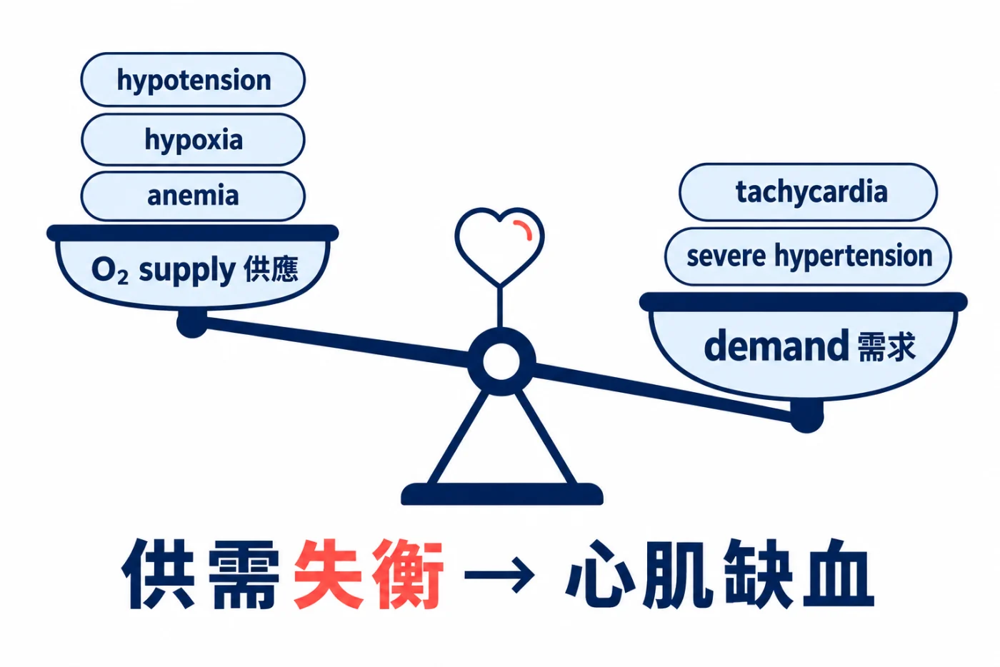
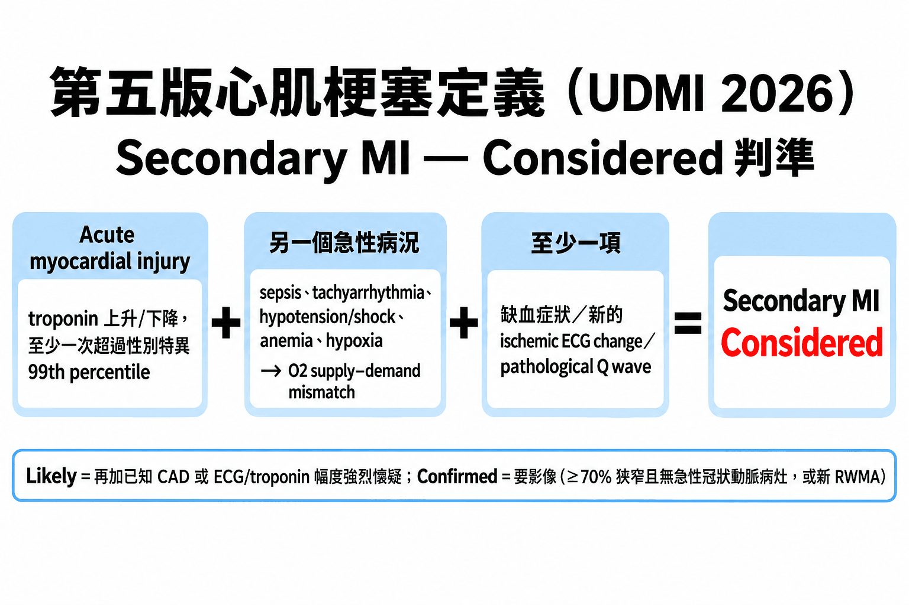
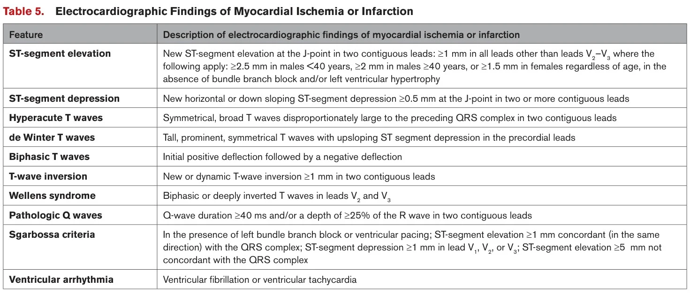
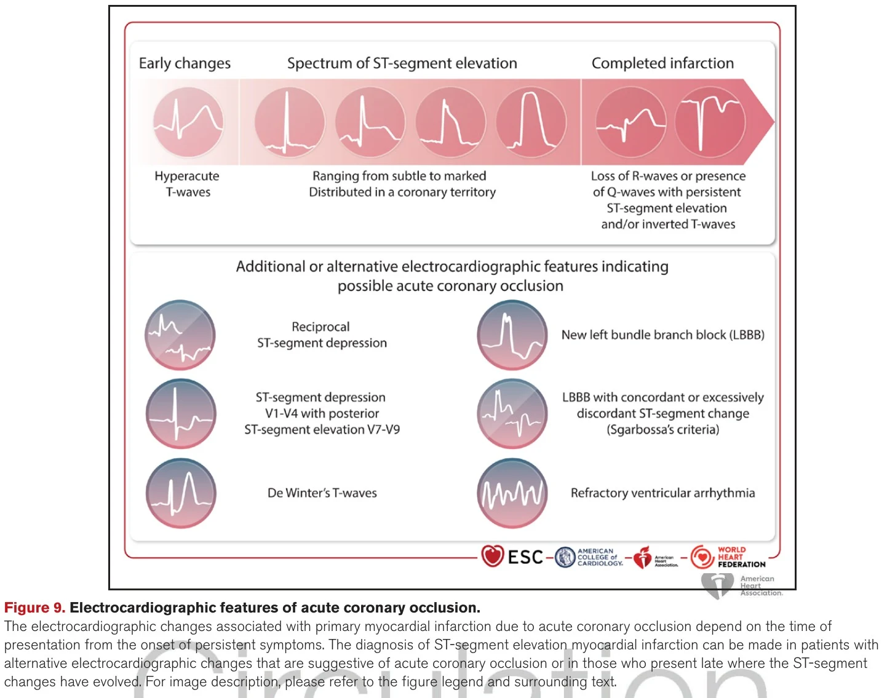
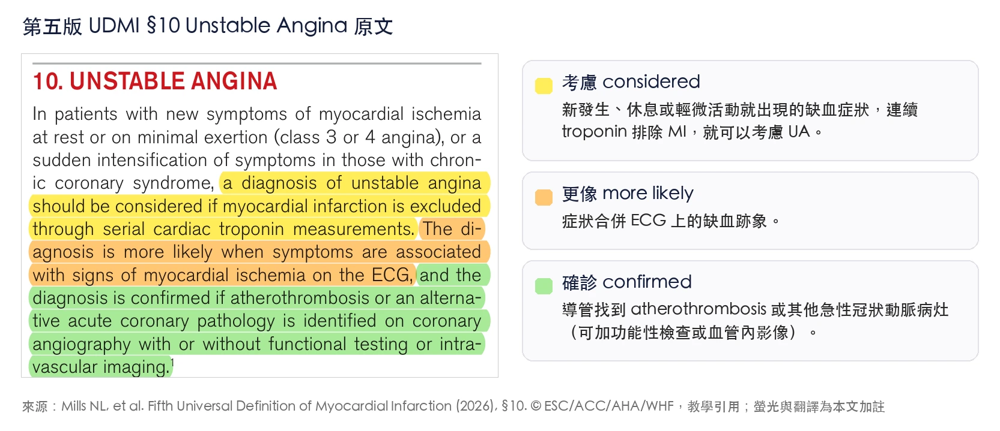



On the morning of August 28, before my shift, I was scrolling X.com. The official ESC account dropped this post:[^1]

")

The post said one thing: the Fifth UDMI is out. Those three hearts in the image are the new three-way classification. More on that later.

Then the whole timeline exploded.

"Types 1-5 are gone." I saw that line in at least five different people's posts.[^2]

The definition of myocardial infarction has been revised. This is the Fifth Universal Definition of Myocardial Infarction (UDMI), the first time the ESC, ACC, AHA, and WHF have all put their names on it together, published the same day in four journals: European Heart Journal, JACC, Circulation, and Global Heart.[^3]

The last version was 2018. Eight years. Type 1, Type 2, Type 4a, Type 4b, Type 4c, Type 5: codes I started memorizing as a resident and was still memorizing as an attending, turned into historical terms overnight.[^4]

This post isn't going to translate the 50-page original (Dr. 劉宜學 has already written five posts on it, very thorough, links at the end). What I want to do is lazier: round up what people on X have been saying and fighting about these past few days, and add a bit of the ED man's perspective.[^5] <!-- keep-zh -->

First, a few questions to ask yourself:


- **Q1**: Did Type 2 MI really disappear? Or did it just get renamed secondary MI?
- **Q2**: The most common one in the ED, sepsis + a red-flagged troponin: what do we call it now?
- **Q3**: Did OMI make it into the new definition? Why is the great Smith firing away on X?
- **Q4**: For the ED man, what changes on tomorrow's shift?


## Wave one: everyone celebrating goodbye to Type 1~5

The new definition no longer asks you to memorize numbers. It asks a question an emergency physician already asks: how did this MI happen? Then it sorts by the answer into three types.

In plain words:

- **Primary MI**: it happened on its own. The coronary artery itself went wrong: plaque rupture with thrombus, SCAD, embolism, vasospasm, all of it counts.
- **Secondary MI**: dragged down by some other acute illness. Supply-demand imbalance, and there must be another acute condition as the trigger.
- **Procedure-related MI**: a complication within 30 days after cardiac surgery or an intervention.[^6]

Here's how the old codes map to the new classification, in one table:[^7]

| Fourth UDMI (2018) | Fifth UDMI (2026) | What changed |
|---|---|---|
| Type 1 | Primary MI | Broader. The old version was atherothrombosis only; the new one takes in <mark>SCAD, embolism, vasospasm</mark> (Type 2 in the fourth edition) and <mark>stent thrombosis, restenosis, and graft failure >30 days after the procedure</mark> (in the fourth edition, stent thrombosis was Type 4b and restenosis was Type 4c, at any time after the procedure; graft failure was only covered by Type 5 within 48 hours after CABG, and anything later had no clear category). The rationale is that stent/graft failure >30 days out counts as de novo disease, not a procedural complication |
| Type 2 | Secondary MI | Narrower, with a higher bar. Must be triggered by another acute condition; SCAD/embolism/vasospasm moved to primary |
| Type 3 | Removed | Sudden death where MI is a possible cause gets assigned to one of the three types based on context or autopsy |
| Type 4a/4b/4c/Type 5 | Procedure-related MI | 48 hours becomes 30 days; PCI and CABG use the same criteria; diagnosis no longer relies on troponin multiples |

The most-liked explainer on X was @AnasNomanMD's nine-point summary. A lot of people related to the opening line: "Thankfully, no more type 1, 2, 4a, 4b, 5 MI. Simpler and more clinically relevant."[^8]

The nine points:

- Primary MI gets broader
- Secondary MI gets stricter, needs obstructive CAD or a new RWMA
- Procedure-related MI changes to 30 days, troponin only supportive
- Type 3 is gone
- Troponin cutoffs split by sex
- MINOCA changes to injury
- Silent MI needs imaging confirmation
- No more typical/atypical, say chest discomfort instead
- Isolated troponin rise after TAVR doesn't count as MI

Interestingly, the second most-liked of all the posts wasn't from the English-speaking world. It was from a Japanese intensivist, @okame_icu. The Japanese emergency/ICU crowd reacted to this much more enthusiastically than I expected. More on that later.[^9]

OK~~ celebration's over. But...... and it's exactly this "but."

## Answering Q1: Secondary MI is not just Type 2 MI with a new name

Celebration posts everywhere, but the one that actually stopped me was a thread by Greek cardiologist Aris Sikolas, which opens with: "Secondary MI ≠ simply the new name for Type 2 MI."[^10]

Sikolas first clears up something a lot of people get wrong: **Type 2 MI already required evidence of ischemia in the fourth edition.** So requiring ischemia is not new.[^11]

")

This is a figure I used to teach with, the fourth-edition definition of AMI: troponin above the 99th percentile at least once (the evidence of myocardial injury), plus evidence of ischemia: at least one of symptoms, ECG, or imaging. Type 2 MI used the same set of criteria; the only difference was that the mechanism is supply-demand mismatch rather than plaque rupture. So Sikolas is right: the requirement for evidence of ischemia was already there in the fourth edition. What the fifth edition actually adds is the three tiers on top: considered, likely, confirmed, each stricter than the last, and the top tier, confirmed, needs imaging evidence (≥70% stenosis with no acute lesion, or a new RWMA) to count.

So what is actually new?

### Narrower scope

One is a narrower scope. SCAD, coronary embolism, and vasospasm, the three things the old version stuffed into Type 2, all moved to primary. Secondary MI is reserved for supply-demand mismatch caused by another acute condition.

The original explains it this way: myocardial oxygen supply-demand imbalance can come from increased demand (tachycardia, severe hypertension) or decreased supply (hypotension, hypoxia, anemia), so lots of acute illnesses can cause it, the most common being tachyarrhythmia. How severe the ischemia gets depends on how long and how hard the trigger hits, and whether the patient has underlying obstructive CAD or structural heart disease, and often two or three triggers come together. In plain words: first there's an acute illness, it wrecks the heart's oxygen supply-demand balance, and only then does the myocardium become ischemic. That's what counts as secondary.[^12]

### Higher diagnostic bar, in three tiers

The other is that the diagnostic bar for secondary MI is higher, and it comes in three tiers:

- **Considered**: acute myocardial injury + another acute condition + at least one of (ischemic symptoms, new ischemic ECG change, pathological Q wave).
- **Likely**: add known CAD, or an extent of ECG ischemia or troponin magnitude big enough to make you strongly suspicious.
- **Confirmed**: needs imaging, and **meeting either one** of the two below is enough (the original says one or more):[^13]
    1. Coronary angiography showing ≥70% stenosis (or ≥50% with physiologic testing proving it's flow-limiting), **without** an acute coronary lesion; if there is an acute lesion, it becomes primary MI.
    2. Cardiac imaging (e.g., echo, CMR) showing a **new** RWMA, or loss of viable myocardium, in a distribution consistent with ischemia.

. Source same as Table 1")

<mark>**No imaging, and secondary MI can only stay at considered or likely. It can't be confirmed.**</mark>

This one matters a lot for the ED. I'll save it for Q2.

The original itself says it bluntly: you can't set a universal threshold for the various triggers (tachycardia, hypotension, anemia, hypoxia), because two or three often come together, and it also depends on whether there's underlying CAD.[^14]

Bear's take: **The fifth edition's stance on secondary MI, in plain words, is: better to under-call than to slap labels on people.** The rationale column of the original Table 1 literally says "prioritize specificity." The goal is to pick out the patients for whom it actually has treatment implications, and not let "red troponin + an acute illness" automatically become an MI diagnosis.[^15]

The rationale column of Table 1 spells out the approach on both sides very plainly. Primary MI prioritizes sensitivity: better to over-call, can't miss a single acute coronary lesion, because the cost of missing one is a vessel and a chunk of myocardium; so injury plus any one of symptoms, ECG, or Q waves counts as likely right away, and cath and imaging are for confirming the mechanism and supplying the sixth character of the ICD code. Secondary MI prioritizes specificity: better to under-call, don't slap MI on every sepsis-plus-red-troponin patient, because the label mostly doesn't change treatment, but the patient walks away with a heart disease label; so it needs objective evidence, obstructive CAD or a new RWMA, and if you can't get that, it stays at considered/likely. Same document, two opposite approaches, because getting each type of MI wrong costs something different: with primary, the fear is missing it; with secondary, the fear is overusing it.

, © ESC/ACC/AHA/WHF, used for teaching")

## Answering Q2: Sepsis + red troponin, what do we call it now?

This is where the fight on X was most vivid.

A Japanese cardiologist who also does emergency/critical care, @RYO_cardeccmepi, wrote right from the ESC venue: 「Sepsis、shock、anemia、hypoxia＋troponin↑＝自動的に『Type 2 MI』でない」. In plain words: **sepsis, shock, anemia, or hypoxia plus a rising troponin no longer automatically equals Type 2 MI.** Why say that? Because the original spells out the reason: in the setting of acute illness like sepsis or shock, ischemic symptoms are hard to elicit (the patient won't tell you about chest tightness, they're just short of breath), the ECG changes are often diffuse, and troponin can't tell ischemic from non-ischemic injury, so symptoms, ECG, and troponin alone can't reliably diagnose MI; you need imaging to confirm or exclude it. The original even says outright that in most of these patients imaging shows neither obstructive CAD nor new myocardial necrosis, and secondary MI can then be excluded.[^16] <!-- keep-zh -->

### Call it acute myocardial injury

So what do you call it? **Acute myocardial injury**.

Troponin rise and/or fall, with at least one value above the sex-specific 99th percentile: that's acute myocardial injury. **To upgrade it to MI, you need evidence of ischemia, and you need to be able to exclude non-ischemic causes.**[^17]

### Everyday life in the ED

A US interventional cardiologist, @DrJayMohan, posted "Good bye Type 2 MI!!!!", saying they hoped patients would stop coming to them thinking they'd had a heart attack.[^18]

Somebody threw cold water on it right away. @tlevin: "I don't think this helps me very much. Prefer just type 1 and type 2. Not sure what to call the trop of 1500 in older nursing home patient who has urosepsis with sinus tach without obstructive cad or wall motion abnormalities in the new classification."

The fifth edition's answer: neither. Her troponin of 1500 is acute myocardial injury. To head toward secondary MI, you'd first need ischemic symptoms or ECG changes to even get to considered; and she's already been shown to have no obstructive CAD and no new wall motion abnormality, and the original says outright that in this situation secondary MI can be excluded. Sepsis itself can trigger atherothrombosis, so you should think about primary MI too, but there's no lesion, so that's excluded as well. So the chart says **acute myocardial injury, due to urosepsis plus sinus tachycardia**. Not MI. That's exactly what the fifth edition wants: stop forcing an MI label onto her.[^19]

Another one, @minhaskh, piled on: "No they will still come and say they had 3 heart attacks while in the hospital with normal EKG, normal echo and no coronary angiography done ever! High sensitivity troponin still is an issue!"[^20]

What these two are describing is everyday life in the ED.

My own reading of the original is this: that nursing-home grandma, under the new definition, stops at "acute myocardial injury, secondary MI considered." To move up to likely, one more feature is enough: she has known CAD, or the extent of ECG ischemia or troponin magnitude is big enough to make you strongly suspicious; either one counts (the original says one or more additional features). To get to confirmed, you need imaging. If the ED can't do it, you honestly stop there.

The original even says that for patients with lots of comorbidities, frailty, or limited life expectancy, imaging is sometimes just not appropriate, and then you rely on clinical judgment.[^21]

<mark>**A red troponin tells you the myocardium is injured, not that it's infarcted. The rest is your homework.**</mark>

Say that one out loud with me. The whole fifth-edition document is really about this.

Bear's take: Finally, no more forcing a Type 2 MI diagnosis onto sepsis patients. But...... but "acute myocardial injury," those few words, don't yet have a familiar place in NHI (Taiwan's National Health Insurance) billing, in discharge diagnoses, or when explaining to families. ICD-11 has a code for it; how Taiwan's ICD-10-CM will handle it, I don't know yet. My guess is this part will be a mess for a while😅[^22]

## Answering Q3: OMI made it into the new definition, but its name didn't

This is the part I most wanted to write.

### The part that made me happy

The happy part first. The fifth edition's ECG section, for the first time, names one by one the patterns that have no STE but are actually acute coronary occlusion: posterior MI (V1-V3 STD), de Winter, Wellens, Aslanger pattern, South African flag sign, new LBBB/RBBB with signs of ischemia, Sgarbossa and modified Sgarbossa (ST/S ≤0.25), hyperacute T wave, VT/VF.[^23]

And the original states it plainly: **up to one in four patients managed as NSTEMI actually have a completely occluded culprit artery.**[^24]

Who's the cited paper? McLaren, de Alencar, Aslanger, Meyers, Smith, the 2024 JACC Advances paper "From ST-Segment Elevation MI to Occlusion MI." That's the OMI paradigm crew.[^25]

The fourth edition actually described these morphologies too, it just didn't name them. It cited the 2008 de Winter paper, with a descriptive line like "tall, prominent, symmetrical T waves in the precordial leads, upsloping ST-segment depression >1 mm at the J-point in the precordial leads... are associated with significant left anterior descending artery (LAD) occlusion." The fifth edition calls them by name, and even draws them into Figure 9.[^26]

For the ED man, this means that next time you call the CV man in the middle of the night, you have an official document signed by four major societies you can pull out.

### STEMI/NSTEMI: both names stay

**STEMI/NSTEMI: both names stay.**[^27]

Dr. Smith himself was at the ESC. On the afternoon of August 30 there was the "Ask the Task Force" session: the three chairs gave 5 minutes of key messages, then 55 minutes of panel discussion, and that's where the Q&A was.[^28]

To be honest up front: the recording is on ESC 365, login required, and I haven't seen the original footage. Nobody else on X posted this Q&A verbatim either (I pulled every Smith post from August 25 to September 3 and also searched posts from other people who were there). So what follows is Smith's own account.[^29]

On August 31 he wrote this on X:

> "They told us in the Q&A that they could not replace STEMI/NSTEMI with OMI/NOMI because ICD-11 does not recognize OMI. So I said that the 6th universal definition will not recognize it because ICD does not, then ICD-12 will not because 6th definition does not."[^30]

In plain words: the committee said ICD-11 has no code for OMI, so they can't replace STEMI/NSTEMI with OMI/NOMI. Smith's reply: then it'll never change; the definition waits for ICD, and ICD waits for the definition.

It's a loop with no exit.

Josh Farkas (PulmCrit) chimed in below: "Everyone is blaming someone else for not modernizing the guidelines. There are simple work-arounds for this (rename the disease in clinical practice but continue to use old ICD-11 codes). So it seems like a poor excuse."[^31]

In plain words: everyone's blaming someone else for not updating the guidelines. There's actually a simple fix: rename the disease in clinical practice first, and keep using the old ICD-11 codes for coding. Using ICD as the reason is a lousy excuse.

Below that, someone asked a question a lot of CV men are probably thinking too. @BryanTanMD: "Genuinely curious to know why does it matter if we call it STEMI or OMI. We can recognize a STEMI on ekg. We know patient needs to go to cath lab when we see a STEMI. We know vessel is occluded when there is a STEMI. Calling OMI doesn't change management or outcomes."[^32]

Another, @smsaadatagah, answered for Smith first: "I guess the issue is there are many other ECG patterns with coronary occlusion without STE that we won't capture or activate the cath lab if we continue to call it STEMI"[^33]

Then Smith himself twisted the knife: "The name "STE" makes people think that STE is all that matters. Is there any other pathology in medicine that is named after a test used to diagnose it? There are none. "Low WBC appendicitis?" If low, you can wait until tomorrow to operate? If pt dies, guidelines were followed!"[^34]

A Brazilian physician took it up a level: "If a scientific society is producing a Universal Definition of myocardial infarction, but feels unable to adopt an important change because the ICD has not yet incorporated the term, it raises an important question: Should classification systems constrain disease definitions, or should disease definitions be driven primarily by the best available evidence?"[^35]

Some people took it more philosophically: "I guess we just keep using OMI/NOMI until it becomes so widespread they can't escape it. Eventually the definitions and coding will have to catch up... A bit of Darwinian survival of the most useful framework."[^36]

Honestly, reading this thread got to me a little. Smith, Meyers, and the rest have been pushing the OMI concept for so many years; the content made it into the official document, and the name is still standing outside the door.

### Farkas's harder critique

Farkas had another, harder critique, the fourth most-liked of all the posts. What he went after was the concept in the original of "regional ST-segment depression due to supply-demand imbalance."[^37]

His argument is simple: **subendocardial ischemia doesn't localize.** Ischemia on the ECG only looks two ways: one is subendocardial ischemia, where the STD is diffuse; the other is transmural ischemia, which gives regional STE, and the STD is reciprocal change.[^38]

So the claim that supply-demand mismatch causes regional STD is dangerous, because it often gets used to explain away the STD in the anterior precordial leads from a posterior OMI. And that's how the patient gets missed.[^39]

I agree with this one completely. **STD in V1-V4: the reflex is posterior MI until proven otherwise.** That's old news Amal Mattu has been preaching forever. And for OMI without STE, what saves the most lives is still Ken Grauer's habit of reading an ECG from Rate, Rhythm, Axis, Interval all the way to Ischemia, without skipping a single lead. However new the tools get, that won't change.

Bear's take: **The content made it in; the name didn't.** When you see a de Winter in the middle of the night, you still have to talk the CV man into why this one needs the cath lab. The only difference is you now have one more line to use: "Figure 9 of the Fifth UDMI lists this pattern."

### What about Amal Mattu?

What about Amal Mattu? I went and checked. He didn't go to ESC, and from August 20 to September 3 he posted only twice on X (a Friday night-shift whiteboard teaching post and a promo for his November ECG course); nothing at all during those four days of ESC, and nobody tagged him on this topic either. The ECG Weekly X account posted a dozen-plus teaching posts in the same period, not one mentioning UDMI.[^40]

His ECG Weekly website, on August 28, the same day the document went live, rewrote its whole "Acute Coronary Syndromes" reference page to align with the fifth edition, and added a new tag, "5th Universal Definition of MI."[^41]

A few lines in there say it even more plainly than the original: "Trigger + elevated troponin ≠ secondary MI." "A dynamic troponin is not synonymous with MI." On keeping STEMI/NSTEMI, its stance is completely different from Smith's: it says "remains clinically important for management and coding," then lays four frameworks side by side and warns you not to mix them up: ACS is the name of a clinical syndrome (unstable angina plus acute MI, caused by an acute coronary lesion); STEMI/NSTEMI is split by ECG, and management and coding still rely on it; primary/secondary/procedure-related is the fifth edition's split by mechanism and context; acute coronary occlusion is about whether the vessel is actually occluded, with or without STE. Four different axes, hence "These classifications should not be used interchangeably."[^42]

To be clear: that ECG STAT page has no author byline. It's the platform's reference library, so it can't be written up as "Mattu says." But I find the contrast really interesting. Smith firing away live in Munich, Farkas ranting on X, and the Master Grandma (Amal Mattu) not saying a word, while his platform swapped out the whole set of teaching material within a day, even describing the retention of STEMI/NSTEMI as "clinically important for management and coding." One argues; the other just uses it.[^43]

While I'm at it, here's the ACS flowchart from that ECG STAT page:

")

This ECG STAT flowchart is really well done. It takes in all the Fifth UDMI concepts and lays the whole logic out in one line: start with symptoms, ECG within 10 minutes; if there are STEMI criteria or a STEMI-equivalent / OMI pattern, go straight to reperfusion, don't wait for troponin. If not, draw serial hs-cTn, first ask whether there's acute myocardial injury, then ask whether there's evidence of ischemia; only with both is it acute MI, and only then do you split primary vs secondary. The box at the bottom left, "fix the stressor & repeat the ECG," is for secondary: treat the trigger, and if the ECG changes resolve, lean toward secondary ischemia; if they don't resolve or get worse, go back and suspect primary. The line at the very bottom is the whole point: troponin tells you about injury; the clinical picture and the ECG decide whether it's ischemia, whether it's MI, and whether it needs immediate reperfusion.

## A few remaining things

OK~~ I went off on a tangent again. I'll go through the remaining things a bit faster.

### The female troponin threshold is now written into the definition

The third most-liked post was Martha Gulati's. **The female troponin threshold is now written into the definition.** The fifth edition explicitly requires sex-specific 99th percentiles, because using one cutoff for men and women systematically underestimates myocardial injury in women.[^44]

To be fair: the fourth edition already "recommended" sex-specific thresholds, it just noted at the time that whether this adds value for every assay was still controversial. The fifth edition moves it from a recommendation into the definition itself.[^45]

**With the latest-generation hs-cTnT in a large healthy population, the URL in women is about half that in men.**[^46]

### MINOCA got renamed, but the acronym didn't change

This next one made me laugh a little when I saw it. **MINOCA got renamed, but the acronym didn't change.** It went from myocardial infarction with non-obstructive coronary arteries to myocardial **injury** with non-obstructive coronary arteries.

The original explains why: calling it infarction was a problem, because most of these patients turn out to have non-coronary heart disease (myocarditis, Takotsubo, cardiomyopathy), or not a heart problem at all (PE). Switching to injury avoids stamping the word "infarction" on the patient from the start.

The I is still I, it just means something else now XD. It's now a working diagnosis, not a final diagnosis. Once CMR is done (cardiac magnetic resonance; the original recommends doing it within two weeks of onset, because Takotsubo and myocarditis changes fade if you wait too long, while an infarct scar doesn't), only 22% to 27% turn out to really be MI; the rest are mostly myocarditis, Takotsubo, cardiomyopathy, PE.[^47]

### Troponin multiples are gone from procedure-related MI

**Troponin multiples are gone from procedure-related MI.** The old rule of >5 times URL after PCI and >10 times URL after CABG is gone. The original's reason is blunt: after cardiac surgery, 97.5% of patients have troponin above 10 times URL. 97.5%!!!! A threshold like that is no threshold at all.[^48]

What the ED will see is this: a patient back with chest pain within 30 days of PCI, TAVI, or an ablation; the first thing to think is procedure-related MI. Stent thrombosis beyond 30 days counts as primary MI.[^49]

### "Typical/atypical chest pain" is officially discouraged

**The phrase "typical/atypical chest pain" is now officially discouraged.** Call it chest discomfort instead.

The original's logic goes like this: chest pain is highly sensitive for MI, similar in men and women, but not specific; patients describe pressure, tightness, squeezing, and how severe the symptom is has nothing to do with whether it's MI, so "chest discomfort" fits better than "chest pain." Some people hurt in the epigastrium, jaw, neck, arm, or back; some have no chest pain at all, just dyspnea, palpitations, nausea, vomiting.

Studies found that symptoms labeled "atypical" are more common in women being evaluated for MI, and the label delays diagnosis. Compared with men, women with ACS more often have interscapular pain, nausea and vomiting, and dyspnea, and less often chest pain and diaphoresis; presentations without chest pain are more common in the elderly and in diabetics. Patients without chest pain get diagnosed later more often, and their in-hospital mortality is higher. So the original recommends: in women, the elderly, and diabetics, systematically ask about more symptoms, though most people will still have chest pain or chest tightness.[^50]

Of course some people on X aren't buying it. One wrote: "Committees of hobbyist doctors voting that I should say chest discomfort instead of chest pain", and I'll skip translating the words that follow XD[^51]

### Pathological Q waves go back to the classical definition

The last one I only found by reading the original myself; almost nobody on X mentioned it. **Pathological Q waves go back to the classical definition.** Plain version first: a Q wave is the little initial downward part of the QRS. Once the myocardium in that direction dies it stops generating current, and the electrode sees the vector of the opposite myocardium, so you get a Q wave. The problem is that normal people have small septal Qs too, so you have to draw a line: how wide and how deep counts as "pathological."

The classical definition has just two numbers: **width ≥40 ms (one small box), and/or depth ≥25% of the R wave in the same lead**, in two contiguous leads. The fourth edition back then switched to a more detailed set of rules: in V2-V3, anything >0.02 s (or QS) counts; in other leads it has to be ≥0.03 s and ≥1 mm deep (or QS), in two contiguous leads; plus an R wave >0.04 s in V1-V2 with R/S>1 and a concordant T wave also counts.

The fifth edition put that set away and went back to the classical 40 ms/25%, with just one sentence of rationale: the classical definition correlates better with transmural infarction seen on CMR. Those 0.02 s and 0.03 s numbers I memorized for eight years...... handed back.[^52]

### Are ACS, STEMI/NSTEMI, and UA still in use?

Still in use, and the two systems coexist, each handling its own job. STEMI/NSTEMI stays, positioned as the working diagnosis for "read the ECG, decide whether to reperfuse right now." The original says: "While imperfect, this classification is simple and useful to identify those patients likely to benefit from immediate coronary intervention or fibrinolysis." ICD-11 gives each its own code too. The original also states its limits: STEMI/NSTEMI only tells you whether the ST is elevated and whether to rush to the cath lab now; it doesn't tell you how this MI came about, whether it's plaque rupture, SCAD, or getting dragged down by sepsis. The decisions after the acute phase, how to do secondary prevention, whether to go looking for vascular disease like SCAD, whether to treat that acute illness first, depend on mechanism, and these two words can't give you that.[^56]

Unstable angina also stays, still within the ACS spectrum, and tiered just like MI: new ischemic symptoms, at rest or with minimal exertion, with MI excluded by serial troponins, and you can consider UA; ischemic signs on the ECG make it more likely; it's only confirmed if cath finds atherothrombosis or another acute coronary lesion. No cath doesn't mean it isn't UA, it just stays at "considered/more likely." The original also explains why UA keeps getting rarer: since hs-cTn became widespread, a lot of what used to be UA has been reclassified as MI, and the group left whose troponin truly doesn't rise has a better prognosis.[^57]

So there are three axes, none replacing the others: ACS is the umbrella term for UA plus acute MI; STEMI/NSTEMI splits by ECG and handles acute-phase management and coding; primary/secondary/procedure-related splits by mechanism, replaces Type 1～5, and handles the final diagnosis. That ECG STAT page earlier, laying four frameworks side by side (ACS, STEMI/NSTEMI, primary/secondary/procedure-related, acute coronary occlusion) and saying they're not interchangeable, is making exactly this point.

## Answering Q4: Tomorrow's shift, what does the ED man change?

1. **For the patient with a red troponin, write acute myocardial injury in the chart first.** To write MI, you need evidence of ischemia.
2. For sepsis, shock, anemia, or hypoxia patients with a high troponin, don't reflexively write Type 2 MI. To write secondary MI you need the triggering acute condition, plus ischemic symptoms or ECG changes; without imaging it's considered/likely, don't write confirmed.
3. V1-V4 STD, de Winter, Wellens, Aslanger, South African flag: these are all in Figure 9 of the official document now. You can cite it directly when you call the CV man.
4. Chest pain coming back within 30 days of a cardiac intervention or surgery: think procedure-related MI; beyond 30 days, treat it as primary MI.
5. Words like Type 1 and Type 2 will probably still be around for a while in handoffs with the CV man. During the transition you need to understand both systems.[^53]

## Afterthoughts

After clicking through 84 posts one by one, the most surprising thing was this: on Traditional Chinese X, the number of posts about this was zero. Not a single one.[^54]

The discussion was all in the English and Japanese circles. Japanese emergency/ICU physicians reacted fast; on August 30, before ESC had even wrapped, people were already posting photos of the slides from the session. Right now the only complete write-up in Taiwan is the five blog posts by Dr. 劉宜學.[^55] <!-- keep-zh -->

My other takeaway is about the document itself. Its biggest change, in my view, isn't the three-way classification, it's that "a red troponin is not MI" has finally been written plainly enough. The Type 2 MI diagnosis was broadly defined in the fourth edition to begin with, and the ED used it that way for eight years. The new definition raises the bar, and I think that's right. The price is that we have to learn to write "acute myocardial injury" and then resist adding anything on top.

As for OMI...... the name didn't make it in, and like the great Smith I'm a little annoyed. But Figure 9 made it in. The sixth edition, eight years from now: we'll see.

## Key takeaways

1. The Fifth UDMI replaces Type 1~5 with three types, primary/secondary/procedure-related, named by "how the MI happened."
2. Secondary MI isn't Type 2 renamed: SCAD/embolism/vasospasm moved to primary; confirmation needs ≥70% stenosis (or ≥50% and flow-limiting) without an acute lesion, or a new RWMA. Without imaging it stays at considered/likely.
3. Troponin rise/fall above the sex-specific 99th percentile = acute myocardial injury, not MI. To call it MI you need evidence of ischemia.
4. The ECG section names de Winter, Wellens, Aslanger, South African flag, posterior, Sgarbossa/modified Sgarbossa; it cites the OMI literature; but the STEMI/NSTEMI names are kept, on the grounds of ICD-11.
5. Procedure-related MI: within 30 days of any cardiac surgery/intervention; not diagnosed by troponin multiples; stent thrombosis >30 days out counts as primary.
6. The I in MINOCA changes to injury, and it's a working diagnosis; after CMR only 22-27% turn out to be MI.
7. Typical/atypical is discouraged; pathological Q waves go back to ≥40 ms and/or ≥25% of the R wave.
8. ACS, STEMI/NSTEMI, and unstable angina all stay: ACS is the umbrella term, STEMI/NSTEMI handles acute-phase reperfusion and coding, primary/secondary/procedure-related handles mechanism and final diagnosis. Three axes, not interchangeable.

## References

1. Mills NL, Newby LK, Zaman S, et al. Fifth Universal Definition of Myocardial Infarction (2026). Eur Heart J 2026; doi:10.1093/eurheartj/ehag101. Co-published in JACC (10.1016/j.jacc.2026.07.025), Circulation (10.1161/CIR.0000000000001477), and Global Heart (10.5334/gh.1578).
2. Thygesen K, Alpert JS, Jaffe AS, et al. Fourth Universal Definition of Myocardial Infarction (2018). Circulation 2018; doi:10.1161/CIR.0000000000000617.
3. McLaren J, de Alencar JN, Aslanger EK, Meyers HP, Smith SW. From ST-segment elevation MI to occlusion MI: the new paradigm shift in acute myocardial infarction. JACC Adv 2024;3:101314.
4. 劉宜學. Fifth Universal Definition of Myocardial Infarction (2026) (I)–(V). 心臟科 x 劉宜學醫師, 2026-08-29. https://wecareheart.com/treatment-guidelines/fifth-universal-definition-of-myocardial-infarction-2026-i/ <!-- keep-zh -->
5. Josh Farkas. Diagnosis of myocardial injury vs ischemia. EMCrit IBCC, updated 2026-08-28. https://emcrit.org/ibcc/troponin/
6. ESC 365. 5th Universal Definition of Myocardial Infarction (ESC, ACC, AHA, and WHF): Ask the Task Force. ESC Congress 2026, Munich, 2026-08-30. [ESC 365 session 52817](https://esc365.escardio.org/session/52817) (login required)
7. X posts (in order of appearance in the text): @escardio 2026-08-28; @AsherElad 08-28; @AnasNomanMD 08-29; @okame_icu 08-28; @ArisSikolas 08-28, 08-29; @RYO_cardeccmepi 08-30; @DrJayMohan 08-31; @tlevin 09-01; @minhaskh 08-31; @smithECGBlog 08-31, 09-01; @PulmCrit 08-29, 08-31; @BryanTanMD 09-01; @smsaadatagah 09-01; @vitorborin_ 08-31; @AhmedAd76369091 08-31; @amalmattu 08-22, 08-24; @DrMarthaGulati 08-30; @MrWBond 08-29. Full links and like counts are in the notes for each section.
8. ECG Weekly. ECG STAT: Acute Coronary Syndromes (ACS); Occlusion MI: STEMI & Beyond. 2026-08-28 (members-only content). [ECG Weekly ECG STAT: ACS](https://ecgweekly.com/ecgstat/acute-coronary-syndromes/)

## Notes and sources

Sources for every quote and number, traced line by line back to the original document and the posts.

[^1]: @escardio 2026-08-28 https://x.com/escardio/status/2093224205798044021 · like counts are the values I saw as of 2026-09-03
[^2]: @AsherElad 2026-08-28 https://x.com/AsherElad/status/2093275677474554203 verbatim: "Types 1-5 are gone. MI is now primary, secondary or procedure-related"; equivalent wording also in posts by @gcfmd, @Bernilina, @AkhilGulati, @BartoszHudzik
[^3]: Mills NL, Newby LK, Zaman S, et al. Fifth Universal Definition of Myocardial Infarction (2026). EHJ DOI 10.1093/eurheartj/ehag101; JACC 10.1016/j.jacc.2026.07.025; Circulation 10.1161/CIR.0000000000001477; Global Heart 10.5334/gh.1578. First-page note: "co-published in European Heart Journal, Journal of the American College of Cardiology, Circulation, and Global Heart". ESC press release 2026-08-28; dedicated session at ESC Congress Munich 2026-08-30
[^4]: Fourth UDMI: Thygesen K, et al. Circulation 2018, DOI 10.1161/CIR.0000000000000617
[^5]: 劉宜學, "Fifth Universal Definition of Myocardial Infarction (2026) (I)–(V)", wecareheart.com 2026-08-29 https://wecareheart.com/treatment-guidelines/fifth-universal-definition-of-myocardial-infarction-2026-i/ <!-- keep-zh -->
[^6]: Fifth UDMI §4 "What Is New" and Table 1 "Comparison of the Fourth and Fifth Universal Definitions of Myocardial Infarction". Verbatim: "Myocardial infarction is now classified into one of three clinical types: Primary myocardial infarction: spontaneous presentation due to a primary acute coronary pathology / Secondary myocardial infarction: resulting from myocardial oxygen supply–demand imbalance due to another acute condition / Procedure-related myocardial infarction: occurring as a complication of a percutaneous or surgical cardiac procedure"
[^7]: Fifth UDMI Table 1. Verbatim (Type 1 row): "Restricted to atherothrombosis" → "Includes all acute coronary pathologies: atherothrombosis; spontaneous coronary artery dissection; coronary embolism; vasospasm; and restenosis, stent thrombosis, or graft failure >30 days from procedure"; (Type 3 row) "Term removed"; (Type 4/5 row) "Coronary complication within 30 days of a cardiac procedure". Fourth-edition 48 hours: Fourth UDMI "Criteria for PCI-Related MI ≤48 Hours After the Index Procedure (Type 4a MI)" "Criteria for CABG-Related MI ≤48 Hours After the Index Procedure (Type 5 MI)"
[^8]: @AnasNomanMD 2026-08-29 https://x.com/AnasNomanMD/status/2093752960568459643 verbatim as above; 205 likes (2026-09-03)
[^9]: @okame_icu 2026-08-28 https://x.com/okame_icu/status/2093319913675071636 268 likes; self-correction the next day 「アテローム性動脈硬化症『以外の』→『以外も含む』」 https://x.com/okame_icu/status/2093629240382304633. Ranking based on likes across the 84 deduplicated posts compiled for this article <!-- keep-zh -->
[^10]: @ArisSikolas 2026-08-28 https://x.com/ArisSikolas/status/2093289918873076180 90 likes; thread of 7 posts
[^11]: Same thread, 2/7, verbatim: "Type 2 MI ALREADY required evidence of acute myocardial ischaemia. So requiring ischaemia is NOT new."; Fourth UDMI "Criteria for Type 2 MI": rise/fall cTn + supply–demand imbalance + at least one of (symptoms / new ischemic ECG / Q waves / imaging)
[^12]: Same thread, 3/7; Fifth UDMI Table 1 Type 2 row: "Myocardial oxygen supply–demand imbalance due to an alternative acute condition"; the Fourth UDMI Type 2 definition originally included "coronary spasm and spontaneous coronary dissection may be involved as well (ie, type 2 MI)"
[^13]: Fifth UDMI Box 4 "Diagnostic Criteria for Secondary Myocardial Infarction" verbatim: "For patients in whom coronary and/or cardiac imaging is feasible and appropriate, the diagnosis is confirmed if one or more of the following features are present" "Obstructive coronary artery disease, defined as ≥70% stenosis in an epicardial vessel by angiography (or ≥50% stenosis in an epicardial vessel that is flow-limiting on physiological assessment) without an acute coronary pathology" "Development of a new or presumed new regional wall motion abnormality or absence of viable myocardium in a pattern consistent with an ischemic etiology"; §7.2.2 verbatim: "If imaging provided evidence of an acute coronary pathology (Figure 3) then a diagnosis of primary myocardial infarction would be confirmed"; the three tiers considered/likely/confirmed as in Box 4 and @ArisSikolas 5/7–7/7
[^14]: Fifth UDMI §7.2.2 verbatim: "Therefore, it is not possible to define thresholds for any of the triggers of supply–demand imbalance that could be reliably applied to all." "two or more triggers often coexist"
[^15]: Fifth UDMI Table 1 rationale column verbatim: "Prioritize specificity to differentiate myocardial infarction from acute myocardial injury in conditions resulting in oxygen supply–demand imbalance. Objective diagnostic criteria to allow consistent application in practice and identify patients in whom the diagnosis has treatment implications."
[^16]: @RYO_cardeccmepi 2026-08-30 https://x.com/RYO_cardeccmepi/status/2094078849692913762 23 likes, verbatim as above, with four photos of the slides from the session; also 「救急 ICUへの影響はでかそう」 <!-- keep-zh -->
[^17]: Fifth UDMI Box 1 verbatim: "Acute myocardial injury is defined as a rise and/or fall in cardiac troponin I or T with at least one value above the sex-specific 99th percentile URL."; §6.1 "When demonstrated to be due to ischemia, acute myocardial injury is the hallmark of myocardial infarction... However, many other cardiac and non-cardiac conditions are commonly associated with acute myocardial injury without myocardial ischemia."
[^18]: @DrJayMohan 2026-08-31 https://x.com/DrJayMohan/status/2094370016267325458 verbatim: "Good bye Type 2 MI!!!! ... hopefully patients will be less confused now and everyone won't come to me thinking they had a heart attack." 99 likes
[^19]: @tlevin 2026-09-01 https://x.com/tlevin/status/2094605446648631296 verbatim: "I don't think this helps me very much. Prefer just type 1 and type 2. Not sure what to call the trop of 1500 in older nursing home patient who has urosepsis with sinus tach without obstructive cad or wall motion abnormalities in the new classification."
[^20]: @minhaskh 2026-08-31 https://x.com/minhaskh/status/2094428547527884952 verbatim: "No they will still come and say they had 3 heart attacks while in the hospital with normal EKG, normal echo and no coronary angiography done ever! High sensitivity troponin still is an issue!"
[^21]: Fifth UDMI §7.2.2 verbatim: "For patients with comorbidities, advanced frailty, or limited life expectancy due to the underlying acute condition, additional cardiac imaging is sometimes not appropriate. Hence, it may not be possible to definitively confirm the diagnosis of secondary myocardial infarction and clinical judgment is required."
[^22]: Fifth UDMI Table 4 ICD-11: BA41.0 STEMI / BA41.1 NSTEMI, sixth character _A secondary (with the acute condition code); §18. Mapping to Taiwan's ICD-10-CM: still to be verified
[^23]: Fifth UDMI §13 verbatim: "Further electrocardiographic patterns that suggest acute coronary occlusion include marked ST-segment depression or hyperacute T waves in V1–V2 with reciprocal changes elsewhere, de Winter pattern (upsloping ST-segment depression with tall, symmetric T waves in V2–V5), Wellens syndrome (biphasic or deeply inverted T waves in V2–V3 during pain-free intervals), Aslanger pattern (ST-segment elevation isolated to lead III with ST-segment depression in any of leads V4–V6 with a positive T wave), and the "South African flag" sign (ST-segment elevation in leads I, aVL, and V2 and ST-segment depression in lead III)." modified Sgarbossa "ST/S-wave ratio ≤0.25"; Table 5 includes hyperacute T waves, ventricular arrhythmia (VF or VT)
[^24]: Fifth UDMI §13 verbatim: "Previous studies have shown that up to 1 in 4 patients managed as a NSTEMI without classical ST-segment elevation on conventional 12-lead ECG have an acute occlusion of the culprit artery." (refs 50, 51, 53)
[^25]: Fifth UDMI reference 51 verbatim: "McLaren J, de Alencar JN, Aslanger EK, Meyers HP, Smith SW. From ST-segment elevation MI to occlusion MI: the new paradigm shift in acute myocardial infarction. JACC Adv. 2024;3:101314. doi: 10.1016/j.jacadv.2024.101314"; ref 52 Ricci et al. Ann Emerg Med 2025 OMI ECG patterns
[^26]: Fourth UDMI ECG chapter verbatim: "tall, prominent, symmetrical T waves in the precordial leads, upsloping ST-segment depression >1 mm at the J-point in the precordial leads... are associated with significant left anterior descending artery (LAD) occlusion" (refs 151–153, including de Winter 2008 NEJM); a full-text grep of the fourth edition finds no "Aslanger" or "South African"
[^27]: Fifth UDMI §7.1.2 verbatim: "While imperfect, this classification is simple and useful to identify those patients likely to benefit from immediate coronary intervention or fibrinolysis."; ICD-11 BA41.0 / BA41.1; the Figure 2 footnote positions STEMI as a working diagnosis
[^28]: ESC 365 session 52817 "5th Universal Definition of Myocardial Infarction (ESC, ACC, AHA, and WHF): Ask the Task Force" 2026-08-30; presentation 320633 key messages 16:15–16:20 (Mills / Newby / Zaman), presentation 320634 panel discussion 16:20–17:15. https://esc365.escardio.org/session/52817
[^29]: The ESC 365 session page is marked "ESC2026 Premium Access" "Sign in for access options"; searching @smithECGBlog posts from 2026-08-25 onward found 12 in total, only 2 related to UDMI; posts from other accounts mentioning Smith's question at the session: 0
[^30]: @smithECGBlog 2026-08-31 https://x.com/smithECGBlog/status/2094510216456937806 verbatim as above; 49 likes
[^31]: @PulmCrit 2026-08-31 https://x.com/PulmCrit/status/2094542556705030163 verbatim as above
[^32]: @BryanTanMD 2026-09-01 https://x.com/BryanTanMD/status/2094638536863449144 verbatim: "Genuinely curious to know why does it matter if we call it STEMI or OMI. We can recognize a STEMI on ekg. We know patient needs to go to cath lab when we see a STEMI. We know vessel is occluded when there is a STEMI. Calling OMI doesn't change management or outcomes."
[^33]: @smsaadatagah 2026-09-01 https://x.com/smsaadatagah/status/2094654125073908065 verbatim: "I guess the issue is there are many other ECG patterns with coronary occlusion without STE that we won't capture or activate the cath lab if we continue to call it STEMI"
[^34]: @smithECGBlog 2026-09-01 https://x.com/smithECGBlog/status/2094755321289826526 verbatim: "The name "STE" makes people think that STE is all that matters. Is there any other pathology in medicine that is named after a test used to diagnose it? There are none. "Low WBC appendicitis?" If low, you can wait until tomorrow to operate? If pt dies, guidelines were followed!"
[^35]: @vitorborin_ 2026-08-31 https://x.com/vitorborin_/status/2094538802979102721 verbatim: "If a scientific society is producing a Universal Definition of myocardial infarction, but feels unable to adopt an important change because the ICD has not yet incorporated the term, it raises an important question: Should classification systems constrain disease definitions, or should disease definitions be driven primarily by the best available evidence?"
[^36]: @AhmedAd76369091 2026-08-31 https://x.com/AhmedAd76369091/status/2094542219617226876 verbatim: "I guess we just keep using OMI/NOMI until it becomes so widespread they can't escape it. Eventually the definitions and coding will have to catch up... A bit of Darwinian survival of the most useful framework."
[^37]: @PulmCrit 2026-08-29 https://x.com/PulmCrit/status/2093708143444283705 116 likes; ranking based on likes across the 84 deduplicated posts compiled for this article (914/268/261/205/133/116)
[^38]: Same post, verbatim: "This concept is incorrect and misleading, because subendocardial ischemia DOESN'T localize to any region. There are really just TWO possible patterns of acute myocardial ischemia on an ECG: [#1] Subendocardial ischemia (diffuse STD). [#2] Transmural ischemia (which often causes regional STE and regional ST depression due to reciprocal changes)."
[^39]: Same post, verbatim: "this is often *incorrectly* invoked to explain regional reciprocal STD. This causes clinicians to *miss* the true diagnosis of transmural infarction (e.g., posterior transmural ischemia causing anterior STD)."
[^40]: Searching @amalmattu posts from 2026-08-20 onward found only 2: https://x.com/amalmattu/status/2091116015035777411 (2026-08-22, 70 likes), https://x.com/amalmattu/status/2091972886001020987 (2026-08-24, 19 likes); 0 after 08-28; ESC 365 speaker search for "Mattu": 0 results; @ECGWeekly posts in the same period: none on UDMI
[^41]: ECG Weekly ECG STAT "Acute Coronary Syndromes (ACS)" dated August 28, 2026; tag page https://ecgweekly.com/ecg-tag/5th-universal-definition-of-mi/; subtitle verbatim "Aligned with the Fifth Universal Definition of Myocardial Infarction and the 2025 ACC/AHA/ACEP/NAEMSP/SCAI ACS Guideline" (members-only content)
[^42]: Same page, verbatim: "However: Trigger + elevated troponin ≠ secondary MI." "Clinical Pearl: A dynamic troponin is not synonymous with MI." "STEMI vs NSTEMI: ECG-based classification of acute MI that remains clinically important for management and coding." "These classifications should not be used interchangeably."; OMI page verbatim: "The Fifth Universal Definition of MI retains the conventional STEMI/NSTEMI classification but explicitly recognizes that not all acute coronary occlusions produce diagnostic ST elevation"
[^43]: The ECG STAT page has no author byline (its reference list includes Meyers HP, Smith SW. Acute Coronary Syndromes. In: Mattu A and Swadron S, ed. CorePendium); "the Master Grandma" is my nickname for Amal Mattu
[^44]: @DrMarthaGulati 2026-08-30 https://x.com/DrMarthaGulati/status/2094173910157681058 261 likes, verbatim: "The new 5th Universal Definition of MI explicitly requires sex-specific 99th-percentile troponin thresholds recognizing that using the same cutoff in women and men can systematically underdiagnose myocardial injury in women"
[^45]: Fourth UDMI verbatim: "sex-specific 99th percentile URLs are recommended for hs-cTn assays... However, there is controversy as to whether this approach provides valuable additional information for all hs-cTn assays."; Fifth UDMI §14.1.1 "sex-specific 99th percentile URLs are necessary to define myocardial injury"; Box 1
[^46]: Fifth UDMI §14.1.1 verbatim: "the URL in females is half the URL in males for cardiac troponin T in a large and representative global healthy reference population" (ref 165); ref 165 = Daniels LB, Mueller C, Giannitsis E, et al; TSIX Investigators. Establishing reference values in healthy participants for the cardiac troponin T high-sensitivity Gen 6 Assay: REF-TSIX global reference study. Clin Chem 2026;72:488–502. doi:10.1093/clinchem/hvag011
[^47]: Fifth UDMI §11 verbatim: "The definition of MINOCA is updated to "myocardial injury with non-obstructive coronary arteries."" "When CMR has been performed, myocardial infarction is the final diagnosis in 22%–27% of patients"; non-obstructive = "no stenosis ≥50%"
[^48]: Fifth UDMI §7.2 verbatim: "97.5% of patients undergoing cardiac surgery had cardiac troponin levels more than 10 times the URL of the assay, and that thresholds more than 218 times the URL (95% confidence interval 40 to 318) were required to identify those at increased risk of peri-procedural mortality"; Fourth UDMI Type 4a ">5 times the 99th percentile URL", Type 5 ">10 times the 99th percentile URL"; on X, threads by @AsherElad https://x.com/AsherElad/status/2093275680511250502 and @ArisSikolas https://x.com/ArisSikolas/status/2093728985628729825 make the same point
[^49]: Fifth UDMI §7.2.3 verbatim: "When an acute coronary event related to a prior cardiac procedure occurs beyond 30 days, the diagnosis of primary myocardial infarction should be considered."; the definition of cardiac procedure includes structural intervention and catheter ablation
[^50]: Fifth UDMI §12 verbatim: "Use of the terms "typical" and "atypical" are discouraged as studies have found that symptoms labelled as atypical are more common among women evaluated for myocardial infarction and may contribute to delayed diagnoses."
[^51]: @MrWBond 2026-08-29 https://x.com/MrWBond/status/2093835224081658339 verbatim: "Committees of hobbyist doctors voting that I should say chest discomfort instead of chest pain is a small part of what is wrong — not just with Medicine — but the modern world. Idiotic."
[^52]: Fifth UDMI §13 verbatim: "The classical definition of a pathological Q wave requires a Q-wave duration ≥40 ms and/or a depth of ≥25% of the R wave in the same lead. While an alternative pathological Q wave definition was suggested in prior versions of the UDMI, the classical definition has a higher correlation with transmural myocardial infarction in CMR imaging studies."; Fourth UDMI Table 3
[^53]: Item 5 is my personal opinion; the Life Support Institute blog also recommends "dual fluency" during the transition https://lifesupportinstitute.com.au/blog/fifth-universal-definition-myocardial-infarction
[^54]: The 84 posts are those found on X between 2026-08-28 and 09-02 using multiple keyword sets, each checked for existence and like count, then deduplicated; one additional keyword set each in Traditional Chinese, Simplified Chinese, and Korean all returned zero posts
[^55]: @EPCHCardiology, @RYO_cardeccmepi posts with on-site photos 2026-08-30; 劉宜學 wecareheart.com 2026-08-29 <!-- keep-zh -->
[^56]: Fifth UDMI §7.1.2 verbatim: "The most widely adopted classification in practice stratifies myocardial infarction into two groups based on the presenting ECG, according to the presence or absence of ST-segment elevation… The recently released ICD-11 reflects the widespread use of this classification by introducing distinct codes for ST-segment elevation myocardial infarction (STEMI) (BA41.0) and non-ST-segment elevation myocardial infarction (NSTEMI) (BA41.1)… While imperfect, this classification is simple and useful to identify those patients likely to benefit from immediate coronary intervention or fibrinolysis. The terms in isolation offer limited insight into the underlying pathophysiological mechanism of myocardial infarction, however, and are therefore less useful at guiding management beyond the acute presentation."
[^57]: Fifth UDMI §10 verbatim: "a diagnosis of unstable angina should be considered if myocardial infarction is excluded through serial cardiac troponin measurements. The diagnosis is more likely when symptoms are associated with signs of myocardial ischemia on the ECG, and the diagnosis is confirmed if atherothrombosis or an alternative acute coronary pathology is identified on coronary angiography" "acute coronary syndrome (ACS) is still commonly used as an umbrella term to describe these diagnoses" "a significant proportion of patients previously diagnosed with unstable angina would be reclassified as having myocardial infarction due to the lower sensitivity of the then utilized biomarker assays. Those with unstable angina without an elevation in cardiac troponin had a more favourable prognosis"
