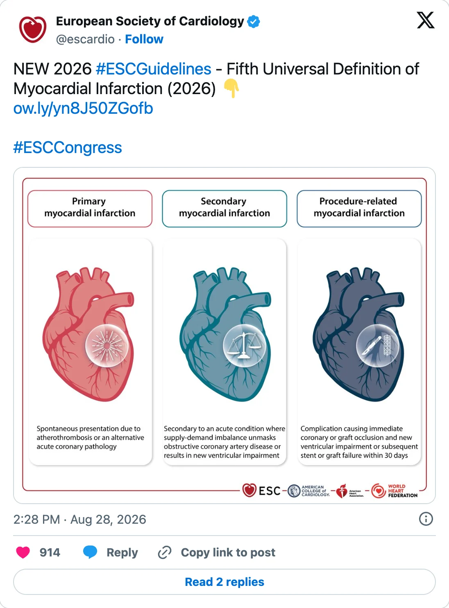
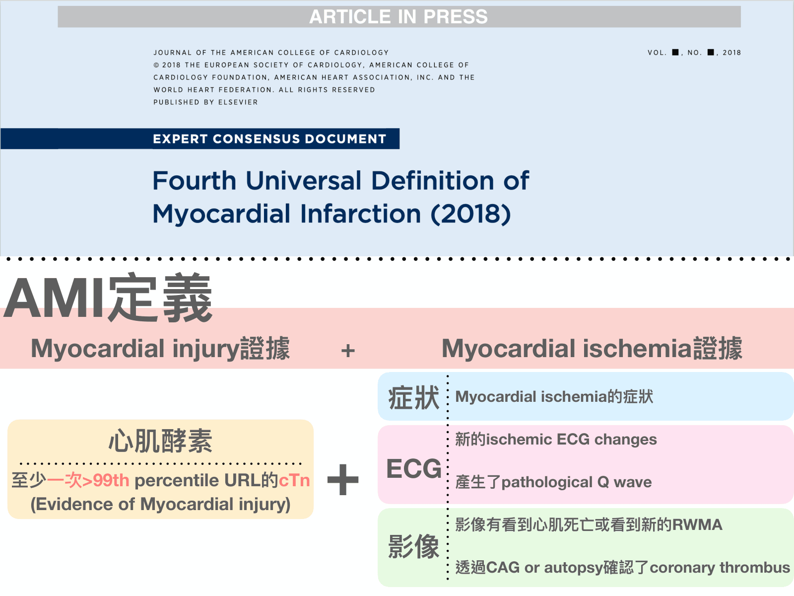
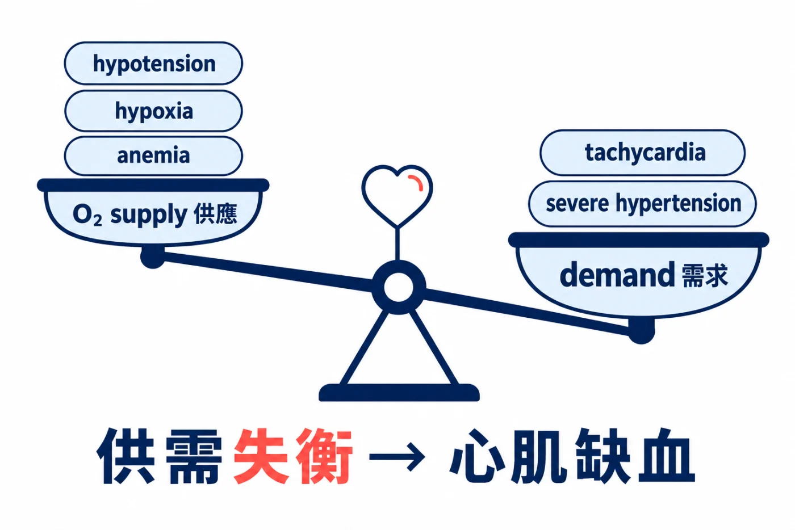
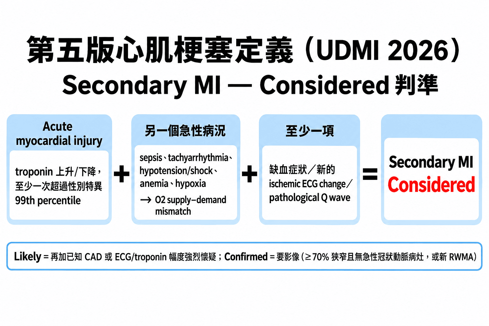
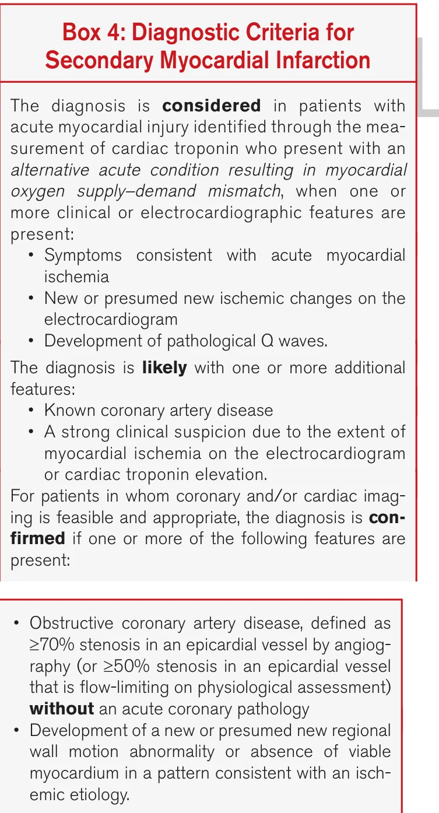
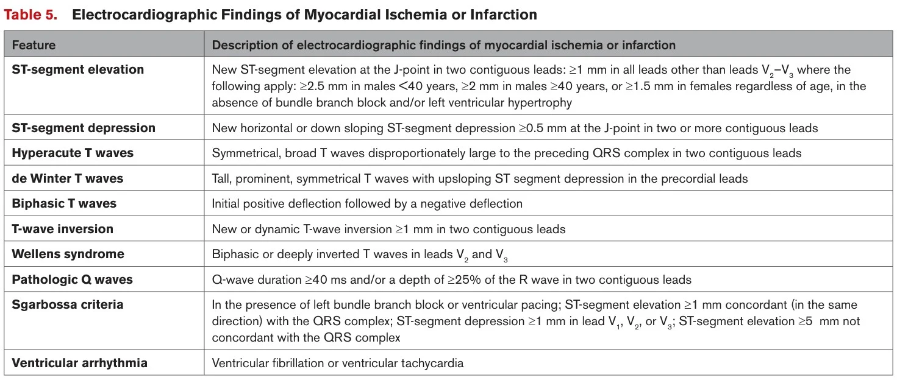
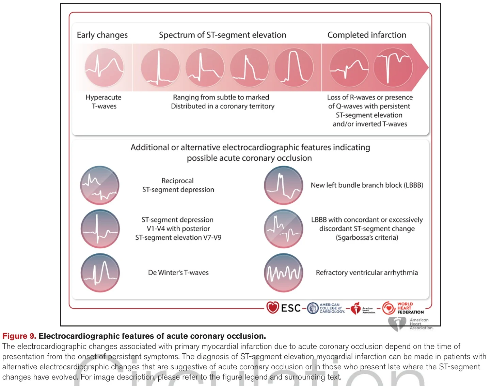
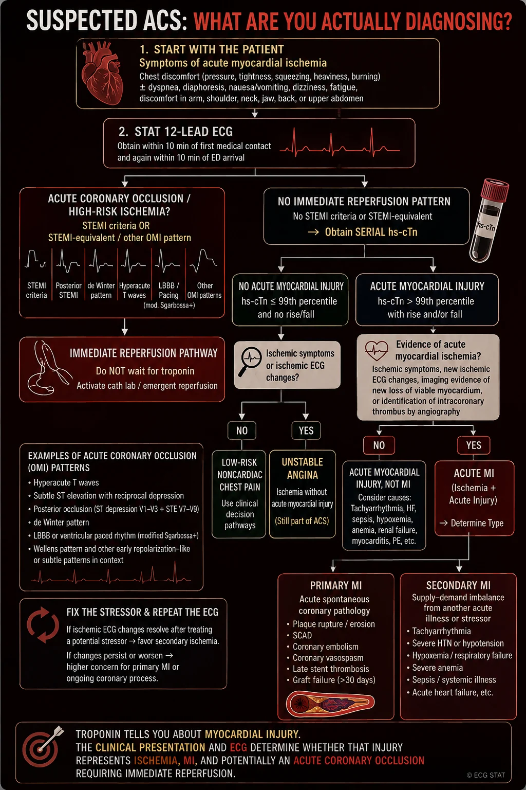
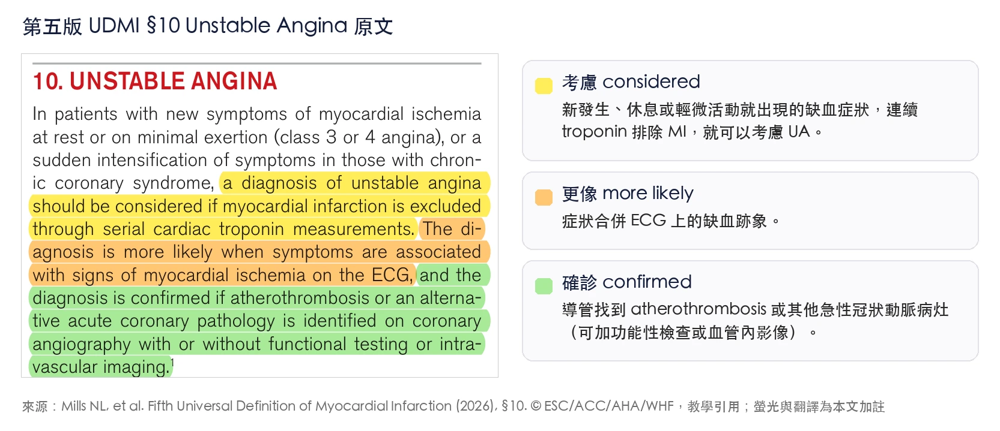



8 月 28 日早上，還沒上班，滑一下 X.com。ESC 官方帳號丟了這則貼文：[^1]

貼文只講一件事：第五版 UDMI 出爐了。附圖那三顆心臟就是新的三分類，後面會講。

然後整個 timeline 就炸了。

「Types 1-5 are gone.」這句話，我在不同人的貼文裡看到至少五次。[^2]

心肌梗塞的定義改版了。這是第五版 Universal Definition of Myocardial Infarction(UDMI)，ESC、ACC、AHA、WHF 四個學會第一次一起掛名寫，同一天登在 European Heart Journal、JACC、Circulation、Global Heart 四本期刊。[^3]

上一版是 2018 年。八年了。Type 1、Type 2、Type 4a、Type 4b、Type 4c、Type 5，這套我從住院醫師時代開始背、當了主治醫師還在背的代號，一夕之間變成歷史名詞。[^4]

這篇不是要把 50 頁的原文翻譯一遍（劉宜學醫師已經寫了五篇，寫得非常完整，文末附連結）。我想做的事情比較偷懶：把這幾天 X 上面大家在講的、在吵的東西整理起來，再加一點 ED man 的觀點。[^5]

先問自己幾個問題：


- **Q1**：Type 2 MI 真的消失了嗎？還是只是換個名字叫 secondary MI？
- **Q2**：急診最常見的那種，sepsis+troponin 紅字，現在要叫什麼？
- **Q3**：OMI 有沒有進到新定義裡？為什麼 Smith 大師在 X 上開砲？
- **Q4**：對 ED man 來說，明天上班要改什麼？


## 第一波：大家都在慶祝 Type 1~5 掰了

新定義不再叫你背數字了。它問的是一個急診醫師本來就會問的問題：這個 MI 是怎麼發生的？然後照答案分成三種。

翻成白話文就是：

- **Primary MI**：自己發生的。冠狀動脈本身出事，plaque rupture 血栓、SCAD、栓塞、vasospasm，全部算。
- **Secondary MI**：被別的急性病拖下水的。Supply-demand imbalance，而且一定要有另一個急性病況當觸發。
- **Procedure-related MI**：做完心臟手術或介入，30 天內出的併發症。[^6]

舊代號怎麼對到新分類，我整理成一張表：[^7]

| 第四版（2018） | 第五版（2026） | 改了什麼 |
|---|---|---|
| Type 1 | Primary MI | 範圍變寬。舊版只有 atherothrombosis，新版把<mark>SCAD、栓塞、vasospasm</mark>（第四版歸 Type 2）和<mark>術後>30 天的 stent thrombosis、restenosis、graft failure</mark>（第四版 stent thrombosis 是 Type 4b、restenosis 是 Type 4c，術後任何時間都算；graft failure 只有 Type 5 管 CABG 後 48 小時內，之後的沒有明確歸類）全部收進來。理由是>30 天的支架/橋血管失效算 de novo disease，不是手術併發症 |
| Type 2 | Secondary MI | 範圍變窄、門檻變高。必須由另一個急性病況觸發；SCAD/栓塞/vasospasm 搬去 primary |
| Type 3 | 刪除 | 猝死若 MI 是可能死因，依情境或解剖歸入三類之一 |
| Type 4a/4b/4c/Type 5 | Procedure-related MI | 48 小時變 30 天；PCI 和 CABG 用同一套準則；不再靠 troponin 倍數確診 |

X 上讚數最高的解說文，是 @AnasNomanMD 的九點摘要。他開頭那句話很多人有共鳴：「Thankfully, no more type 1, 2, 4a, 4b, 5 MI. Simpler and more clinically relevant.」[^8]

他的九點：

- Primary MI 變寬
- Secondary MI 變嚴，要有 obstructive CAD 或新的 RWMA
- Procedure-related MI 改成 30 天，troponin 只當佐證
- Type 3 消失
- Troponin cutoff 分男女
- MINOCA 改成 injury
- Silent MI 要影像確認
- 不說 typical/atypical，改說 chest discomfort
- TAVR 後單獨 troponin 升高不算 MI

有趣的是，全部貼文裡讚數第二高的不是英文圈，是日本一位集中治療醫師 @okame_icu。日本的急診 ICU 圈對這件事的反應比我想像中熱很多，後面會再提到。[^9]

好~~慶祝完了。但是......也就是這個但是。

## 回答 Q1：Secondary MI 不是 Type 2 MI 換個名字

慶祝的貼文一堆，但真正把我拉住的是希臘心臟科醫師 Aris Sikolas 的一串討論串，開頭就寫：「Secondary MI ≠ simply the new name for Type 2 MI.」[^10]

他先澄清一件很多人搞錯的事：**Type 2 MI 在第四版本來就要求有缺血證據。** 所以「要有 ischemia」不是新東西。[^11]

這張是我以前上課用的圖，第四版的 AMI 定義：troponin 至少一次超過 99th percentile（心肌損傷的證據），再加上缺血的證據，症狀、ECG、影像至少一項。Type 2 MI 套的是同一組準則，差別只在機轉是 supply-demand mismatch 而不是 plaque rupture。所以 Sikolas 講的沒錯，「要有 ischemia 證據」第四版就有了，第五版真正加上去的是後面那三層門檻：considered、likely、confirmed，一層比一層嚴，最上面那層 confirmed 要影像證據（≥70% 狹窄且沒有急性病灶，或新的 RWMA）才算數。

那新的到底是什麼？

### 範圍變窄

一個是範圍變窄。SCAD、冠狀動脈栓塞、vasospasm 這三個舊版塞在 Type 2 的東西，全部搬去 primary。Secondary MI 只留給「另一個急性病況造成的 supply-demand mismatch」。

原文的解釋是：心肌的氧氣供需失衡，可以是需求變多（tachycardia、severe hypertension），也可以是供應變少（hypotension、hypoxia、anemia），所以很多急性病都能引起，最常見的是 tachyarrhythmia。缺血會有多嚴重，要看誘因拖多久、多厲害，還有病人底下有沒有 obstructive CAD 或結構性心臟病，而且常常兩三個誘因一起來。翻成白話文：先有一個急性病，它把心臟的氧氣供需打壞，心肌才缺血，這才叫 secondary。[^12]

### 確診門檻變高，分三層

另一個是 secondary MI 的確診門檻變高，而且分三層：

- **Considered**:acute myocardial injury + 另一個急性病況 + 至少一項（缺血症狀、新的 ischemic ECG change、pathological Q wave）。
- **Likely**：再加上已知 CAD，或是 ECG 缺血範圍、troponin 幅度大到讓你強烈懷疑。
- **Confirmed**：要影像。冠狀動脈 ≥70% 狹窄（或 ≥50% 但生理學檢查證實限流）且沒有急性冠狀動脈病灶；或是新的 RWMA/失去存活心肌，分布符合缺血。[^13]

<mark>**沒做到影像，secondary MI 就只能停在 considered 或 likely，不能 confirmed。**</mark>

這一條對急診的意義很大。留到 Q2 講。

原文自己也講得很白：各種觸發因子（tachycardia、hypotension、anemia、hypoxia）不可能定出一個通用的閾值，因為常常兩三個一起來、又要看有沒有底下的 CAD。[^14]

熊評論：**第五版對 secondary MI 的態度，翻成白話文就是寧可少抓，也不要亂貼標籤。** 原文 Table 1 的 rationale 欄直接寫「prioritize specificity」，目的是把真正有治療意義的病人挑出來，不要讓「troponin 紅字+有急性病」就自動變成 MI 診斷。[^15]

Table 1 的 rationale 欄把兩邊的取向寫得很白。Primary MI 是 prioritizes sensitivity：寧可多抓，不能漏掉任何一個急性冠狀動脈病灶，因為漏掉的代價是一條血管、一塊心肌；所以 injury 加上症狀、ECG、Q 波任一項就先算 likely，導管和影像是拿來確認機轉、給 ICD 第六碼用的。Secondary MI 是 prioritizes specificity：寧可少抓，不要把每一個 sepsis 加 troponin 紅字都貼上 MI，因為貼了對治療多半沒有意義，病人卻多一個心臟病的標籤；所以要客觀證據，obstructive CAD 或新的 RWMA，做不到就停在 considered／likely。同一份文件、兩個方向相反的取向，原因是兩種 MI 抓錯的代價不同：primary 怕漏，secondary 怕濫。

，© ESC/ACC/AHA/WHF，教學引用")

## 回答 Q2：Sepsis+troponin 紅字，現在叫什麼？

這題 X 上吵得最有畫面。

日本一位心臟科兼急重症的醫師 @RYO_cardeccmepi 在 ESC 現場直接寫：「Sepsis、shock、anemia、hypoxia＋troponin↑＝自動的に『Type 2 MI』でない」。翻成白話文就是：**敗血症、休克、貧血、缺氧加 troponin 上升，不再自動等於 Type 2 MI。** 為什麼會這樣講？因為原文把理由講得很白：在 sepsis、shock 這種急性病的情境下，缺血症狀不好問（病人不會說胸悶，只會喘）、ECG 的變化常常是瀰漫性的、troponin 也分不出是缺血還是非缺血的傷害，所以光靠症狀、ECG、troponin 沒辦法可靠地診斷 MI，要靠影像去證實或排除。原文甚至直接說，這種病人大多數做完影像既沒有 obstructive CAD、也沒有新的心肌壞死，secondary MI 就可以排除。[^16]

### 叫 acute myocardial injury

那要叫什麼？叫**acute myocardial injury**。

Troponin rise and/or fall，至少一個值超過 99th percentile，這叫 acute myocardial injury。**要升級成 MI，要有缺血的證據，還要能排除非缺血原因。**[^17]

### 急診每天的日常

美國介入心臟科醫師 @DrJayMohan 貼了一則「Good bye Type 2 MI!!!!」，說希望以後病人不會再一直跑來說自己心臟病發過。[^18]

底下馬上有人潑冷水。@tlevin 說：「對我幫助不大，我寧可只有 Type 1 和 Type 2。安養院的老人家 urosepsis、sinus tach、troponin 1500，沒有 obstructive CAD 也沒有 wall motion abnormality，新分類要叫什麼？」

照第五版的答案：兩個都不是。她的 troponin 1500 是 acute myocardial injury。要往 secondary MI 走，得先有缺血症狀或 ECG 變化才算 considered；而她已經證實沒有 obstructive CAD、也沒有新的 wall motion abnormality，原文直接說這種情況 secondary MI 可以排除。Sepsis 本身會誘發 atherothrombosis，所以 primary MI 也要想一下，但沒有病灶，也排除了。所以病歷上就是**acute myocardial injury，urosepsis 加 sinus tachycardia 造成的**，不是 MI。第五版要的就是這個：不要再硬擠一個 MI 給她。[^19]

另一位 @minhaskh 補刀：「病人還是會說他住院時心臟病發了三次，ECG 正常、echo 正常、從來沒做過導管。問題在 high sensitivity troponin。」[^20]

這兩位講的就是急診每天的日常。

我自己讀完原文的理解是這樣：那位安養院阿嬤，新定義會讓她停在「acute myocardial injury，secondary MI considered」。要往上走到 likely，再多一項就夠：她有已知 CAD，或是 ECG 缺血範圍、troponin 幅度大到讓你強烈懷疑，兩者有一個就算（原文寫的是 one or more additional features）；要 confirmed，要做影像。急診做不到的，就誠實停在那裡。

原文甚至說，共病多、衰弱、預期壽命有限的病人，影像有時候就是不適合做，那就靠臨床判斷。[^21]

<mark>**Troponin 紅字告訴你的是心肌受傷了，不是心肌梗塞了。剩下的是你的功課。**</mark>

這句話請跟著唸一遍。第五版整份文件其實就在講這件事。

熊評論：這下總算不用硬擠一個 Type 2 MI 的診斷給 sepsis 病人了。可是......可是「acute myocardial injury」這五個字，在健保申報、在出院診斷、在跟家屬解釋的時候，還沒有一個大家習慣的位置。ICD-11 有給碼，台灣的 ICD-10-CM 怎麼接，我還不知道。這一段我猜會亂一陣子😅[^22]

## 回答 Q3：OMI 進了新定義，但是名字沒進

這一段是我最想寫的。

### 讓我開心的部分

先講讓我開心的部分。第五版的 ECG 章節，第一次把「沒有 STE 但其實是 acute coronary occlusion」的那些 pattern 一個一個點名列出來：posterior MI(V1-V3 STD)、de Winter、Wellens、Aslanger pattern、South African flag sign、新出現的 LBBB/RBBB 合併缺血跡象、Sgarbossa 和 modified Sgarbossa(ST/S ≤0.25)、hyperacute T wave、VT/VF。[^23]

而且原文明講：**多達四分之一被當 NSTEMI 處理的病人，culprit artery 其實是完全塞住的。**[^24]

引用的文獻是誰？McLaren、de Alencar、Aslanger、Meyers、Smith，2024 年 JACC Advances 那篇「From ST-Segment Elevation MI to Occlusion MI」。就是 OMI paradigm 那群人。[^25]

第四版其實也有描述這些型態，只是沒有點名。它引了 de Winter 2008 那篇，寫的是「upsloping ST-segment depression with tall symmetric T waves associated with LAD occlusion」這種描述句。第五版是直接叫名字，還畫進 Figure 9。[^26]

對 ED man 來說，這代表以後半夜 Call CV man，手上多了一份四大學會掛名的官方文件可以拿出來。

### STEMI/NSTEMI 這兩個名字，保留

**STEMI/NSTEMI 這兩個名字，保留。**[^27]

Dr. Smith 本人去了 ESC 現場。8 月 30 日下午那場「Ask the Task Force」，三位主席先講 5 分鐘 key messages，接著 55 分鐘的 panel discussion，Q&A 就在這裡。[^28]

先老實講：那場錄影放在 ESC 365，要登入才看得到，我還沒看到原始畫面。X 上也沒有其他人把這段 Q&A 逐字貼出來（我把 8 月 25 日到 9 月 3 日 Smith 的貼文全部撈過一遍，也搜了現場其他人的貼文）。所以下面這段，是 Smith 自己的轉述。[^29]

8 月 31 日他在 X 上寫了這段：

> 「They told us in the Q&A that they could not replace STEMI/NSTEMI with OMI/NOMI because ICD-11 does not recognize OMI. So I said that the 6th universal definition will not recognize it because ICD does not, then ICD-12 will not because 6th definition does not.」[^30]

翻成白話文：委員會說，ICD-11 沒有 OMI 這個碼，所以不能用 OMI/NOMI 取代 STEMI/NSTEMI。Smith 回：那就永遠改不了，定義等 ICD，ICD 等定義。

這就是一個死循環。

Josh Farkas（PulmCrit）在底下接了一句：「Everyone is blaming someone else for not modernizing the guidelines. There are simple work-arounds for this (rename the disease in clinical practice but continue to use old ICD-11 codes). So it seems like a poor excuse.」[^31]

翻成白話文：大家都在怪別人不更新指引。其實有簡單的解法，臨床上先把病改名，編碼繼續用舊的 ICD-11 碼就好。拿 ICD 當理由，是個爛藉口。

底下有人問了一個很多 CV man 心裡也在想的問題。@BryanTanMD：「真心想知道，叫 STEMI 還是叫 OMI 有什麼差？ECG 上看到 STEMI 我們就認得，看到 STEMI 就知道要進導管室，看到 STEMI 就知道血管塞住了。改叫 OMI 又不會改變處置和結果。」[^32]

另一位 @smsaadatagah 先替 Smith 回了：「問題在於有很多冠狀動脈塞住但沒有 STE 的 ECG pattern，如果我們繼續叫它 STEMI，這些病人就不會被抓到、不會啟動導管室。」[^33]

然後 Smith 自己補了一刀：「STE 這個名字讓人以為 ST 上升就是全部。醫學上有哪個疾病是用診斷它的檢查來命名的？沒有。難道有『低白血球闌尾炎』嗎？白血球低就可以等明天再開？病人死了，反正指引有照做。」[^34]

一位巴西的醫師把這件事拉高一層來看：「一個學會在寫心肌梗塞的通用定義，卻因為 ICD 還沒收錄這個詞就不敢採用重要的改變。那到底是分類系統該限制疾病定義，還是疾病定義該由最好的證據來決定？」[^35]

也有人看得比較開：「那就繼續用 OMI/NOMI，用到它普及到他們躲不掉為止。定義和編碼總有一天要追上來，算是最有用的框架的達爾文式存活。」[^36]

說真的，我看到這串的時候有點感慨。OMI 這個概念 Smith 和 Meyers 他們喊了這麼多年，內容進了官方文件，名字還在門外。

### Farkas 更硬的批評

Farkas 另外還有一則更硬的批評，全部貼文裡排第四高。他批的是原文裡「regional ST-segment depression due to supply-demand imbalance」這個概念。[^37]

他的論點很簡單：**subendocardial ischemia 不會局部化。** ECG 上的缺血只有兩種樣子：一種是 subendocardial ischemia，STD 是瀰漫性的；另一種是 transmural ischemia，會有 regional STE，而 STD 是 reciprocal change。[^38]

所以「supply-demand mismatch 造成 regional STD」這種說法很危險，因為它常常被拿來解釋掉 posterior OMI 在前胸導程的 STD。病人就這樣被放掉了。[^39]

這一條我完全同意。**V1-V4 的 STD，反射動作就是 posterior MI 直到證明不是。** 這是 Amal Mattu 老生常談的東西了。而且沒有 STE 的 OMI，最救命的還是 Ken Grauer 那種一張 ECG 從 Rate、Rhythm、Axis、Interval 一路讀到 Ischemia、一個 lead 都不放過的習慣。工具再新，這個不會變。

熊評論：**內容進了，名字沒進。** 你半夜看到 de Winter，還是要跟 CV man 喇嘴皮子解釋這張為什麼要進導管室。差別只在於，現在你多了一句台詞：「第五版 UDMI 的 Figure 9 有列這個 pattern」。

### 那 Amal Mattu 呢？

那 Amal Mattu 呢？我特地去查了。他沒去 ESC，8 月 20 日到 9 月 3 日 X 上只發了兩則（週五大夜班白板教學、十一月 ECG 課程宣傳），ESC 那四天完全沒發文，也沒有人 tag 他談這件事。ECG Weekly 的 X 帳號同期發了十幾則教學，一則都沒提 UDMI。[^40]

他的 ECG Weekly 網站在 8 月 28 日，文件上線的同一天，就把「Acute Coronary Syndromes」那頁參考教材整個改成對齊第五版，還掛了一個新標籤「5th Universal Definition of MI」。[^41]

裡面幾句話講得比原文還白：「Trigger + elevated troponin ≠ secondary MI.」「A dynamic troponin is not synonymous with MI.」對於 STEMI/NSTEMI 保留這件事，它的態度跟 Smith 完全不同，寫的是「remains clinically important for management and coding」，然後把四套講法並排列出來，提醒不要混用：ACS 是臨床症候群的名字（unstable angina 加上急性 MI，由急性冠狀動脈病灶引起）；STEMI/NSTEMI 是用 ECG 分的，處置和編碼還是靠它；primary/secondary/procedure-related 是第五版用機轉和情境分的；acute coronary occlusion 講的是血管有沒有真的塞住，有沒有 STE 都可能。四個是四條不同的軸，所以說「These classifications should not be used interchangeably」。[^42]

要說清楚：ECG STAT 那頁沒有署名，是平台的參考庫，不能寫成「Mattu 說」。但這個對比我覺得很有意思。Smith 在慕尼黑現場開砲、Farkas 在 X 上罵，大師阿嬤一句話都沒說，他的平台一天之內把整套教材換好，連 STEMI/NSTEMI 保留都寫成「管理與編碼上仍然重要」。一個吵，一個直接用。[^43]

順便把 ECG STAT 那頁的 ACS 流程圖貼過來：

這張 ECG STAT 的流程圖畫得非常好，第五版 UDMI 的概念全部收進去了，而且把整套邏輯排成一條線：先看症狀，10 分鐘內 ECG；有 STEMI criteria 或 STEMI-equivalent、OMI pattern 就直接走再灌流，不等 troponin。沒有的話抽連續 hs-cTn，先問有沒有 acute myocardial injury，再問有沒有缺血證據，兩個都有才是 acute MI，然後才分 primary 還是 secondary。左下那格「fix the stressor & repeat the ECG」是給 secondary 用的：誘因治好、ECG 變化退掉，偏向 secondary ischemia；退不掉或變糟，回頭懷疑 primary。最底下那句就是全篇主旨：troponin 講的是 injury，臨床表現和 ECG 才決定它是不是缺血、是不是 MI、要不要立刻再灌流。

## 剩下幾件事

好~~又講遠了。剩下幾件事我用比較快的速度講。

### 女性的 troponin 門檻寫進定義了

讚數排第三的貼文是 Martha Gulati 的。**女性的 troponin 門檻寫進定義了。** 第五版明確要求用 sex-specific 99th percentile，因為男女用同一個 cutoff 會系統性低估女性的 myocardial injury。[^44]

要公平講一句：第四版就已經「建議」用 sex-specific threshold 了，只是那時候還註明「對每一種 assay 是不是都有價值，仍有爭議」。第五版是把它從建議變成定義本身。[^45]

**最新一代 hs-cTnT 在大型健康族群，女性的 URL 大約是男性的一半。**[^46]

### MINOCA 改名了，但縮寫沒變

再來這個我看到的時候笑了一下。**MINOCA 改名了，但縮寫沒變。** 從 myocardial infarction with non-obstructive coronary arteries 變成 myocardial **injury** with non-obstructive coronary arteries。

原文有講為什麼：以前叫 infarction 有問題，因為這群病人多數後來查出來是非冠狀動脈的心臟病（myocarditis、Takotsubo、cardiomyopathy），或根本不是心臟的問題（PE），改成 injury 才不會一開始就把「梗塞」兩個字扣在病人頭上。

I 還是 I，只是意思換了 XD 它現在是工作診斷，不是最終診斷。做了 CMR（cardiac magnetic resonance，心臟核磁共振；原文建議發病兩週內做，因為 Takotsubo 和 myocarditis 的變化拖久會消掉，梗塞留下的疤不會），只有 22% 到 27% 最後真的是 MI，其他多半是 myocarditis、Takotsubo、心肌病變、PE。[^47]

### Procedure-related MI 的 troponin 倍數拿掉了

**Procedure-related MI 的 troponin 倍數拿掉了。** 舊版 PCI 後>5 倍、CABG 後>10 倍 URL 的規則沒了。原文給的理由很直接：心臟手術後 97.5% 的病人 troponin 都超過 10 倍 URL。97.5%!!!! 這種閾值等於沒有。[^48]

急診會遇到的是這種：做完 PCI、TAVI、電燒 30 天內回來胸痛的病人，第一個要想的是 procedure-related MI；超過 30 天的 stent thrombosis，算 primary MI。[^49]

### 「典型/非典型胸痛」官方不鼓勵了

**「典型/非典型胸痛」這個講法，官方不鼓勵了。** 改叫 chest discomfort。

原文的邏輯是這樣：胸痛對 MI 的敏感度很高、男女差不多，但不專一；病人形容的是壓迫、緊、被擠，而且症狀嚴不嚴重跟是不是 MI 沒有關係，所以「chest discomfort」比「chest pain」更貼切。有些人痛在上腹、下巴、脖子、手臂、背，有些人根本沒胸痛，只有喘、心悸、噁心、嘔吐。

研究發現被貼上「非典型」標籤的症狀，在來評估 MI 的女性身上更常見，這個標籤會讓診斷延誤。跟男性比，女性 ACS 更常出現肩胛中間痛、噁心嘔吐、喘，比較少胸痛和冒冷汗；沒有胸痛的表現在老人和糖尿病病人更常見。沒胸痛的病人診斷更常被拖到，住院死亡率也更高。所以原文的建議是：女性、老人、糖尿病，要系統性地多問幾個症狀，但大多數人還是會胸痛或胸悶。[^50]

X 上當然有人不買單。有一位寫：「一群業餘醫師委員會投票決定我該說 chest discomfort 不能說 chest pain」，後面接的字我就不翻了 XD[^51]

### Pathological Q wave 回到古典定義

最後一個是我自己讀原文才發現的，X 上幾乎沒人講。**Pathological Q wave 回到古典定義。** 先講白話版：Q wave 是 QRS 一開始往下的那一小段。那個方向的心肌死掉以後不再產生電流，電極看到的是對面心肌的向量，所以出現 Q wave。問題是正常人也會有小小的 septal Q，所以要畫一條線，多寬、多深才算「病理性」。

古典定義只有兩個數字：**寬度 ≥40 ms（一小格），和/或深度 ≥同一導程 R wave 的 25%**，兩個相鄰導程都有。第四版當年改成一套比較細的規則：V2-V3 只要>0.02 秒（或 QS）就算；其他導程要 ≥0.03 秒而且 ≥1 mm 深（或 QS），兩個相鄰導程；另外 V1-V2 的 R wave>0.04 秒、R/S>1、T 波同向的也算。

第五版把這套收起來，回到古典的 40 ms/25%，理由只有一句：古典定義跟 CMR 看到的 transmural infarction 相關性比較高。那套 0.02 秒、0.03 秒我背了八年......還給它了。[^52]

### ACS、STEMI/NSTEMI、UA 還在用嗎？

還在，而且是兩套並存，各管一件事。STEMI/NSTEMI 保留，定位是「看 ECG 決定要不要立刻再灌流」的工作診斷。原文自己講：「While imperfect, this classification is simple and useful to identify those patients likely to benefit from immediate coronary intervention or fibrinolysis.」ICD-11 也各給一個碼。它的極限原文也講了：STEMI/NSTEMI 只告訴你 ST 有沒有上升、現在要不要衝導管，沒告訴你這個 MI 是怎麼來的，是斑塊破裂、SCAD，還是被 sepsis 拖下水。急性期過了以後的決定，二級預防怎麼開、要不要去找 SCAD 那類血管病、要不要先治那個急性病，靠的是機轉，這兩個詞給不了。[^56]

Unstable angina 也保留，還在 ACS 的光譜裡，而且跟 MI 一樣分層：新發生的、休息或輕微活動就出現的缺血症狀，連續 troponin 排除 MI，就可以考慮 UA；ECG 有缺血跡象，更像；導管找到 atherothrombosis 或其他急性冠狀動脈病灶，才算確診。沒做導管不代表不是 UA，只是停在「考慮／很像」。原文順便交代了為什麼 UA 越來越少：hs-cTn 普及以後，以前很多 UA 被重新歸成 MI，剩下真正 troponin 沒升的那群預後比較好。[^57]

所以是三個軸，不互相取代：ACS 是 UA 加急性 MI 的統稱；STEMI/NSTEMI 用 ECG 分，管急性期處置與編碼；primary/secondary/procedure-related 用機轉分，取代 Type 1～5，管最終診斷。前面 ECG STAT 那頁把四套講法並排（ACS、STEMI/NSTEMI、primary/secondary/procedure-related、acute coronary occlusion）、說不能互換，講的就是這件事。

## 回答 Q4：明天上班，ED man 要改什麼？

1. **Troponin 紅字的病人，病歷上先寫 acute myocardial injury。** 要寫 MI，要有缺血證據。
2. Sepsis、shock、貧血、缺氧的病人 troponin 高，不要反射性寫 Type 2 MI。寫 secondary MI 要有觸發的急性病況，加上缺血症狀或 ECG 變化；沒有影像就是 considered/likely，不要寫 confirmed。
3. 看到 V1-V4 STD、de Winter、Wellens、Aslanger、South African flag，這些現在都在官方文件的 Figure 9 裡。Call CV man 的時候可以直接引用。
4. 做完心臟介入或手術 30 天內回來的胸痛，想 procedure-related MI；超過 30 天，當 primary MI 處理。
5. Type 1、Type 2 這些字，在跟 CV man 交班的時候大概還會用一陣子。過渡期兩套都要聽得懂。[^53]

## 事後回顧感想

84 則貼文一則一則點完，最意外的是這個：繁體中文的 X 上，關於這件事的貼文是零則。一則都沒有。[^54]

討論全部在英文和日文圈。日本的急診 ICU 醫師反應很快，8 月 30 日 ESC 還沒散場就有人把現場投影片拍下來貼了。台灣目前唯一完整的整理是劉宜學醫師的五篇部落格。[^55]

另一個感想是關於這份文件本身。它最大的改變在我看來不是三分法，是「troponin 紅字不等於 MI」這件事終於被寫得夠白。Type 2 MI 這個診斷，第四版的定義本來就寬，急診也就這樣用了八年，新定義把門檻抬高，我覺得是對的。代價是我們要學會寫「acute myocardial injury」然後忍住不要往上加字。

至於 OMI......名字沒進去，我跟 Smith 大師一樣有點嘔。但 Figure 9 進去了。八年後的第六版，我們再看。

## 學習重點

1. 第五版 UDMI 把 Type 1~5 改成 primary/secondary/procedure-related 三類，依「MI 怎麼發生的」命名。
2. Secondary MI 不是 Type 2 換名：SCAD/栓塞/vasospasm 搬去 primary；確診要 ≥70% 狹窄（或 ≥50% 且限流）無急性病灶，或新 RWMA。沒影像停在 considered/likely。
3. Troponin rise/fall 超過 sex-specific 99th percentile = acute myocardial injury，不是 MI。要 MI 要有缺血證據。
4. ECG 章節點名了 de Winter、Wellens、Aslanger、South African flag、posterior、Sgarbossa/modified Sgarbossa；引用 OMI 文獻；但 STEMI/NSTEMI 名稱保留，理由是 ICD-11。
5. Procedure-related MI：任何心臟手術/介入 30 天內；不靠 troponin 倍數確診；>30 天的 stent thrombosis 算 primary。
6. MINOCA 的 I 改成 injury，是工作診斷；CMR 做完只有 22-27% 是 MI。
7. Typical/atypical 不鼓勵用；pathological Q wave 回到 ≥40 ms 和/或 ≥25% R wave。
8. ACS、STEMI/NSTEMI、unstable angina 都保留：ACS 是統稱，STEMI/NSTEMI 管急性期再灌流與編碼，primary/secondary/procedure-related 管機轉與最終診斷，三個軸不互換。

## 參考資料

1. Mills NL, Newby LK, Zaman S, et al. Fifth Universal Definition of Myocardial Infarction (2026). Eur Heart J 2026; doi:10.1093/eurheartj/ehag101. 同步刊於 JACC (10.1016/j.jacc.2026.07.025)、Circulation (10.1161/CIR.0000000000001477)、Global Heart (10.5334/gh.1578)。
2. Thygesen K, Alpert JS, Jaffe AS, et al. Fourth Universal Definition of Myocardial Infarction (2018). Circulation 2018; doi:10.1161/CIR.0000000000000617.
3. McLaren J, de Alencar JN, Aslanger EK, Meyers HP, Smith SW. From ST-segment elevation MI to occlusion MI: the new paradigm shift in acute myocardial infarction. JACC Adv 2024;3:101314.
4. 劉宜學. Fifth Universal Definition of Myocardial Infarction (2026) (I)–(V). 心臟科 x 劉宜學醫師, 2026-08-29. https://wecareheart.com/treatment-guidelines/fifth-universal-definition-of-myocardial-infarction-2026-i/
5. Josh Farkas. Diagnosis of myocardial injury vs ischemia. EMCrit IBCC, updated 2026-08-28. https://emcrit.org/ibcc/troponin/
6. ESC 365. 5th Universal Definition of Myocardial Infarction (ESC, ACC, AHA, and WHF): Ask the Task Force. ESC Congress 2026, Munich, 2026-08-30. [ESC 365 session 52817](https://esc365.escardio.org/session/52817) （需登入）
7. X 貼文（依文中出現順序）：@escardio 2026-08-28；@AsherElad 08-28；@AnasNomanMD 08-29；@okame_icu 08-28；@ArisSikolas 08-28、08-29；@RYO_cardeccmepi 08-30；@DrJayMohan 08-31；@tlevin 09-01；@minhaskh 08-31；@smithECGBlog 08-31、09-01；@PulmCrit 08-29、08-31；@BryanTanMD 09-01；@smsaadatagah 09-01；@vitorborin_ 08-31；@AhmedAd76369091 08-31；@amalmattu 08-22、08-24；@DrMarthaGulati 08-30；@MrWBond 08-29。完整連結與讚數見各段出處。
8. ECG Weekly. ECG STAT: Acute Coronary Syndromes (ACS); Occlusion MI: STEMI & Beyond. 2026-08-28（會員內容）. [ECG Weekly ECG STAT: ACS](https://ecgweekly.com/ecgstat/acute-coronary-syndromes/)

## 註釋與出處

每段引述與數字的出處，逐條對回原文與貼文。

[^1]: @escardio 2026-08-28 https://x.com/escardio/status/2093224205798044021 · 讚數為 2026-09-03 當時看到的數值
[^2]: @AsherElad 2026-08-28 https://x.com/AsherElad/status/2093275677474554203 逐字：「Types 1-5 are gone. MI is now primary, secondary or procedure-related」；同義句另見 @gcfmd、@Bernilina、@AkhilGulati、@BartoszHudzik 貼文
[^3]: Mills NL, Newby LK, Zaman S, et al. Fifth Universal Definition of Myocardial Infarction (2026). EHJ DOI 10.1093/eurheartj/ehag101；JACC 10.1016/j.jacc.2026.07.025；Circulation 10.1161/CIR.0000000000001477；Global Heart 10.5334/gh.1578。首頁註記「co-published in European Heart Journal, Journal of the American College of Cardiology, Circulation, and Global Heart」。ESC 新聞稿 2026-08-28、ESC Congress 慕尼黑 2026-08-30 專場
[^4]: Fourth UDMI: Thygesen K, et al. Circulation 2018, DOI 10.1161/CIR.0000000000000617
[^5]: 劉宜學〈Fifth Universal Definition of Myocardial Infarction (2026) (I)–(V)〉wecareheart.com 2026-08-29 https://wecareheart.com/treatment-guidelines/fifth-universal-definition-of-myocardial-infarction-2026-i/
[^6]: Fifth UDMI §4「What Is New」與 Table 1「Comparison of the Fourth and Fifth Universal Definitions of Myocardial Infarction」。逐字：「Myocardial infarction is now classified into one of three clinical types: Primary myocardial infarction: spontaneous presentation due to a primary acute coronary pathology / Secondary myocardial infarction: resulting from myocardial oxygen supply–demand imbalance due to another acute condition / Procedure-related myocardial infarction: occurring as a complication of a percutaneous or surgical cardiac procedure」
[^7]: Fifth UDMI Table 1。逐字（Type 1 列）：「Restricted to atherothrombosis」→「Includes all acute coronary pathologies: atherothrombosis; spontaneous coronary artery dissection; coronary embolism; vasospasm; and restenosis, stent thrombosis, or graft failure >30 days from procedure」；（Type 3 列）「Term removed」；（Type 4/5 列）「Coronary complication within 30 days of a cardiac procedure」。第四版 48 小時：Fourth UDMI「Criteria for PCI-Related MI ≤48 Hours After the Index Procedure (Type 4a MI)」「Criteria for CABG-Related MI ≤48 Hours After the Index Procedure (Type 5 MI)」
[^8]: @AnasNomanMD 2026-08-29 https://x.com/AnasNomanMD/status/2093752960568459643 逐字如上；讚數 205（2026-09-03）
[^9]: @okame_icu 2026-08-28 https://x.com/okame_icu/status/2093319913675071636 讚 268；隔日自我更正「アテローム性動脈硬化症『以外の』→『以外も含む』」https://x.com/okame_icu/status/2093629240382304633。排名依本文整理的 84 則去重貼文讚數
[^10]: @ArisSikolas 2026-08-28 https://x.com/ArisSikolas/status/2093289918873076180 讚 90；討論串共 7 則
[^11]: 同上 2/7 逐字：「Type 2 MI ALREADY required evidence of acute myocardial ischaemia. So requiring ischaemia is NOT new.」；Fourth UDMI「Criteria for Type 2 MI」：rise/fall cTn + supply–demand imbalance + 至少一項（症狀／新缺血 ECG／Q 波／影像）
[^12]: 同上 3/7；Fifth UDMI Table 1 Type 2 列：「Myocardial oxygen supply–demand imbalance due to an alternative acute condition」；Fourth UDMI Type 2 定義原含「coronary spasm and spontaneous coronary dissection may be involved as well (ie, type 2 MI)」
[^13]: Fifth UDMI Box 4「Diagnostic Criteria for Secondary Myocardial Infarction」逐字：「Obstructive coronary artery disease, defined as ≥70% stenosis in an epicardial vessel by angiography (or ≥50% stenosis in an epicardial vessel that is flow-limiting on physiological assessment) without an acute coronary pathology」「Development of a new or presumed new regional wall motion abnormality or absence of viable myocardium in a pattern consistent with an ischemic etiology」；三層 considered／likely／confirmed 同 Box 4 與 @ArisSikolas 5/7–7/7
[^14]: Fifth UDMI §7.2.2 逐字：「Therefore, it is not possible to define thresholds for any of the triggers of supply–demand imbalance that could be reliably applied to all.」「two or more triggers often coexist」
[^15]: Fifth UDMI Table 1 rationale 欄逐字：「Prioritize specificity to differentiate myocardial infarction from acute myocardial injury in conditions resulting in oxygen supply–demand imbalance. Objective diagnostic criteria to allow consistent application in practice and identify patients in whom the diagnosis has treatment implications.」
[^16]: @RYO_cardeccmepi 2026-08-30 https://x.com/RYO_cardeccmepi/status/2094078849692913762 讚 23，逐字如上，附四張現場投影片照片；另有「救急 ICUへの影響はでかそう」
[^17]: Fifth UDMI Box 1 逐字：「Acute myocardial injury is defined as a rise and/or fall in cardiac troponin I or T with at least one value above the sex-specific 99th percentile URL.」；§6.1「When demonstrated to be due to ischemia, acute myocardial injury is the hallmark of myocardial infarction... However, many other cardiac and non-cardiac conditions are commonly associated with acute myocardial injury without myocardial ischemia.」
[^18]: @DrJayMohan 2026-08-31 https://x.com/DrJayMohan/status/2094370016267325458 逐字：「Good bye Type 2 MI!!!! ... hopefully patients will be less confused now and everyone won't come to me thinking they had a heart attack.」讚 99
[^19]: @tlevin 2026-09-01 https://x.com/tlevin/status/2094605446648631296 逐字：「I don't think this helps me very much. Prefer just type 1 and type 2. Not sure what to call the trop of 1500 in older nursing home patient who has urosepsis with sinus tach without obstructive cad or wall motion abnormalities in the new classification.」
[^20]: @minhaskh 2026-08-31 https://x.com/minhaskh/status/2094428547527884952 逐字：「No they will still come and say they had 3 heart attacks while in the hospital with normal EKG, normal echo and no coronary angiography done ever! High sensitivity troponin still is an issue!」
[^21]: Fifth UDMI §7.2.2 逐字：「For patients with comorbidities, advanced frailty, or limited life expectancy due to the underlying acute condition, additional cardiac imaging is sometimes not appropriate. Hence, it may not be possible to definitively confirm the diagnosis of secondary myocardial infarction and clinical judgment is required.」
[^22]: Fifth UDMI Table 4 ICD-11：BA41.0 STEMI／BA41.1 NSTEMI，第六碼 _A secondary（併急性病況碼）；§18。台灣 ICD-10-CM 對應：尚待查證
[^23]: Fifth UDMI §13 逐字：「Further electrocardiographic patterns that suggest acute coronary occlusion include marked ST-segment depression or hyperacute T waves in V1–V2 with reciprocal changes elsewhere, de Winter pattern (upsloping ST-segment depression with tall, symmetric T waves in V2–V5), Wellens syndrome (biphasic or deeply inverted T waves in V2–V3 during pain-free intervals), Aslanger pattern (ST-segment elevation isolated to lead III with ST-segment depression in any of leads V4–V6 with a positive T wave), and the "South African flag" sign (ST-segment elevation in leads I, aVL, and V2 and ST-segment depression in lead III).」modified Sgarbossa「ST/S-wave ratio ≤0.25」；Table 5 含 hyperacute T waves、ventricular arrhythmia (VF or VT)
[^24]: Fifth UDMI §13 逐字：「Previous studies have shown that up to 1 in 4 patients managed as a NSTEMI without classical ST-segment elevation on conventional 12-lead ECG have an acute occlusion of the culprit artery.」（refs 50, 51, 53）
[^25]: Fifth UDMI 參考文獻 51 逐字：「McLaren J, de Alencar JN, Aslanger EK, Meyers HP, Smith SW. From ST-segment elevation MI to occlusion MI: the new paradigm shift in acute myocardial infarction. JACC Adv. 2024;3:101314. doi: 10.1016/j.jacadv.2024.101314」；ref 52 Ricci et al. Ann Emerg Med 2025 OMI ECG patterns
[^26]: Fourth UDMI ECG 章逐字：「tall, prominent, symmetrical T waves in the precordial leads, upsloping ST-segment depression >1 mm at the J-point in the precordial leads... are associated with significant left anterior descending artery (LAD) occlusion」（refs 151–153，含 de Winter 2008 NEJM）；第四版全文 grep 無「Aslanger」「South African」
[^27]: Fifth UDMI §7.1.2 逐字：「While imperfect, this classification is simple and useful to identify those patients likely to benefit from immediate coronary intervention or fibrinolysis.」；ICD-11 BA41.0／BA41.1；Figure 2 註腳將 STEMI 定位為 working diagnosis
[^28]: ESC 365 session 52817「5th Universal Definition of Myocardial Infarction (ESC, ACC, AHA, and WHF): Ask the Task Force」2026-08-30；presentation 320633 key messages 16:15–16:20（Mills／Newby／Zaman）、presentation 320634 panel discussion 16:20–17:15。https://esc365.escardio.org/session/52817
[^29]: ESC 365 session 頁面標示「ESC2026 Premium Access」「Sign in for access options」；檢索 @smithECGBlog 2026-08-25 起的貼文共 12 則，僅 2 則與 UDMI 相關；其他帳號提到 Smith 現場提問的貼文 0 則
[^30]: @smithECGBlog 2026-08-31 https://x.com/smithECGBlog/status/2094510216456937806 逐字如上；讚 49
[^31]: @PulmCrit 2026-08-31 https://x.com/PulmCrit/status/2094542556705030163 逐字如上
[^32]: @BryanTanMD 2026-09-01 https://x.com/BryanTanMD/status/2094638536863449144 逐字：「Genuinely curious to know why does it matter if we call it STEMI or OMI. We can recognize a STEMI on ekg. We know patient needs to go to cath lab when we see a STEMI. We know vessel is occluded when there is a STEMI. Calling OMI doesn't change management or outcomes.」
[^33]: @smsaadatagah 2026-09-01 https://x.com/smsaadatagah/status/2094654125073908065 逐字：「I guess the issue is there are many other ECG patterns with coronary occlusion without STE that we won't capture or activate the cath lab if we continue to call it STEMI」
[^34]: @smithECGBlog 2026-09-01 https://x.com/smithECGBlog/status/2094755321289826526 逐字：「The name "STE" makes people think that STE is all that matters. Is there any other pathology in medicine that is named after a test used to diagnose it? There are none. "Low WBC appendicitis?" If low, you can wait until tomorrow to operate? If pt dies, guidelines were followed!」
[^35]: @vitorborin_ 2026-08-31 https://x.com/vitorborin_/status/2094538802979102721 逐字：「If a scientific society is producing a Universal Definition of myocardial infarction, but feels unable to adopt an important change because the ICD has not yet incorporated the term, it raises an important question: Should classification systems constrain disease definitions, or should disease definitions be driven primarily by the best available evidence?」
[^36]: @AhmedAd76369091 2026-08-31 https://x.com/AhmedAd76369091/status/2094542219617226876 逐字：「I guess we just keep using OMI/NOMI until it becomes so widespread they can't escape it. Eventually the definitions and coding will have to catch up... A bit of Darwinian survival of the most useful framework.」
[^37]: @PulmCrit 2026-08-29 https://x.com/PulmCrit/status/2093708143444283705 讚 116；排名依本文整理的 84 則去重貼文讚數（914／268／261／205／133／116）
[^38]: 同上逐字：「This concept is incorrect and misleading, because subendocardial ischemia DOESN'T localize to any region. There are really just TWO possible patterns of acute myocardial ischemia on an ECG: [#1] Subendocardial ischemia (diffuse STD). [#2] Transmural ischemia (which often causes regional STE and regional ST depression due to reciprocal changes).」
[^39]: 同上逐字：「this is often *incorrectly* invoked to explain regional reciprocal STD. This causes clinicians to *miss* the true diagnosis of transmural infarction (e.g., posterior transmural ischemia causing anterior STD).」
[^40]: 檢索 @amalmattu 2026-08-20 起的貼文僅 2 則：https://x.com/amalmattu/status/2091116015035777411（2026-08-22，讚 70）、https://x.com/amalmattu/status/2091972886001020987（2026-08-24，讚 19）；08-28 之後 0 則；ESC 365 講者搜尋「Mattu」0 筆；@ECGWeekly 同期貼文無 UDMI
[^41]: ECG Weekly ECG STAT「Acute Coronary Syndromes (ACS)」標註 August 28, 2026；tag 頁 https://ecgweekly.com/ecg-tag/5th-universal-definition-of-mi/；副標逐字「Aligned with the Fifth Universal Definition of Myocardial Infarction and the 2025 ACC/AHA/ACEP/NAEMSP/SCAI ACS Guideline」（會員內容）
[^42]: 同上頁逐字：「However: Trigger + elevated troponin ≠ secondary MI.」「Clinical Pearl: A dynamic troponin is not synonymous with MI.」「STEMI vs NSTEMI: ECG-based classification of acute MI that remains clinically important for management and coding.」「These classifications should not be used interchangeably.」；OMI 頁逐字：「The Fifth Universal Definition of MI retains the conventional STEMI/NSTEMI classification but explicitly recognizes that not all acute coronary occlusions produce diagnostic ST elevation」
[^43]: ECG STAT 頁面無作者署名（參考文獻列 Meyers HP, Smith SW. Acute Coronary Syndromes. In: Mattu A and Swadron S, ed. CorePendium）；「大師阿嬤」是我對 Amal Mattu 的暱稱
[^44]: @DrMarthaGulati 2026-08-30 https://x.com/DrMarthaGulati/status/2094173910157681058 讚 261，逐字：「The new 5th Universal Definition of MI explicitly requires sex-specific 99th-percentile troponin thresholds recognizing that using the same cutoff in women and men can systematically underdiagnose myocardial injury in women」
[^45]: Fourth UDMI 逐字：「sex-specific 99th percentile URLs are recommended for hs-cTn assays... However, there is controversy as to whether this approach provides valuable additional information for all hs-cTn assays.」；Fifth UDMI §14.1.1「sex-specific 99th percentile URLs are necessary to define myocardial injury」；Box 1
[^46]: Fifth UDMI §14.1.1 逐字：「the URL in females is half the URL in males for cardiac troponin T in a large and representative global healthy reference population」（ref 165）；ref 165 = Daniels LB, Mueller C, Giannitsis E, et al; TSIX Investigators. Establishing reference values in healthy participants for the cardiac troponin T high-sensitivity Gen 6 Assay: REF-TSIX global reference study. Clin Chem 2026;72:488–502. doi:10.1093/clinchem/hvag011
[^47]: Fifth UDMI §11 逐字：「The definition of MINOCA is updated to "myocardial injury with non-obstructive coronary arteries."」「When CMR has been performed, myocardial infarction is the final diagnosis in 22%–27% of patients」；non-obstructive = 「no stenosis ≥50%」
[^48]: Fifth UDMI §7.2 逐字：「97.5% of patients undergoing cardiac surgery had cardiac troponin levels more than 10 times the URL of the assay, and that thresholds more than 218 times the URL (95% confidence interval 40 to 318) were required to identify those at increased risk of peri-procedural mortality」；Fourth UDMI Type 4a「>5 times the 99th percentile URL」、Type 5「>10 times the 99th percentile URL」；X 上 @AsherElad https://x.com/AsherElad/status/2093275680511250502、@ArisSikolas https://x.com/ArisSikolas/status/2093728985628729825 討論串同此
[^49]: Fifth UDMI §7.2.3 逐字：「When an acute coronary event related to a prior cardiac procedure occurs beyond 30 days, the diagnosis of primary myocardial infarction should be considered.」；心臟手術定義含 structural intervention、catheter ablation
[^50]: Fifth UDMI §12 逐字：「Use of the terms "typical" and "atypical" are discouraged as studies have found that symptoms labelled as atypical are more common among women evaluated for myocardial infarction and may contribute to delayed diagnoses.」
[^51]: @MrWBond 2026-08-29 https://x.com/MrWBond/status/2093835224081658339 逐字：「Committees of hobbyist doctors voting that I should say chest discomfort instead of chest pain is a small part of what is wrong — not just with Medicine — but the modern world. Idiotic.」
[^52]: Fifth UDMI §13 逐字：「The classical definition of a pathological Q wave requires a Q-wave duration ≥40 ms and/or a depth of ≥25% of the R wave in the same lead. While an alternative pathological Q wave definition was suggested in prior versions of the UDMI, the classical definition has a higher correlation with transmural myocardial infarction in CMR imaging studies.」；Fourth UDMI Table 3
[^53]: 第 5 點為個人觀點；Life Support Institute 部落格亦建議過渡期「dual fluency」https://lifesupportinstitute.com.au/blog/fifth-universal-definition-myocardial-infarction
[^54]: 84 則為 2026-08-28 至 09-02 間以多組關鍵字在 X 搜尋、逐則核對存在與讚數後去重的貼文數；另以繁中、簡中、韓文關鍵字各查一組，皆為零則
[^55]: @EPCHCardiology、@RYO_cardeccmepi 現場照片貼文 2026-08-30；劉宜學 wecareheart.com 2026-08-29
[^56]: Fifth UDMI §7.1.2 逐字：「The most widely adopted classification in practice stratifies myocardial infarction into two groups based on the presenting ECG, according to the presence or absence of ST-segment elevation… The recently released ICD-11 reflects the widespread use of this classification by introducing distinct codes for ST-segment elevation myocardial infarction (STEMI) (BA41.0) and non-ST-segment elevation myocardial infarction (NSTEMI) (BA41.1)… While imperfect, this classification is simple and useful to identify those patients likely to benefit from immediate coronary intervention or fibrinolysis. The terms in isolation offer limited insight into the underlying pathophysiological mechanism of myocardial infarction, however, and are therefore less useful at guiding management beyond the acute presentation.」
[^57]: Fifth UDMI §10 逐字：「a diagnosis of unstable angina should be considered if myocardial infarction is excluded through serial cardiac troponin measurements. The diagnosis is more likely when symptoms are associated with signs of myocardial ischemia on the ECG, and the diagnosis is confirmed if atherothrombosis or an alternative acute coronary pathology is identified on coronary angiography」「acute coronary syndrome (ACS) is still commonly used as an umbrella term to describe these diagnoses」「a significant proportion of patients previously diagnosed with unstable angina would be reclassified as having myocardial infarction due to the lower sensitivity of the then utilized biomarker assays. Those with unstable angina without an elevation in cardiac troponin had a more favourable prognosis」
