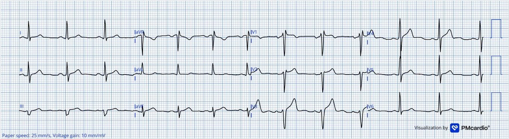
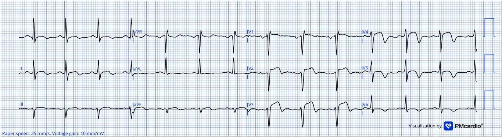
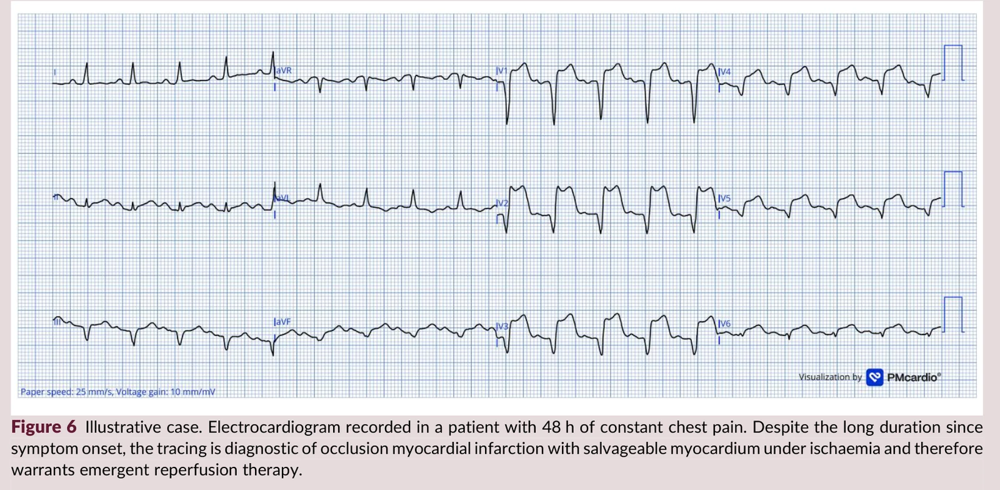
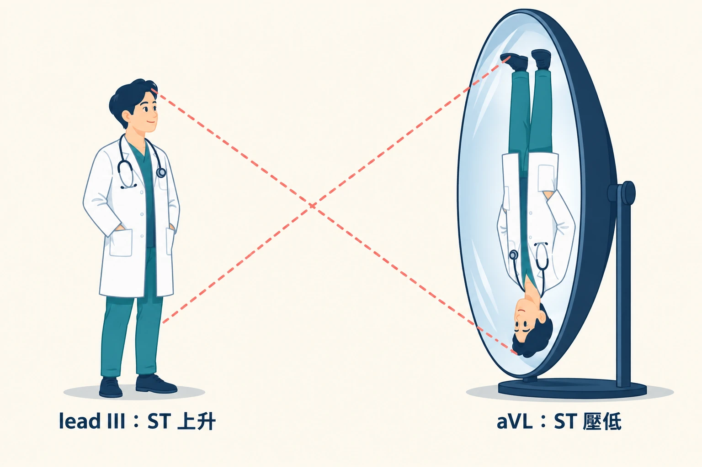
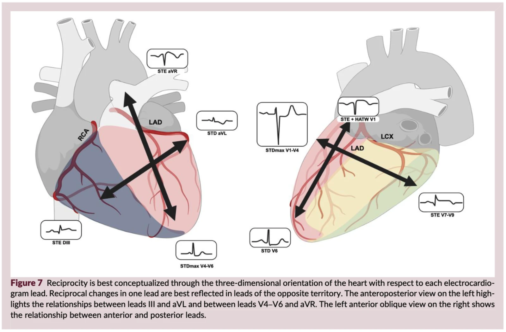
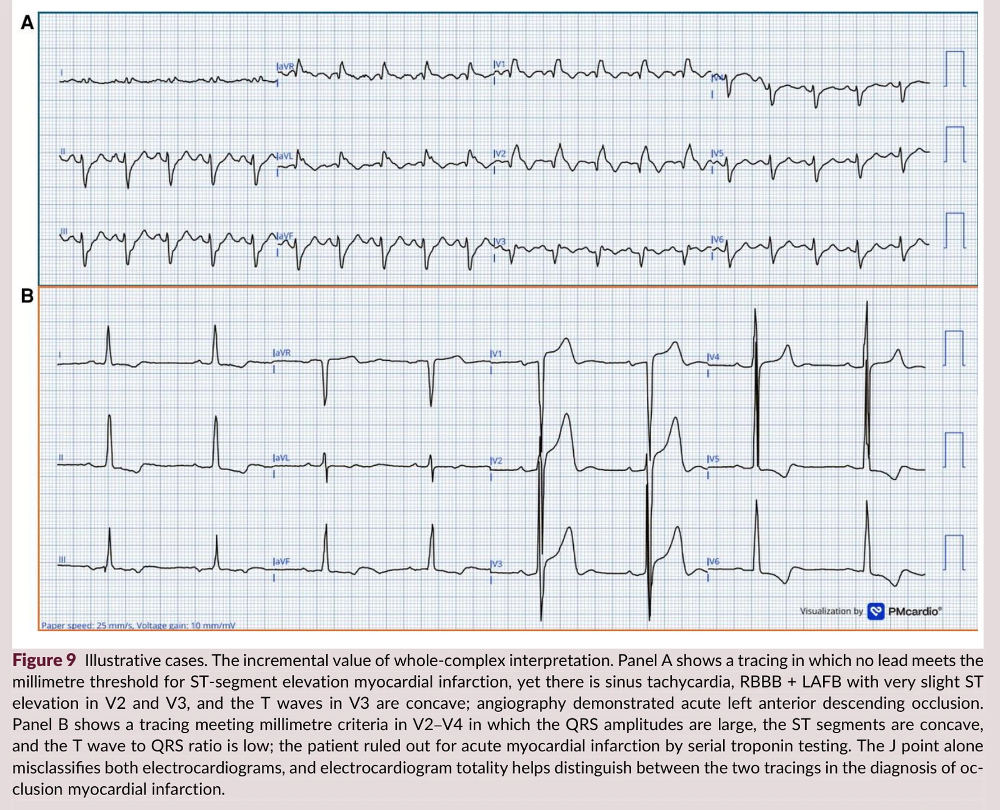



This post is built on Helseth HC, Mansur P, El-Baba M, McLaren JTT, de Alencar JN, Smith SW. *<mark style="background-color: lightgreen">Electrocardiographic principles for the diagnosis of occlusion myocardial infarction</mark>.* Eur Heart J Acute Cardiovasc Care. 2026. DOI: 10.1093/ehjacc/zuag114.[^1]

This month I read a paper that I think every ED man should read.

You'll recognize the authors right away: **Stephen Smith, Jesse McLaren, José Nunes de Alencar**. The original OMI crew.

This time they didn't publish yet another new ECG sign. They stepped back a level and wrote down **how they actually think, step by step, when they look at an ECG that might be ischemic**.

Six principles. Dynamicity, acuteness, reciprocity, proportionality, totality, surrogacy.

First, the case they use to thread the whole paper together.

## A 40-year-old man, and the ECG 16 minutes later

**40-year-old man, chest pain.** First ECG: the T waves in the inferior and anterior leads are on the large side, but **the S wave in V3 was so deep it didn't fit on the original ECG paper and got clipped**, so you have no real way to judge whether that T wave is proportionate to the QRS.

The Queen of Hearts AI model's read: **OMI not detected**.

16 minutes later, another one (Fig. 2): the T waves are now clearly, disproportionately huge, with **terminal T-wave inversion**. This time the AI's read: **OMI**.

And then?

**This patient already had a true coronary occlusion at the time of the first ECG.**

So the point of this case is not "the second one is more obvious."

**The patient was already occluded at the time of the first ECG. <u>What changed in those 16 minutes was the ECG, not the artery</u>.**

What this paper does is write down "the six things that should be running through your head during those 16 minutes."

## Why do we need six principles? The STEMI millimeter criteria miss more than half of occlusions

Let me start with something I don't think many people have ever thought about: **where did those STEMI millimeter thresholds come from?**

Those millimeter criteria were first written into the **first** universal definition of myocardial infarction (the 2000 ESC/ACC consensus "Myocardial infarction redefined"), with thresholds of **≥0.1 mV in the limb leads and V4–V6, ≥0.2 mV in V1–V3, in at least two contiguous leads**. In February of the same year, Menown et al. published the evidence behind those numbers: they enrolled 1190 people (1041 chest pain patients, 335 of them with confirmed AMI, plus 149 controls without chest pain), compared how various definitions of ST elevation performed, and the "best model" they settled on was **≥1 mm in any inferior/lateral lead, or ≥2 mm in any anteroseptal lead**. And the sensitivity of that "best model" was **55.8%**, with specificity 94.0%.[^2a]

Later, in 2004, Macfarlane et al. modified those ACC/ESC thresholds to be stratified **by age and sex**. The fourth edition (2018) and the current fifth edition (2026) both use these stratified thresholds, not Menown's original numbers.[^2]

The stratification made it into the guidelines in two steps: in 2007 the second UDMI split by sex first (V2–V3 ≥0.2 mV in men, ≥0.15 mV in women); in 2009 the AHA/ACCF/HRS recommendations for standardizing ECG interpretation added age (V2–V3 ≥0.2 mV in men 40 and older, ≥0.25 mV in men under 40, ≥0.15 mV in women), and Macfarlane himself was one of the authors of those recommendations; in 2012 the third UDMI adopted the same set of numbers.[^udmisteps]

Remember my recent post on the 5th UDMI? Here's the link: 👉 [Goodbye, Type 1~5 MI? The Fifth Universal Definition of MI, and what everyone on X.com is fighting about](https://agoodbear.com/post/ecg-post-18/)

:275-283. PMID: 10653675; Macfarlane PW, et al. J Electrocardiol. 2004;37 Suppl:98-103. PMID: 15534817; Helseth HC, et al. Eur Heart J Acute Cardiovasc Care. 2026. DOI: 10.1093/ehjacc/zuag114")

The paper puts it bluntly: **none of these thresholds were derived using angiographically proven occlusion as the Gold Standard**, and **they don't take the amplitude of the ST-T relative to the amplitude of the QRS (that is, proportionality) into account at all**.

The consequence?

The 2024 meta-analysis by de Alencar et al. (3 studies, 23,704 people) gives you a number:[^3]

<mark>**Applying STEMI criteria to a single ECG, the pooled sensitivity for acute coronary occlusion (ACO) is only 43.6% (95% CI 34.7–52.9%).**</mark>

Specificity, on the other hand, looks great: 96.5%.

**In plain words: if you're not occluded, these millimeter criteria will almost never call you occluded; but if you really are occluded, they miss more than half of you.**

### How do these six relate to the 20 findings I'm writing about?

I've been writing an OMI ECG findings series, six posts, covering **20 specific findings**: NTTV1, HATW, inverted U wave, Subtle STE, STDmaxV1-4, Precordial Swirl, de Winter, Aslanger...

Those are the **moves**.

**These six principles explain why those 20 moves exist in the first place. They're the underlying method.**

And what I said in the intro to that series still holds: **as long as using STEMI criteria to diagnose MI stays this insensitive, more and more ECG patterns will keep getting published saying "this can be MI too."** The moves will keep multiplying; the method is just these six.

## First, ask yourself a few questions:


- **Q1**: The first ECG is indeterminate. How long do I actually wait before the next one?
- **Q2**: The patient says the pain has been going on for 48 hours. Is there still myocardium to save?
- **Q3**: I know to look at aVL for inferior STE. So where are the reciprocal pairs for anterior and posterior?
- **Q4**: Same 1 mm of STE. Why does it count in some people and not others?
- **Q5**: If the J point doesn't give it away, what else on the 12 leads can I look at?
- **Q6**: If the ECG says OMI, is it really OMI? What if the AI says so?


These six questions are the six principles below. We'll come back to the answers in the take-home points at the end.

⚠️ By the way: in my own notes I rearranged the first letters of the six principles into

<mark>**DR PATS** (**D**ynamicity, **R**eciprocity, **P**roportionality, **A**cuteness, **T**otality, **S**urrogacy)</mark>

Think of it as a doctor named Pats reminding you. For the Chinese version I memorize six words of my own: <mark style="background-color: lightgreen">**會變、多急、照鏡、比例、整張、不是血管** (it changes, how acute, the mirror, proportion, the whole tracing, not the artery). **I made both of these up myself; the paper has no mnemonic**</mark>. <!-- keep-zh -->

## Principle 1 | Dynamicity: an ECG is a snapshot, not a movie

**A thrombus in a coronary artery grows, dissolves, and grows again. So the ECG is going to change too. (Occlusion and re-occlusion, over and over.)**

### What's the mechanism?

Three things together:

1. **Thrombus is dynamic.** Once a coronary thrombus forms, it propagates and lyses unpredictably (Arbab-Zadeh 2012).
2. **Ischemia burns from the inside out.** The ischemic cascade starts in the subendocardium and spreads toward the epicardium (Birnbaum 2001, Kenigsberg 2007). It goes inside-out because the coronary arteries run on the surface of the heart and then dive inward through the myocardium, so the subendocardium is the very end of the line, the layer farthest from the blood supply; it's also closest to the high pressure inside the ventricular cavity, takes the most wall stress, and needs the most oxygen. So the moment flow isn't enough, the subendocardium is the first to go ischemic.[^subendo]
   ")
   This figure lays out the timeline: occlusion **under 20 minutes** doesn't yet cause irreversible damage; **beyond 20 minutes** it starts to become irreversible, and it advances like a wavefront from endocardium to epicardium; at **60 minutes** the inner third of the LV is already irreversible; at **3 hours** only a thin subepicardial layer is still alive; **somewhere between 3 and 6 hours** the transmural infarct is complete. **<mark>What mainly determines how fast that wavefront moves is collateral circulation</mark>.**
3. **So what you see on the ECG is an instantaneous state.** Your one 12-lead records the electrophysiologic state of the myocardial cells over those 10 seconds, not the history of that artery over the past two hours (Krucoff 2004).

**<mark style="background-color: lightgreen">One ECG is one snapshot. But we often read that snapshot as if it were the whole dynamic process</mark>.**

### What does one more ECG actually buy you?

This is what I think makes this principle so strong: it has numbers.

**① There's a group of patients who will never hit the threshold no matter how long you wait.** In 2025, Meyers et al. took 53 patients with total LAD occlusion (TIMI-0, no flow at all) and measured every pre-angiography ECG against STEMI criteria. **20 of them (38%) never met criteria on "any" ECG.** Of those 20, 16 had two or more ECGs, with a median of 44 minutes between the first and last (the longest gap was 44 hours), and still not a single one met criteria.[^21]

So what did those 20 people have on their first ECG? The paper is very clear:

**Of these 20, 17 already had HATW on the first ECG.**

And the abstract of the same study adds: for these 20 cases, both expert interpretation and the AI model had **100% sensitivity for diagnosing LAD OMI on the first ECG**.

<mark>**The people who can see it see it on the first ECG. For the people who can't, there's still no STE to wait for by the fifth.**</mark>

> So you still have to build up your own skills and read a lot of ECGs.
>
> A while back I built a practice site with **random ECG quiz questions**
>
> <mark style="background-color: pink">It's under "Tools" on the blog: 👉 [ECG random quiz](https://agoodbear.com/tools/ecg-quiz/)</mark>
>
> It has **1649 questions** from real Dr. Smith cases, each with a five-part explanation; you can answer straight from the 1–4 keys, wrong answers go automatically into a review deck (sign in with Google to sync to the cloud), images can be zoomed, and there's even a caliper for measuring the ST segment.
>
> Shamelessly plugging my own homemade ECG web tool XD

**② How much earlier can expert reading get there?** In a retrospective case-control study of 808 cases, experts diagnosed 146 cases (55%) earlier than STEMI criteria did. Excluding the 20 cases diagnosed more than 24 hours earlier (those patients' cath was delayed a day or two), in the remaining 126 cases **the median time gained was 1.3 hours (IQR 0.58–2.76)**.[^4]

 earlier than the STEMI paradigm; after excluding the 20 diagnosed more than 24 hours earlier, the median time gained in 126 cases was 1.3 hours (IQR 0.58–2.76). Source: Meyers HP, et al. Int J Cardiol Heart Vasc. 2021;33:100767 (main text, section 4.3). Drawn by this site from the paper's numbers.")

At this point you might be thinking: I'm not an expert, so what does that number have to do with me?

**Aim to become the expert!!!** That 86% and those 1.3 hours gained were produced by **experienced readers**. Nobody is born with them. These six principles are the training plan. Every one you really understand brings you a little closer to those numbers.

And **among these 146 patients identified early**, the most common basis for the earlier call was "subtle STE not meeting STEMI criteria," at **83%**. Here's how often each OMI finding showed up in those 146:

| OMI finding | Proportion of the 146 |
|---|---|
| Subtle STE not meeting STEMI criteria | **83%** |
| Reciprocal STD and/or T-wave inversion | **82%** |
| Terminal QRS distortion (the terminal QRS doesn't return to baseline, with neither a J wave nor an S wave) | 53% |
| Any STE in inferior leads with any STD/T-wave inversion in aVL | 50% |
| Hyperacute T-waves | 49% |
| Pathologic Q-waves (Q waves with subtle STE that can't be explained by an old MI) | 47% |
| STD maximal in V2–V4 indicative of posterior OMI | 45% |

Source: the paper's online supplement Table 6, reordered here from highest to lowest. One patient can have several (92% had two or more), so the total is over 100%.[^4]

So how exactly were those 808 people split up? The paper doesn't have a flowchart, so I drew one from its numbers:

; of the 543 controls, 34 were not OMI but met STEMI criteria as false positives. The two bars at the bottom are two ways of splitting the same 396 AMIs: by ECG, STEMI 108 + NSTEMI 288; by artery, OMI 265 + NOMI 131; 157 of the 288 NSTEMIs were actually OMI. Source: Meyers HP, et al. Int J Cardiol Heart Vasc. 2021;33:100767 (main text and online supplement Table 4). Drawn by this site from the paper's numbers.")

**1.3 hours.** That's the cash value of dynamicity in the ED~~
Some patients start going into VT/VF during exactly that window. When that happens, of course we ED docs step up and shock them without hesitation.
But that kind of "bonus" I'd rather leave for someone else XD.
Seriously though: **the main thing is still to get the artery open fast; the less myocardium the patient loses, the better.**

So what can you do with those 1.3 hours? **You can use them to call the CV man.** You can also do more echo, more ECGs, or keep watching the patient's symptoms and signs; **if any one of those turns bad, you can call the CV man earlier.**

**③ It can open and then occlude again.** In the 2019 RCT by Lemkes et al. on transient STEMI, <strong>5.6% (4 patients)</strong> in the delayed-intervention group needed urgent intervention because of symptoms and signs of reinfarction.[^5]

**Symptoms getting better and the ECG looking prettier doesn't mean the problem is solved. It might just mean the thrombus loosened for a while.**

### So what do you do in the ED?

**Symptoms change ➜ repeat the ECG.** Not next shift. Now.

**First ECG is non-diagnostic but something feels off ➜ set a time and repeat it.** The paper's running case was 16 minutes. So how often should you get one? That number has a source, and it has a history. **The 2014 AHA/ACC NSTE-ACS guideline spells it out**:[^g2014] "The ECG can be relatively normal or initially nondiagnostic; if this is the case, **the ECG should be repeated (e.g., at 15- to 30-minute intervals during the first hour)**, especially if symptoms recur." In plain words: **one every 15 to 30 minutes during the first hour.**

**But the new 2025 version dropped that fixed interval.** The new version is the **2025 ACC/AHA/ACEP/NAEMSP/SCAI ACS guideline**, which covers STEMI and NSTE-ACS together, and it changed this to **repeat based on changes in symptoms and clinical status** (<mark>original text: "timing of repeat ECGs should be guided by the patient’s symptoms, especially recurrent chest pain, and any change in clinical condition"</mark>).[^g2025]

Why the change? Riley's data probably explain it. Of 41,560 STEMI patients, 4,566 (**11.0%**) had a non-diagnostic first ECG, with diagnostic changes only showing up on a later ECG. **The first ECG is minute 0**, whether it was done prehospital or after arrival in the ED. For these 4,566 people, the **median time from the first ECG to diagnostic changes was 46 minutes**, and the denominator in the table below is these same 4,566 people:[^riley]

| From the first ECG (minute 0) | Proportion of the 4,566 who had already developed diagnostic changes |
|---|---|
| Within 30 minutes | 32.0% |
| Within 60 minutes | **60.0%** |
| Within 90 minutes | 72.4% |
| Within 120 minutes | 78.6% |

**In the first hour you only catch six in ten.**
So remember these two things together: **while symptoms persist, one every 15 to 30 minutes; and don't let go just because the first hour has passed.**

**Always dig up the old ECG.** Dynamicity only works if there's "change," and without a baseline there's no change to see.

**Write the ECG timestamps into the chart.** Later, when you need to tell the CV man "it turned into this within 40 minutes," you'll need those times.

### ⚠️ Pitfall

**Reperfusion makes the ECG look better, but the myocardium isn't necessarily safe.** The artery opened on its own, the ST segment came back down, the T waves are starting to invert. That's a good thing, but it also means **this artery was just occluded**, and **nobody knows when it will occlude again**.

## Principle 2 | Acuteness: the ECG knows better than the patient how much myocardium has died

<mark>**Don't use "how long it's been hurting" to decide whether to save it. Use how much salvageable myocardium is left on the ECG.**</mark>

Of the six, this is the one I think gets overlooked the most, yet it's the one most able to change what you do.

### Why can't you trust "how long it's been hurting"?

Because the time the patient gives you often doesn't match the actual state of the myocardium.

The 1995 paper by Raitt et al. is the most direct: **in patients who arrived within 1 hour of symptom onset, 53% already had abnormal Q waves on the initial ECG.**[^6]

**One hour. Q waves.**

What does that mean? **It means Q waves show up much earlier than we think.** There are two ways to explain that:

**① This patient has actually been in pain longer** (had pain before, occluded before, just didn't mention it, or didn't think of it as pain)

**② Q waves don't mean the myocardium is already necrotic at all**; they may just be a sign of "severe ischemia."

The authors pick option ②, and they say it firmly: **Q waves (especially QR waves) should not become your reason not to reperfuse.**

Smith's 2002 book *The ECG in Acute MI* already said the same thing in its Q wave chapter, in bold: **"Never let Q waves alone dissuade you from initiating reperfusion strategies."** The book gives three reasons:[^smithbook]

- **Q waves appear early.** Just 1 hour into an anterior AMI occlusion, about half of patients already have Q waves (or lost R waves), possibly from ischemia of the conduction system; without reperfusion, the Q waves are fully developed within 12 hours.
- **A Q wave by itself can't tell you how old the infarct is.** In leads with ST elevation, a QS wave is more likely an old infarct or a very late AMI; **a QR wave is just as likely to be acute as old**.
- **Patients with new Q waves don't benefit less from opening the artery.** Patients with new Q waves (almost all QR) are older, arrive later, have bigger infarcts, and have higher mortality, but the mortality benefit of reperfusion **is the same as in patients without Q waves, maybe even greater**.

Either way, both explanations lead to the same conclusion: **you can't use "how long it's been hurting" or "whether there are Q waves" on its own to decide whether there's still something to save.**

The reverse is true too. Figure 6 in this paper shows a patient with **48 hours of chest pain** whose ECG was still clearly diagnostic, still with salvageable myocardium, and who needed emergent reperfusion.

### Can "acuteness" be measured? The Anderson–Wilkins acuteness score

Somebody actually did quantify "acuteness," and they did it back in 1999.

<mark>**The Anderson–Wilkins acuteness score**</mark>. For how the study was done and how to read the score, just look at the figure:[^7]

:826-831. Drawn by this site from the paper's numbers.")

Here's what they found:

**Among anterior infarcts, the group whose ECG still looked "very acute" (high score) ended up with only half as much dead myocardium as the group that looked "not acute."**

And the high-score group actually had a longer time from chest pain onset to treatment.

That doesn't mean waiting longer is better. It means: **how long the patient says it's been hurting and how long the myocardium has really been ischemic are often two different things.** Some people have collaterals holding things up; in some the artery occludes, opens on its own, then occludes again. So even though they've hurt for a long time, the myocardium is still alive and the ECG still looks "very acute." Conversely, some people have barely been hurting and the myocardium is already mostly dead.

**So <mark>use the ECG to judge how much myocardium is left, don't just look at how long the patient has been hurting.</mark>**

This score has its limits, though. Later, in 2011, Engblom et al. used post-PCI SPECT and MRI to test whether "high score = more myocardium salvaged": it held up in patients with an **occluded RCA**, but didn't match in patients with an **occluded LAD**. **In other words, the score is useful as a reference, but you can't rely on it alone to decide whether to go save it.**

### So how do you read acuteness off the ECG?

, then ST elevation appears, then Q waves develop. Not every patient follows this sequence: some only ever have HATW with no ST elevation at all, and some have a completely normal ECG. Image source: Helseth HC, Mansur P, El-Baba M, McLaren JTT, de Alencar JN, Smith SW. Electrocardiographic principles for the diagnosis of occlusion myocardial infarction. Eur Heart J Acute Cardiovasc Care. 2026: Figure 1. DOI: 10.1093/ehjacc/zuag114")

Conceptually you're looking at the relationship among these three things (the evolution timeline in the paper's Figure 1). **But that timeline alone isn't enough to judge acuteness; the paper separately lists two sets of ECG features, three each for high and low acuteness:**

- **High acuteness (lots of myocardium still salvageable)**: HATW present, **especially when the T wave amplitude is bigger than the STE**; STE > 4 mm; **and no QS waves and no T-wave inversion yet**.
- **Low acuteness (infarct mostly complete)**: T waves flattened or only shallowly inverted; **QS waves already formed**; STE not very high but well-developed Q waves.

The table below is the order of that timeline; read it together with the two sets of features above:

| Stage | T wave | ST segment | Q wave |
|---|---|---|---|
| Earliest | **HATW** (tall and fat, much bigger than the STE) | Not elevated yet, or slightly elevated | None |
| Ongoing | Still large | **Obvious STE** | Starting to appear |
| Later | Starting to invert | STE still present | **Q waves formed** |
| Old | Flat or inverted | Mostly back to baseline | **QS waves** |

First look at the paper's Figure 4, which draws acuteness as a single picture:

, and advancing outward. The ECG reflects this process through Q waves developing and the hyperacute quality of the T wave gradually fading. Every patient's infarct timeline is different, so the ECG tells you better than “time since onset” how much salvageable myocardium is left. Image source: Helseth HC, Mansur P, El-Baba M, McLaren JTT, de Alencar JN, Smith SW. Electrocardiographic principles for the diagnosis of occlusion myocardial infarction. Eur Heart J Acute Cardiovasc Care. 2026: Figure 4. DOI: 10.1093/ehjacc/zuag114")

**The key is the last sentence of the legend: every patient's infarct timeline is different, so the ECG tells you better than "how long it's been hurting" how much salvageable myocardium is left.**

The paper's Figure 5 puts two patients side by side to make exactly this point: **Panel A is a recent occlusion: T waves much bigger than the STE, lots of salvageable myocardium; Panel B is an old infarct: QS waves, flat T waves, with acute OMI ultimately ruled out by troponin.**

 T waves, no Q waves, T wave amplitude bigger than the STE, meaning a recent occlusion with a lot of salvageable myocardium; this was recorded less than an hour into chest pain, and turned out to be a 60% thrombotic stenosis from an ulcerated plaque in the mid LAD. Panel B: similar STE (V2 1 mm, V3 0.5 mm), but with QS waves and T waves that are flat and small compared with the QRS, meaning the infarct is mostly complete; the patient had a history of an old anterior infarct, and serial troponins ruled out acute OMI. Millimeter criteria would call these two the same. Image source: Helseth HC, Mansur P, El-Baba M, McLaren JTT, de Alencar JN, Smith SW. Electrocardiographic principles for the diagnosis of occlusion myocardial infarction. Eur Heart J Acute Cardiovasc Care. 2026: Figure 5. DOI: 10.1093/ehjacc/zuag114")

**The two patients may have about the same STE. But one needs to go to the cath lab right now to get the artery opened, and the other doesn't.**

### So what do you do in the ED?

**When you see STE, don't rush to report a time.** Look at the T waves and Q waves first. T waves still tall and fat, Q waves not grown in yet ➜ the myocardium is still alive.

**When the patient says "it's been hurting a long time," don't give up because of that.** The 48-hour patient in Fig. 7 is the counterexample.

. A patient with 48 hours of chest pain: even though onset was long ago, this ECG is still diagnostic of OMI, with ongoing ischemic, salvageable myocardium, so emergent reperfusion is needed. Image source: Helseth HC, Mansur P, El-Baba M, McLaren JTT, de Alencar JN, Smith SW. Electrocardiographic principles for the diagnosis of occlusion myocardial infarction. Eur Heart J Acute Cardiovasc Care. 2026: Figure 6. DOI: 10.1093/ehjacc/zuag114")

**When the patient says "it just started," don't relax because of that either.** Raitt's paper found: **in patients arriving within 1 hour of symptoms, 53% already had abnormal Q waves on the initial ECG.** But be careful: **that doesn't mean the myocardium in that 53% is already dead and not worth saving.** The paper is clear that these early Q waves **may just reflect "severe ischemia," not "a completed infarct,"** so <strong><mark>Q waves (especially QR waves) should not become your reason not to reperfuse</mark>.</strong>

### ⚠️ Pitfall: don't use BRAVE-2 as evidence for this principle

First, why does BRAVE-2 even come up when talking about acuteness?

In the acuteness section the paper has this sentence: **beyond the traditional time windows, emergent PCI is still beneficial as long as acuteness is high** (original text: "Beyond traditional time windows, emergent PCI remains beneficial when acuteness is high"), and then <mark>it cites BRAVE-2 as the evidence for that sentence</mark>.

The idea: once pain has gone past 12 hours, traditional thinking says the golden window is over; but as long as the ECG still looks very acute, opening the artery is still worth it. **The problem is, <mark>BRAVE-2 can't hold up that sentence</mark>.**

First, here's what BRAVE-2 looked like:[^8]

:2865-72; Helseth HC, et al. 2026. Drawn by this site from the paper's numbers.")

The numbers look great. **But this trial can't prove the acuteness principle.**

Why? Start with **how it enrolled patients**. BRAVE-2 had only two inclusion criteria: **① 12–48 hours after symptom onset ② STE or new pathologic Q waves still on the ECG**. That's it. It did **not** classify these patients' ECG acuteness as high or low, and it did **not** group patients by acuteness to compare them. So <mark>the only thing this trial can prove is: **"intervening in the 12–48 hour window is beneficial."** As for <strong>"acuteness can pick out who's worth doing,"</strong> it simply can't answer that. Acuteness wasn't even a variable in the inclusion criteria, so of course it can't be analyzed.</mark>

One more thing to be clear about: **its control group was "medical therapy without planned angiography,"** not what we routinely do now (an early invasive strategy).
Meaning, this trial compared "immediate PCI vs nearly nothing," not "immediate PCI vs current early invasive."
So it didn't even prove that "immediate beats guideline-directed early invasive." **The authors say this explicitly themselves**, which is honest of them.

**Bear's take:** **This paper is itself teaching us "look at the strength of the evidence, not at who's saying it,"** so naturally I'm going to read it by the same standard.
To put it bluntly: **BRAVE-2 can hold up "past 12 hours there may still be something to save," but it can't hold up "the acuteness score helps you pick patients."** The two sentences look alike, but the strength of evidence behind them is very different.

### ⚠️ One more thing: a normal troponin can't rule it out

I'm putting this here because it's the same logic as acuteness: <mark>**the early stuff not showing up yet doesn't mean nothing happened**</mark>.

Wereski et al. 2020: among patients with confirmed STEMI,[^9]

**14.4%** had an initial high-sensitivity troponin I **below the 99th percentile upper reference limit**

**26.8%** were below the commonly used rule-in threshold of 52 ng/L

<mark>**One in seven STEMI patients had a normal first troponin.**</mark>

Remember that. Remember it!!!!!!

## Principle 3 | Reciprocity: every patch of ischemic myocardium has a mirror on the opposite side

**During myocardial ischemia, the current of injury projects onto the leads on the opposite side, like the image in a concave mirror.**

### Mechanism: this is really geometry, not cardiology

The idea is simple: the injury current has a direction. What a lead records is the component of that vector projected onto its own axis.

**So when one lead sees the ST go up, the lead whose axis points roughly the opposite way sees the ST go down.**

The paper's Figure 7 uses the heart's three-dimensional orientation to show this: the anteroposterior view shows the relationship between III and aVL and between V4–V6 and aVR; the left anterior oblique view shows the relationship between the anterior and posterior leads (**Fig. 14**).

**This is also why reciprocal change is so valuable: it isn't a second finding, it's <mark>a second witness</mark> to the same finding.**

### Two numbers you have to remember

**① Inferior STE ➜ go look at aVL.**

Bischof et al. 2016:[^10]

- 154 patients with inferior STEMI: **all of them, 100% (95% CI 98–100%), had some degree of ST depression in aVL**
- 49 patients with pericarditis: **not a single one had it** (specificity 100%, 95% CI 91–100%)

<mark>**Inferior STE with no ST depression at all in aVL: think pericarditis first, or that it isn't inferior OMI at all.**</mark>

⚠️ **There's one number here I need to clear up.**

Bischof actually enrolled three groups of patients (called cohorts, meaning "one batch of patients enrolled"): the first was the 154 obvious inferior STEMIs above, the second was the 49 pericarditis patients, and **the third was 272 angiographically confirmed occlusive inferior MIs, 54 of whom had very subtle inferior STE (less than 1 mm)**.

**Of those 54, 49 had ST depression in aVL, about nine in ten (90.7%).**

The paper and its Table 2 say "98.8%," and attribute it to the third cohort. But there's no way to get 98.8% out of 272 people; it looks more like the first and third cohorts combined (421/426).

**<mark>So remember it this way: with obvious inferior STE, aVL is depressed almost 100% of the time; with very subtle inferior STE, about nine in ten</mark>.** And the very-subtle-STE group is exactly the group we most need help with.

Also: all three cohorts were people who "already had some visible inferior STE." So these numbers only apply when "there's a bit of inferior STE and you're wondering whether it's real." **You can't apply them to patients with no STE at all, or to infarcts in other territories.** The authors themselves list this in the limitations.

**② ST depression in V1–V4 ➜ think posterior.**

Meyers et al. 2021 (J Am Heart Assoc): in patients with acute chest pain, **as long as the "maximum" of ischemic ST depression falls in V1–V4 (rather than V5–V6), regardless of how deep, the specificity for OMI is 97%**. And the OMI here is, overwhelmingly, **posterior OMI**.[^11]

This is the **STDmaxV1-4** I'll cover in detail in my series. For now, just remember that 97%.

### The paper's Table 2: each region of the heart and its mirror

| The two regions that mirror each other | ECG leads | How it's used clinically | Evidence |
|---|---|---|---|
| Inferior ↔ high lateralᵃ | III ↔ aVL | **Inferior OMI**: STE/HATW in III, reciprocal STD in aVL. Among patients with inferior STE, 98.8% of inferior OMIs had STD in aVL, and none of the pericarditis patients did (see the note above about the 98.8% figure). **High lateralᵃ OMI**: STE/HATW in aVL, with reciprocal STD most obvious in III | Bischof 2016 |
| Apex ↔ base | II, V5 ↔ aVR | **Subendocardial ischemia**: STE in aVR is the mirror of diffuse STD (most obvious around II and V5). **Apical OMI**: mid-to-distal LAD occlusion, with STE/HATW most obvious in II and V5 and STD in aVR. **Pericarditis**: diffuse STE, II > III, reciprocal STD in aVR; a diagnosis of exclusion | Harhash 2019 |
| Anterior ↔ posterior/lateralᵇ | V1–V4 ↔ V5–V9 | **Posterior/lateralᵇ OMI**: ischemic STD maximal in V1–V4, 97% specific for OMI. Posterior leads V7–V9 may show reciprocal STE, but it's unreliable. **Precordial swirl**: LAD occlusion before the septal perforator, with STE/HATW in V1–V2 and reciprocal STD in V5–V6 | Meyers 2021; Goss 2025 |
| High lateralᵃ ↔ anterior | I, aVL ↔ V1–V4 | **Proximal LAD OMI**: occlusion before the first diagonal, STE in both anterior and high lateral leads, with reciprocal STD or down-up T waves inferiorly. **Circumflex OMI**: high lateral STE/HATW with anterior STD/TWI, meaning a circumflex occlusion causing both high lateral and posterior OMI | Geffin 2024 |
| Mid-anterolateral ↔ inferior | aVL, I, V2 ↔ II, III, aVF | **Mid-anterolateral OMI**: STE in V2 with reciprocal STD or down-up T waves in the inferior leads, strongly associated with first diagonal occlusion. **South African flag sign**: STE in I, aVL, V2 with STD in III, also associated with first diagonal occlusion | Sclarovsky 1994; Littmann 2016 |

ᵃ **High lateral / mid-anterior naming**: cardiac magnetic resonance (CMR) studies show that I and aVL actually correspond to the mid-anterior wall, not the traditional "high lateral" wall. The table keeps the traditional term "high lateral" for consistency with the existing literature and the AHA/ACCF/HRS recommendations; both terms are currently in use.

ᵇ **Posterior / lateral naming**: CMR studies show that the wall traditionally called "posterior" is more accurately the lateral or inferolateral wall, and the AHA 17-segment model has no segment called "posterior." The AHA/ACCF/HRS committee recommended keeping the term "posterior" pending further study, and the studies cited in the table all use it, so the paper keeps it, but reminds readers: when matching the ECG to echocardiography or CMR, the responsible myocardium should be inferolateral. The paper uses the two terms interchangeably.

Source: the paper's Table 2, translated.

### So what do you do in the ED?

**When you see STE in any region, your reflex should be to go find its mirror.**

- Found it ➜ one more piece of evidence.
- Can't find it ➜ start wondering whether this is really ischemia.

**The reverse matters even more: when you see ST depression, first ask "is this the mirror of STE somewhere else?"** Especially in V1–V4.

At this point I have to bring up **Dr. Jerry Jones**'s two reminders about reciprocal change. In his own words: **"Reciprocal changes to an acute occlusion of one of the coronary arteries may appear before any ST elevation. And even if the ST elevation is present, the reciprocal changes may continue to be much much more impressive. Don't be fooled."** In plain words, that's two things:

**<mark style="background-color: lightgreen">① Reciprocal change (STD) may show up before the STE</mark>.** While you're still waiting for STE, the mirror side may already be talking.

**<mark style="background-color: lightgreen">② Even once STE is there, the STD may still be more obvious than the STE</mark>.** So don't let it go just because "the STE doesn't look like much."

<strong>He also wrote this as a rule in his own book:</strong> the first corollary of Jones's Rule, that reciprocal change may appear before the STE (the primary change) of transmural ischemia.

**So my habit is:** whenever I see STD in any region, I first treat it as "the mirror of STE somewhere else" and go looking, rather than calling it subendocardial ischemia first.

**<mark>aVL and V1–V4 are the two places most often skipped</mark>.** The paper calls them out specifically.

### ⚠️ Pitfall: this principle has more limits than you'd think

The authors are very upfront in this section, so I'll just copy it over:

1. **No two leads are truly 180 degrees apart.** So reciprocal change is only "roughly opposite," not a mathematical mirror image. **aVL and III** are the leads closest to 180 degrees.
2. **LVH, pre-excitation, and LBBB can produce exactly the same geometry** ➜ all three will give you **false positives**.
3. **<mark>When multiple vessels are involved at once, the vectors cancel each other out</mark>.** The subendocardial repolarization vector in the non-culprit territory partly cancels the transmural current of injury from the culprit. The result: the ECG actually looks clean.

The prototype for point 3 is the **Aslanger pattern** (Aslanger 2020). Its definition:[^12]

- ST elevation in lead III, but not in the other inferior leads
- ST depression in any of V4–V6, but not in V2, and the T wave in V2 is positive or terminally positive
- ST in V1 higher than in V2

And an even nastier one: <mark>**Geffin et al. 2024 pointed out that with left dominance plus a proximal circumflex occlusion, the high lateral and inferior vectors may roughly cancel each other out**. That's why **silent OMI most often involves the circumflex territory**</mark>. The original text, verbatim: "In left dominant circulation with proximal circumflex occlusion, high lateral and inferior vectors may roughly oppose each other, which is why silent OMI most often involves the circumflex territory." The same paragraph adds: **when a left main occlusion causes both anterior and posterior OMI, the cancellation is even more uneven.**

**<mark>Mirrors can cancel each other out. The patient with the "clean" ECG might be ischemic in two places at once</mark>.** Picture it: one area is ischemic and its injury vector points this way; another area is also ischemic and its vector points the opposite way. Add the two together and **they cancel out at the body surface**. So that "nice clean-looking" ECG in your hand might not be clean because nothing's wrong, but **because two areas are ischemic at the same time and are masking each other's signal**. That's exactly why **silent OMI most often involves the circumflex** (left dominant + proximal LCx occlusion, where the high lateral and inferior vectors happen to cancel), and also why the ECG in **left main occlusion** often "doesn't look enough like it." <mark>**A clean ECG doesn't mean clean arteries. The more lesions there are, the quieter the ECG may get.**</mark>

## Principle 4 | Proportionality: 1 mm means different things in different people

**Look at the amplitude of the ST-T relative to this patient's own QRS amplitude, not relative to a fixed millimeter threshold.**

This is where the OMI paradigm differs most from the STEMI paradigm. And I think it's the **easiest to teach, easiest to learn, best bang for the buck** of the six.

### Why do absolute millimeters get you in trouble?

Because **the amplitude of the ST-T is inherently tied to the amplitude of the QRS**. In someone with low QRS voltage, the same degree of ischemia gives a smaller STE.

, the same absolute STE value corresponds to completely different ST/QRS ratios. Image source: Helseth HC, Mansur P, El-Baba M, McLaren JTT, de Alencar JN, Smith SW. Electrocardiographic principles for the diagnosis of occlusion myocardial infarction. Eur Heart J Acute Cardiovasc Care. 2026: Figure 8. DOI: 10.1093/ehjacc/zuag114")
That's exactly what the paper's Figure 8 shows: at three QRS voltages (low / normal / high), **the same absolute STE value corresponds to completely different ST/QRS ratios**. Yet in the STEMI/NSTEMI paradigm, these three people get managed exactly the same way. (**Fig. 15**)

**The same 1 mm, in a lead where the QRS is only 5 mm versus a lead where the QRS is 20 mm, means things four times apart. And STEMI criteria only recognize 1 mm.**

### Four proportionality formulas you can actually take into the ED

This section is what I think is the most practical part of the whole paper. Every one of them is a **ratio**, not millimeters.

**<mark style="background-color: lightgreen">① LBBB / ventricular pacing ➜ Smith-modified Sgarbossa criteria</mark>**

- The third rule of the original Sgarbossa criteria uses discordant STE of **absolute value ≥5 mm**. In 2012, Smith et al. replaced it with a **proportion**:[^13]
- **STE/S ≥ 0.25 (that is, 25%).** The original paper treated the S wave as negative, so it's written as ST/S ≤ −0.25; same meaning.
- The original study was 33 occlusion ECGs vs 129 controls. Results:

| Criteria | Sensitivity | Specificity |
|---|---|---|
| **Modified (STE/S ≥ 0.25)** | **91%** (95% CI 76–98%) | **90%** (95% CI 83–95%) |
| Original weighted | 52% (95% CI 34–69%) | 98% (95% CI 93–100%) |
| Original unweighted | 67% (95% CI 48–82%) | 90% (95% CI 83–95%) |

- LR+ 9.0, LR− 0.1. These criteria were later externally validated by Meyers et al. in 2015, and also validated in patients with <strong>ventricular pacing (paced rhythm)</strong> (Dodd 2021).

**<mark style="background-color: lightgreen">② LV aneurysm morphology ➜ T/QRS ratio</mark>**

- Persistent STE left behind by an old anterior infarct (LV aneurysm morphology) looks a lot like "a fresh occlusion on top of that LV aneurysm."
- The criterion from Klein et al. 2015:[^14]
- **T/QRS ≥ 0.36 in any lead V1–V4 ➜ predicts acute STEMI. The smaller the ratio, the more likely it's a subacute or old infarct.**

**<mark style="background-color: lightgreen">③ Subtle anterior STE vs early repolarization ➜ Smith 4 variable formula</mark>**

- I'll take this apart in a whole section in Part 4 of my series; here I'll just explain why it belongs under proportionality:
- **It combines four variables: STE in V3 (measured 60 ms after the J point, i.e. 1.5 small boxes, not at the J point itself), QRS amplitude in V2, R wave amplitude in V4, and the QT interval.** It has been externally validated (Driver 2017, Bozbeyoğlu 2018).
- **The key is its direction: the bigger the QRS and R wave amplitudes, the lower the value the formula spits out, and the less it looks like anterior OMI.**
- **In plain words: for the same STE, the taller the R waves next to it, the less you need to worry; the shorter the R waves, the more you should worry.**

**<mark style="background-color: lightgreen">④ HATW ➜ area ratio, not height</mark>**

- I wrote about this one in Part 1 (first half) of my series; let's go over it again here.
- In 2025 Meyers et al. finally quantified HATW: using **the area under the T wave relative to the preceding QRS amplitude**, plus **T wave symmetry** (the ratio of peak-to-end time to J point-to-peak time).[^15]
- And after adding this quantitative HATW score to STEMI criteria: **sensitivity went from 41% up to 53%, while specificity only dropped from 97% to 96%.**
- **HATW can come before STE, can persist without any STE at all, and can linger after reperfusion. In all three situations, proportionality is the only thing you can go on; a millimeter threshold catches none of them.**

### So what do you do in the ED?

**Every time the ST-T looks a little off, drop your eyes and see how big the QRS next to it is.**

In practice it comes down to three lines:

- **See LBBB or paced ➜ measure STE/S, cutoff 25%.**
- **See persistent STE in V1–V4 with Q waves (with PRWP) ➜ measure T/QRS, cutoff 0.36.**
- **T waves look weird ➜ don't ask "how many mm," ask "compared with the QRS amplitude next to it, which is bigger."**

### ⚠️ Pitfall: don't transplant the formulas

The paper is very clear on this, and I think it's important:

**Every proportionality formula was derived and validated in a specific population and a specific lead region. It shouldn't be extrapolated to populations or leads outside the original comparison.**

For example: the Smith 4 variable formula is for telling "**anterior** subtle STEMI vs **early repolarization**" apart. You can't use it on the inferior leads, and you can't use it to sort out pericarditis.

## Principle 5 | Totality: don't stare at that one J point (look at the whole thing)

**An ECG has 12 leads, a rhythm, conduction, an axis, Q waves, R wave progression. STEMI criteria use exactly one point out of all of that: the J point.**

### How much does reading the whole thing actually add?

Of the six principles, this is the one with **the hardest evidence**.

A retrospective case-control study of 808 cases, read blinded using **predefined OMI findings**:[^4]

|  | Sensitivity | Specificity |
|---|---|---|
| **Holistic OMI reading** | **86%** | **91%** |
| STEMI criteria | 41% | 94% |

To make sure this wasn't just one person who happened to be really good, the study had a second reader independently re-read 250 cases from one of the hospitals: sensitivity 80%, specificity 92%; STEMI criteria on the same cases gave 36% and 91%. **In other words, a different reader got pretty much the same result.**

<mark>**Sensitivity went from 41% to 86%, more than double. Specificity only dropped from 94% to 91%.**</mark>

That's the value of reading the whole thing. **You didn't get a better machine. You just read the whole page.**

### So what do you look at on "the whole page"? Four things

**① Rhythm and conduction: the artery will tell you where it's blocked**
")

I don't think many people have thought this part through systematically:

- **The RCA and the left circumflex supply the sinus node** ➜ occlusion can cause **sinus bradycardia** (Frampton 2023)
- **The RCA usually also supplies the AV node** ➜ occlusion can cause **transient AV block** (usually not too bad)
- **The LAD supplies most of the bundle branch system** ➜ occlusion causes **infra-Hisian AV block** (O'Gara 2013), with **a much worse prognosis**
- **The same new AV block means two completely different levels of severity in an inferior MI versus an anterior MI.**

**② <mark style="background-color: pink">RBBB + LAFB</mark>: this combo is a red flag**

- <mark style="background-color: lightgreen">The LAD's <strong>septal perforators</strong> usually supply the right bundle branch and the left anterior fascicle</mark>.
- So: **ACS with new or presumed new RBBB + LAFB** (often with subtle concordant STE or HATW) is **strongly associated with LAD occlusion and acute left main occlusion**, and also strongly associated with **shock and cardiac arrest** (Widimsky 2012).
- **New RBBB + LAFB plus acute chest pain is an indication for emergent evaluation, even if the conduction abnormality makes the ST-T unreliable to interpret. Don't wait for clear STE before acting.**
- ⚠️ To balance that: a later cohort study using high-sensitivity troponin found that **right bundle branch block by itself is not an independent predictor of mortality** (Neumann 2019). So the **red flag is about the combination of "new," "with LAFB," and "with chest pain," not the letters RBBB by themselves**.

**③ Q waves and R wave progression: not seeing Q waves doesn't mean no infarct**

- **Moon et al. 2004 (a cardiac MRI cohort): 29% of transmural infarcts don't produce Q waves.**[^16]

**④ ST segment shape: upward concavity doesn't rule it out**

- I love this one, because it hits a myth a lot of people carry around: "concave STE is more benign."
- The raw data from Smith's 2006 paper: of 37 patients with proven LAD occlusion who underwent emergent PCI, **16 (43%) had upwardly concave ST segments in every lead from V2–V6**.[^17]
  - The paper's conclusion, verbatim: **"concave morphology cannot be used to exclude STEMI with LAD occlusion"**.
  - <mark>**Concavity doesn't rule out LAD occlusion. In forty-three percent of LAD occlusions, V2–V6 were concave all the way across.**</mark>
- The paper's Figure 9 (below) draws this as two panels: **Panel A doesn't meet the millimeter threshold but is positive on holistic reading (LAD occlusion later confirmed); Panel B meets the millimeter threshold but is negative on holistic reading (later ruled out by troponin).** The J point lies to you on both ECGs; only reading the whole thing tells them apart.

### So what do you do in the ED?

Back to the five-box grid: **Rate → Rhythm → Axis → Interval → Ischemia**.

**At its core, the totality principle is saying: don't skip the first four boxes and charge straight to the J point in box five.**

**Rhythm** (who's firing, and how fast) slows down ➜ think SA node, meaning **RCA or LCx**; **conduction** (whether the path the impulse takes to the ventricles is open) changes ➜ think **LAD**; the axis shifts (think LAFB); Q waves appear (think acuteness). **All of these are clues for the Ischemia box; they just don't live in that box.**

### ⚠️ Pitfall: the biggest problem with this principle is "who's reading"

The limitations the authors list themselves are, I think, very honest, and I have to copy them over:

**Holistic reading requires training. Its reproducibility at non-expert centers has not been established. Adopting holistic reading without training may increase false-positive cath lab activations.**

**Bear's take:** To be fair, this sentence has to be read alongside the "41%→86%" above. **That 86% was produced by "experienced readers."** It's not that anyone who looks over the whole ECG gets 86%.

So my position is: **holistic reading isn't "staring at the ECG a few seconds longer," it's "knowing which places to scan."** The former makes you call the cath lab on everything; the latter is what lets you catch the OMI.

## Principle 6 | Surrogacy: what the ECG shows you is never the artery itself

**The ECG reflects the current electrophysiologic state of the myocardial cells, not the patency of the coronary artery. It's for revising the pretest probability of occlusion, not for defining occlusion.**

The most abstract of the six, but I think it's **the most central** one. Because it defines both the **value** and the **limits** of the ECG.

### Why the ECG doesn't equal the artery: four sets of numbers

**<mark style="background-color: lightgreen">① What looks occluded may already be open</mark>**

- Pooled analysis of the PAMI trials, 2507 patients undergoing primary PTCA: **at initial angiography, 16% already had spontaneous TIMI-3 flow.**[^18]

**<mark style="background-color: lightgreen">② What looks occluded may not be that occluded</mark>**

- Koyama et al. 2002, immediate angiography on arrival in patients with suspected MI:[^19]
  - 279 suspected **STEMI**: 94% had significant coronary lesions, **75% had coronary occlusion or flow limitation**
  - 125 suspected **NSTEMI**: 90% had significant lesions, **63% had coronary occlusion or flow limitation**
- **In-hospital mortality was similar in the two groups** (4.7% vs 5.6%)
- **Among suspected NSTEMI patients, sixty-three percent had an occluded or flow-limited artery. And their mortality was the same as STEMI.**

**<mark style="background-color: lightgreen">③ A quarter of the people we call NSTEMI have an occluded artery</mark>**

- Meta-analysis of 7 studies, 40,777 NSTEMI patients:[^20]
  - **25.5% (10,415 patients) had an occluded culprit artery**
  - Distribution mainly inferolateral: **40% right coronary artery, 33% left circumflex**
  - Short-term all-cause mortality **relative risk (RR) 1.67 (95% CI 1.31–2.13)**
- **Why the RCA and LCx?** Go back to the reciprocity section: **because the mirrors in those two territories are the most likely to cancel each other out, and the least likely to have leads directly facing them.**
- <mark>**One in four NSTEMIs has an occluded artery, and that patient's risk of death is sixty-seven percent higher. That's why the OMI paradigm exists.**</mark>

**<mark style="background-color: lightgreen">④ So what is the ECG actually good for?</mark>**

- Back to those 808 cases: **holistic reading 86%/91%, STEMI criteria 41%/94%.**[^4]
- **86% is already a very good tool. But 86% isn't 100%.**

### So what do you do in the ED?

How you put this principle into practice really comes down to one sentence:

**Treat the ECG as one piece of evidence that "revises the probability" (its job is to push the probability you started with up or pull it down, not to hand you the answer), and run it together with the history, POCUS, and troponin kinetics. Don't treat it as the only or final criterion.**

For example:

- **ECG negative + patient still in pain ➜ the pretest probability has barely moved; it hasn't dropped low enough to send them home yet.** Repeat the ECG (back to Principle 1).
- **ECG positive ➜ it's not "the ECG has spoken," it's "the probability went up."** Add POCUS, add serial troponins, stack up the evidence.
- **When you call the CV man, don't argue about "whether it meets criteria." Give them evidence.** This is the **evidence-stacking approach** I keep talking about.

### ⚠️ Pitfall: this principle can't be validated

This was the part I found most interesting after reading the whole thing. The authors admit themselves:

**The surrogacy principle can't be validated against any ECG-defined reference standard, because angiography always comes after the ECG, and spontaneous reperfusion may have happened in between.**

**In plain words: you can never prove whether "the ECG was right at that moment," because by the time you see the artery, it isn't that moment anymore.**

That also explains, looking back, why that 16% spontaneous TIMI-3 above matters so much.

**Bear's take:** I think the real value of the surrogacy principle isn't in teaching you how to read, but in **putting the ECG back where it belongs**.

The ECG isn't the judge. It's a witness. And it's a witness who talks fast, but vaguely, and sometimes gets it wrong.

**Your job isn't to believe it. It's to cross-examine it: ask what time it was done, ask whether there's a second witness, ask whether it could be mistaken.**

## All six together: one table

| Principle | In one line | Numbers to take into the ED | Most common false positive / pitfall |
|---|---|---|---|
| **Dynamicity** | The ECG is a snapshot, not a movie | Repeat when symptoms change; experts diagnose a median **1.3 hours** earlier | Reperfusion makes the ECG look better, but it may re-occlude |
| **Acuteness** | Ask how much myocardium has died, not how long it's been hurting | T waves still fat, Q waves not grown in → myocardium still there; **53% of those presenting within 1 hour already have Q waves** | "48 hours of pain" doesn't mean nothing to save; the initial troponin is normal in <strong>14.4%</strong> |
| **Reciprocity** | Every patch of ischemia has a mirror on the other side | Inferior STE → **aVL (100% in obvious cases)**; **V1–V4 STD 97% specific for OMI** | LVH / pre-excitation / LBBB have the same geometry; multivessel lesions cancel each other out |
| **Proportionality** | Relative to their own QRS, not relative to 1 mm | LBBB / paced: **STE/S ≥ 0.25**; LV aneurysm: **T/QRS ≥ 0.36** | Don't transplant formulas across populations or leads |
| **Totality** | Don't just stare at the J point | Holistic reading **41%→86%**; <strong>29%</strong> of transmural infarcts have no Q waves; <strong>43%</strong> of LAD occlusions are concave across all of V2–V6 | Requires training; untrained use increases false-positive activations |
| **Surrogacy** | The ECG is a witness, not a judge | <strong>25.5%</strong> of NSTEMIs have an occluded artery (mortality RR **1.67**) | The principle itself can't be validated (angiography comes after the ECG) |

## ↩️Back to case: running both ECGs through the six principles

Back to the 40-year-old man from the beginning.

**First ECG ([Fig. 1](#fig-case-ecg1)):** inferior and anterior T waves on the large side, but the S wave in V3 was too deep to fit on the paper and got clipped. AI read: OMI not detected.

Looking at this one through the six principles:

- **Proportionality** ➜ This is exactly the problem. **With the S wave clipped, you can't measure the T wave relative to the QRS.** This ECG isn't "no proportionality abnormality," it's "proportionality can't be assessed." **"Can't measure" and "normal" are two completely different things.**
- **Totality** ➜ Whole-tracing changes, like loss of R wave progression, are already visible on this one.
- **Surrogacy** ➜ The most crucial point: **this patient already had a true coronary occlusion at this very moment.** The ECG not showing it doesn't mean the artery wasn't occluded. **The authors' position is clear: even at the moment of Fig. 1, the cath lab should be activated. Not because the ECG is clear enough, but because this patient really does have ACO.**
- **Dynamicity** ➜ So what you do is: **repeat it 16 minutes later.**

**Second ECG ([Fig. 2](#fig-case-ecg2), 16 minutes later):** the T waves are now clearly, disproportionately huge, with terminal T-wave inversion. AI read: OMI; the authors read the morphology as somewhere between active and reperfused.

- **Dynamicity** ➜ The change between the two is itself the diagnosis.
- **Proportionality** ➜ Now proportionality can be assessed, and it's abnormal.
- **Acuteness** ➜ Terminal T-wave inversion + T waves still huge ➜ this is a pattern where **there's still myocardium to save**.

**When the first ECG is indeterminate, you need to know exactly where your uncertainty is. The problem with this one was the clipped S wave and unmeasurable proportionality, so go measure it, or go get a second piece of evidence.**

## The AI section: algorithms can't escape surrogacy either

The paper has a whole section on AI, and I think it strikes the right balance.

I've boiled its take on AI down to four points:

1. **What AI measures is four of these six principles.** I'll break that down in "What AI is doing" below.
2. **A model that only takes a single ECG can't see dynamicity.** Only models that take in several serial ECGs can measure change over time and reperfusion.
3. **Take the report card with a grain of salt.** Most current numbers come from retrospective studies, and the comparator is mostly STEMI criteria, not expert OMI reading. The authors themselves call comparing against STEMI criteria "a low bar."
4. **AI flags which leads and which segments it based its call on** (explainability maps), and the point is to help experts look, not to replace them. The authors think the next step is to combine AI ECG, hs-troponin changes, LV wall motion on POCUS, and clinical data into a single probability of occlusion, but that's still at the research stage.

### The numbers

**Herman et al. 2024**, an externally validated deep learning model tested across multinational cohorts:[^22]

|  | Sensitivity | Specificity |
|---|---|---|
| **AI model** | **80.6%** (95% CI 76.8–84.0) | **93.7%** |
| STEMI criteria (applied blinded) | 32.5% (95% CI 28.4–36.6) | 97.7% |

**Sensitivity went from 32.5% to 80.6%, and specificity only dropped from 97.7% to 93.7%.** And **it catches cases in patients without STE too**.

In addition, a multicenter US registry study showed that the same AI approach improved diagnostic accuracy and **reduced false-positive STEMI cath lab activations** (Herman 2026).[^23]

### What AI is doing is really just four of these six principles

The paper puts it well: what the deep learning model quantifies in milliseconds is exactly four of these six principles:

- Paired STD/STE vectors ➜ **reciprocity**
- Area under the T wave, Q wave morphology ➜ **acuteness**
- ST-T relative to QRS amplitude ➜ **proportionality**
- Rhythm, conduction, axis, global QRST features ➜ **totality**

### But the algorithm can't see the artery either

<mark>**The surrogacy principle holds just the same for AI algorithms (meaning the deep learning models discussed above, the Queen of Hearts kind). Just like you, the algorithm only sees the ECG; it can't see the coronary arteries.**</mark>

I think this is the single most important sentence in the whole paper. **AI doesn't know any more than the ECG itself does. It just wrings the ECG drier.**

So the paper's conclusion is: **AI ECG models should "revise" rather than "replace" the decision to activate the cath lab**, exactly the same role as the ECG itself.

## A few thoughts

Not one of these six principles is new.

Bischof's paper is from 2016, Smith's is from 2006, Raitt's is from 1995. **This stuff has been sitting there for a long time.**

The authors themselves say so clearly: **the paper doesn't propose new principles; what it does is reorganize existing principles and link them back to coronary pathophysiology.**

So why is it still worth reading?

Because **before this paper, these six things were scattered**. You learned proportionality on Smith's blog, reciprocity from the Master Grandma (Amal Mattu) on ECG Weekly, looking at the whole tracing from Grauer, and dynamicity from that one scare where you almost sent someone home. In your head they were six unrelated habits.

**This paper strings them into a chain you can teach to others, and use to check yourself.**

And my favorite part is the last one, surrogacy.

**It's basically telling you: all six principles put together still won't give you X-ray vision.** The ECG will always be that witness standing at the door. **It talks fast, but vaguely.**

That's why the 16 minutes with that 40-year-old man matter so much.

**Not because the second ECG was prettier. Because during those 16 minutes, somebody decided not to let him go.**

That somebody was the ED man.

**And what they did during those 16 minutes is called catching the OMI.**

Please come visit the site often, read ECGs, and stay safe 😅

While I'm at it, a little self-promotion.
In 2024 I wrote [How to detect OMI in 10 Steps?](https://agoodbear.com/post/ecg-post-2/), which breaks "how to find OMI on an ECG, step by step" into ten steps, starting from ruling out artifact and going all the way through the various STE/STD scenarios.
That one is the **operating manual**; this one is the **underlying method**.
The six principles cover "why you look at it this way"; the ten steps cover "how you actually do it hands-on." Read them together and you'll get more out of both.

## Take-home points:

1. **The STEMI millimeter thresholds weren't derived using angiography as the Gold Standard, and they don't factor in proportionality.** That's why their sensitivity for ACO is only **43.6% (95% CI 34.7–52.9%)**. They almost never misdiagnose people who aren't occluded, but miss more than half of the people who really are.
2. **Dynamicity: the ECG is a snapshot, not a movie.** Repeat it when symptoms change. Expert reading can beat STEMI criteria by a **median of 1.3 hours**. And know this: **in 38% of total LAD occlusions, not a single ECG from start to finish meets STEMI criteria**. That's not a "wait a bit longer" problem.
3. **Acuteness: don't use "how long it's been hurting" to decide whether to save it; use the ECG to judge how much salvageable myocardium is left.** In patients presenting within 1 hour of symptoms, **53% already have abnormal Q waves on the initial ECG**; and a patient with 48 hours of chest pain may still have myocardium to save. **Errors happen in both directions.**
4. **Reciprocity: every patch of ischemic myocardium has a mirror on the opposite side.** With inferior STE you must look at **aVL** (100% in obvious inferior STEMI; but only **90.7%** in the subtle group); **ischemic STD in V1–V4 is 97% specific for OMI**. **But mirrors can cancel each other out**: multivessel lesions and left dominance with proximal LCx occlusion are where silent OMI comes from.
5. **Proportionality: 1 mm means different things in different people.** Remember three cutoffs: for LBBB/paced use **STE/S ≥ 0.25 (25%)**, for LV aneurysm use **T/QRS ≥ 0.36**, for subtle anterior STE use the Smith 4 variable formula. **HATW can only be judged by proportion; millimeters catch none of it.**
6. **Totality: don't just stare at the J point.** Holistic reading takes sensitivity from **41% to 86%**, while specificity only drops from 94% to 91%. **29% of transmural infarcts have no Q waves; in 43% of LAD occlusions, V2–V6 are all concave**. Concavity doesn't rule it out. **But that 86% was produced by trained readers**; using holistic reading without training will only increase false-positive activations.
7. **Surrogacy: the ECG is a witness, not a judge.** In <strong>25.5%</strong> of NSTEMI patients the culprit artery is occluded, with mortality **RR 1.67 (95% CI 1.31–2.13)**; and among AMI patients undergoing primary PTCA, <strong>16%</strong> had already opened on their own by the time of angiography. **The ECG is for revising probability, not for defining occlusion.** **Same goes for AI: just like you, the algorithm only sees the ECG; it can't see the coronary arteries.**
8. **Not one of these six principles is new. What's new is stringing them together.** The moves (those 20 OMI ECG findings) will keep multiplying; the method is just these six.

## References:

> Copyright in all images cited in this post belongs to the original authors and publishers. They are used here solely for medical education, and the source is given in each figure's caption.

[^1]: Helseth HC, Mansur P, El-Baba M, McLaren JTT, de Alencar JN, Smith SW. Electrocardiographic principles for the diagnosis of occlusion myocardial infarction. Eur Heart J Acute Cardiovasc Care. 2026. DOI: 10.1093/ehjacc/zuag114
[^2a]: Menown IB, Mackenzie G, Adgey AA. Optimizing the initial 12-lead electrocardiographic diagnosis of acute myocardial infarction. Eur Heart J. 2000;21(4):275-283. PMID: 10653675. DOI: 10.1053/euhj.1999.1748; The Joint European Society of Cardiology/American College of Cardiology Committee. Myocardial infarction redefined—a consensus document of the Joint European Society of Cardiology/American College of Cardiology Committee for the Redefinition of Myocardial Infarction. Eur Heart J. 2000;21(18):1502-1513. PMID: 10973764 / J Am Coll Cardiol. 2000;36(3):959-969. PMID: 10987628
[^2]: Macfarlane PW, Browne D, Devine B, et al. Modification of ACC/ESC criteria for acute myocardial infarction. J Electrocardiol. 2004;37 Suppl:98-103. PMID: 15534817. DOI: 10.1016/j.jelectrocard.2004.08.032
[^3]: de Alencar Neto JN, et al. Systematic review and meta-analysis of diagnostic test accuracy of ST-segment elevation for acute coronary occlusion. Int J Cardiol. 2024;402:131889. PMID: 38382857. DOI: 10.1016/j.ijcard.2024.131889
[^4]: Meyers HP, Bracey A, Lee D, Lichtenheld A, Li WJ, Singer DD, et al. Accuracy of OMI ECG findings versus STEMI criteria for diagnosis of acute coronary occlusion myocardial infarction. Int J Cardiol Heart Vasc. 2021;33:100767. PMID: 33912650. PMCID: PMC8065286. DOI: 10.1016/j.ijcha.2021.100767
[^5]: Lemkes JS, Janssens GN, van der Hoeven NW, et al. Timing of revascularization in patients with transient ST-segment elevation myocardial infarction: a randomized clinical trial. Eur Heart J. 2019;40(3):283-291. PMID: 30371767. DOI: 10.1093/eurheartj/ehy651
[^6]: Raitt MH, Maynard C, Wagner GS, Cerqueira MD, Selvester RH, Weaver WD. Appearance of abnormal Q waves early in the course of acute myocardial infarction: implications for efficacy of thrombolytic therapy. J Am Coll Cardiol. 1995;25(5):1084-8. PMID: 7897120
[^7]: Corey KE, Maynard C, Pahlm O, et al. Combined historical and electrocardiographic timing of acute anterior and inferior myocardial infarcts for prediction of reperfusion achievable size limitation. Am J Cardiol. 1999;83(6):826-831. PMID: 10190393
[^8]: Schömig A, Mehilli J, Antoniucci D, et al. Mechanical reperfusion in patients with acute myocardial infarction presenting more than 12 hours from symptom onset: a randomized controlled trial (BRAVE-2). JAMA. 2005;293(23):2865-72. PMID: 15956631
[^9]: Wereski R, Kimenai DM, Taggart C, et al. Cardiac Troponin Thresholds and Kinetics to Differentiate Myocardial Injury and Myocardial Infarction. JAMA Cardiol. 2020;5(11):1302-1304. PMCID: PMC7675101. DOI: 10.1001/jamacardio.2020.2867
[^10]: Bischof JE, Worrall C, Thompson P, Marti D, Smith SW. ST depression in lead aVL differentiates inferior ST-elevation myocardial infarction from pericarditis. Am J Emerg Med. 2016;34(2):149-154. PMID: 26542793. DOI: 10.1016/j.ajem.2015.09.035
[^11]: Meyers HP, Bracey A, Lee D, et al. Ischemic ST-Segment Depression Maximal in V1-V4 (Versus V5-V6) of Any Amplitude Is Specific for Occlusion Myocardial Infarction. J Am Heart Assoc. 2021;10(23):e022866. PMID: 34775811. PMCID: PMC9075358. DOI: 10.1161/JAHA.121.022866
[^12]: Aslanger E, Yıldırımtürk Ö, Şimşek B, et al. DIagnostic accuracy oF electrocardiogram for acute coronary OCClUsion resuLTing in myocardial infarction (DIFOCCULT Study). Int J Cardiol Heart Vasc. 2020;30:100603.
[^13]: Smith SW, Dodd KW, Henry TD, Dvorak DM, Pearce LA. Diagnosis of ST-elevation myocardial infarction in the presence of left bundle branch block with the ST-elevation to S-wave ratio in a modified Sgarbossa rule. Ann Emerg Med. 2012;60(6):766-76. PMID: 22939607. DOI: 10.1016/j.annemergmed.2012.07.119
[^14]: Klein LR, Shroff GR, Beeman W, Smith SW. Electrocardiographic criteria to differentiate acute anterior ST-elevation myocardial infarction from left ventricular aneurysm. Am J Emerg Med. 2015;33(6):786-90. PMID: 25862248. DOI: 10.1016/j.ajem.2015.03.044
[^15]: Meyers HP, Simančík F, Herman R, et al. Hyperacute T Waves Are Specific for Occlusion Myocardial Infarction, Even Without Diagnostic ST-Segment Elevation. JACC Adv. 2025;4(10 Pt 2):102120. PMID: 40892623. PMCID: PMC12791876. DOI: 10.1016/j.jacadv.2025.102120
[^16]: Moon JCC, De Arenaza DP, Elkington AG, et al. The pathologic basis of Q-wave and non-Q-wave myocardial infarction: a cardiovascular magnetic resonance study. J Am Coll Cardiol. 2004;44(3):554-560. PMID: 15358019
[^17]: Smith SW. Upwardly concave ST segment morphology is common in acute left anterior descending coronary occlusion. J Emerg Med. 2006;31(1):69-77. PMID: 16798159. DOI: 10.1016/j.jemermed.2005.09.008
[^18]: Stone GW, Cox D, Garcia E, et al. Normal flow (TIMI-3) before mechanical reperfusion therapy is an independent determinant of survival in acute myocardial infarction: analysis from the primary angioplasty in myocardial infarction trials. Circulation. 2001;104(6):636-41. PMID: 11489767
[^19]: Koyama Y, Hansen PS, Hanratty CG, Nelson GI, Rasmussen HH. Prevalence of coronary occlusion and outcome of an immediate invasive strategy in suspected acute myocardial infarction with and without ST-segment elevation. Am J Cardiol. 2002;90(6):579-84. PMID: 12231080
[^20]: Khan AR, Golwala H, Tripathi A, et al. Impact of total occlusion of culprit artery in acute non-ST elevation myocardial infarction: a systematic review and meta-analysis. Eur Heart J. 2017;38(41):3082-3089. PMID: 29020244. DOI: 10.1093/eurheartj/ehx418
[^21]: Meyers HP, Sharkey SW, Herman R, de Alencar JN, Shroff GR, Frick WH, Smith SW. Failure of standard contemporary ST-elevation myocardial infarction electrocardiogram criteria to reliably identify acute occlusion of the left anterior descending coronary artery. Eur Heart J Acute Cardiovasc Care. 2025;14(7):403-411. PMID: 40717627. DOI: 10.1093/ehjacc/zuaf037
[^22]: Herman R, Meyers HP, Smith SW, et al. International evaluation of an artificial intelligence-powered ECG model detecting acute coronary occlusion myocardial infarction. Eur Heart J Digit Health. 2024;5(2):123-133. PMID: 38505483. PMCID: PMC10944682. DOI: 10.1093/ehjdh/ztad074
[^23]: Herman R, Mumma BE, Hoyne JD, Cooper BL, Johnson NP, Kisova T, et al. AI-Enabled ECG Analysis Improves Diagnostic Accuracy and Reduces False STEMI Activations: A Multicenter U.S. Registry. JACC Cardiovasc Interv. 2026;19(2):145-156. PMID: 41158088. DOI: 10.1016/j.jcin.2025.10.018
[^g2014]: Amsterdam EA, Wenger NK, Brindis RG, et al. 2014 AHA/ACC Guideline for the Management of Patients with Non-ST-Elevation Acute Coronary Syndromes. J Am Coll Cardiol. 2014;64(24):e139-e228. PMID: 25260718. DOI: 10.1016/j.jacc.2014.09.017
[^g2025]: Rao SV, O’Donoghue ML, Ruel M, et al. 2025 ACC/AHA/ACEP/NAEMSP/SCAI Guideline for the Management of Patients With Acute Coronary Syndromes. J Am Coll Cardiol. 2025;85(22):2135-2237. PMID: 40013746. DOI: 10.1016/j.jacc.2024.11.009
[^udmisteps]: Thygesen K, Alpert JS, White HD. Universal definition of myocardial infarction. J Am Coll Cardiol. 2007;50(22):2173-2195. PMID: 18036459 (Table 3); Wagner GS, Macfarlane P, Wellens H, et al. AHA/ACCF/HRS recommendations for the standardization and interpretation of the electrocardiogram: part VI: acute ischemia/infarction. J Am Coll Cardiol. 2009;53(11):1003-1011. PMID: 19281933; Thygesen K, Alpert JS, Jaffe AS, et al. Third universal definition of myocardial infarction. J Am Coll Cardiol. 2012;60(16):1581-1598. PMID: 22958960 (Table 3); Thygesen K, Alpert JS, Jaffe AS, et al. Fourth Universal Definition of Myocardial Infarction (2018). Circulation. 2018;138(20):e618-e651. PMID: 30571511 (Table 2); Mills NL, Newby LK, Zaman S, et al. Fifth Universal Definition of Myocardial Infarction (2026). Circulation. 2026. DOI: 10.1161/CIR.0000000000001477 (§13, Table 5)
[^subendo]: Strauss DG, Schocken DD. Marriott's Practical Electrocardiography. 13th ed. Wolters Kluwer; 2021: Chapter 6 (Introduction to Myocardial Ischemia and Infarction); Goldberger AL, Goldberger ZD, Shvilkin A. Goldberger's Clinical Electrocardiography: A Simplified Approach. 9th ed. Elsevier; 2018: Chapter 10
[^smithbook]: Smith SW, Zvosec DL, Sharkey SW, Henry TD, eds. The ECG in Acute MI: An Evidence-Based Manual of Reperfusion Therapy. Philadelphia: Lippincott Williams & Wilkins; 2002: Chapter 11 (Q Waves), p. 96-97
[^riley]: Riley RF, Newby LK, Don CW, et al. Diagnostic time course, treatment, and in-hospital outcomes for patients with ST-segment elevation myocardial infarction presenting with nondiagnostic initial electrocardiogram: a report from the American Heart Association Mission: Lifeline program. Am Heart J. 2013;165(1):50-56. PMID: 23237133. PMCID: PMC3523309. DOI: 10.1016/j.ahj.2012.10.027
