

本篇以 Helseth HC, Mansur P, El-Baba M, McLaren JTT, de Alencar JN, Smith SW. *<mark style="background-color: lightgreen">Electrocardiographic principles for the diagnosis of occlusion myocardial infarction</mark>.* Eur Heart J Acute Cardiovasc Care. 2026. DOI: 10.1093/ehjacc/zuag114 為主體。[^1]

這個月讀到一篇文章，我覺得應該讓每個ED man都讀過。

作者群你一看就知道是誰:**Stephen Smith、Jesse McLaren、José Nunes de Alencar**。OMI這套東西的原班人馬。

他們這次沒有再發表一個新的ECG sign，而是往上退一層，講**他們看一張疑似缺血的ECG時，心裡是怎麼一步一步想的**。

六條原則。dynamicity、acuteness、reciprocity、proportionality、totality、surrogacy。

先看他們自己用來貫穿全文的那個case。

## 一個40歲男性，和16分鐘後的ECG

**40歲男性，胸痛。** 第一張ECG:下壁與前壁導程的T波偏大，但是**V3的S波太深，原始ECG紙上印不下，被切掉了**，所以你根本沒辦法好好評估這個T波相對QRS到底成不成比例。

Queen of Hearts這個AI模型的判讀是:**未偵測到OMI**。

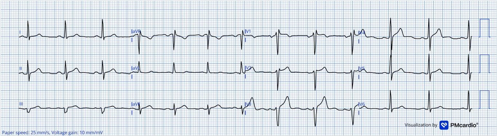

16分鐘後,再做一張(Fig. 2):T波變得明顯更不成比例地巨大，而且合併**終末T波倒置**。這次AI的判讀是:**OMI**。

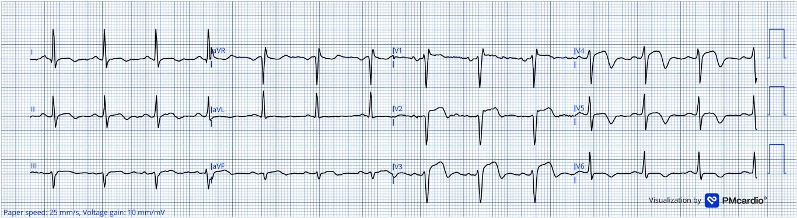

然後呢?

**這個病人在第一張ECG的當下，就已經有真正的冠狀動脈阻塞了。**

所以這個case的重點不在「第二張比較明顯」。

**病人在第一張ECG的當下就已經塞住了。<u>那16分鐘裡面改變的是ECG，不是血管</u>。**

這篇文章做的事情，就是把「那16分鐘之內，你腦袋裡應該跑哪六件事」寫下來。

## 為什麼需要六條原則?STEMI的毫米標準會漏掉一半以上的阻塞

先講一件我覺得很多人沒想過的事:**STEMI那個毫米門檻，是怎麼定出來的?**

那組毫米標準最早是寫進**第一版**心肌梗塞通用定義的(2000年ESC/ACC那份「Myocardial infarction redefined」共識)，用的門檻是**肢導與V4–V6 ≥0.1 mV、V1–V3 ≥0.2 mV，而且要兩條相鄰導程都達到**。同一年2月，Menown等人發表了那組數值的實證依據:他們收了1190人(1041位胸痛病人、其中335位確診AMI，外加149位沒有胸痛的對照)，比較各種ST上升定義的表現，最後選出的「最佳模型」是**下壁／側壁導程任一條 ≥1 mm，或前中膈導程任一條 ≥2 mm**。而這個「最佳模型」的敏感度是**55.8%**、特異度94.0%。[^2a]

之後Macfarlane等人2004年再把這組ACC/ESC門檻改成**依年齡與性別**分層。第四版(2018)和現行的第五版(2026)用的都是這種分層後的門檻，不是Menown那組原始數值。[^2]

這組分層是分兩步寫進指引的:2007年第二版UDMI先分男女(V2–V3男性≥0.2 mV、女性≥0.15 mV);2009年AHA/ACCF/HRS的ECG判讀標準化建議再分年齡(V2–V3在40歲以上男性≥0.2 mV、40歲以下男性≥0.25 mV、女性≥0.15 mV)，Macfarlane本人就是這份建議的作者之一;2012年第三版UDMI採用了同一組數值。[^udmisteps]

大家還記得，我最近寫的5th UDMI嗎?連結在這裡:👉 [Type 1~5 MI掰了？第五版心肌梗塞定義，X.com上的大家在吵什麼？](https://agoodbear.com/post/ecg-post-18/)

:275-283. PMID: 10653675；Macfarlane PW, et al. J Electrocardiol. 2004;37 Suppl:98-103. PMID: 15534817；Helseth HC, et al. Eur Heart J Acute Cardiovasc Care. 2026. DOI: 10.1093/ehjacc/zuag114")

這篇文章講得很直接:**這些門檻都不是以血管攝影證實阻塞為Gold Standard推導出來的**，而且**完全沒有把ST-T幅度相對於QRS幅度(也就是比例性)納入考量**。

後果是什麼?

de Alencar等人2024年的統合分析(3篇研究、23,704人)給了一個數字:[^3]

<mark>**單張ECG套STEMI準則，對acute coronary occlusion(ACO)的合併敏感度只有43.6%(95% CI 34.7–52.9%)。**</mark>

特異度倒是很漂亮，96.5%。

**翻成白話文就是:沒塞住的人，這毫米標準幾乎不會誤判成有;但真的塞住的人，它有一半以上抓不到。**

### 這六條，跟我正在寫的那20個finding是什麼關係?

我最近在寫OMI ECG findings系列，六篇，講的是**20個具體的finding**:NTTV1、HATW、inverted U wave、Subtle STE、STDmaxV1-4、Precordial Swirl、de Winter、Aslanger……

那些是**招式**。

**這六條原則，講的是那20個招式為什麼會存在。是心法。**

而且我前言那句話到現在還是成立的:**只要用STEMI criteria診斷MI的敏感度一直這麼差，就只會有越來越多的ECG pattern被發表出來說「這樣也可能有MI」。** 招式會一直變多，心法只有這六條。

## 先問自己幾個問題:


- **Q1**：第一張ECG不確定，我到底要等多久再做一張?
- **Q2**：病人說痛了48小時了，還有沒有心肌可以救?
- **Q3**：下壁STE我知道要去看aVL。那前壁、後壁鏡像的reciprocal pairs在哪裡?
- **Q4**：同樣是1 mm的STE，為什麼有的人算、有的人不算?
- **Q5**：J點沒中，整張12導程還有什麼可以看?
- **Q6**：ECG說是OMI，就真的是OMI嗎?那AI說是呢?


這六題，就是下面六個原則。最後學習重點再回來對答案。

⚠️ 順帶一提:我自己在筆記裡把六個原則的字首重排成

<mark>**DR PATS**（**D**ynamicity、**R**eciprocity、**P**roportionality、**A**cuteness、**T**otality、**S**urrogacy）</mark>

就當有個姓Pats的醫師在提醒你。中文版我自己記六個詞:<mark style="background-color: lightgreen">**會變、多急、照鏡、比例、整張、不是血管**。**這兩個都是我自己編的，原文沒有口訣**</mark>。

## 原則一｜Dynamicity 動態性:一張 ECG，只是一張照片，不是一個動態電影

**冠狀動脈裡的血栓本來就會長大、會溶解、會再長大。所以ECG也一定會變。(不斷的occlusion/re-occlusion)**

### 機轉在哪?

三件事合在一起:

1. **血栓是動態的。** 冠狀動脈血栓形成之後，會不可預期地增殖與溶解(Arbab-Zadeh 2012)。
2. **缺血是由內往外燒的。** ischemic cascade從心內膜下開始，往心外膜擴展(Birnbaum 2001、Kenigsberg 2007)。會從內往外，是因為冠狀動脈走在心臟表面，再往內穿過心肌，心內膜下是最末端、離血液來源最遠的一層;它又最靠近心室腔裡的高壓，承受的壁張力最大，需要的氧氣也最多。所以血流一不夠，最先缺血的就是心內膜下。[^subendo]
   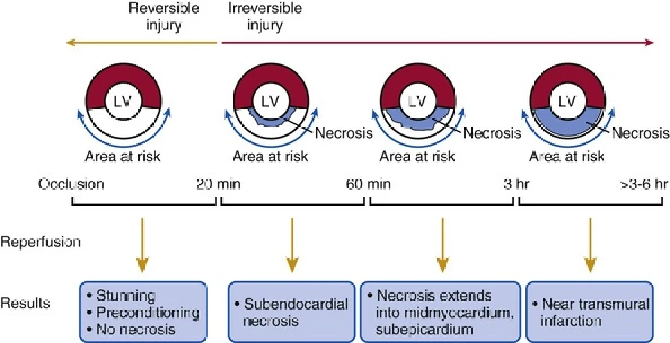
   這張圖把時間軸畫出來了:**20分鐘以內**的阻塞還不會造成不可逆傷害;**超過20分鐘**開始不可逆，而且像波前一樣從心內膜往心外膜推;**60分鐘**時左心室內側三分之一已經不可逆;**3小時**只剩心外膜下薄薄一層還活著;**3到6小時之間**透壁梗塞完成。**<mark>決定這個波前推多快的，最主要是側枝循環</mark>。**
3. **所以ECG上看到的是瞬時狀態。** 你那一張12導程，記錄的是那10秒鐘心肌細胞的電生理狀態，不是這條血管過去兩小時的歷史(Krucoff 2004)。

**<mark style="background-color: lightgreen">一張ECG是一張照片。但我們常常把這張照片，當成整個動態過程在看</mark>。**

### 多做一張ECG，到底能多抓到什麼?

這是我覺得這個原則最有力的地方:它有數字。

**① 有一群人，你等再久它都不會達到門檻。** Meyers等人2025年把53例LAD完全阻塞(TIMI-0，完全沒有血流)的病人，血管攝影前的每一張ECG都拿來量STEMI準則，**結果有20例(38%)「任何一張」都沒有達到**。這20例裡有16例做了兩張以上，第一張到最後一張中位數隔了44分鐘(最久隔了44小時)，還是沒有一張達到。[^21]

那這20個人，第一張ECG上有什麼?文章寫得很清楚:

**這20例裡面，有17例的第一張ECG就已經出現HATW。**

而同一篇研究的摘要另外寫著:專家判讀與AI模型對這20例，**在第一張ECG上診斷LAD OMI的敏感度都是100%**。

<mark>**看得出來的人，第一張就看出來了。看不出來的人，等到第五張也還是沒有STE可以等。**</mark>

> 所以還是得好好增強自己的實力，多多看ECG。
>
> 我之前做了一個**ECG隨機考題**的練習站
>
> <mark style="background-color: pink">放在部落格的「實用工具」底下:👉 [ECG 隨機考題](https://agoodbear.com/tools/ecg-quiz/)</mark>
>
> 裡面有**1649題**真實的Dr. Smith案例，每題都附五段式詳解;可以用1–4鍵直接作答，答錯的自動進錯題本(Google登入就能雲端同步)，圖可以放大，還附了一把量尺可以量ST段。
>
> 自己做的ECG網頁工具自己推XD

**② 專家判讀可以提前多久?** 808例的回溯病例對照研究中，146例(55%)由專家判讀比STEMI準則更早診斷出來。扣掉提前超過24小時的20例(那些病人的心導管拖了一兩天才做)，其餘126例**提前的時間中位數是1.3小時(IQR 0.58–2.76)**。[^4]

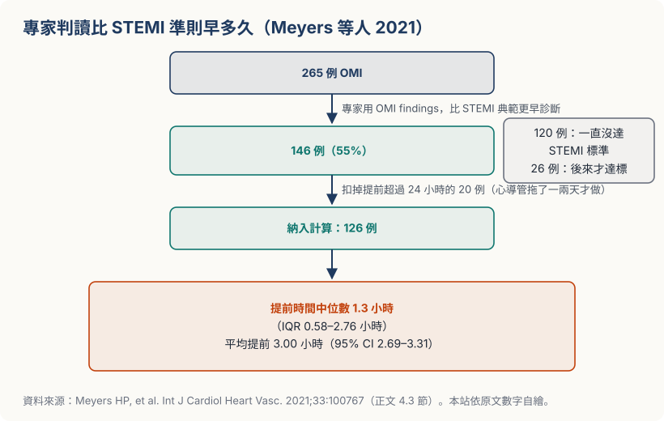

看到這裡你可能會想:那我又不是專家，這個數字跟我有什麼關係?

**期許自己變成專家!!!** 那86%、那提前的1.3小時，都是**有經驗的判讀者**做出來的，不是天生的。 這六條原則就是訓練菜單。每看懂一條，你就往那個數字靠近一點。

而在**這146例被提前辨識的病人當中**，最常見的提前依據是「subtle STE not meeting STEMI criteria」，佔**83%**。這146例身上，各項OMI finding出現的比例如下:

| OMI finding | 146例中出現的比例 |
|---|---|
| Subtle STE not meeting STEMI criteria | **83%** |
| Reciprocal STD and/or T-wave inversion | **82%** |
| Terminal QRS distortion(QRS終末沒有回到基線，也沒有J波和S波) | 53% |
| Any STE in inferior leads with any STD/T-wave inversion in aVL | 50% |
| Hyperacute T-waves | 49% |
| Pathologic Q-waves(伴隨subtle STE、又不能用陳舊MI解釋的Q波) | 47% |
| STD maximal in V2–V4 indicative of posterior OMI | 45% |

資料來源:原文線上附錄Table 6，這裡由高到低重新排列。一個病人可以同時有好幾項(92%的人有兩項以上)，所以加起來超過100%。[^4]

那808個人到底怎麼分的?原文沒有畫流程圖，我照原文的數字畫了一張:

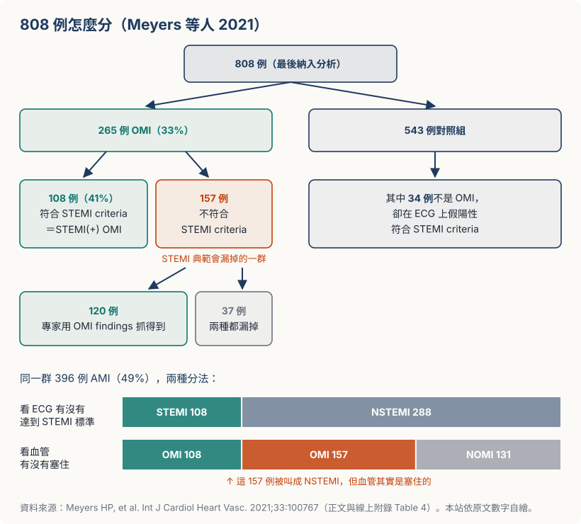

**1.3小時。** 這就是dynamicity這條原則在急診的現金價值~~
有些病患就在這段時間內開始跳VT/VF。遇到了，我們急診醫師當然是義不容辭地電了下去。
但這種好康的，還是送給別人吧XD。
講正經的:**主要還是趕快把血管打通，病患心肌死得越少越好。**

那1.3小時可以拿來做什麼?**可以拿來Call CV man。** 另外，也可以多做echo、多做幾張ECG，或是持續觀察病人的symptom和sign;**只要有任何一項出現問題，就可以提早Call CV man。**

**③ 通了也可能再塞回去。** Lemkes等人2019年那個transient STEMI的RCT，延遲介入組有<strong>5.6%(4例)</strong>因為再梗塞的症狀與徵象而需要緊急介入。[^5]

**症狀好轉、ECG變漂亮，不等於問題解決了。那可能只是血栓暫時鬆開。**

### 所以在急診你要怎麼做?

**症狀有變化 ➜ 重做ECG。** 不是等下一個班，是現在。

**第一張non-diagnostic但你心裡毛毛的 ➜ 設定時間點重做。** 那篇文章的貫穿病例是16分鐘。 那到底該多久做一張?這個數字是有出處的，而且它有一段演變。 **2014年的AHA/ACC NSTE-ACS指引寫得很白**:[^g2014]「The ECG can be relatively normal or initially nondiagnostic; if this is the case, **the ECG should be repeated (e.g., at 15- to 30-minute intervals during the first hour)**, especially if symptoms recur.」 講成中文就是:**最初一小時內，每15到30分鐘一張。**

**但2025年的新版把這個固定間隔拿掉了。** 這份新版是**2025 ACC/AHA/ACEP/NAEMSP/SCAI ACS指引**，把STEMI和NSTE-ACS合在一起寫，改成「**依症狀與臨床狀態的變化重做**」(<mark>原文:「timing of repeat ECGs should be guided by the patient’s symptoms, especially recurrent chest pain, and any change in clinical condition」</mark>)。[^g2025]

為什麼會改?看Riley的數據大概就懂了。41,560位STEMI病人中，有4,566位(**11.0%**)第一張ECG是non-diagnostic，後來的ECG才出現診斷性變化。**第一張ECG就是第0分鐘**，不管它是在到院前還是到急診之後做的。這4,566人從第一張到出現診斷性變化的**中位數是46分鐘**，下面這張表的分母也是這4,566人:[^riley]

| 從第一張ECG(第0分鐘)算起 | 4,566人中已經出現診斷性變化的比例 |
|---|---|
| 30分鐘內 | 32.0% |
| 60分鐘內 | **60.0%** |
| 90分鐘內 | 72.4% |
| 120分鐘內 | 78.6% |

**你在第一個小時只抓得到六成。**
所以這兩件事要一起記:**症狀還在就15到30分鐘一張;而且不要因為過了第一個小時，就鬆手。**

**一定要去挖舊片。** dynamicity要有「動」才成立，沒有比較基準就沒有動態。

**把ECG的時間戳記寫進病歷。** 之後要跟CV man說明「這在40分鐘內變成這樣」的時候，你需要那個時間。

### ⚠️ 陷阱

**reperfusion會讓ECG變好看，但心肌不一定安全。** 血管自己通了，ST段回來了，T波開始倒了。這是好事，但它同時代表**這條血管剛剛塞過**，而且**什麼時候再塞回去沒有人知道**。

## 原則二｜Acuteness 急性程度:ECG比病人更知道心肌死到哪了

<mark>**不要用「痛了多久」決定要不要救。要用ECG上還剩多少可搶救的心肌來決定。**</mark>

這條是我覺得六條裡面最容易被忽略、但最能改變處置的一條。

### 為什麼不能相信「痛多久」?

因為病人講的時間，跟心肌實際上的狀態，常常對不起來。

Raitt等人1995年那篇最直接:**症狀發作1小時內就到院的病人，53%的初診ECG上就已經看得到異常Q波了。**[^6]

**一小時。Q波。**

這代表什麼?**代表Q波出現得比我們以為的早很多。** 這件事有兩種解釋:

**①這個病人其實已經痛更久了**（先前痛過、塞過，只是他沒說、或不覺得那算痛）

**②Q波根本不代表心肌已經壞死**，它可能只是「嚴重缺血」的表現。

作者選的是第②個，而且講得很硬:**Q波（尤其是QR波）不應該變成你不做再灌流的理由。**

Smith 2002年那本《The ECG in Acute MI》，Q波那一章就寫過同一件事，而且是粗體:**「Never let Q waves alone dissuade you from initiating reperfusion strategies.」** 書裡給了三個理由:[^smithbook]

- **Q波出現得很早。** 前壁AMI阻塞才1小時，大約一半的人就已經有Q波(或R波不見了)，可能是傳導系統缺血造成的;沒有再灌流的話，12小時內Q波就會完全長好。
- **Q波本身推不出梗塞多久了。** 在ST上升的導程，QS波比較可能是陳舊梗塞、或已經很晚期的AMI;**QR波是急性、陳舊的機會一樣大**。
- **有新Q波的人，打通的好處不會比較少。** 新出現Q波(幾乎都是QR)的病人年紀較大、比較晚到、梗塞比較大、死亡率也比較高，但再灌流帶來的死亡率好處，**跟沒有Q波的人一樣，甚至可能更大**。

但兩種解釋的結論是同一個:**你不能拿「痛多久」或「有沒有Q波」單獨決定還有沒有得救。**

反過來也一樣。這篇文章的Figure 6放了一個**胸痛48小時**的病人，ECG上仍然診斷明確、而且仍有可搶救心肌，需要緊急再灌流。

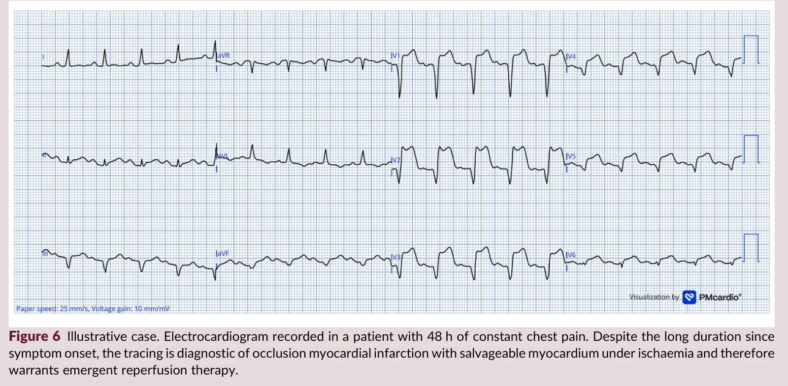

### 「急性程度」量得出來嗎?Anderson–Wilkins acuteness score

真的有人把「急性程度」量化過，而且1999年就做出來了。

<mark>**Anderson–Wilkins acuteness score**</mark>，研究怎麼做、分數怎麼看，直接看圖:[^7]

:826-831。本站依原文數字自繪。")

結果是這樣:

**前壁梗塞的病人裡，ECG看起來「還很急」(分數高)的那組，最後死掉的心肌，只有「看起來不急」那組的一半。**

而且分數高的那組，從開始胸痛到接受治療，中間隔的時間反而比較久。

這不是說拖越久越好。意思是:**病人說「痛了多久」，跟心肌真正缺血了多久，常常是兩回事。** 有人有側枝循環在撐，有人血管塞了又自己通、通了又塞，所以雖然痛了很久，心肌其實還活著，ECG看起來也還「很急」。反過來，有人才痛沒多久，心肌已經死得差不多了。

**所以<mark>要用ECG判斷心肌還剩多少，不要只看病人痛了多久。</mark>**

不過這個分數也有它的邊界。後來Engblom等人2011年，拿病人做完PCI之後的SPECT和MRI來驗證「分數高＝救回來的心肌多」這件事:在**RCA塞住**的病人身上成立，在**LAD塞住**的病人身上就對不起來。**也就是說，這個分數可以拿來參考，但不能單靠它決定要不要救。**

### 那怎麼從ECG讀出acuteness?

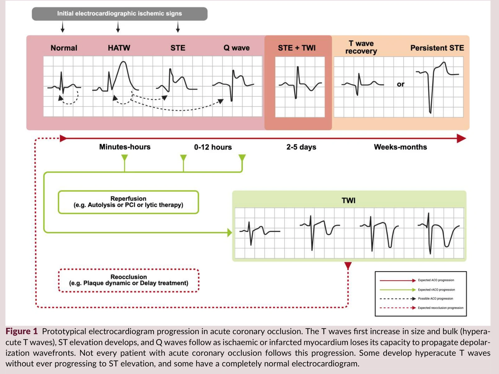

概念上就是看這三樣東西的相對關係(該文Figure 1那條演變時間軸)。 **但光看那條時間軸還判斷不了急性程度，文章另外列了兩組ECG特徵，高急性程度和低急性程度各三項:**

- **高急性程度(還有很多心肌可以救)**:有HATW，**尤其是T波幅度大過STE的時候**;STE > 4 mm;**而且還沒有QS波、也還沒有T波倒置**。
- **低急性程度(梗塞大致完成了)**:T波變平、或只是淺淺倒置;**QS波已經成形**;STE不高但Q波長得很清楚。

下面這張表是那條時間軸的順序，配著上面兩組特徵一起看:

| 階段 | T波 | ST段 | Q波 |
|---|---|---|---|
| 最早 | **HATW**(又高又胖，遠大於STE) | 還沒抬或微抬 | 無 |
| 進行中 | 仍大 | **STE明顯** | 開始出現 |
| 較晚 | 開始倒置 | STE仍在 | **Q波成形** |
| 陳舊 | 扁平或倒置 | 多半回到基線 | **QS波** |

先看原文的Figure 4，它把acuteness畫成一張圖:

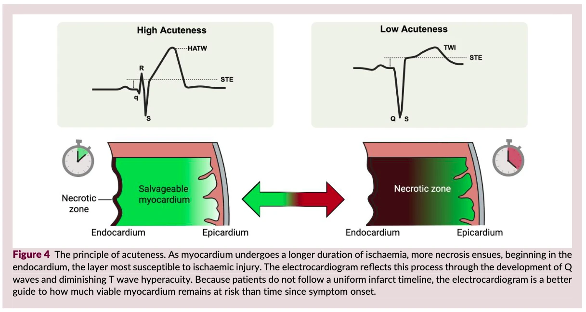

**重點在圖說最後一句:每個病人的梗塞時間軸都不一樣，所以ECG比「痛了多久」更能告訴你，還剩多少心肌可以救。**

該文Figure 5把兩個病人並排，就是在講這件事:**Panel A是近期阻塞:T波遠大於STE，可搶救心肌多;Panel B是陳舊性梗塞:QS波、扁平T波，最後靠troponin排除急性OMI。**

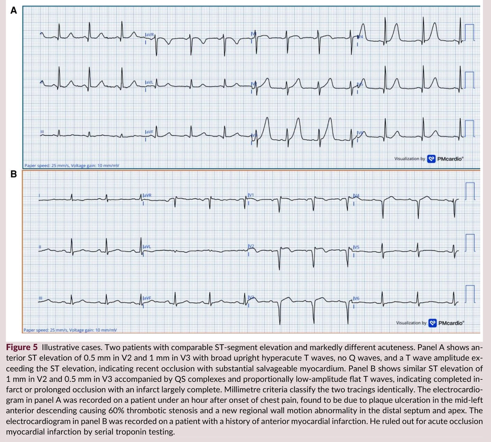

**兩個人的STE可能差不多。但一個要現在就送心導管室打通血管，一個不用。**

### 所以在急診你要怎麼做?

**看到STE，先別急著報時間。** 先看T波跟Q波。T波還又高又胖、Q波還沒長出來 ➜ 心肌還活著。

**病人講「痛很久了」，不要因此放棄。** Fig. 7那個48小時的病人就是反例。

**病人講「才剛開始痛」，也不要因此放心。** Raitt那篇發現:**症狀1小時內就到院的病人，53%的初診ECG上已經有異常Q波。** 但要小心:**這不等於那53%的心肌都已經壞死、不值得救了。** 文章講得很清楚，這些早期的Q波**可能只是「嚴重缺血」，不是「已經完成的梗塞」**，所以<strong><mark>Q波（尤其是QR波）不應該變成你不做再灌流的理由</mark>。</strong>

### ⚠️ 陷阱:別把BRAVE-2拿來當這條原則的證據

先講為什麼講acuteness會講到BRAVE-2。

原文在acuteness這一節寫了一句:**超過傳統的時間窗，只要acuteness高，緊急PCI還是有好處**(原文:「Beyond traditional time windows, emergent PCI remains beneficial when acuteness is high」)，然後<mark>拿BRAVE-2當這句話的證據</mark>。

意思是:痛超過12小時，照傳統的想法已經過了黃金時間;但只要ECG看起來還很急，打通還是值得。**問題是，<mark>BRAVE-2撐不起這句話</mark>。**

先看BRAVE-2這個試驗長怎樣:[^8]

:2865-72；Helseth HC, et al. 2026。本站依原文數字自繪。")

數字很漂亮。**但這個試驗證明不了acuteness這條原則。**

為什麼?先看它**怎麼收病人**。BRAVE-2的收案條件只有兩件事:**①症狀發作後12–48小時 ②ECG上還有STE或新的病理性Q波**。就這樣。 它**沒有**去分這些病人的ECG acuteness是高是低，也**沒有**依acuteness把病人分組來比。 所以<mark>這個試驗能證明的只有:**「在12–48小時這個時間窗做介入，有好處」**。 至於<strong>「用acuteness可以挑出哪些人值得做」</strong>，它就沒辦法回答了。收案條件裡根本沒有acuteness這個變數，當然分析不出來。</mark>

還有一件事要講清楚:**它的對照組是「不安排血管攝影的藥物治療」**，不是我們現在的常規做法（早期侵入治療）。
意思是，這個試驗比的是「立即PCI vs 幾乎不做」，不是「立即PCI vs 現行的早期侵入」。
所以它連「立即比指引導向的早期侵入更好」都沒有證明。**這點作者自己也明白寫出來了**，算誠實。

**熊評論:** **這篇文章本身就在教我們「要看證據的強度，不要看誰講的」**，那我讀它的時候當然要用同一個標準。
講白一點:**BRAVE-2撐得起「超過12小時還是可能有救」這句話，撐不起「acuteness score幫你挑人」這句話。** 兩句話長得很像，證據強度差很多。

### ⚠️ 還有一件事:troponin正常不能拿來排除

順便放在這裡，因為它跟acuteness是同一個道理:<mark>**早期的東西還沒出現，不代表事情沒發生**</mark>。

Wereski等人2020年:確診STEMI的病人裡，[^9]

**14.4%** 的初始高敏感度troponin I **低於99百分位參考值上限**

**26.8%** 低於52 ng/L這個常用的rule-in門檻

<mark>**七分之一的STEMI病人，第一套troponin是正常的。**</mark>

切記，切記!!!!!!

## 原則三｜Reciprocity 對應性:每一片缺血的心肌，在對面都有一面鏡子

**心肌缺血時的current of injury，會投影到對側面的lead，如同凹透鏡的鏡像一樣。**

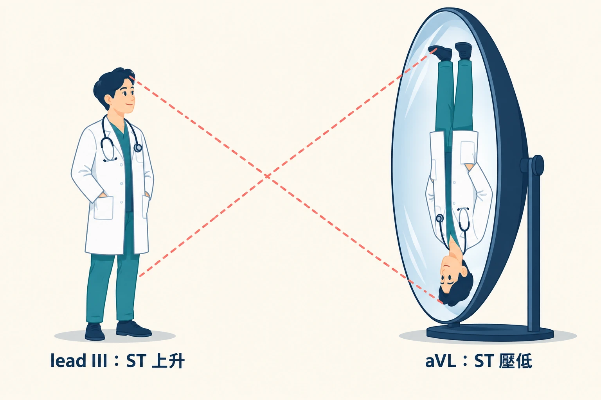

### 機轉:這其實是幾何學，不是心臟學

想法很單純:損傷電流有方向。一個導程記錄到的，是這個向量投影在它自己軸線上的分量。

**所以當一個導程看到ST抬起來，軸線大致相反的那個導程，就會看到ST壓下去。**

該文Figure 7用心臟的三維方位在講這件事:前後視圖顯示III與aVL的關係、V4–V6與aVR的關係;左前斜視圖顯示前壁與後壁導程的關係(**Fig. 14**)。

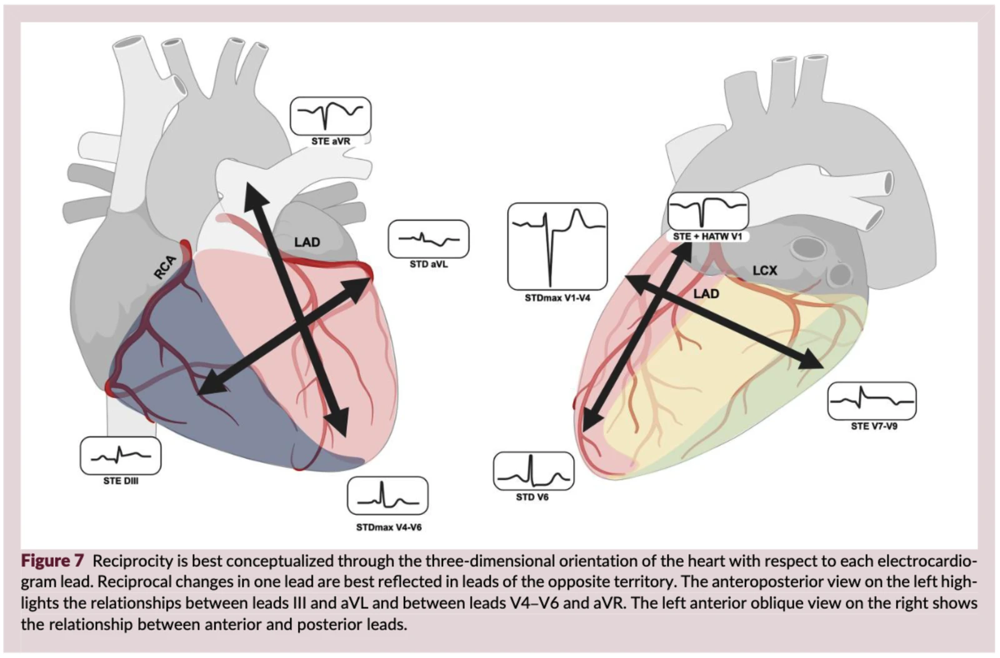

**這也是為什麼reciprocal change這麼有價值:它不是第二個發現，它是同一個發現的<mark>第二個證人</mark>。**

### 兩個一定要記的數字

**① 下壁STE ➜ 去看aVL。**

Bischof等人2016年:[^10]

- 154例下壁STEMI病人，**全部100%(95% CI 98–100%)在aVL出現某種程度的ST壓低**
- 49例心包膜炎病人，**沒有一例出現**(特異度100%，95% CI 91–100%)

<mark>**下壁STE而aVL沒有任何ST壓低，先想想是不是心包膜炎，或者根本不是下壁OMI。**</mark>

⚠️ **這裡有一個數字要講清楚。**

Bischof這篇其實收了三批病人(英文叫cohort，意思就是「一批收進來的病人」):第一批是上面那154位明顯的下壁STEMI，第二批是那49位心包膜炎，**第三批是272位血管攝影證實阻塞的下壁梗塞，其中有54位的下壁STE很輕微(不到1 mm)**。

**這54位裡面，aVL有ST壓低的是49位，大約九成(90.7%)。**

原文和它的Table 2寫的是「98.8%」，而且說是第三批的數字。但272人怎麼算都算不出98.8%;它比較像是第一批加第三批合起來算的(421/426)。

**<mark>所以請這樣記:下壁STE很明顯，aVL幾乎100%會壓;下壁STE很輕微，大約九成</mark>。** 而STE很輕微的那一群，正好是我們最需要幫忙的人。

還有:這三批病人全都是「已經看得到下壁有一點STE」的人。所以這些數字只能用在「下壁有一點STE，你在想它是不是真的」的時候，**不能拿去套在完全沒有STE的病人，也不能套在其他區域的梗塞。** 這一點作者自己也寫在限制裡。

**② V1–V4的ST壓低 ➜ 去想後壁。**

Meyers等人2021年(J Am Heart Assoc):在急性胸痛的病人中，**只要缺血性ST壓低的「最大值」落在V1–V4(而不是V5–V6)，不管壓得多深，對OMI的特異度就是97%**。而這裡講的OMI，絕大多數就是**後壁OMI**。[^11]

這個就是我系列裡會細講的**STDmaxV1-4**。這裡先記住那個97%。

### 該文Table 2:心臟各區和它的鏡像

| 互為鏡子的兩區 | ECG導程 | 臨床上怎麼用 | 證據 |
|---|---|---|---|
| 下壁 ↔ 高側壁ᵃ | III ↔ aVL | **下壁OMI**:III出現STE/HATW，aVL出現reciprocal STD。在下壁STE的病人中，下壁OMI有98.8%在aVL出現STD，心包膜炎則一個都沒有(98.8%這個數字見上面的說明)。**高側壁ᵃ OMI**:aVL出現STE/HATW，reciprocal STD最明顯在III | Bischof 2016 |
| 心尖 ↔ 心底 | II、V5 ↔ aVR | **Subendocardial ischemia**:aVR的STE，是瀰漫性STD(最明顯在II和V5附近)的鏡子。**Apical OMI**:LAD中遠段阻塞，STE/HATW最明顯在II和V5，aVR出現STD。**心包膜炎**:瀰漫性STE、II > III，aVR出現reciprocal STD;要先排除其他診斷才能下 | Harhash 2019 |
| 前壁 ↔ 後壁／側壁ᵇ | V1–V4 ↔ V5–V9 | **後壁／側壁ᵇ OMI**:缺血性STD最明顯在V1–V4，對OMI的特異度97%。後壁導程V7–V9可能照出reciprocal STE，但不可靠。**Precordial swirl**:LAD在septal perforator之前阻塞，V1–V2出現STE/HATW，V5–V6出現reciprocal STD | Meyers 2021;Goss 2025 |
| 高側壁ᵃ ↔ 前壁 | I、aVL ↔ V1–V4 | **近端LAD OMI**:阻塞在first diagonal之前，前壁和高側壁ᵃ都出現STE，下壁出現reciprocal STD或down-up T波。**迴旋支OMI**:高側壁STE/HATW合併前壁STD/TWI，表示迴旋支阻塞同時造成高側壁和後壁OMI | Geffin 2024 |
| Mid-anterolateral ↔ 下壁 | aVL、I、V2 ↔ II、III、aVF | **Mid-anterolateral OMI**:V2出現STE，下壁導程出現reciprocal STD或down-up T波，跟first diagonal阻塞強烈相關。**South African flag sign**:I、aVL、V2出現STE，III出現STD，也跟first diagonal阻塞有關 | Sclarovsky 1994;Littmann 2016 |

ᵃ **高側壁／中前壁的名稱**:心臟磁振造影(CMR)研究顯示，I和aVL對應的其實是中前壁(mid-anterior)，不是傳統說的「高側壁」。表中保留「高側壁」這個傳統說法，是為了跟既有文獻和AHA/ACCF/HRS的建議一致，兩種說法目前都有人用。

ᵇ **後壁／側壁的名稱**:CMR研究顯示，傳統叫「後壁」的那一面，更精確的說法是側壁或下側壁(inferolateral)，AHA 17節段模型裡也沒有叫「後壁」的節段。AHA/ACCF/HRS委員會建議，在進一步研究之前先保留「後壁」這個說法，表中引用的研究也都這樣用，所以原文保留它，但提醒讀者:拿ECG去對心臟超音波或CMR時，負責的心肌應該在下側壁。原文把兩種說法交替使用。

資料來源:原文Table 2，繁中翻譯。

### 所以在急診你要怎麼做?

**看到任何一區的STE，反射動作就是去找它的鏡子。**

- 找到 ➜ 證據多一條。
- 找不到 ➜ 要開始懷疑這是不是真的缺血。

**反過來更重要:看到ST壓低，先問「這是不是別的地方STE的鏡子」。** 尤其是V1–V4。

講到這裡，一定要提 **Dr. Jerry Jones** 對 reciprocal change 的兩個提醒。他的原話是: **"Reciprocal changes to an acute occlusion of one of the coronary arteries may appear before any ST elevation. And even if the ST elevation is present, the reciprocal changes may continue to be much much more impressive. Don't be fooled."** 翻成白話文就是兩件事:

**<mark style="background-color: lightgreen">① reciprocal change(STD)可能比STE更早出現</mark>。** 你還在等STE的時候，鏡子那一邊可能已經先講話了。

**<mark style="background-color: lightgreen">② 就算STE已經出現，STD還是可能比STE更明顯</mark>。** 所以不要因為「STE看起來不怎麼樣」就放過它。

<strong>這一點他在自己的書裡也寫成規則:</strong>Jones's Rule 第一推論，reciprocal change 可能出現在穿壁缺血的 STE(primary change)之前。

**所以我的習慣是:** 看到任何一區STD，先把它當成「別的地方STE的鏡子」去找，而不是先當成subendocardial ischemia。

**<mark>aVL和V1–V4是最常被跳過的兩個地方</mark>。** 這篇文章特別點名。

### ⚠️ 陷阱:這條原則的限制比你想的多

這一節作者講得很老實，我照抄過來:

1. **沒有哪兩個lead是真的差180度。** 所以reciprocal change只是「差不多相反」，不是數學上的鏡像。**aVL和III**是最接近180度的lead。
2. **LVH、pre-excitation、LBBB也會長出一模一樣的幾何形狀** ➜ 這三個都會給你**假陽性**。
3. **<mark>多條血管一起有事的時候，向量會互相抵銷</mark>。** 非罪犯血管那一區的subendocardial復極向量，會把罪犯血管的穿壁current of injury抵掉一部分。結果就是:ECG反而看起來乾淨。

第3點的原型就是**Aslanger pattern**(Aslanger 2020)。它的定義是:[^12]

- III導程ST上升，但其他下壁導程沒有
- V4–V6任一導程ST壓低，但V2沒有，且V2的T波正向或終末正向
- V1的ST高於V2

還有一個更麻煩的:<mark>**Geffin等人2024年指出，left dominant合併近端迴旋支阻塞時，高側壁與下壁的向量可能大致互相抵銷**。這就是為什麼**隱性(silent)OMI最常發生在迴旋支區域**</mark>。原文逐字是:「In left dominant circulation with proximal circumflex occlusion, high lateral and inferior vectors may roughly oppose each other, which is why silent OMI most often involves the circumflex territory.」同一段還補了一句:**left main阻塞同時造成前壁與後壁OMI的時候，抵銷得更不均勻。**

**<mark>鏡子會互相抵銷。ECG「乾淨」的那個病人，可能是兩個地方同時在缺血</mark>。** 想像一下:一個地方缺血，injury vector往這邊指;另一個地方也缺血，vector往反方向指。兩個一加，**在體表就互相抵銷掉了**。 所以你手上那張「看起來很乾淨」的ECG，可能不是因為沒事，而是**因為同時有兩個地方在缺血，把對方的訊號蓋掉了**。 這正是為什麼**silent OMI最常發生在迴旋支**（left dominant＋近端LCx阻塞，高側壁和下壁的向量剛好互相對消），也是為什麼**left main阻塞**的ECG常常「不夠像」。 <mark>**ECG乾淨，不等於血管乾淨。病灶越多，ECG反而可能越安靜。**</mark>

## 原則四｜Proportionality 比例性:1 mm在誰身上，意義不一樣

**ST-T的幅度要相對於這個病人自己的QRS幅度來看，不是相對於固定的毫米標準。**

這條是整個OMI典範跟STEMI典範差最多的地方。而且我認為，這是六條裡面**最好教、最好學、CP值最高**的一條。

### 為什麼絕對毫米會出事?

因為**ST-T的幅度本來就跟QRS的幅度綁在一起**。QRS電壓小的人，同樣程度的缺血，STE也小。

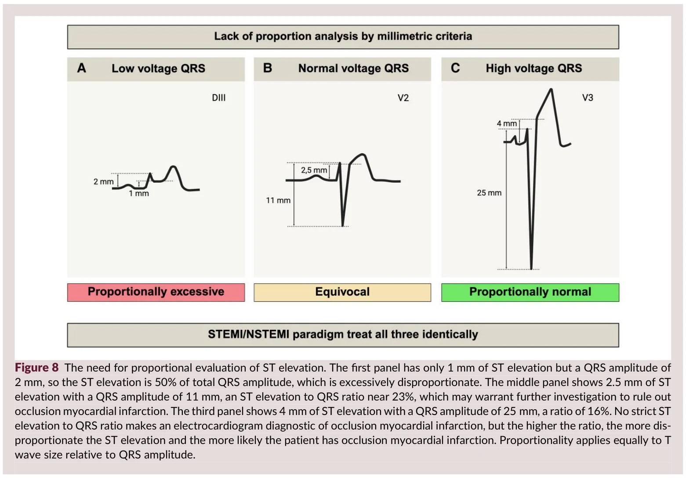
該文Figure 8畫的就是這件事:三種QRS電壓(低／正常／高)下，**同樣一個絕對STE值，對應到完全不同的ST/QRS比值**。但在STEMI/NSTEMI典範裡，這三個人的處置一模一樣。(**Fig. 15**)

**同樣1 mm，在QRS只有5 mm的那個lead，跟在QRS有20 mm的那個lead，代表的東西差四倍。而STEMI criteria只認1 mm。**

### 四個真的可以帶進急診用的比例公式

這一節是我覺得整篇文章最實用的地方。全部都是**比值**，不是毫米。

**<mark style="background-color: lightgreen">① LBBB／心室節律器 ➜ Smith修訂版Sgarbossa準則</mark>**

- 原始Sgarbossa準則的第三條，用的是**絕對值≥5 mm**的不一致性STE。Smith等人2012年把它換成**比例**:[^13]
- **STE/S ≥ 0.25(也就是25%)。** 原始論文把S波當成負值，所以寫成ST/S ≤ −0.25，意思一樣。
- 原始研究是33份阻塞的ECG對129份對照。結果:

| 準則 | 敏感度 | 特異度 |
|---|---|---|
| **修訂版(STE/S ≥ 0.25)** | **91%**(95% CI 76–98%) | **90%**(95% CI 83–95%) |
| 原始加權版 | 52%(95% CI 34–69%) | 98%(95% CI 93–100%) |
| 原始未加權版 | 67%(95% CI 48–82%) | 90%(95% CI 83–95%) |

- LR+ 9.0、LR− 0.1。這套準則後來由Meyers等人2015年外部驗證，也在<strong>心室節律器(paced rhythm)</strong>的病人身上驗證過(Dodd 2021)。

**<mark style="background-color: lightgreen">② LV動脈瘤形態 ➜ T/QRS比值</mark>**

- 老的前壁梗塞留下的持續性STE(LV aneurysm morphology)，跟「這個LV aneurysm上面又新塞了一次」，長得很像。
- Klein等人2015年給的判準:[^14]
- **V1–V4任何一個lead的 T/QRS ≥ 0.36 ➜ 預測急性STEMI。比值越小，越可能是亞急性或陳舊性梗塞。**

**<mark style="background-color: lightgreen">③ Subtle前壁STE vs early repolarization ➜ Smith 4 variable formula</mark>**

- 這個我系列的Part 4會整節拆，這裡只講它為什麼屬於proportionality:
- **它結合四個變數:V3的STE(量J點後60 ms，也就是1.5小格的位置，不是J點本身)、V2的QRS幅度、V4的R波幅度、QT間期。** 已經外部驗證過(Driver 2017、Bozbeyoğlu 2018)。
- **重點是它的方向性:QRS與R波幅度越大，公式算出來的值越低、越不像前壁OMI。**
- **翻成白話文就是:同樣一個STE，旁邊的R波越高，越不用怕;R波越矮，越要怕。**

**<mark style="background-color: lightgreen">④ HATW ➜ 面積比，不是高度</mark>**

- 這條我在系列Part 1（上）寫過，這裡再對一次。
- Meyers等人2025年終於把HATW量化了:用**T波下面積相對於前面QRS幅度的比例**，加上**T波對稱性**(peak-to-end與J點-to-peak的時間比)。[^15]
- 而把這個量化HATW score加到STEMI準則上之後:**敏感度從41%提升到53%，特異度從97%只掉到96%。**
- **HATW可以在STE出現之前、也可以持續存在而完全沒有STE、也可以在再灌流之後還殘留。這三種情況，你都只能靠比例性判斷，靠毫米門檻一個都抓不到。**

### 所以在急診你要怎麼做?

**每次看到ST-T有點怪，先把眼睛往下移，看它旁邊的QRS有多大。**

實作上就三句話:

- **看到LBBB或paced ➜ 量STE/S，抓25%。**
- **看到V1–V4持續STE、又有Q波(具PRWP) ➜ 量T/QRS，抓0.36。**
- **看到T波怪怪的 ➜ 不要問「幾mm」，問「它跟旁邊的QRS振幅比，誰大」。**

### ⚠️ 陷阱:公式不能亂搬

這一點文章講得很清楚，我覺得很重要:

**每一條比例公式，都是在特定族群、特定導程區域推導與驗證出來的。不應該外推到原始比較情境以外的族群或導程。**

舉例來說:Smith 4 variable formula是用來分「**前壁**subtle STEMI vs **Early repolarization**」的，你不能拿它去分下壁、也不能拿它去分心包膜炎。

## 原則五｜Totality 整體性:不要只盯著J點那一個點(整體來看)

**一張ECG有12個導程、有節律、有傳導、有axis、有Q wave、有R wave progression。STEMI準則只用了其中一個點:J點。**

### 整體判讀到底加了多少分?

這是六條原則裡**證據最硬**的一條。

808例的回溯病例對照研究，用**預先定義的OMI判讀項目**做盲性判讀:[^4]

|  | 敏感度 | 特異度 |
|---|---|---|
| **OMI整體判讀** | **86%** | **91%** |
| STEMI準則 | 41% | 94% |

為了確定這不是某一個人特別會看，研究又請第二位判讀者，把其中一家醫院的250例獨立再看一次:他的敏感度80%、特異度92%;同一批病例用STEMI準則，是36%、91%。**也就是說，換一個人看，結果還是差不多。**

<mark>**敏感度從41%變成86%，翻了一倍以上。特異度只從94%掉到91%。**</mark>

這就是整體判讀的價值。**你沒有換一台更好的機器，你只是把整張紙看完。**

### 那「整張紙」要看什麼?四件事

**① 節律與傳導:血管會告訴你它塞在哪**
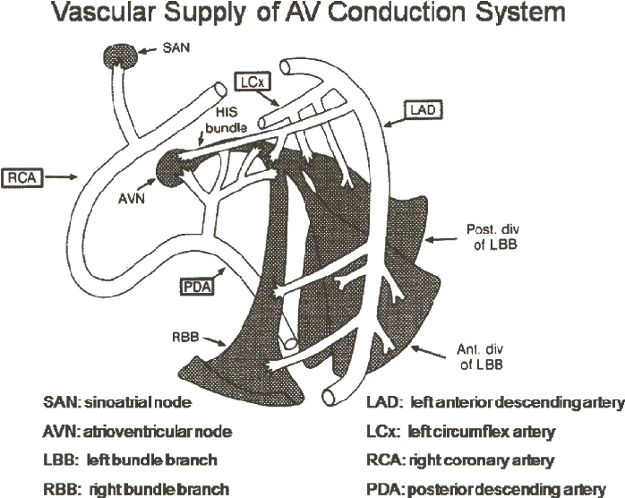

這一段我覺得很多人沒有系統性地想過:

- **RCA與左迴旋支供應竇房結** ➜ 阻塞可造成**竇性心搏過緩**(Frampton 2023)
- **RCA通常也供應房室結** ➜ 阻塞可造成**暫時性房室傳導阻滯**(通常還好)
- **LAD供應大部分的束支系統** ➜ 阻塞造成的是**希氏束以下(infra-Hisian)的房室傳導阻滯**(O'Gara 2013)，**預後差得多**
- **同樣是新出現的AV block，在下壁梗塞跟在前壁梗塞，是兩件完全不同嚴重度的事。**

**② <mark style="background-color: pink">RBBB + LAFB</mark>:這一組是red flag**

- <mark style="background-color: lightgreen">LAD的<strong>中膈穿通支(septal perforators)</strong>通常供應右束支與左前分支</mark>。
- 所以:**ACS合併新發或疑似新發的RBBB＋LAFB**(常合併輕微一致性STE或HATW)，與**LAD阻塞及左主幹急性阻塞高度相關**，也與**休克及心搏停止**高度相關(Widimsky 2012)。
- **新發RBBB＋LAFB加上急性胸痛，就算ST-T因為傳導異常而判讀不可靠，也要當成緊急評估的適應症。不要等出現明確STE才動作。**
- ⚠️ 平衡一下:後續一項用高敏感度troponin的世代研究發現，**右束支傳導阻滯本身並不是死亡率的獨立預測因子**(Neumann 2019)。所以r**ed flag的重點在「新發」「合併LAFB」「合併胸痛」這個組合，不是RBBB三個字本身**。

**③ Q波與R wave progression:沒看到Q波，不代表沒有梗塞**

- **Moon等人2004年(心臟磁振造影世代):29%的透壁梗塞不會出現Q波。**[^16]

**④ ST段的形狀:上凹不能排除**

- 這條我很愛，因為它打的是一個很多人心裡的迷思:「上凹(concave)的STE比較良性」。
- Smith 2006年這篇的原始數據:37位經證實LAD阻塞、接受緊急PCI的病人中，**16位(43%)的V2–V6全部都是上凹型ST段**。[^17]
  - 原文結論逐字:**「concave morphology cannot be used to exclude STEMI with LAD occlusion」**。
  - <mark>**上凹不能排除LAD阻塞。四成三的LAD阻塞，V2–V6全部都是上凹的。**</mark>
- 該文Figure 9(下圖)把這件事畫成兩個panel:**Panel A沒達到毫米門檻，但整體判讀陽性(後來證實LAD阻塞);Panel B達到了毫米門檻，但整體判讀陰性(後來troponin排除)。** 兩張ECG的J點都會騙你，整體判讀才分得開。

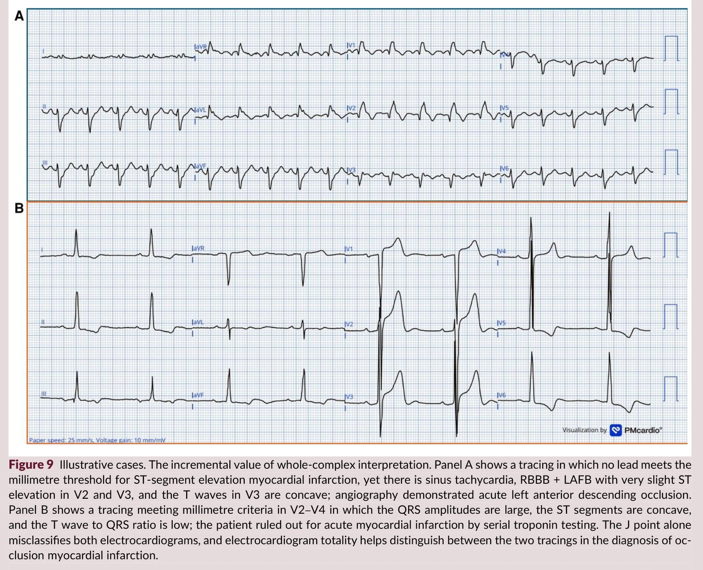

### 所以在急診你要怎麼做?

回到五宮格:**Rate → Rhythm → Axis → Interval → Ischemia**。

**totality這條原則，本質上就是在說:不要跳過前面四格，直接殺到第五格的J點。**

**節律**(誰在發電、跳多快)慢了 ➜ 想SA node，也就是**RCA或LCx**;**傳導**(電走到心室的那條路通不通)變了 ➜ 想**LAD**、電軸轉了(想LAFB)、Q波長出來了(想acuteness)。**這些全部都是Ischemia那一格的線索，只是它們不住在那一格裡。**

### ⚠️ 陷阱:這條原則最大的問題是「誰在判讀」

作者自己列出的限制，我覺得非常誠實，一定要照抄:

**整體判讀需要訓練。它在非專家中心的再現性尚未確立。若未經訓練就貿然採用整體判讀，可能增加偽陽性的心導管室啟動。**

**熊評論:** 這句話要跟前面那個「41%→86%」放在一起讀才公道。**86%那個數字是「有經驗的判讀者」做出來的**，不是隨便一個人看完整張ECG就有86%。

所以我的態度是:**整體判讀不是「把ECG多盯幾秒鐘」，而是「知道該掃哪幾個地方」。** 前者會讓你亂call，後者才會讓你擋下OMI。

## 原則六｜Surrogacy 代理性:ECG看得到的，永遠不是血管本身

**ECG反映的是心肌細胞當下的電生理狀態，不是冠狀動脈的通暢度。它是用來修正阻塞的pretest probability，不是用來定義阻塞。**

六條裡面最抽象的一條，但我認為是**最核心**的一條。因為它同時界定了ECG的**價值**與**極限**。

### 為什麼ECG不等於血管?四組數字

**<mark style="background-color: lightgreen">① 看起來塞住的，可能已經通了</mark>**

- PAMI試驗合併分析，2507例接受primary PTCA的病人:**在初次血管攝影時，16%已經有自發性的TIMI-3血流。**[^18]

**<mark style="background-color: lightgreen">② 看起來塞住的，可能沒那麼塞</mark>**

- Koyama等人2002年，對疑似MI病人在到院當下立即做血管攝影:[^19]
  - 279例疑似**STEMI**:94%有顯著冠狀動脈病灶，**75%有冠狀動脈阻塞或血流受限**
  - 125例疑似**NSTEMI**:90%有顯著病灶，**63%有冠狀動脈阻塞或血流受限**
- **兩組的院內死亡率相當**(4.7% vs 5.6%)
- **疑似NSTEMI的病人裡，有六成三的人血管是塞的或血流受限的。而他們的死亡率跟STEMI一樣。**

**<mark style="background-color: lightgreen">③ 被叫做NSTEMI的人，四分之一血管是塞的</mark>**

- 7篇研究、40,777例NSTEMI病人的統合分析:[^20]
  - **25.5%(10,415例)存在阻塞性罪犯血管**
  - 分布以下側壁為主:**40%右冠狀動脈、33%左迴旋支**
  - 短期全因死亡**相對風險(RR) 1.67(95% CI 1.31–2.13)**
- **為什麼是RCA和LCx?** 回去看reciprocity那一節:**因為那兩個區域的鏡子最容易互相抵銷，也最容易沒有直接對應的導程。**
- <mark>**四個NSTEMI裡面有一個血管是塞的，而且他的死亡風險高出六成七。這就是OMI典範存在的理由。**</mark>

**<mark style="background-color: lightgreen">④ 那ECG到底能幹嘛?</mark>**

- 回到那808例的數字:**整體判讀86%／91%，STEMI準則41%／94%。**[^4]
- **86%已經是很好的工具了。但86%不是100%。**

### 所以在急診你要怎麼做?

這條原則的操作方式，其實就一句話:

**把ECG當成「修正機率」的其中一項證據(它負責把你心裡原本的機率往上推或往下拉，不負責給答案)，跟病史、POCUS、troponin動力學一起算。不要把它當唯一或最終的判準。**

舉例來說:

- **ECG陰性 + 病人還在痛 ➜ pretest probability幾乎沒被動到，還沒降到可以回家。** 重做ECG(回到原則一)。
- **ECG陽性 ➜ 不是「ECG說了算」，是「機率被推高了」。** 補POCUS、補serial troponin、把證據堆起來。
- **Call CV man的時候，不要跟他吵「符不符合criteria」，要給他證據。** 這是我一直在講的**證據堆疊法**。

### ⚠️ 陷阱:這條原則沒辦法被驗證

這是我讀完整篇覺得最有意思的一段。作者自己承認:

**surrogacy這條原則，無法用任何以ECG定義的參考標準去驗證，因為血管攝影一定是在做完ECG之後，中間可能已經發生自發性再灌流。**

**翻成白話文就是:你永遠沒辦法證明「那一刻ECG講的對不對」，因為等你看到血管的時候，已經不是那一刻了。**

這也回頭解釋了為什麼上面那個16%的自發性TIMI-3這麼重要。

**熊評論:** 我覺得surrogacy這條原則的真正價值，不在於它教你怎麼判讀，而在於它**幫你把ECG放回它該在的位置**。

ECG不是法官，是證人。而且是一個講話很快、但講得含糊、有時候還會看錯的證人。

**你要做的不是相信它，是交叉詰問它:問它是幾點做的、問它有沒有第二個證人、問它會不會看錯。**

## 六條一起看:一張表

| 原則 | 一句話 | 帶進急診的數字 | 最常見的假陽性／陷阱 |
|---|---|---|---|
| **Dynamicity** 動態性 | ECG是照片不是動態電影 | 症狀變化就重做;專家提前診斷中位數**1.3小時** | reperfusion讓ECG變好看，但可能再塞 |
| **Acuteness** 急性程度 | 問心肌死到哪，不要問痛多久 | T波還胖、Q波還沒長→心肌還在;**1小時內就診者53%已有Q波** | 「痛48小時」不等於沒救;初始troponin <strong>14.4%</strong>是正常的 |
| **Reciprocity** 對應性 | 每片缺血在對面都有鏡子 | 下壁STE→**aVL(明確者100%)**;**V1–V4 STD對OMI特異度97%** | LVH／預激／LBBB形態相同;多血管病灶會互相抵銷 |
| **Proportionality** 比例性 | 相對於他自己的QRS，不是相對於1 mm | LBBB／paced:**STE/S ≥ 0.25**;LV動脈瘤:**T/QRS ≥ 0.36** | 公式不能跨族群、跨導程亂搬 |
| **Totality** 整體性 | 不要只盯J點 | 整體判讀 **41%→86%**;<strong>29%</strong>透壁梗塞沒Q波;<strong>43%</strong>的LAD阻塞V2–V6全上凹 | 需要訓練;未受訓者亂用會增加偽陽性啟動 |
| **Surrogacy** 代理性 | ECG是證人不是法官 | NSTEMI中<strong>25.5%</strong>血管是塞的(死亡RR **1.67**) | 這條原則本身無法被驗證(血管攝影在ECG之後) |

## ↩️Back to case:那兩張ECG，用六條規則跑一遍

回到開頭那個40歲男性。

**第一張ECG([Fig. 1](#fig-case-ecg1)):** 下壁與前壁T波偏大，但V3的S波太深、紙上印不下，被切掉了。AI判讀:未偵測到OMI。

用六條原則看這張:

- **Proportionality** ➜ 這正是問題所在。**S波被截斷，你就量不出T波相對QRS的比例。** 這張ECG不是「沒有比例性異常」，是「比例性無法評估」。**「測不到」跟「正常」是兩件完全不同的事。**
- **Totality** ➜ R波遞增消失等等整體變化，在這張就看得到。
- **Surrogacy** ➜ 最關鍵的一點:**這個病人在這一刻就已經有真正的冠狀動脈阻塞了。** ECG沒看出來，不代表血管沒塞。**作者的立場很明確:即使在Fig. 1這個當下，就應該啟動心導管室。理由不是ECG夠明確，而是這個病人確實有ACO。**
- **Dynamicity** ➜ 所以你要做的是:**16分鐘後再做一張。**

**第二張ECG([Fig. 2](#fig-case-ecg2)，16分鐘後):** T波變得明顯更不成比例地巨大，合併終末T波倒置。AI判讀:OMI，而且形態介於active與reperfused之間。

- **Dynamicity** ➜ 兩張之間的變化本身就是診斷。
- **Proportionality** ➜ 現在比例性可以評估了，而且是異常的。
- **Acuteness** ➜ 終末T波倒置＋T波仍巨大 ➜ 這是**還有心肌可以救**的形態。

**第一張不確定的時候，要知道自己不確定在哪裡。這張的問題是S波被截斷、比例性測不出來，那就去把它測出來，或者去拿第二個證據。**

## AI這一節:演算法也逃不掉surrogacy

這篇文章有一整節在講AI，我覺得立場拿捏得不錯。

它對AI的描述，我整理成四點:

1. **AI量的，就是這六條原則裡的四條。** 下面「AI在做的事」那段會拆開講。
2. **只吃一張ECG的模型，看不到dynamicity。** 要能吃進好幾張連續ECG的模型，才量得到前後的變化跟再灌流。
3. **成績單要打折看。** 目前的數字大多來自回溯性研究，而且比較的對象多半是STEMI準則，不是專家的OMI判讀。作者自己說，拿STEMI準則來比是「a low bar」。
4. **AI會標出它是看哪幾個導程、哪一段做出判斷**(explainability maps)，用意是幫專家看，不是取代專家。作者認為下一步是把AI ECG、hs-troponin的變化、POCUS看到的LV wall motion和臨床資料，合成一個「塞住的機率」，但這還在研究階段。

### 數字

**Herman等人2024年**，一個經外部驗證、跨多國世代測試的深度學習模型:[^22]

|  | 敏感度 | 特異度 |
|---|---|---|
| **AI模型** | **80.6%**(95% CI 76.8–84.0) | **93.7%** |
| STEMI準則(盲性應用) | 32.5%(95% CI 28.4–36.6) | 97.7% |

**敏感度從32.5%變成80.6%，特異度只從97.7%掉到93.7%。** 而且**在沒有STE的病人身上也抓得到**。

另外有一項多中心美國登錄研究顯示，同一套AI方法改善了診斷準確度，並**減少偽陽性的STEMI心導管室啟動**(Herman 2026)。[^23]

### AI在做的事，其實就是這六條

文章講得很好:深度學習模型在毫秒之內量化的，正好就是這六條原則:

- 配對STD/STE向量 ➜ **reciprocity**
- T波下面積、Q波形態 ➜ **acuteness**
- ST-T相對QRS幅度 ➜ **proportionality**
- 節律、傳導、電軸、全體QRST特徵 ➜ **totality**

### 可是，演算法也看不到血管

<mark>**surrogacy這條原則，對AI演算法(就是前面講的那個深度學習模型，Queen of Hearts那一類)一樣成立。演算法跟你一樣，只看得到心電圖，看不到冠狀動脈。**</mark>

這句話我覺得是整篇文章最重要的一句。**AI不會比ECG本身知道得更多。它只是把ECG榨得比較乾。**

所以文章的結論是:**AI心電圖模型應該「修正」而不是「取代」啟動心導管室的決策**，跟ECG本身的角色完全一致。

## 一點感想

這六條原則，沒有一條是新的。

Bischof那篇是2016年、Smith那篇是2006年、Raitt那篇是1995年。**這些東西早就在那裡了。**

這篇作者自己也講得很清楚:**它沒有提出新原則，它做的是「把既有原則重新組織、並連結回冠狀動脈的病理生理」。**

那為什麼還是值得讀?

因為**在這篇之前，這六件事是散的**。你在Smith的blog學到proportionality、在大師阿嬤的ECG Weekly學到reciprocity、在Grauer那裡學到要看整張、在某一次差點放人回家的驚嚇裡學到dynamicity。它們在你腦袋裡是六個互不相干的習慣。

**這篇把它們串成一條可以教給別人、也可以拿來檢查自己的鏈子。**

而我最喜歡的，是它最後那條surrogacy。

**它等於在跟你說:這六條原則加起來，還是不會讓你變成透視眼。** ECG永遠只是那個站在門口的證人。**它講得快，但講得含糊。**

所以那個40歲男性的16分鐘，才那麼重要。

**不是因為第二張ECG比較漂亮。是因為那16分鐘裡，有一個人決定不要放他走。**

那個人是ED man。

**而那16分鐘裡面他做的事情，就叫做擋下OMI。**

拜託多多來光顧本站，看心電圖，保平安😅

講到這裡，順便自己推銷一下。
2024年我寫過一篇 [How to detect OMI in 10 Steps?](https://agoodbear.com/post/ecg-post-2/)，把「怎麼在一張ECG上一步一步找OMI」拆成十個步驟，從排除artifact開始，一路走到各種STE/STD的情境。
那篇是**操作手冊**，這篇是**心法**。
六條原則講的是「為什麼要這樣看」，十個步驟講的是「實際上手怎麼看」。兩篇搭著讀，效果會比較好。

## 學習重點:

1. **STEMI毫米門檻不是用血管攝影當Gold Standard推導出來的，也沒把比例性納入。** 所以它對ACO的敏感度只有**43.6%(95% CI 34.7–52.9%)**。沒塞住的人它幾乎不會誤判，真的塞住的人它有一半以上抓不到。
2. **Dynamicity:ECG是照片不是電影。** 症狀變化就重做。專家判讀可以比STEMI準則提前**中位數1.3小時**。而且要知道:**有38%的LAD完全阻塞，從頭到尾沒有一張ECG會達到STEMI準則**。那不是「等久一點」的問題。
3. **Acuteness:不要用「痛多久」決定救不救，要用ECG判斷還剩多少可搶救心肌。** 症狀1小時內就診者，**53%初診ECG已經有異常Q波**;而胸痛48小時的病人，可能仍有心肌可救。**兩個方向的錯都會發生。**
4. **Reciprocity:每一片缺血的心肌在對面都有鏡子。** 下壁STE一定要看**aVL**(明確的下壁STEMI是100%;但subtle那一群只有**90.7%**);**V1–V4的缺血性STD對OMI特異度97%**。**但鏡子會互相抵銷**:多血管病灶、left dominant合併近端LCx阻塞，就是silent OMI的來源。
5. **Proportionality:1 mm在誰身上，意義不一樣。** 三個切點記起來:LBBB／paced用**STE/S ≥ 0.25(25%)**、LV動脈瘤用**T/QRS ≥ 0.36**、前壁subtle STE用Smith 4 variable formula。**HATW只能靠比例判斷，靠毫米一個都抓不到。**
6. **Totality:不要只盯J點。** 整體判讀把敏感度從**41%拉到86%**，特異度只從94%掉到91%。**29%的透壁梗塞沒有Q波;43%的LAD阻塞，V2–V6全部是上凹的**。上凹不能排除。**但這86%是受過訓練的人做出來的**，未受訓就亂用整體判讀，只會增加偽陽性啟動。
7. **Surrogacy:ECG是證人，不是法官。** NSTEMI病人中<strong>25.5%</strong>罪犯血管是塞的，死亡**RR 1.67(95% CI 1.31–2.13)**;而疑似STEMI的人裡，<strong>16%</strong>在血管攝影時已經自己通了。**ECG是用來修正機率的，不是用來定義阻塞的。** **AI也一樣:演算法跟你一樣，只看得到心電圖，看不到冠狀動脈。**
8. **這六條原則沒有一條是新的。新的是把它們串起來。** 招式(那20個OMI ECG finding)會一直變多，心法只有這六條。

## 參考資料:

> 本文引用之圖片，著作權均歸原作者與出版者所有，此處僅作醫學教育說明之用，並已於各圖圖說標明出處。

[^1]: Helseth HC, Mansur P, El-Baba M, McLaren JTT, de Alencar JN, Smith SW. Electrocardiographic principles for the diagnosis of occlusion myocardial infarction. Eur Heart J Acute Cardiovasc Care. 2026. DOI: 10.1093/ehjacc/zuag114
[^2a]: Menown IB, Mackenzie G, Adgey AA. Optimizing the initial 12-lead electrocardiographic diagnosis of acute myocardial infarction. Eur Heart J. 2000;21(4):275-283. PMID: 10653675. DOI: 10.1053/euhj.1999.1748；The Joint European Society of Cardiology/American College of Cardiology Committee. Myocardial infarction redefined—a consensus document of the Joint European Society of Cardiology/American College of Cardiology Committee for the Redefinition of Myocardial Infarction. Eur Heart J. 2000;21(18):1502-1513. PMID: 10973764／J Am Coll Cardiol. 2000;36(3):959-969. PMID: 10987628
[^2]: Macfarlane PW, Browne D, Devine B, et al. Modification of ACC/ESC criteria for acute myocardial infarction. J Electrocardiol. 2004;37 Suppl:98-103. PMID: 15534817. DOI: 10.1016/j.jelectrocard.2004.08.032
[^3]: de Alencar Neto JN, et al. Systematic review and meta-analysis of diagnostic test accuracy of ST-segment elevation for acute coronary occlusion. Int J Cardiol. 2024;402:131889. PMID: 38382857. DOI: 10.1016/j.ijcard.2024.131889
[^4]: Meyers HP, Bracey A, Lee D, Lichtenheld A, Li WJ, Singer DD, et al. Accuracy of OMI ECG findings versus STEMI criteria for diagnosis of acute coronary occlusion myocardial infarction. Int J Cardiol Heart Vasc. 2021;33:100767. PMID: 33912650. PMCID: PMC8065286. DOI: 10.1016/j.ijcha.2021.100767
[^5]: Lemkes JS, Janssens GN, van der Hoeven NW, et al. Timing of revascularization in patients with transient ST-segment elevation myocardial infarction: a randomized clinical trial. Eur Heart J. 2019;40(3):283-291. PMID: 30371767. DOI: 10.1093/eurheartj/ehy651
[^6]: Raitt MH, Maynard C, Wagner GS, Cerqueira MD, Selvester RH, Weaver WD. Appearance of abnormal Q waves early in the course of acute myocardial infarction: implications for efficacy of thrombolytic therapy. J Am Coll Cardiol. 1995;25(5):1084-8. PMID: 7897120
[^7]: Corey KE, Maynard C, Pahlm O, et al. Combined historical and electrocardiographic timing of acute anterior and inferior myocardial infarcts for prediction of reperfusion achievable size limitation. Am J Cardiol. 1999;83(6):826-831. PMID: 10190393
[^8]: Schömig A, Mehilli J, Antoniucci D, et al. Mechanical reperfusion in patients with acute myocardial infarction presenting more than 12 hours from symptom onset: a randomized controlled trial (BRAVE-2). JAMA. 2005;293(23):2865-72. PMID: 15956631
[^9]: Wereski R, Kimenai DM, Taggart C, et al. Cardiac Troponin Thresholds and Kinetics to Differentiate Myocardial Injury and Myocardial Infarction. JAMA Cardiol. 2020;5(11):1302-1304. PMCID: PMC7675101. DOI: 10.1001/jamacardio.2020.2867
[^10]: Bischof JE, Worrall C, Thompson P, Marti D, Smith SW. ST depression in lead aVL differentiates inferior ST-elevation myocardial infarction from pericarditis. Am J Emerg Med. 2016;34(2):149-154. PMID: 26542793. DOI: 10.1016/j.ajem.2015.09.035
[^11]: Meyers HP, Bracey A, Lee D, et al. Ischemic ST-Segment Depression Maximal in V1-V4 (Versus V5-V6) of Any Amplitude Is Specific for Occlusion Myocardial Infarction. J Am Heart Assoc. 2021;10(23):e022866. PMID: 34775811. PMCID: PMC9075358. DOI: 10.1161/JAHA.121.022866
[^12]: Aslanger E, Yıldırımtürk Ö, Şimşek B, et al. DIagnostic accuracy oF electrocardiogram for acute coronary OCClUsion resuLTing in myocardial infarction (DIFOCCULT Study). Int J Cardiol Heart Vasc. 2020;30:100603.
[^13]: Smith SW, Dodd KW, Henry TD, Dvorak DM, Pearce LA. Diagnosis of ST-elevation myocardial infarction in the presence of left bundle branch block with the ST-elevation to S-wave ratio in a modified Sgarbossa rule. Ann Emerg Med. 2012;60(6):766-76. PMID: 22939607. DOI: 10.1016/j.annemergmed.2012.07.119
[^14]: Klein LR, Shroff GR, Beeman W, Smith SW. Electrocardiographic criteria to differentiate acute anterior ST-elevation myocardial infarction from left ventricular aneurysm. Am J Emerg Med. 2015;33(6):786-90. PMID: 25862248. DOI: 10.1016/j.ajem.2015.03.044
[^15]: Meyers HP, Simančík F, Herman R, et al. Hyperacute T Waves Are Specific for Occlusion Myocardial Infarction, Even Without Diagnostic ST-Segment Elevation. JACC Adv. 2025;4(10 Pt 2):102120. PMID: 40892623. PMCID: PMC12791876. DOI: 10.1016/j.jacadv.2025.102120
[^16]: Moon JCC, De Arenaza DP, Elkington AG, et al. The pathologic basis of Q-wave and non-Q-wave myocardial infarction: a cardiovascular magnetic resonance study. J Am Coll Cardiol. 2004;44(3):554-560. PMID: 15358019
[^17]: Smith SW. Upwardly concave ST segment morphology is common in acute left anterior descending coronary occlusion. J Emerg Med. 2006;31(1):69-77. PMID: 16798159. DOI: 10.1016/j.jemermed.2005.09.008
[^18]: Stone GW, Cox D, Garcia E, et al. Normal flow (TIMI-3) before mechanical reperfusion therapy is an independent determinant of survival in acute myocardial infarction: analysis from the primary angioplasty in myocardial infarction trials. Circulation. 2001;104(6):636-41. PMID: 11489767
[^19]: Koyama Y, Hansen PS, Hanratty CG, Nelson GI, Rasmussen HH. Prevalence of coronary occlusion and outcome of an immediate invasive strategy in suspected acute myocardial infarction with and without ST-segment elevation. Am J Cardiol. 2002;90(6):579-84. PMID: 12231080
[^20]: Khan AR, Golwala H, Tripathi A, et al. Impact of total occlusion of culprit artery in acute non-ST elevation myocardial infarction: a systematic review and meta-analysis. Eur Heart J. 2017;38(41):3082-3089. PMID: 29020244. DOI: 10.1093/eurheartj/ehx418
[^21]: Meyers HP, Sharkey SW, Herman R, de Alencar JN, Shroff GR, Frick WH, Smith SW. Failure of standard contemporary ST-elevation myocardial infarction electrocardiogram criteria to reliably identify acute occlusion of the left anterior descending coronary artery. Eur Heart J Acute Cardiovasc Care. 2025;14(7):403-411. PMID: 40717627. DOI: 10.1093/ehjacc/zuaf037
[^22]: Herman R, Meyers HP, Smith SW, et al. International evaluation of an artificial intelligence-powered ECG model detecting acute coronary occlusion myocardial infarction. Eur Heart J Digit Health. 2024;5(2):123-133. PMID: 38505483. PMCID: PMC10944682. DOI: 10.1093/ehjdh/ztad074
[^23]: Herman R, Mumma BE, Hoyne JD, Cooper BL, Johnson NP, Kisova T, et al. AI-Enabled ECG Analysis Improves Diagnostic Accuracy and Reduces False STEMI Activations: A Multicenter U.S. Registry. JACC Cardiovasc Interv. 2026;19(2):145-156. PMID: 41158088. DOI: 10.1016/j.jcin.2025.10.018
[^g2014]: Amsterdam EA, Wenger NK, Brindis RG, et al. 2014 AHA/ACC Guideline for the Management of Patients with Non-ST-Elevation Acute Coronary Syndromes. J Am Coll Cardiol. 2014;64(24):e139-e228. PMID: 25260718. DOI: 10.1016/j.jacc.2014.09.017
[^g2025]: Rao SV, O’Donoghue ML, Ruel M, et al. 2025 ACC/AHA/ACEP/NAEMSP/SCAI Guideline for the Management of Patients With Acute Coronary Syndromes. J Am Coll Cardiol. 2025;85(22):2135-2237. PMID: 40013746. DOI: 10.1016/j.jacc.2024.11.009
[^udmisteps]: Thygesen K, Alpert JS, White HD. Universal definition of myocardial infarction. J Am Coll Cardiol. 2007;50(22):2173-2195. PMID: 18036459（Table 3）；Wagner GS, Macfarlane P, Wellens H, et al. AHA/ACCF/HRS recommendations for the standardization and interpretation of the electrocardiogram: part VI: acute ischemia/infarction. J Am Coll Cardiol. 2009;53(11):1003-1011. PMID: 19281933；Thygesen K, Alpert JS, Jaffe AS, et al. Third universal definition of myocardial infarction. J Am Coll Cardiol. 2012;60(16):1581-1598. PMID: 22958960（Table 3）；Thygesen K, Alpert JS, Jaffe AS, et al. Fourth Universal Definition of Myocardial Infarction (2018). Circulation. 2018;138(20):e618-e651. PMID: 30571511（Table 2）；Mills NL, Newby LK, Zaman S, et al. Fifth Universal Definition of Myocardial Infarction (2026). Circulation. 2026. DOI: 10.1161/CIR.0000000000001477（§13、Table 5）
[^subendo]: Strauss DG, Schocken DD. Marriott's Practical Electrocardiography. 13th ed. Wolters Kluwer; 2021: Chapter 6（Introduction to Myocardial Ischemia and Infarction）；Goldberger AL, Goldberger ZD, Shvilkin A. Goldberger's Clinical Electrocardiography: A Simplified Approach. 9th ed. Elsevier; 2018: Chapter 10
[^smithbook]: Smith SW, Zvosec DL, Sharkey SW, Henry TD, eds. The ECG in Acute MI: An Evidence-Based Manual of Reperfusion Therapy. Philadelphia: Lippincott Williams & Wilkins; 2002: Chapter 11（Q Waves）, p. 96-97
[^riley]: Riley RF, Newby LK, Don CW, et al. Diagnostic time course, treatment, and in-hospital outcomes for patients with ST-segment elevation myocardial infarction presenting with nondiagnostic initial electrocardiogram: a report from the American Heart Association Mission: Lifeline program. Am Heart J. 2013;165(1):50-56. PMID: 23237133. PMCID: PMC3523309. DOI: 10.1016/j.ahj.2012.10.027
