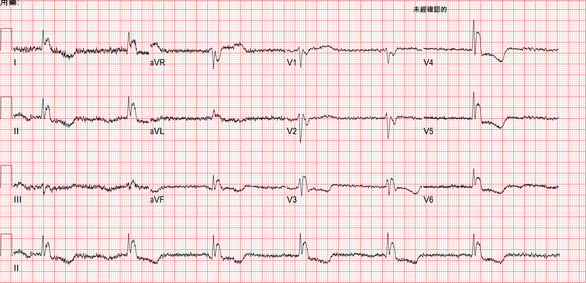
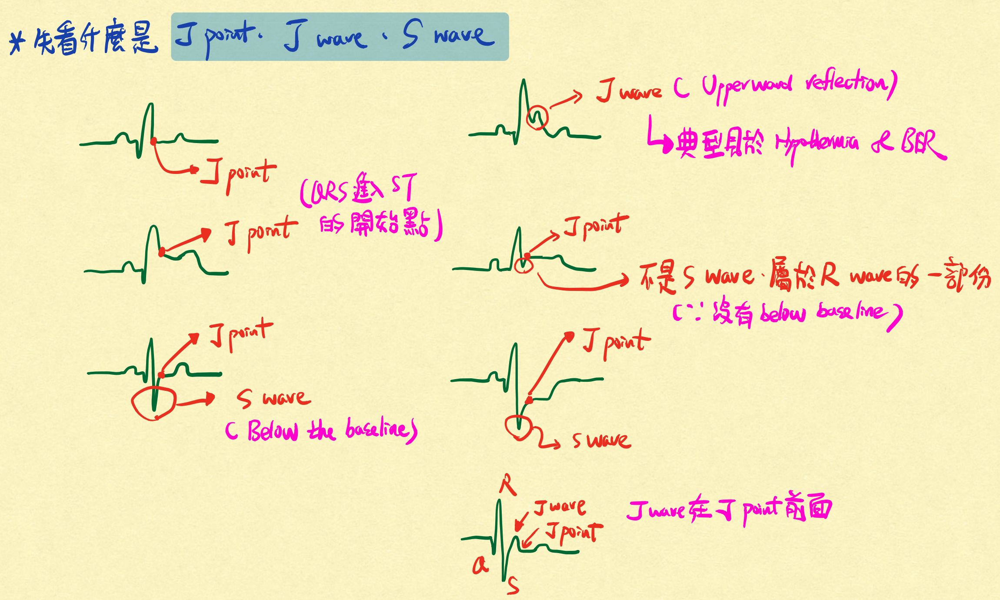
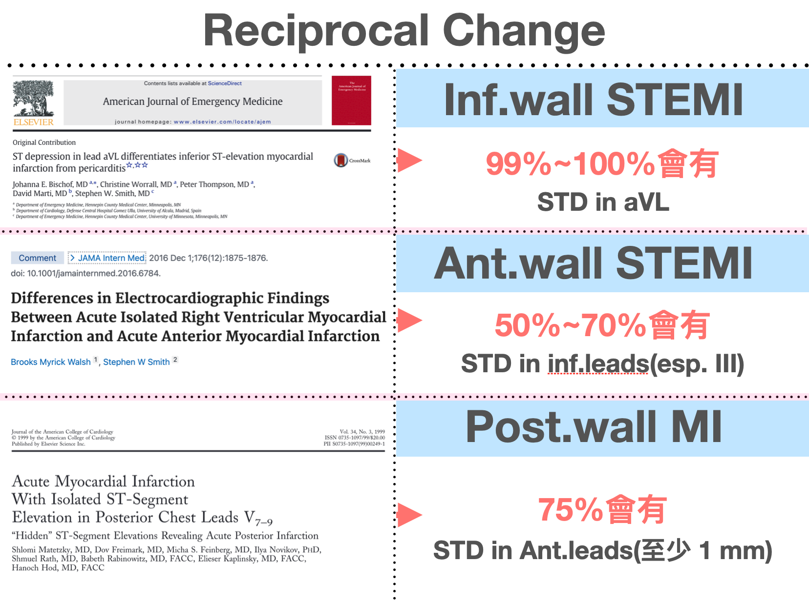
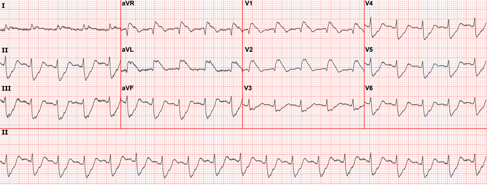
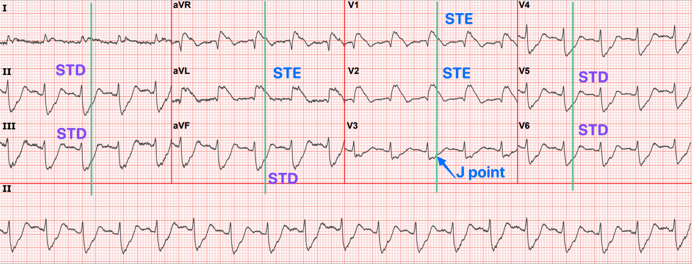
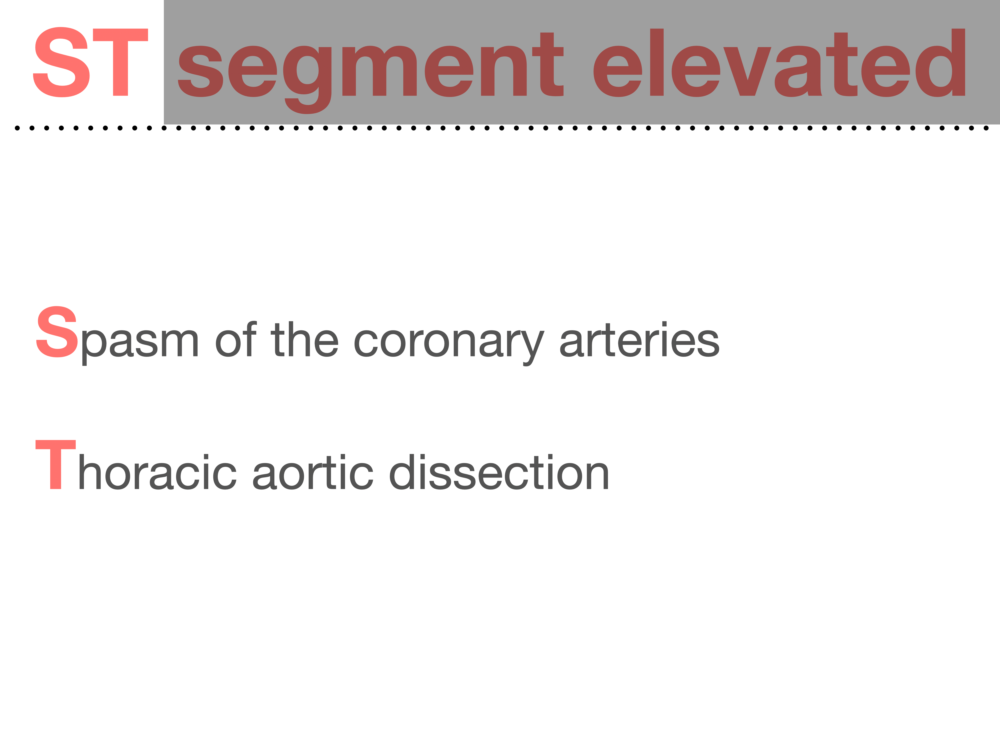
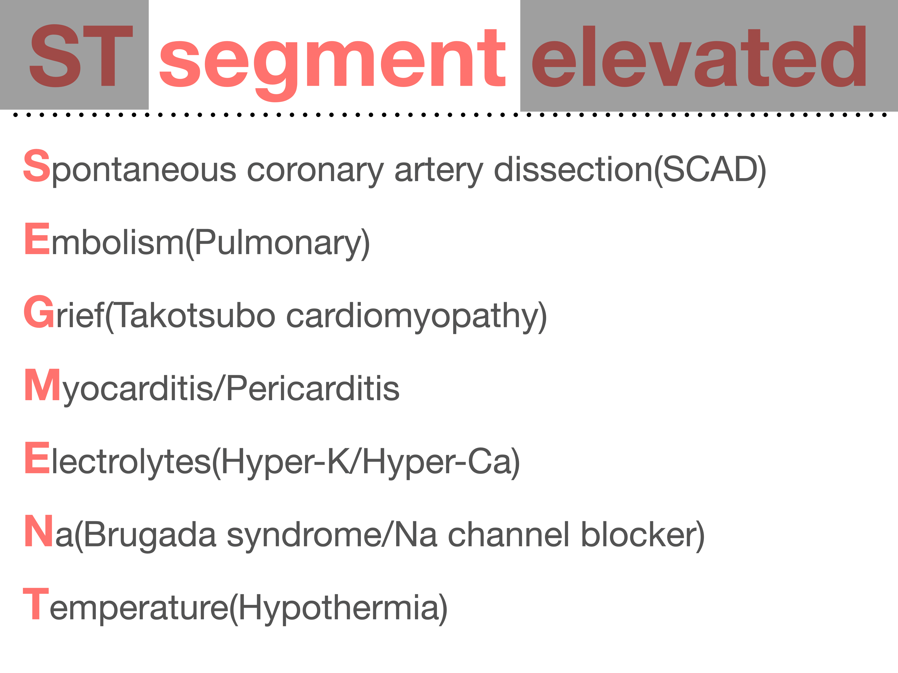
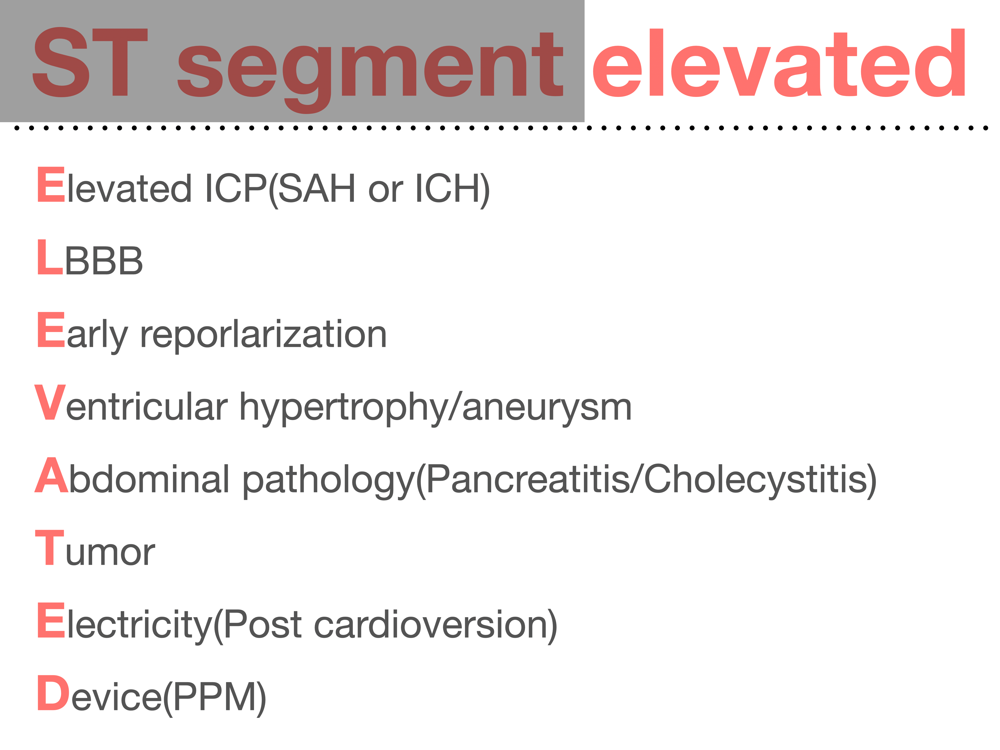
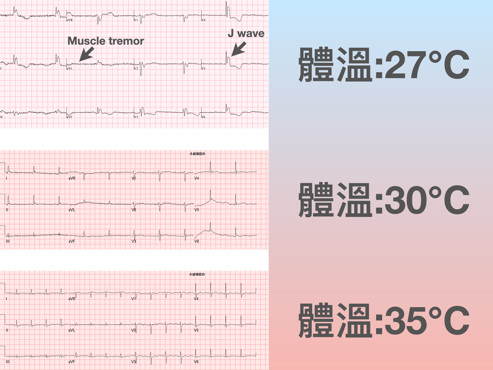

Today's case is a fun one~~

I first saw it in the LINE group our Yilan County Fire Department uses for prehospital ECGs.

xx91..... heading to NYCU Hospital

Let's look at this prehospital ECG first

Shaky baseline, very slow rate, looks like there might be STE — that was my first impression the moment I saw a fellow EMT upload this ECG to the LINE group.

# I find this one really interesting, because this ECG is bait sitting there for whoever bites

I followed up on how this case went afterward. Let me walk you through it.

This is the ECG on arrival

It's actually not far off from the prehospital ECG.

---

**Let's use the prehospital ECG. First, a few questions to ask.**

1. Is there STE?
2. Why is the baseline shaking like this?
3. Why so slow?

Is there STE? Because that decides whether we're about to call the CV man right away.

First we need to know where the J point is. Because whether there's STE or STD depends on whether the J point sits above or below the baseline.

**<u>The J point is defined as where the QRS ends and the ST segment begins</u>**

The image below is one I use a lot in my digital notes, so I can quickly review J point & J wave & S wave

In the <u>2nd from the left</u>, the J point is above the baseline, so it's STE

In the <u>3rd from the right</u>, the J point is below the baseline, so it's STD

So............ what's a J wave XD

A J wave is an **upward deflection before the J point** (in aVR and V1 it deflects downward) ➔ the <u>4th from the right</u> clearly shows a J wave before the J point

#### So does the prehospital ECG have STE or not?

First, you have to build a habit: when you see STE, first confirm it really is STE. The way to confirm is what I just said — find the J point first!!!! (Step 1)

Look at the 12 leads in Fig 3: Lead I/II/aVL/aVF/V4/V5/V6 all seem to have STE, and finding the J point there may not be so easy. So let's find it in another lead.

In V1 it's actually pretty obvious where the J point is. Once we find the J point in one lead, the next step is to measure the QRS width. (Step 2)

Then take that QRS width and lay it over the leads we thought had STE, and you'll find that what we thought was STE actually all falls within the QRS width.

#### So the leads we suspected of STE have no STE at all

{}

Step 1➔ Find the J point

Step 2➔ Find the QRS width

Step 3➔ Map the QRS width onto the leads we think have STE.

{}

---

#### Case continued

The ED doctor at the time saw what looked like STE, so they called the CV man right then, and the CV man also recommended cath. But the family didn't want aggressive resuscitation, so they didn't want to go further with cath either.

When I look back at these cases that **weren't mine**, I have a habit of asking myself some questions.

##### <mark>If I'd seen this ECG back then, could I have recognized it?</mark>

Besides what I just said — when you see STE, reflexively go find the J point first to confirm whether there really is STE.

You also need to pair it with whether the patient has relevant history, ACS S/S, and so on, which raises the pretest probability of AMI. Why?

ACS symptoms come from reduced coronary blood flow causing myocardial hypoxia. When a patient has typical ACS symptoms — chest pain, dyspnea, diaphoresis, nausea, or epigastric pain — these symptoms are associated with MI, so they raise the pretest probability of MI. That means when diagnosing MI in patients with these symptoms, the predicted likelihood of MI is higher than in patients without them.

So reading the ECG together with relevant history and ACS S/S (**like how you've got to have popcorn at the movies**) is how you diagnose AMI effectively and accurately.

**Per the chart, this patient was found lying in bed with lots of empty pill packets around her — suspected overdose. On arrival she was not alert, so we couldn't get any symptom history from her at all; we had to rely on the family.**

AMI less often causes altered consciousness, except when the infarct has gone on so long that cardiac output is affected, causing hypotension (cardiogenic shock).

So altered consciousness + this ECG ➔ you may already want to put a question mark on it

Also, looking closer at this prehospital ECG: say our eyes get drawn to the suspected STE in II/aVF. Its reciprocal pair, I/aVL, doesn't show the corresponding reciprocal STD change — instead I/aVL show the same suspected STE pattern as II/aVF. At this point the question mark should get bigger. Because with an inf. wall STEMI, you'll mostly see corresponding STD in I/aVL.

**For the rates of reciprocal STD change in each type of STEMI, see the figure below (Fig.4).**

---

I also want to bring up another case that mirrors this one, to read side by side.

**This prehospital ECG case has no STE, but it's easy to mistake it for STE**

**The next case has STE, but it's easy to mistake it for no STE**

This case comes from this post by Dr. Smith [^1]

**Can we tell at a glance that this is a STEMI?**

I think some people can, but a lot of people will hesitate and just think the QRS is very wide.

Dr. Smith often says: **<mark>When the QRS is wide, the J-point will hide. So, your next step is to Trace it down, and Copy it over</mark>**

In plain words: when the QRS widens, the J point easily gets hidden. What we need to do is find the J point, measure the true QRS width, lay it over the other leads, and see whether there's STE we missed.

How to break down this ECG: use the method I described before. First find where the J point is. On this 12 lead ECG, I think the J point is easiest to see in V3. Draw a vertical line through that J point and you can see V1/V2 both have STE.

Lay V3's true QRS width over the other leads and you can see II/III/aVF all have STD and aVL has STE ➔ at this point you can practically say outright that the proximal LAD is occluded!!!!

This is qR-pattern RBBB + LAFB, giving the ECG look in Fig.5.

This ECG pattern is one of the highest-risk OMIs ➔ possibly with cardiogenic shock and a high incidence of VT/Vf

- This paper describes [^2] that some very severe LAD occlusions or LM occlusions present as RBBB+LAFB ➔ these patients have the highest risk of Vf and cardiogenic shock and the highest in-hospital mortality (**AMI for new RBBB alone was 18.8%**)

So our brains are really strange: it's there but we don't see it, it's not there but we see it. **<mark>The key is recognizing the J point</mark>**.

**Looks like STE, but there's no STE ➔ here in the prehospital ECG, once you've nailed the J point's position you know there's no STE. But sometimes the J wave really does pull the J point up, producing real STE. That's a bit like the concept of STEMI mimics (STE without an MI)**

My own mnemonic for STEMI mimics is **ST segment elevated**: each letter is a condition that can produce a STEMI mimic (**the final t on the 2nd image is hypothermia**)

#### Case continued

The patient was then admitted to the ICU.

TnI over the next several days was normal. Cardiology's comprehensive echo was also completely normal.

**One more thing was done in the ICU, after which the ECG gradually normalized.**

### **<mark>Rewarming!!!!!</mark>**

The patient's temperature in the ED was 27℃

So the suspected STE we saw on the prehospital ECG — the upward deflection, downward in aVR/V1 — is **the famous Osborn wave, a.k.a. the J wave**. And the **very shaky baseline** on the prehospital ECG was **ECG artifact from muscle tremor**.

---

# So what ECG findings can hypothermia produce? [^3] [^4]

- **J wave, a.k.a. Osborn wave**: a positive deflection at the end of the QRS complex, usually with J point elevation
  - Generally appears at core temperature < 32°C
  - Its size is inversely proportional to body temperature
  - Quite a few observational studies show that at body temperature < 30°C, every patient has a J wave
  - As the patient rewarms, the J wave shrinks
  - DDx (these conditions may also show it): SAH, acute cardiac ischemia, and normothermic patients
- In moderate hypothermia, **AfSVR** is the most common rhythm, but SB, atrial reentrant rhythm, and JB can also be seen
- Myocardial irritability makes **PVCs** common
- As it progresses to severe hypothermia, the risk of **Vf** and **asystole** rises
- In moderate/severe hypothermia, myocardial conduction/depolarization/repolarization all slow down, **leading to a longer PR interval, AV block, wide QRS, and QT prolongation**
- **marked bradycardia**
- **ECG Artifact from shivering**

<u>Amal Mattu's ECG weekly post also covers a few more concepts about hypothermia:</u> [^5]

- Prolong all interval
  - QT prolong ➔ the ST segment gets longer (Hypo-Ca does this too). **For QT prolongation from a stretched-out ST segment, think hypothermia and Hypo-Ca first — that's it**
- Pseudo STE or STD

<u>Below are the uncommon ECG findings:</u>

- **TWI** ➔ severe hypothermia usually comes with TWI (but Terminal TWI is uncommon); Af is also commonly seen [^6]
- **type 1 Brugada ECG pattern** [^7]
- **Electrical alternans** is an ECG pattern of cyclic beat-to-beat changes in amplitude or axis ➔ many different causes can do this, including AMI, Cardiomyopathy, SVT, VT, hypothermia, Af, or electrolyte imbalance [^8]

---

# How many stages of hypothermia are there? [^9]

| Stage              | Core temperature           | Clinical findings                                 |
| ------------------ | -------------------------- | ------------------------------------------------ |
| Cold stressed, not hypothermic | 35 to 37°C     | Normal mental status, shivering. Functions normally. Able to care for self. |
| Mild               | 32 to 35°C                 | Alert and shivering. Unable to care for self.    |
| Moderate           | 28 to 32°C                 | Altered level of consciousness. May be awake or unconscious, with or without shivering. |
| Severe             | <28°C                      | Unconscious. Not shivering.                      |

> Note: in 2021 the International Commission for Mountain Emergency Medicine (ICAR MedCom) published the Revised Swiss System for field staging. It stages by level of consciousness (AVPU), estimates the risk of hypothermic cardiac arrest rather than core temperature, and no longer uses shivering to define a stage; when core temperature can be measured reliably, the measurement still comes first.[^rss]

# Key points:

1. Where exactly is the J point?
2. Use the steps from the Tips to figure out whether there's really STE
3. Note that RBBB+LAFB is one of the deadliest OMIs — you have to be able to read it. It sometimes gets missed (see the post above)
4. What are the STEMI mimics?
5. What are the ECG findings of Hypothermia?

# **References:**

[^1]: Dr. Smith's ECG Blog: An elderly woman with acute vomiting, presyncope, and hypotension, and a wide QRS complex - [link](http://hqmeded-ecg.blogspot.com/2022/11/an-elderly-woman-with-acute-vomiting.html)
[^2]: Widimsky, P., Rohac, F., Stasek, J., Kala, P., Rokyta, R., Kuzmanov, B., Jakl, M., Poloczek, M., Kanovsky, J., Bernat, I., Hlinomaz, O., Belohlavek, J., Kral, A., Mrazek, V., Grigorov, V., Djambazov, S., Petr, R., Knot, J., Bilkova, D., … Lorencova, A. (2012). Primary angioplasty in acute myocardial infarction with right bundle branch block: should new onset right bundle branch block be added to future guidelines as an indication for reperfusion therapy? __European Heart Journal__, __33__(1), 86–95. https://doi.org/10.1093/eurheartj/ehr291
[^3]: Dr. Smith's ECG Blog: What does LBBB look like in severe hypothermia? Is there a long QT? Is the QT appropriate for the temperature? - [link](http://hqmeded-ecg.blogspot.com/2022/01/what-does-lbbb-look-like-in-severe.html)
[^4]: Dr. Smith's ECG Blog: Hypothermia at 18 Celsius in V Fib arrest: CPR, then ECMO rewarming, for 3 hours, then Defib with ROSC. Interpret the ECG. - [link](http://hqmeded-ecg.blogspot.com/2022/02/hypothermia-at-18-celsius-in-v-fib.html)
[^5]: Amal Mattu’s ECG Case of the Week – March 22, 2021 – ECG Weekly - [link](https://ecgweekly.com/2021/03/amal-mattus-ecg-case-of-the-week-march-22-2021/)
[^6]: Dr. Smith's ECG Blog: Should we activate the cath lab? A Quiz on 5 Cases. - [link](http://hqmeded-ecg.blogspot.com/2023/10/should-we-activate-cath-lab-quiz-on-5.html)
[^7]: Dr. [[Smith's ECG Blog]]: Patient in Single Vehicle Crash: What is this ST Elevation, with Peak Troponin of 6500 ng/L? - [link](http://hqmeded-ecg.blogspot.com/2022/11/patient-in-single-vehicle-crash-what-is.html)
[^8]: Amazon.com: Electrocardiography in Emergency, Acute, and Critical Care: 9781732748606: Amal Mattu, MD, FACEP, Jeffrey A. Tabas, MD, FACEP, William Brady, MD, FACEP, FAAEM: Books - [link](https://www.amazon.com/Electrocardiography-Emergency-Acute-Critical-Care/dp/1732748608)
[^9]: Accidental hypothermia in adults - UpToDate - [link](https://www.uptodate.com/contents/zh-Hans/accidental-hypothermia-in-adults#H2352758494)
[^rss]: Musi, M. E., Sheets, A., Zafren, K., Brugger, H., Paal, P., Hölzl, N., & Pasquier, M. (2021). Clinical staging of accidental hypothermia: The Revised Swiss System. __Resuscitation__, __162__, 182–187. https://doi.org/10.1016/j.resuscitation.2021.02.038
