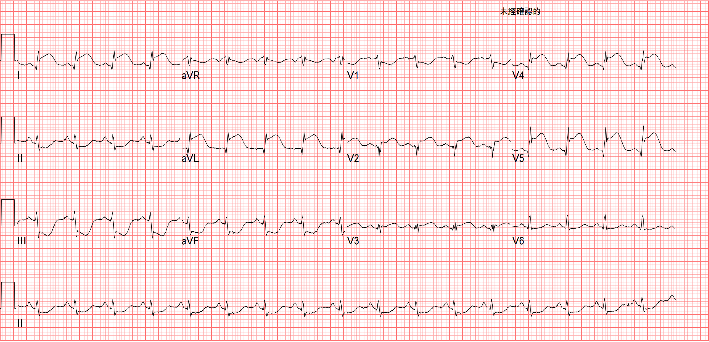
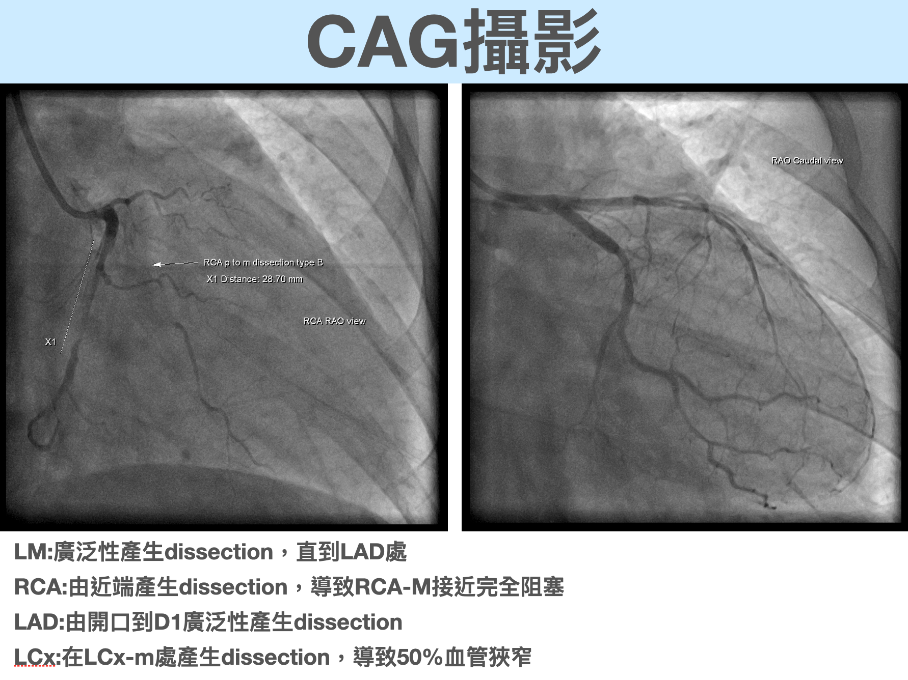
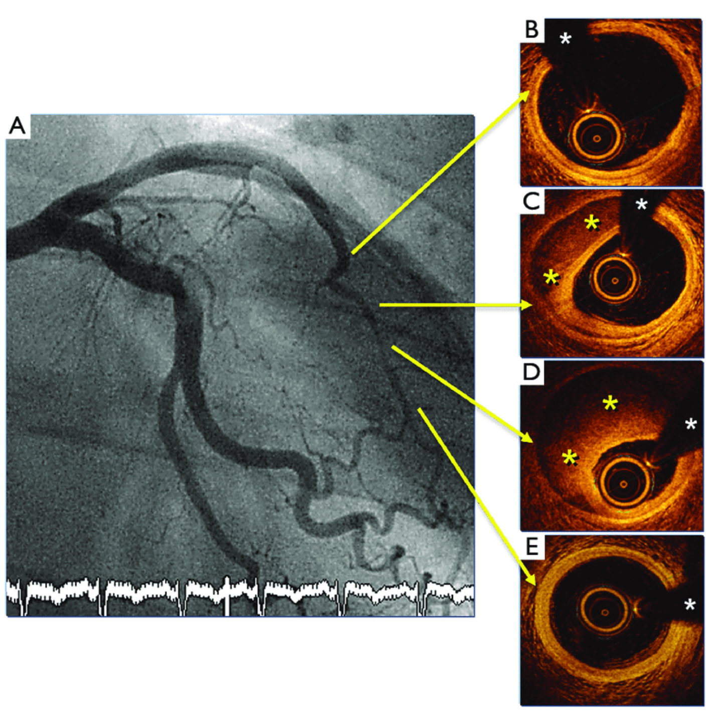
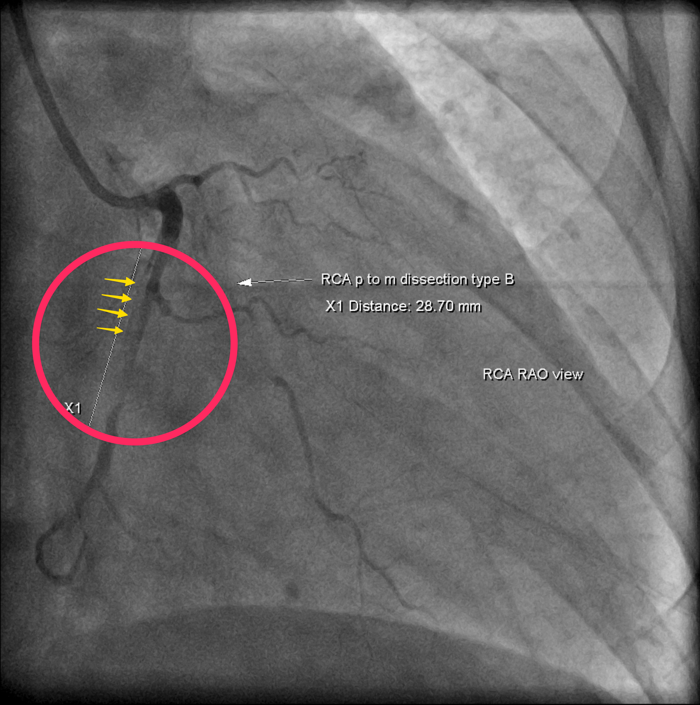
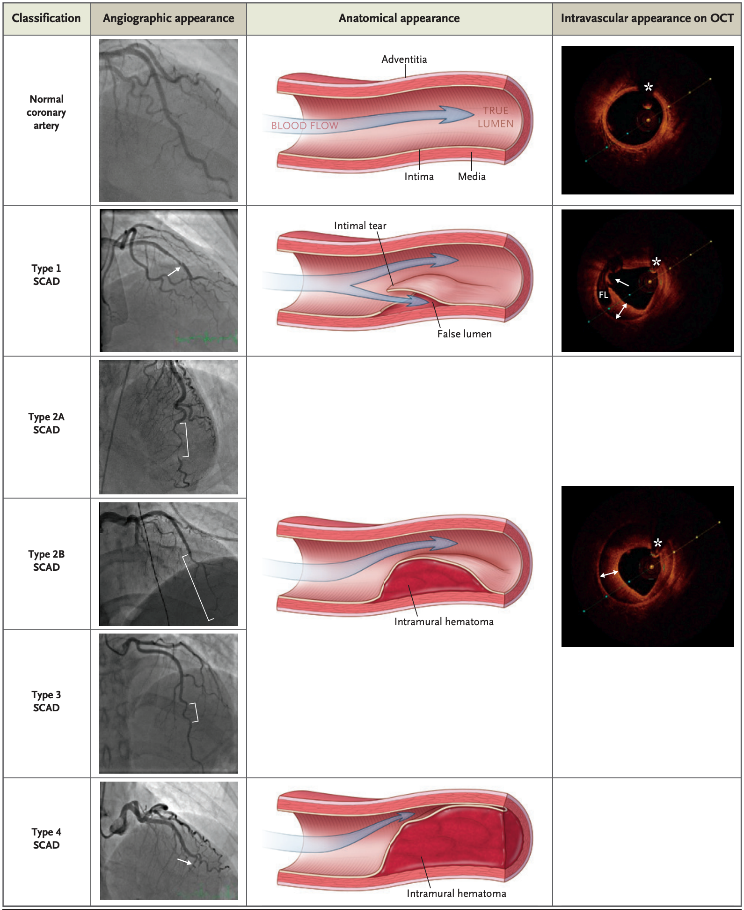
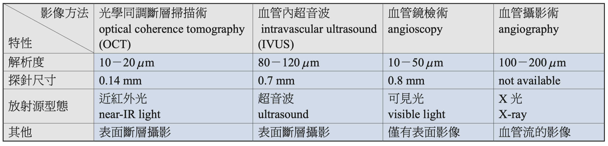
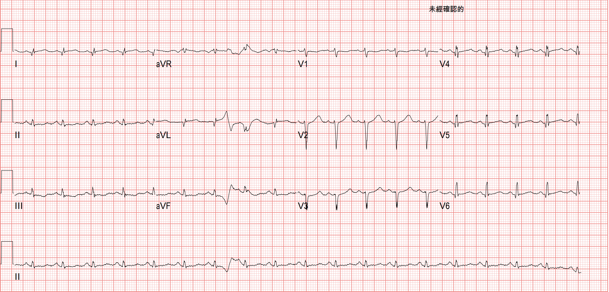

---

A young mother in her 30s, G3P0A2. **This was her only successful delivery so far, and it very nearly became her last.**

The baby was breech before birth, so she ended up delivering by C-section.

At noon on the fifth postpartum day, she suddenly developed chest pain. About 10 minutes later her consciousness became impaired, and then she had a seizure-like episode. **Right after that, no breathing, no heartbeat.**

Anyone who works in emergency or critical care knows that these seizure-like movements aren't really a brain problem. The upstream cause is often a ventricular arrhythmia, like ventricular fibrillation or ventricular tachycardia: not enough cardiac output, so the brain goes ischemic, and that triggers the seizure-like movements (**see Fig.1**).

---

### <mark>Back to the case~~</mark>

Once the ECG monitor was on, there was still a waveform, but no palpable pulse.

**PEA (pulseless electrical activity)**

The team started CPR.........getting ready to give epinephrine and intubate.

**I put myself in that moment. A mother who had finally, for the first time, delivered successfully, and now she had nothing. In the nursery lay the baby she had worked so hard to bring into the world, crying. And the mother couldn't even cry, because at that moment she didn't even have her life.**

Pretty soon she went into pulseless VT, got one 200J shock and one dose of epinephrine, and then had ROSC.

Because of suspected **amniotic fluid embolism**, she was transferred to the surgical ICU for further workup.

---

#### A little knowledge booster pack:

1. What might cause amniotic fluid embolism?
2. What are the risk factors for amniotic fluid embolism?
3. What are the symptoms?
4. Is there any diagnostic test that's the golden standard?
5. How common is it?

<mark>Amniotic fluid embolism is when, during labor and delivery, amniotic fluid or its components enter the maternal circulation and trigger an intense immune response. That immune response releases a large amount of cytokines, called a cytokine storm, which can lead to severe cardiovascular collapse and coagulopathy.</mark> The exact cause of amniotic fluid embolism is still unclear, but research suggests it may be related to an immune response to specific components of the amniotic fluid.

This figure comes from [here](https://commons.wikimedia.org/wiki/File:Amniotic_fluid_embolism.png).

Put simply, none of our bodies like a foreign body.

During pregnancy, under normal conditions, fetal cells and amniotic fluid don't show up in the maternal circulation. But with bad luck, when there's a tear in a uterine vein or the placenta, those fetal cells and amniotic fluid can slip into the maternal circulation. Once these non-maternal materials are in the maternal circulation, they get treated as a foreign body and stopped there. That sets off a cascade of immune/allergic reactions.[^1]

**Here's a list of possible risk factors:**

| Risk factor                                | Notes                                            | Source |
| :-------------------------------------- | ----------------------------------------------- | :--: |
| Age over 35                            | Associated with increased AFE risk                             | [^2] |
| Placenta previa             | Placenta previa increases the risk 30.4-fold                        | [^2] |
| Cesarean delivery             | Cesarean delivery increases the risk 5.7-fold                           | [^2] |
| Older and ethnic minority women                      | AFE risk is significantly higher in older and ethnic minority women       | [^3] |
| Mode of delivery                                | Cesarean and instrument-assisted vaginal delivery are associated with increased AFE risk       | [^4] |
| Pregnancy-related risk factors                        | Including placental abnormalities, preeclampsia, polyhydramnios, etc.              | [^4] |
| Induced labor                   | Some methods of induction may increase AFE risk, but research is still limited | [^5] |
| Multiple pregnancy        | Multiple pregnancy is associated with increased AFE risk                     | [^3] |
| Placental abruption             | Placental abruption is associated with increased AFE risk                       | [^4] |
| Electrolyte abnormalities | Electrolyte abnormalities are significantly associated with developing AFE             | [^6] |

So how do you diagnose it?

According to this UpToDate article [^7], a working group under the Society for Maternal-Fetal Medicine (SMFM) and the Amniotic Fluid Embolism Foundation proposed **four diagnostic criteria for amniotic fluid embolism (all present at the same time)**. These criteria were meant to standardize diagnosis for research purposes, and they may also have some clinical use.

{}

1. Sudden cardiopulmonary collapse, or evidence of hypotension with respiratory distress
2. Evidence of DIC
3. Clinical onset during labor or within 30 minutes after delivery of the placenta
4. No fever (≥38°C) during labor

{}

That said, most experts agree that using these criteria will clearly exclude any patient who doesn't have amniotic fluid embolism, but may leave out those with atypical amniotic fluid embolism.

As for how common it is? Per the same UpToDate article, about 1.9 to 6.1 cases per 100,000 deliveries. It's actually a very rare disease[^7].

**So is there a golden standard for diagnosis?**

**Amniotic fluid embolism is more of a diagnosis of exclusion. You have to rule out a whole bunch of lethal conditions, and then.....it's you.....Orz**

The **differential diagnosis** of amniotic fluid embolism covers obstetric, non-obstetric, and anesthesia-related causes (**see the table below; the right column lists how each differs from the symptoms AFE produces**) [^8].

| Differential diagnosis (DDx)                                                | How it differs from the symptoms of amniotic fluid embolism                                     |
| :----------------------------------------------------------- | ------------------------------------------------------------ |
| Anaphylaxis                                      | Unlike AFE, anaphylaxis usually comes with a rapidly developing allergic reaction, such as skin rash and dyspnea, rather than AFE's typical features like cardiovascular collapse or coagulopathy. |
| Aortic dissection                                | Patients with aortic dissection usually have severe chest or back pain from the tear in the inner layer of the aorta; AFE usually doesn't present this way. |
| Cholesterol embolism                             | Cholesterol embolism usually affects the skin or kidneys, causing related findings like purpura on the skin or renal failure, which differs from AFE. |
| Myocardial infarction                              | The main symptom of MI is chest pain, possibly with ECG and blood biomarker changes; these aren't the main features of AFE. |
| Pulmonary embolism                                   | PE mainly presents with dyspnea, chest pain, and hemoptysis, while AFE may have no obvious chest pain or hemoptysis. |
| Septic shock                                     | Septic shock usually comes with obvious signs of infection, such as fever and abnormal WBC; these aren't the main features of AFE. |
| Air embolism                                       | Air embolism is usually related to a medical procedure, such as central venous catheter placement, with sudden dyspnea and a drop in blood pressure, but without AFE's typical coagulopathy. |
| Eclamptic convulsions and coma     | Seizures and coma from eclampsia are usually associated with hypertension and proteinuria; these aren't the main features of AFE. |
| Convulsion from the toxic reaction to local anesthetic drugs | These seizures are usually tied to a specific procedure and aren't common in AFE.        |
| Aspiration of gastric contents                 | Aspiration of gastric contents is usually related to anesthesia-induced vomiting and aspiration, whereas AFE is a sudden emergency of the lungs and the coagulation system. |
| Hemorrhagic shock in an obstetric patient | Hemorrhagic shock in an obstetric patient is usually related to massive bleeding, such as placental abruption or uterine rupture, whereas AFE is due to problems with the lungs and the coagulation system. |

Whoa~~ this "little" knowledge booster pack turned out kind of big 😅

---

### <mark>Back to the case~~</mark>

After she got to the surgical ICU, she had a head CTA/chest CTA and an ECG. The head CTA/chest CTA showed nothing abnormal.

Here's the ECG:

Now let's read this interesting ECG~~

- Rate: 105 bpm

- Rhythm: sinus

- Axis: normal

- Interval: QTc: 499

- Ischemia

I think what really grabs the eye is the ischemic change ➡ STE over V2-5 & I/aVL with reciprocal STD over inf.leads

Looks like the proximal LAD is the problem.

Young, postpartum, a lethal arrhythmia, and the ECG points straight at the LAD.

Either way, the CV man went in to see what was going on with the vessels. After all, the ECG was hard STEMI evidence.

#### **Let's look at the CAG. What happened to the vessels?**

All three vessels had spontaneous dissection, causing intramural hematoma that compressed the vessels and caused ischemia. Especially the RCA, which was squeezed by the false-lumen hematoma to the point of near-total occlusion. So the CV man put a stent in that coronary segment to prop the flow open.

What is this?

This is one of the STEMI mimics mentioned in the [previous post](https://agoodbear.com/post/ecg-post-4/): SCAD (spontaneous coronary artery dissection).

---

#### **First, a few questions to ask yourself:** (**if I get anything wrong, CV men, please teach and correct me**)

1. What does SCAD look like on CAG/IVUS or OCT?
2. Is SCAD classified into types?
3. What does SCAD have to do with pregnancy?

This case comes from [here](https://www.researchgate.net/figure/Patient-presenting-with-ACS-A-Coronary-angiography-of-a-patient-with-SCAD-showing-a_fig3_326713504).

This case is also a patient who presented with ACS symptoms. In the OCT image at B you can see the normal extent of the vessel wall. At C and D you can clearly see the lumen severely compressed by intramural hematoma, causing stenosis. On CAG you'd see a long stretch of vessel suddenly get small.

**In our case (Fig.6)**, you can also see a long segment of the RCA suddenly narrowing.

The red circle is the long segment of sudden narrowing (where the intramural hematoma is compressing the vessel).

The yellow arrow faintly shows where the original lumen of the vessel was.

#### **SCAD is currently divided into four types:** [^10]

| Type   | Description                                                         | Features                                                         | Detection      |
| ------ | ------------------------------------------------------------ | ------------------------------------------------------------ | ------------- |
| Type 1 | Dissection with pathognomonic features, including multiple radiolucent lumens, due to an intimal tear letting contrast penetrate two flow channels | On angiography, a radiolucent flap separating two flow channels can be seen (left image, arrow). Type 1 SCAD may also cause contrast staining at the intimal tear or slow clearance of contrast. On optical coherence tomography (OCT), an intimal tear (right image, arrow) separates the true lumen from the false lumen (FL) | Angiography, OCT |
| Type 2 | The most common type: luminal compression from intramural hematoma, without an intimal tear, appearing as a long segment of arterial narrowing | Type 2 SCAD lesions are long (usually >20 mm), often show an abrupt change in arterial caliber, and may be bordered by normal-caliber artery (type 2A) or extend to the tip of the artery (type 2B). OCT imaging shows intramural hematoma | Angiography, OCT |
| Type 3 | The least common type, and the hardest to recognize on angiography. Its appearance also suggests compression by intramural hematoma, but Type 3 SCAD is usually no longer than 20 mm | Type 3 SCAD has been described as a mimic of atherosclerosis. It should be considered when suspicion for SCAD is high, especially when the rest of the coronary tree has no atherosclerosis, the lesion is straight and long (11 to 20 mm), or there is coronary tortuosity. As with Type 2 SCAD lesions, OCT imaging shows a compressive intramural hematoma | Angiography, OCT |
| Type 4 | Described as total occlusion of the vessel                                       | Its appearance may resemble a thromboembolic occlusion; dissection as the cause of the occlusion may only become apparent after the vessel remodels, or after an embolic cause is excluded and repeat coronary angiography shows the vessel has healed | Angiography, OCT |

This table, based on this article [^10], describes the main features and detection methods of each of the four SCAD types (**read it alongside the figure above**).

How do you diagnose it?

Of course you can make the diagnosis with CAG. But for more complex vessel lesions, adding OCT or IVUS can help further.

#### **Current cardiovascular imaging methods are as follows:** [^9]

OCT can identify the boundary between the intima and the media inside the coronary artery wall. On OCT images, the intima appears as a strong-signal layer closest to the lumen, while the media shows up as a weaker-signal middle layer, something current intravascular ultrasound technology can't distinguish.[^9]

The clinical presentation of SCAD is very similar to acute MI. Once we suspect SCAD, coronary angiography (CAG) should be done as early as possible. Optical coherence tomography (OCT) and intravascular ultrasound (IVUS) help with diagnosing and differentiating complex lesions. [^11]

Of course, intravascular imaging (OCT/IVUS) isn't all benefit and no harm. Otherwise we'd just grab every patient getting angiography and do OCT or IVUS on them too. The main thing is that **intravascular imaging has its own possible complications**:

1. It can make the **dissection extend further**
2. When acquiring intravascular images, inserting the probe can **obstruct flow**, especially in narrowed or fragile vessels. This may be more common with OCT, because OCT needs to briefly clear the blood to get a clear image, whereas IVUS, using ultrasound, interferes less with blood flow.
3. During the procedure, especially when the vessel anatomy is complex or a dissection is already present, the operator may **accidentally advance the probe into the false lumen, raising the risk of complications**

These complications have been reported in up to 8% of SCAD patients [^10]. So intravascular imaging isn't risk-free, and it's only considered when CAG is inconclusive for SCAD, or when intravascular imaging is used as guidance during percutaneous coronary intervention (PCI).

Finally.....

#### SCAD risk factors and how they relate to pregnancy

SCAD is most common in women aged 40 to 50, but it can also occur at any age and in men [^12].

The main risk factors include [^12]:

- **Sex**: women are more likely than men to be affected by SCAD.
- **Childbirth**: some SCAD patients have recently given birth.
- **Extreme stress**: including intense physical exercise and severe emotional stress.
- **Fibromuscular dysplasia (FMD)**: a condition that weakens medium-sized arteries in the body, which can lead to arterial problems like aneurysm or dissection; women are more likely than men to have it.
- **Inherited connective tissue disorders**: such as Ehlers-Danlos syndrome and Marfan syndrome.
- **Very high blood pressure**: severe hypertension may increase the risk of SCAD.
- **Illegal drug use**: using cocaine or other illegal drugs may increase the risk of SCAD.

### SCAD and pregnancy

SCAD **occurs most often in the first few weeks after delivery**, but it can also happen during pregnancy [^12]. Pregnant and postpartum women are also at risk of SCAD [^13]. Pregnancy-related SCAD is a relatively common cause of ACS in women, especially young women [^14]. Studies suggest that the hormonal and hemodynamic changes of pregnancy may play a role in SCAD [^14]. In short, SCAD is a rare but potentially serious condition, especially in pregnant and postpartum women.

And if a woman has had SCAD and gets pregnant again, how likely is SCAD to happen again? According to this NEJM article [^10], there isn't much data yet, but there are case reports of SCAD recurring during pregnancy.

---

### <mark>Back to the case~~</mark>

The figure below is the post-PCI ECG. The nearly totally occluded vessel at RCA-m got a stent, and sure enough, on the post-PCI ECG, the obvious STE from the acute event has all come down. The thing that puzzles me, though, is that the ECG findings pointed straight at the proximal LAD as the culprit lesion, but the CAG didn't show that.

In the end, all from having a baby, the patient stayed in the hospital for more than half a month, and even stopped by the gates of hell to say hi to the King of Hell. Luckily, the King of Hell decided it wasn't her time yet and sent her back to the world of the living~~

Pregnancy and childbirth really are very high-risk business. No wonder the old Taiwanese saying goes: **make it through, and you get the sesame-oil chicken soup; don't, and you get four planks (a coffin)**. 「生得過雞酒香，生不過四塊板」 <!-- keep-zh -->

March happens to be the month of my own birthday (my mother's day of suffering, as we say), so I put together this interesting post to share with all my fellow ECG fans~~

Wishing every pregnant woman out there a safe passage through the big hurdle of childbirth!!!

## Key points:

1. AFE (amniotic fluid embolism): possible causes? How to diagnose? What are the possible risk factors?
2. SCAD: how to diagnose? Classification? Risk factors? How is it related to pregnancy?

## References:

[^1]: Amniotic Fluid Embolism - Creative Med Doses - [link](https://creativemeddoses.com/topics-list/amniotic-fluid-embolism/)
[^2]: Incidence and risk factors of amniotic fluid embolisms: a population-based study on 3 million births in the United States - PubMed - [link](https://pubmed.ncbi.nlm.nih.gov/18295171/)
[^3]:Surveillance of amniotic fluid embolism | NPEU - [link](https://www.npeu.ox.ac.uk/research/projects/97-ukoss-afe)
[^4]:Amniotic Fluid Embolism and Maternal Death - [link](https://www.birthinjuryhelpcenter.org/amniotic-fluid-embolism.html)
[^5]:What Is Amniotic Fluid Embolism? Symptoms, Risk Factors, and More - [link](https://www.webmd.com/baby/what-is-amniotic-fluid-embolism)
[^6]:Profile and Outcomes of Women With Amniotic Fluid Embolism i... : Obstetrics & Gynecology - [link](https://journals.lww.com/greenjournal/abstract/2023/05001/profile_and_outcomes_of_women_with_amniotic_fluid.178.aspx)
[^7]:Amniotic fluid embolism - UpToDate - [link](https://www.uptodate.com/contents/amniotic-fluid-embolism)
[^8]:Amniotic fluid embolism - PMC - [link](https://www.ncbi.nlm.nih.gov/pmc/articles/PMC4874066/)
[^9]:OCT: Ready for Prime Time? Clinical Applications of Optical Coherence Tomography (in Chinese) | Airiti Library - [link](https://www.airitilibrary.com/Article/Detail/10195440-201102-201102190010-201102190010-88-91)
[^10]:Spontaneous Coronary-Artery Dissection | NEJM - [link](https://www.nejm.org/doi/full/10.1056/NEJMra2001524)
[^11]:[Advances in research on the pathophysiology and treatment of spontaneous coronary artery dissection] (in Chinese) - Chinese Journal of Cardiovascular Medicine - [link](https://rs.yiigle.com/cmaid/1305945)
[^12]:Spontaneous coronary artery dissection (SCAD) - Symptoms and causes - Mayo Clinic - [link](https://www.mayoclinic.org/diseases-conditions/spontaneous-coronary-artery-dissection/symptoms-causes/syc-20353711)
[^13]:Spontaneous coronary artery dissection (SCAD) | Heart and Stroke Foundation - [link](https://www.heartandstroke.ca/heart-disease/conditions/spontaneous-coronary-artery-dissection)

[^14]:Pregnancy-related Spontaneous Coronary Artery Dissection: Two Case Reports and a Comprehensive Review of Literature - PMC - [link](https://www.ncbi.nlm.nih.gov/pmc/articles/PMC3424780/)
