### `A 48-year-old woman, going downstairs, missed a step and tumbled all the way down.`

#### One simple sentence, and yet it was the start of her tragic story.

---

Altered consciousness, plus trauma. The patient was wheeled into the resus room.

We put her on the ECG monitor, saw her heart was beating very fast, and right away got a 12 lead ECG

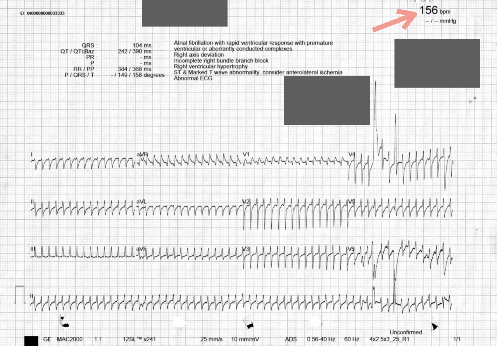

**Hmm, the rate on this one is a real problem.**

Why?

It's definitely not 156. The rate on this ECG should be double that, close to 300.

Basically, the ECG machine mistook one of the R waves for a T wave, so a heart rate that should have been 300 got cut in half by the machine's own count.

#### `You need your own principles for reading ECGs. Whatever the machine prints, just take it as a reference. It can help, but you must never use it as the answer.`

This kind of **doubled H.R situation is more common when the T waves are prominent** (e.g., hyper-K, or when hyperacute T waves show up first in an AMI).

Here's another example from a colleague (**Fig.2**). During a shift, my colleague noticed the ECG monitor kept alarming; it alarmed because the machine thought the heart rate was too fast.

**Was it really too fast?**

No~~ The T waves were so prominent that the machine got it wrong. After treatment it became the tracing below. The T waves came down, and the machine read it correctly too.

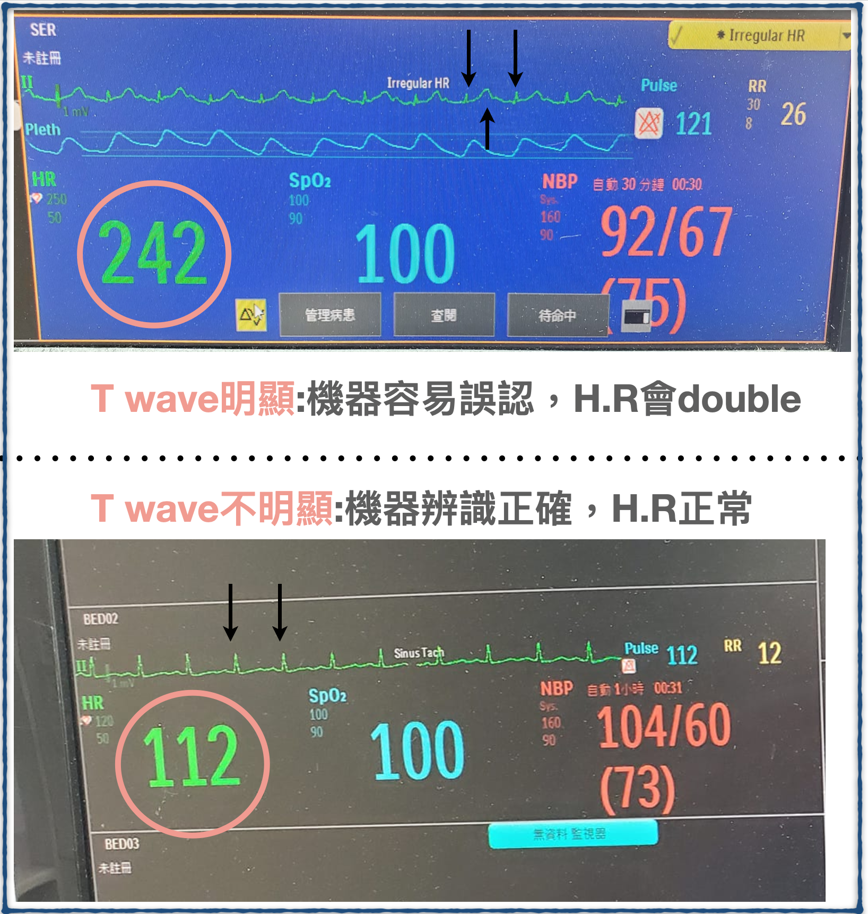

This was actually my first time running into the machine taking the R wave for a T wave and cutting the H.R in half.

> Tips: when your eyeball H.R doesn't match the machine, check whether the machine misread it, mistaking the T wave for an R wave (the more common one)

---

#### **<mark>The case continues~~</mark>**

But in this case, very quickly, before we even shocked her, the heart rate came down on its own

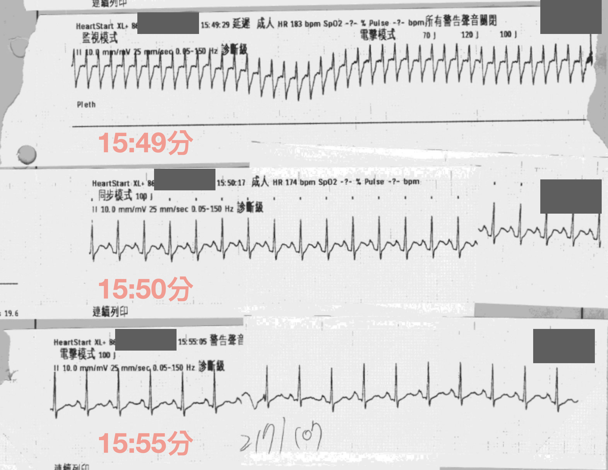

In **Fig.3**, the rate at the top is similar to the 12 lead ECG, and it quickly drops to half (the RR interval goes from one big box to about two big boxes); the bottom strip is about three big boxes, leaving around 100.

**A few little tricks for calculating H.R:**

- Use the rule of 300
- The long lead II method
- Look at the ECG machine's number😆

The rule of 300: first count how many big boxes are in the RR interval, then just do 300/number of big boxes (**Fig.4**). There's one prerequisite, though: the 12 lead ECG speed has to be set at **25 mm/sec**. In theory it's normally set to 25 mm/sec, and nobody changes it for no reason.

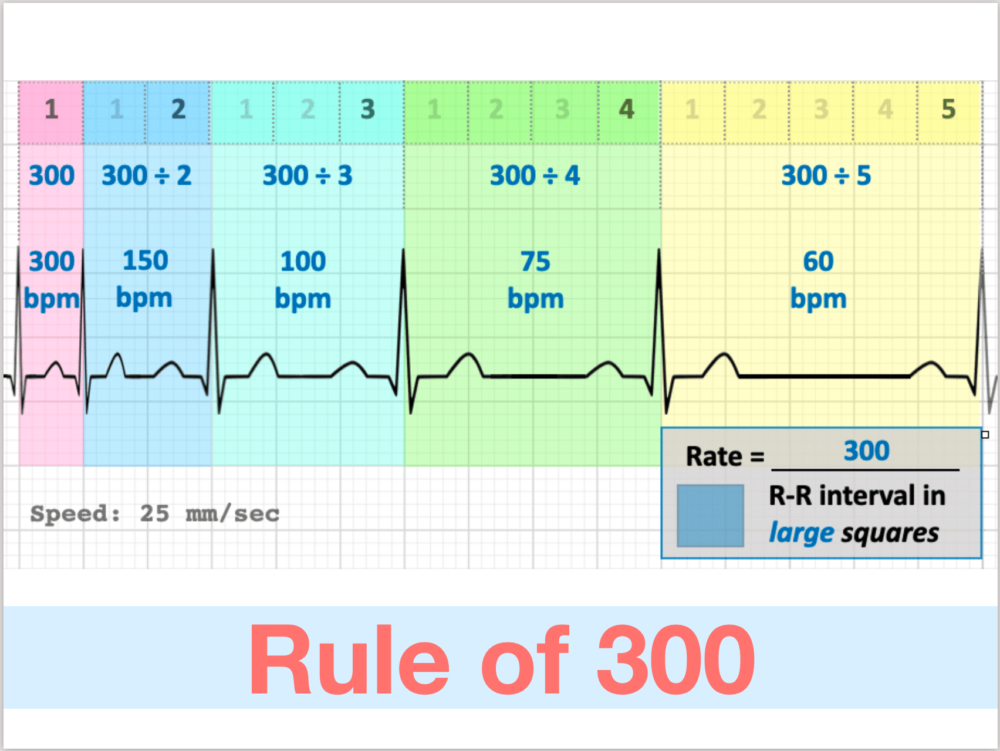

Then there's the long lead II method: take the long lead II at the bottom of the 12 lead ECG, count the QRS complexes, then x6 and that's the heart rate per minute. Basically, a 12 lead ECG covers 10 seconds, so x6 gives you the beats per minute.

---

#### **<mark>The case continues~~</mark>**

Because she had obvious trauma and altered consciousness, she went on to get a Brain CT and Whole body CT.

**Brain CT showed a left SDH and bilateral tentorial SDH**

**Whole body CT showed rib fractures, a clavicle fracture, and a scapula fracture**

From what I was told, her heart rate kept setting off the ECG monitor alarm.

Not long after...... it was the ventilator's turn to start alarming!!!

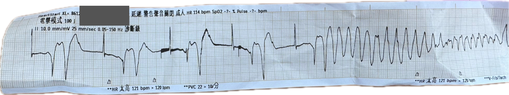

The nurse shouted: Vf

Everyone rushed in again

200J DC shock

WTF!!!! Seriously~~ trauma, and now the heart is going haywire too (**if I'd been the attending there, I'd definitely have wanted to swear exactly that**😆)

Fig.6 is a really interesting one.

Because on one of my shifts, someone told me this patient came in for trauma and ended up getting shocked for Vf on top of it.

I thought, what on earth is going on: a surgical problem + a medical problem. That's just too unlucky😭

Later I looked at this patient's ECG strip~~

### `Whoa........ this is the famous R on T phenomenon~~`

Catching exactly the moment of R on T, right as the wild arrhythmia starts. Wow~~

I've probably only ever seen this in a textbook!!! (**probably mainly because I don't have enough experience points in cardiac critical care yet**😆)

Let's analyze this ECG strip. I've marked up **Fig.6** a bit

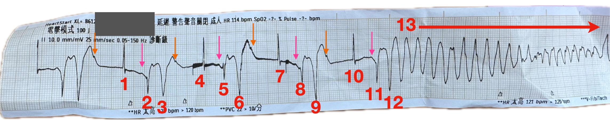

Look closely, and this rhythm actually has **order within the chaos**.

Beats 123, 456, 789, and 101112 each form a group

**1, 4, 7, 10 are all the same beat**

- Narrow QRS, but no obvious P wave. Or is the one at the **orange arrow** in front the P wave of this beat?

**2, 5, 8, 11 are all the same beat**

- This beat is clearly different from the one before it. It has an obvious P wave (**pink arrow**), fires from the atrium, goes down the normal conduction pathway, and produces the QRS-T

**3, 6, 9, 12 are all the same beat**

- This beat is wide, with no obvious P wave; it looks like a PVC

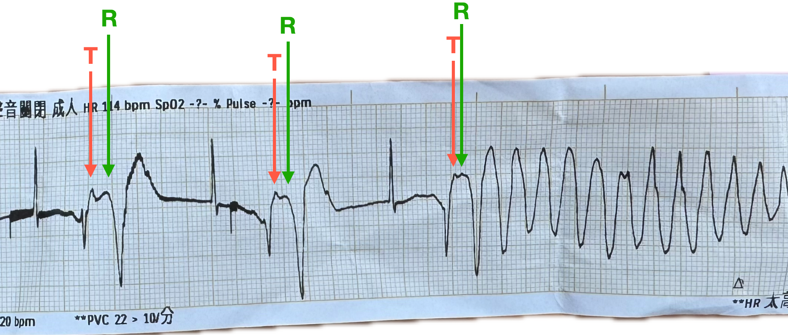

In **Fig.8** I've marked the approximate **T waves** of **2, 5, 8, 11**, and the **R waves** of 3, 6, 9, 12. The figure shows one thing clearly.

The R wave gets closer and closer to the T wave (**the green and red lines get pulled closer and closer**), producing the **R on T phenomenon**.

Speaking of the R on T phenomenon, you have to bring up the term `Commotio cordis`. Let's first look at this figure from an NEJM paper [^1]

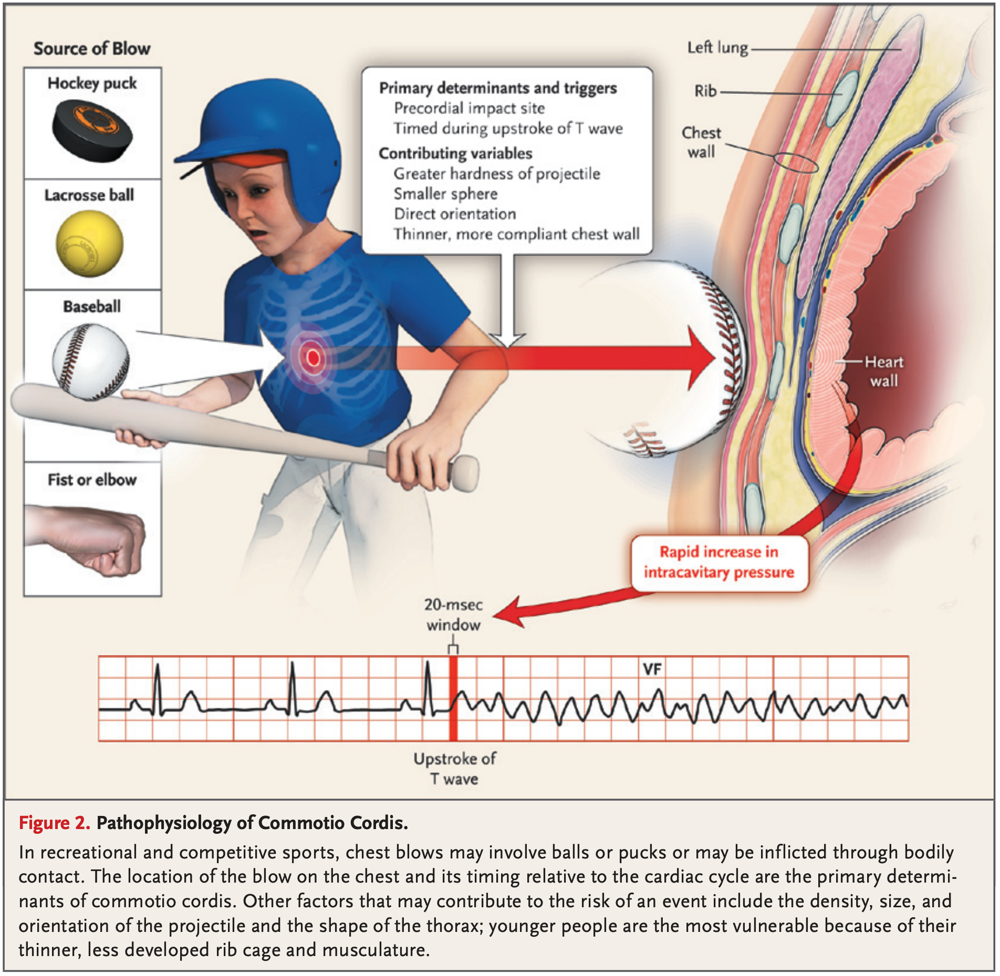

**Fig.9** explains the pathophysiology of commotio cordis. Every so often you see a news story about someone who got hit hard in the chest by a fist, a baseball, or something like that, and dropped on the spot and never got up. The main point is that **the blow lands in the vulnerable period of ventricular repolarization. During the vulnerable period the ventricle is electrically unstable, so when a stimulus (a premature complex --> especially a PVC) lands in this window, it can easily trigger Vf or TdP.**

So where is the vulnerable period? **It's the 20-30 ms before the T wave peak**, that is, the commotio cordis risk window in **Fig.10**. 

---

#### <mark>The case continues~~</mark>

I've pulled out the second half of the ECG strip where this case went into a ventricular arrhythmia from the R on T phenomenon (**Fig.11**).

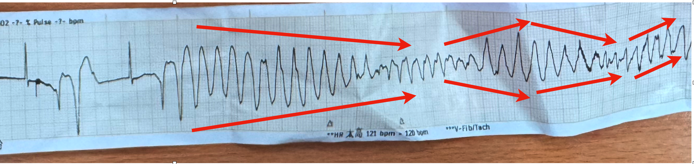

Honestly, is this Vf or polymorphic VT?

The rhythm looks like polymorphic VT (TdP type) morphology. According to the nurse, no pulse was felt at the time.

It may really have been Vf, or polymorphic VT, which is also a malignant ventricular arrhythmia, may have made her cardiac output so poor that her pulse was almost impalpable.

Either way, if the patient is unstable, you still have to shock the rhythm back first and sort out the rest later.

### `If it's polymorphic VT and you're going to shock it, how do you shock it? How much?`

Normally, when we press the sync button on the defibrillator, there's a slight delay when the paddles are about to discharge. The delay is mainly the machine trying to sync with the patient's rhythm, because the defibrillator wants to discharge on the R wave of the QRS. But with Vf or polymorphic VT, the defibrillator may keep failing to find a recognizable R wave before discharging, and so can't fire.

Also, polymorphic VT can quickly progress to Vf, which is a life-threatening state that needs immediate defibrillation to restore a normal rhythm, so what you do is an **unsynchronized defibrillation shock** [^2] . The joules are the same as for Vf: 360J for a monophasic defibrillator, 200J for biphasic.

Polymorphic VT can also be divided into two major categories; their causes and treatment are in the figure I put together below (Fig.12).

So if this case was polymorphic VT, which category would it fall into? Let's keep reading~~

---

#### <mark>The case continues~~</mark>

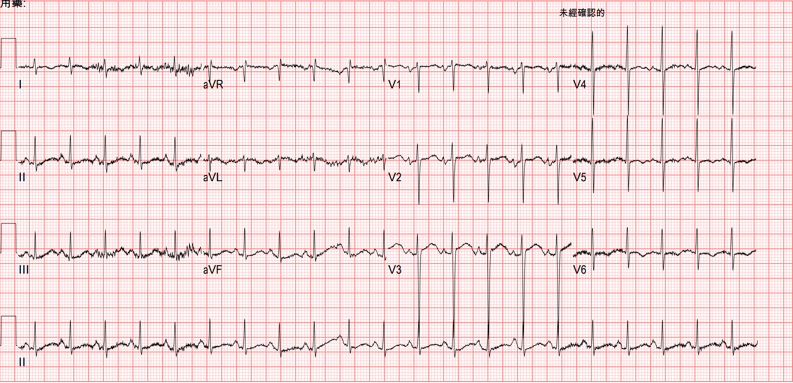

**Fig.13** is the ECG after the shock: noisy baseline, sinus tachycardia, LVH by voltage

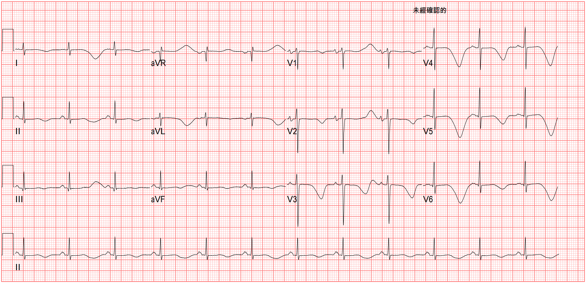

**Fig.14** is an interesting one, done the day after ICU admission. On reading, there's obvious TWI in V2-V6 and I/aVL, all of them super giant. And the QT interval is super long; the QTc calculates out to 724 ms.

**<mark>When we see giant T wave inversion (usually meaning >5-10mm deep), here's the DDx<mark> [^3] :**

- Apical (Yamaguchi) Cardiomyopathy
- Takotsubo Cardiomyopathy
  - **If the patient's chief complaint is chest tightness/pain, you must consider Tako, but if the patient is altered, get a Brain CT to rule out a brain problem**
- Severe CNS disorders
  - Caused by increased intracranial pressure
- Stokes-Adams attacks
  - Especially when there's severe bradycardia or complete AV block
- Acute ischemia/coronary artery disease
  - Seeing TWI may make us think of a reperfused rhythm, but the TWI usually isn't this giant; also, if it's a reperfused rhythm, the patient's symptoms should resolve
- Post-Tachycardia Syndrome
  - TWI after tachycardia, after a shock, after pacing ➔ usually transient and benign
  - Deeper, larger T waves after a run of ventricular depolarization (e.g., PPM, VT, SVT with aberrancy, pre-excitation)
  - This is what's commonly called the **Cardiac memory T wave**, i.e., **the heart remembers the deeper T waves from the brief run of VT/aberrant conduction**
- Massive Pulmonary Embolism
  - **RV strain**, especially TWI in the right precordial leads

We also saw the QTc as high as 724 ms

Let's review the **possible causes of QT prolongation**. Clinically, any time you see **QTc>500 ms**, this figure should pop up by knee-jerk reflex to remind yourself: is something wrong with the patient somewhere? Shouldn't you put them on an ECG monitor first, or they might go into TdP any minute😅 (**just when you think you can't possibly be that unlucky, the universe will prove to you that you are**)

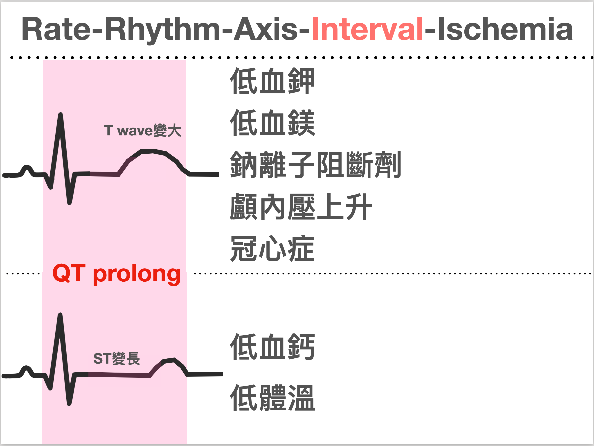

---

#### Why would trauma cause such a severe arrhythmia?

This patient had a brain bleed, rib fractures, a clavicle fracture, and a scapula fracture.

The ED's **"sleep-well-every-night bible-turned-pillow"**: Tintinalli[^4] spells it out clearly right up front on scapula fractures (**Fig.15**): the scapula is a protected bone, so a fracture usually means a high-energy impact was needed to break it, and the ipsilateral lung, chest cavity, and ribs may often be injured along with it.

In plain words: **when you see a scapular fracture, don't assume it's only a scapular fracture. Check everywhere else too; things are usually not as simple as we think.**

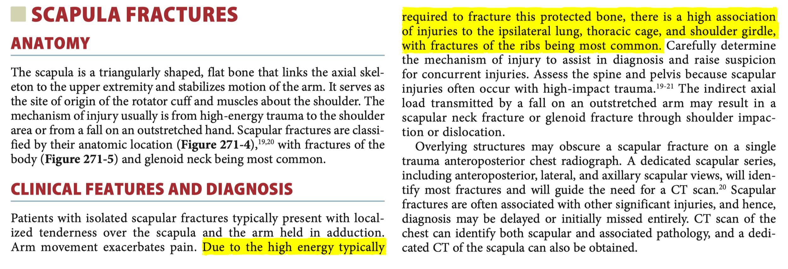

A 48-year-old woman with no particular chronic illness. After one trauma, she went into this severe an arrhythmia. I want to point straight at!!!!!!!

#### <mark>Cardiac contusion</mark>

#### **This post by Dr. Smith covers some concepts of blunt cardiac injury; I've excerpted them below** [^5] :

- The ECG isn't very sensitive for blunt cardiac injury ➡ mainly because **the RV sits anatomically anterior, right up against the sternum, which makes the RV more vulnerable to injury than the LV**
  - But because the LV has more electrical mass (more myocardium), the electrical activity and ECG abnormalities it produces make the ECG abnormalities from the smaller/thinner RV harder to detect (**meaning the LV masks the RV's ECG changes**)
- **Common ECG findings of cardiac contusion:**
  - sinus tachycardia (common in any trauma patient)
  - other arrhythmias (PVC, PAC, Af, bradycardia, possible VT/Vf)
  - RBBB (currently the most common conduction defect, because the RV's anatomic position makes it easier to injure
    - Fascicular blocks and LBBB are much less common
  - signs of myocardial injury ➡ Q waves, STE/STD ➡ if these findings are present, they usually suggest LV involvement
  - QTc prolong
  - Brugada Phenocopy

**So in this case, it was probably that after the trauma she had a brain bleed, which prolonged the QT, and then the cardiac contusion produced PVCs. When you add PVCs on top of a prolonged QT, the R on T phenomenon happens very easily (think of the commotio cordis figure: the ball or fist is just like the PVC, slamming into the vulnerable period, and then Vf or TdP starts)**

---

#### <mark>The case continues~~</mark>

Her brain injury turned out to be severe and she couldn't be extubated. She later had a tracheostomy and was then transferred to an RCC (respiratory care center) for ongoing care!!!

She was only 48!!!!!

In our daily lives, while we're eating well and sleeping well, don't forget to be grateful for everything we've been given. An accident can take it all away at any moment🥲

>### Key points:

1. When your eyeball H.R doesn't match the machine, check whether the machine misread it, mistaking the T wave for an R wave (the more common one)
2. What's the relationship between commotio cordis and the R on T phenomenon?
3. What's the DDx for giant T wave inversion?
4. Possible causes of QT prolongation
5. What ECG findings can cardiac contusion have?

>### References:

[^1]:Commotio Cordis | NEJM - [link](https://www.nejm.org/doi/full/10.1056/nejmra0910111)
[^2]:Cardioversion and Defibrillation | Critical Care | AccessMedicine | McGraw Hill Medical - [link](https://accessmedicine.mhmedical.com/content.aspx?bookid=1944&sectionid=143522317)
[^3]:ECG Interpretation: ECG Blog #59 — Giant T - Ischemia -Yamaguchi - [link](https://ecg-interpretation.blogspot.com/2013/01/ecg-interpretation-review-59-t-wave.html)
[^4]:Amazon.com: Tintinalli's Emergency Medicine: A Comprehensive Study Guide, 9th Edition: 9781405296434: Tintinalli, Judith, Ma, O. John, Yealy, Donald, Meckler, Garth, Stapczynski, J., Cline, David, Thomas, Stephen: Books - [link](https://www.amazon.com/Tintinallis-Emergency-Medicine-Comprehensive-Study/dp/1260019934)
[^5]:Dr. Smith's ECG Blog: Patient in Single Vehicle Crash: What is this ST Elevation, with Peak Troponin of 6500 ng/L? - [link](https://hqmeded-ecg.blogspot.com/2022/11/patient-in-single-vehicle-crash-what-is.html)
