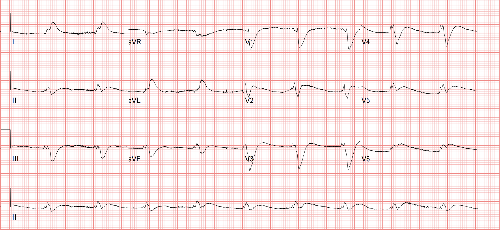
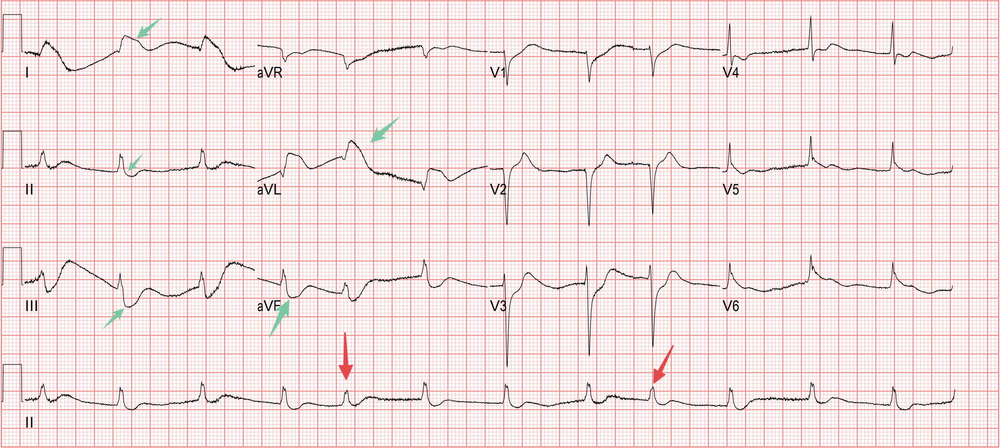
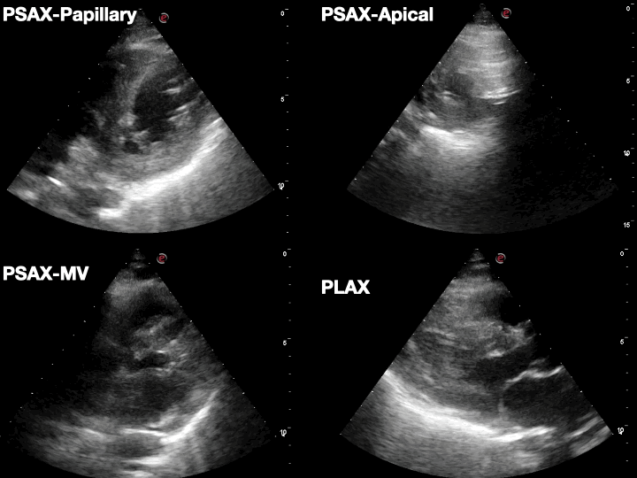
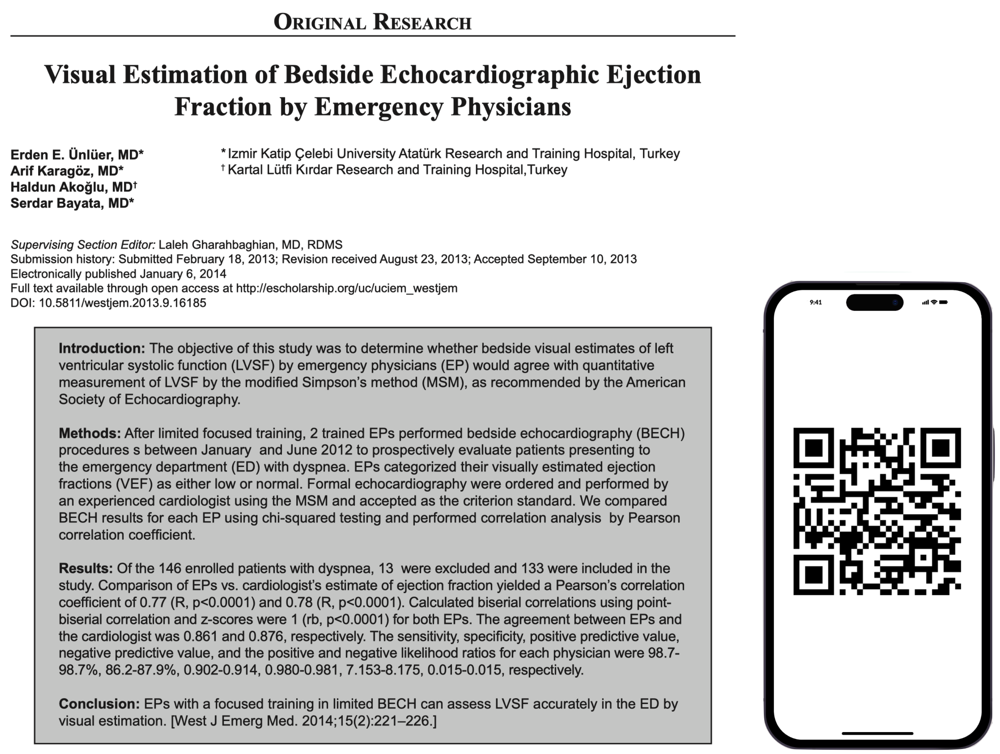
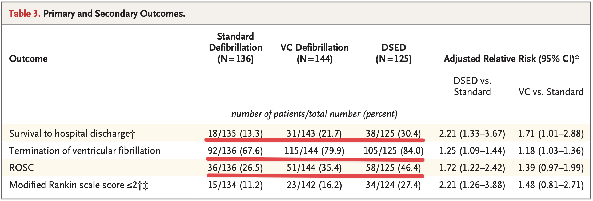
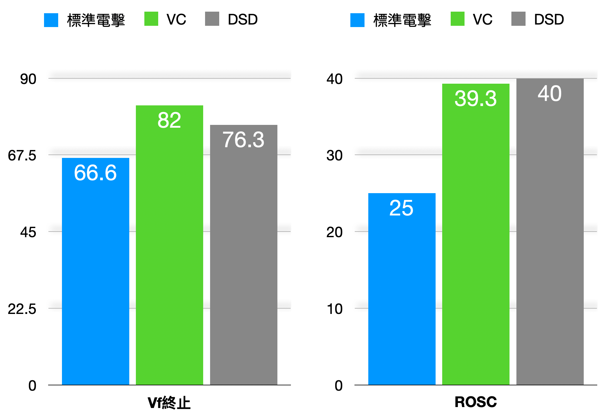
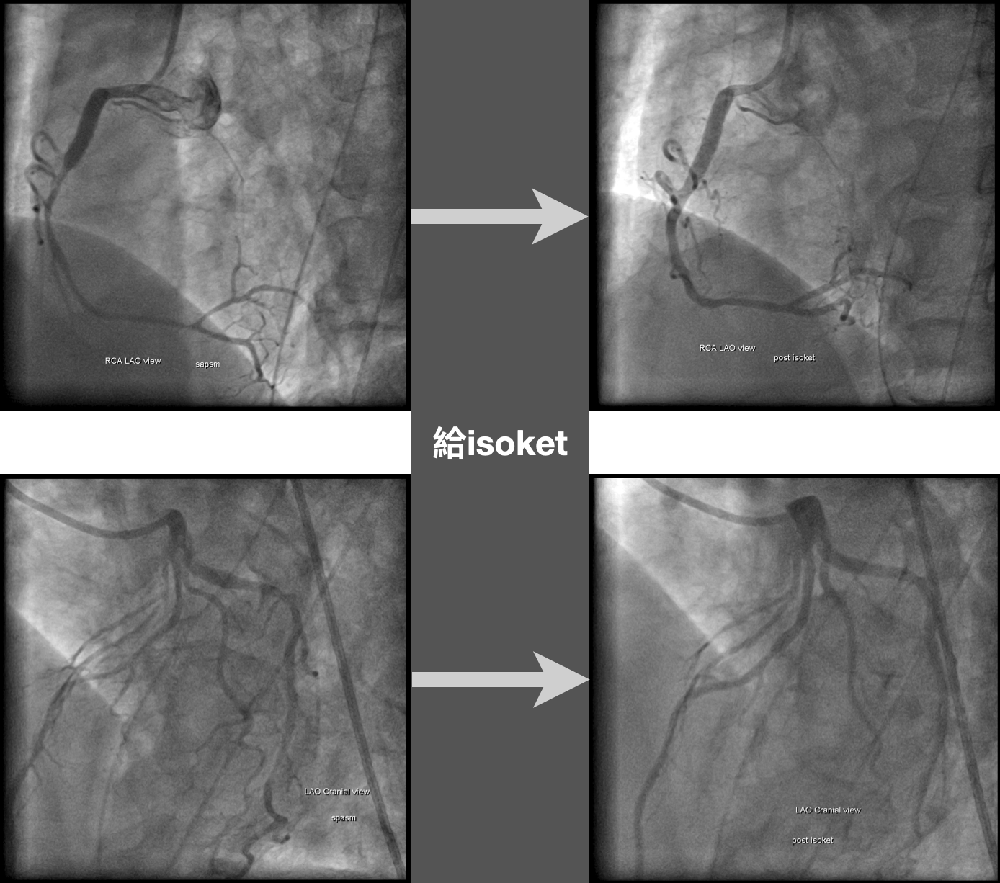
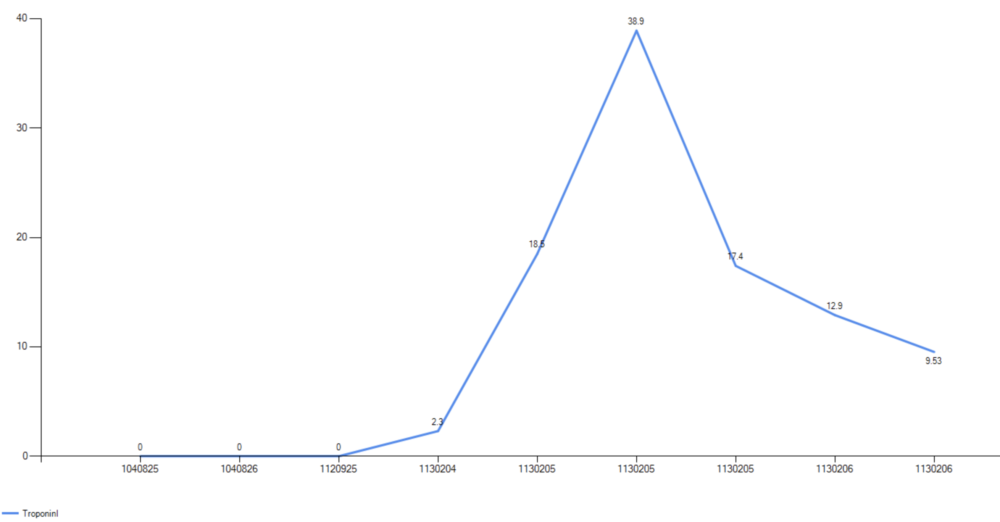
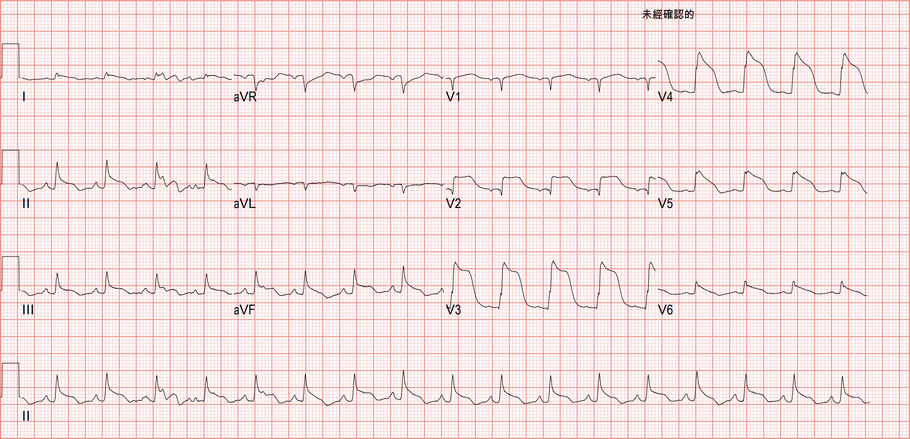
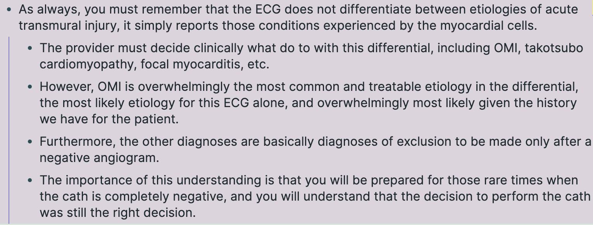

A little after 6 p.m., we got a patient in prehospital cardiac arrest.

I quickly asked the family what happened. The son said his dad was eating at the dinner table and suddenly collapsed.

EMTs got him to our hospital fast, and our team took him.

Initial rhythm Vf....... the rhythm even the ED cleaning lady can recognize (**the old ACLS cliché**)

The rest of the team quickly intubated, set up the thumper, got IV access, and started the epi.
After CPR the rhythm was still ventricular fibrillation, shocked again ⚡️, continued CPR
Started antiarrhythmics
Still ventricular fibrillation, shocked again ⚡️
I asked a nurse to bring a second defibrillator and put pads on the patient's anterior chest and back. I was going to do DSD.
I held one defibrillator, the nurse pressed the other, and I called 1-2-3 for both to discharge together.

I tease the leader a lot, but I sincerely hoped her unit wouldn't fire when I'd only gotten to 2 😅

**DSD three more times in total, and finally ROSC.**

No clear P waves, and you can't tell where the QRS ends. So is the QRS wide or narrow?

Still no clear P waves, but the QRS is clearly narrow. The red ones might be JPCs (junctional premature complex). The overall rhythm should be AJR (Accelerated junctional rhythm).

But the green arrows are where it gets interesting. Since we know the QRS isn't wide, comparing across, Lead I/aVL both have STE and Lead II/III/aVF all have STD. Looks like a **High lateral MI!!!!!!!!**

I'm not a board-certified cardiologist, but with an MI patient I can't help wanting to look at the echo to see if there's RWMA matching the ECG ischemia territory. In the Heart POCUS above, **I originally expected some RWMA in LAD or LCX territory, but there didn't seem to be any obvious RWMA**.

#### Sometimes I wonder: when we do Heart POCUS, we focus on whether there's RWMA and eyeballing the rough LV systolic function. How far off are we from what the CV man sees?

This is a paper published in the **Western Journal of Emergency Medicine**.

The study looked at emergency physicians who, after brief training, used bedside echo to eyeball LVEF, and compared their estimates with cardiologists' measurements using the Simpson method. The results showed that **specifically trained emergency physicians can accurately estimate LV systolic function visually in the ED**.

---

### ✏**Before we get to what happened to the patient, let's look at a few questions:**

1. What on earth is DSD (**Double Sequential Defibrillation**)?
2. What is electrical storm?
3. When is it appropriate to bring in DSD?

First, DSD means using two defibrillators on the patient, discharging at nearly the same time, to break refractory VT/Vf.[^1]

And **refractory VT/Vf is not the same as electrical storm: refractory means still VT/Vf after three shocks[^rvf]; electrical storm is defined as 3 or more episodes of VT, Vf, or ICD shocks within 24 hours** [^6][^es]

The **rationale for DSD** rests mainly on the following [^2] :

1. **Better electrical vector direction**: DSD uses two defibrillators and changes pad placement to change or add different electrical vectors. This defibrillates myocytes across more vectors and affects more myocardial surface area, improving defibrillation.
2. **More current energy**: Studies have shown that the joules used in defibrillation (i.e., the energy of the current) significantly affect the shock success rate for ventricular fibrillation (Vf). Using DSD to increase the defibrillation joules may help improve the chance of successful defibrillation
3. **Lower defibrillation threshold**: Some research suggests the first shock may lower the defibrillation threshold; if the second shock comes within 100 milliseconds of the first, the energy needed for successful defibrillation can drop noticeably. This suggests that in DSD, the relatively longer shock duration can help defibrillate the myocytes

Here I want to mention an NEJM paper [^3] that splits defibrillation into three approaches: **AP position**, the so-called vector change (VC); the **standard position** (anterior-lateral position); and DSD with **AP + standard position**

- This paper enrolled **405 OHCA patients whose VT/Vf remained refractory after three shocks. The trial randomized patients into these three groups**

- **Both the Vector change and DSD groups improved survival to hospital discharge, and both had higher Vf termination and ROSC rates than the anterior-lateral position (standard position) group**

But DSD uses multiple defibrillators, which adds clinical complexity and may compromise high-quality CPR. So without proof that DSD has any clear benefit over vector change, the recommendation for refractory Vf is to use Vector change.

Also, because enrollment fell short during the COVID-19 pandemic, the study was stopped after enrolling less than 50% of its subjects. These factors kept the trial from reaching its planned sample size, affecting the statistical significance and reliability of the results.

Also, this paper compared DSD and VC each against standard-position defibrillation. From the results, DSD seems to have the edge over VC, but the paper chose not to compare DSD and VC directly, possibly because the two differ substantially in technique and in where they can be applied. DSD needs two defibrillators, is more complex to run, and needs more equipment, while VC just means moving the pads — relatively simple to do with less equipment.

**In real-world practice, different EMS systems have different resources and capabilities, so choosing the right strategy matters a lot. That is: if there's only one defibrillator on scene and it's still refractory Vf/VT with standard pad placement, switch to VC; if there are two defibrillators you can choose DSD, but the operational complexity goes up, so think twice about whether it's worth it**.

The author, Sheldon Cheskes, had also published a study on DSD for refractory Vf in Resuscitation earlier, in 2020 [^7] .

The chart above seems to show results similar to the NEJM paper: compared with the standard group, the VC/DSD groups had higher Vf termination and ROSC rates.

Here's **EM:RAP** showing how to place the pads and how to discharge.

<iframe width="560" height="315" src="https://www.youtube.com/embed/Ov-BBUhKdJU?si=gavO9nhkdoLG70GU" title="YouTube video player" frameborder="0" allow="accelerometer; autoplay; clipboard-write; encrypted-media; gyroscope; picture-in-picture; web-share" referrerpolicy="strict-origin-when-cross-origin" allowfullscreen></iframe>

**So should the DSD shocks be timed simultaneously, or one after the other?** [^4]

**DSD is sequential defibrillation, not simultaneous defibrillation**. If one person presses the discharge buttons on two defibrillators with both hands, even pressing at the same moment there's still a time gap, so the two machines are unlikely to fire at exactly the same time. And with two people each running a defibrillator and counting 1-2-3 to press together, it's even harder to fire "simultaneously." So what the two machines achieve is "consecutive" discharge within a very short time, not "simultaneous" discharge.

One possible worry with DSD: if two defibrillators discharge at nearly the same time, will it fry the defibrillator?

This paper published in Resuscitation [^5] also describes that with an Orthogonal vector configuration (**i.e., one set placed right-upper/left-lower, the other anterior-posterior**), the voltage induced on one set of electrodes by the other set's shock is significantly reduced, **lowering the risk of defibrillator damage**. With a parallel vector configuration, where the two sets of pads are oriented almost parallel, the voltage applied by one set induces a higher voltage on the other set, increasing the risk of defibrillator damage.

This paper [^5] also notes that **DSD effectiveness depends on the inter-shock interval**. DSD with overlapping, 10 ms, and 100 ms intervals outperformed single-vector stacked shocks; DSD with a 50 ms interval did worse; intervals of 200 ms or longer made no difference.

The single-vector stacked shocks in the paper mean using the same pair of electrodes to deliver two consecutive shocks, about 10 seconds apart.

So to sum up: if we hit refractory Vf and choose DSD, we may need to consider whether it could damage the defibrillator, and the interval between the two defibrillators' discharges may also affect the outcome.

Current defibrillators don't have any DSD-related setting that can precisely control shock timing. But if a larger study really shows DSD clearly helps and it gets written into the BLS/ACLS guidelines, I think the major defibrillator manufacturers will find a way to build that setting.

---

### ✏**Case continued**

After ROSC, a whole crowd took the patient from the ED to the cath lab for further cardiac catheterization.

The CAG findings **suggested coronary a. spasm as the cause**.

Later that day he was put on ECMO in the ICU. Then we looked for possible causes of the coronary a. spasm.

In Fig.8 you can see the CXR in the ED: the left side is about to white out. Later in the ICU he tested positive for Flu B, and was reported as severe influenza.

Troponin peaked the day after arrival. **The final diagnosis was influenza myocarditis**.

There's an ECG from his third day in the ICU. Interesting one.

Looks like a Shark fin sign~~

The **Shark fin sign** is one of the famous big three widow makers XD

Why? Because **it carries a very high chance of Vf and Cardiogenic shock**.

<blockquote class="twitter-tweet">
<a href="https://twitter.com/hashtag/ECG?src=hash&amp;ref_src=twsrc%5Etfw">#ECG</a> &quot;Widow Makers&quot; 🪦 🦈 🌊  👆🏾 High rates of VF/cardiogenic shock Can be mistaken for broad complex tachy or hyperkalaemia  Recognise and treat aggressively. <a href="https://t.co/n5KXtPnZmE">pic.twitter.com/n5KXtPnZmE</a>
&mdash; Rob Buttner (@rob_buttner) <a href="https://twitter.com/rob_buttner/status/1441358257969197073?ref_src=twsrc%5Etfw">September 24, 2021</a></blockquote> 

Usually, though, when the shark fin is that obvious in the septal-ant. leads, you mostly see reciprocal change in the inf. leads — but in this case the inf. leads had STE too.

There's a line from Dr. Smith in this post [^8] that I think is excellent, so I'm sharing it.

#### **My plain-language translation:**

In any case, we have to understand that the ECG can't distinguish the etiology of transmural ischemia (**meaning STE has appeared**); it simply reflects the state of the myocytes.

The clinician has to decide what to put on the DDx — OMI, Takotsubo cardiomyopathy, focal myocarditis, and so on can all produce STE

But given the patient's history, OMI is definitely the most common and the most treatable cause on that differential. The other diagnoses are diagnoses of exclusion made after a negative CAG.

Why this matters: **even if the cath is negative, you can see that your decision to send the patient to cath was right — after all, some diagnoses can only be made once the cath is negative**.

**A negative cath finding is also a positive finding.**

I've had some cases where the CV man suspected myocarditis but didn't do a CAG. But OMI vs. Myocarditis can't be distinguished clinically on the ECG. Only CAG tells you what's going on in the vessels, whether there really is an occlusion causing OMI. If you never do the CAG, how do you know it isn't OMI?

**In the end the patient was in the hospital for 17 days and walked out on his own!!!**

# Learning Points:

1. With refractory VT/Vf (still VT/Vf after three shocks), consider VC pad placement or DSD (**there's still no strong evidence supporting DSD**)
2. What is the rationale for DSD?
3. Possible concerns with DSD include added ACLS complexity, possible interference with high quality CPR, and possible damage to the defibrillator ➡︎ **if that's too much to worry about, just try VC pad placement**
4. When there's STE, sometimes a negative cath is also a positive finding, especially when you're weighing OMI vs. Takotsubo or OMI vs. myocarditis — a negative cath can push the diagnosis toward one side.

# References:

[^1]: Basic principles and technique of external electrical cardioversion and defibrillation - UpToDate - [link](https://www.uptodate.com/contents/basic-principles-and-technique-of-external-electrical-cardioversion-and-defibrillation?search=Double sequential defibrillation&source=search_result&selectedTitle=1~150&usage_type=default&display_rank=1#H4072367215)
[^2]: National Fire Agency, Ministry of the Interior | An OHCA Rescue at the Chiayi City Civil Sports Center: Account and Discussion (in Chinese) - [link](https://nfamag.com/article.php?id=273)
[^3]: Cheskes, S., Verbeek, P. R., Drennan, I. R., McLeod, S. L., Turner, L., Pinto, R., Feldman, M., Davis, M., Vaillancourt, C., Morrison, L. J., Dorian, P., & Scales, D. C. (2022). Defibrillation Strategies for Refractory Ventricular Fibrillation. __The New England Journal of Medicine__, __387__(21), 1947–1956. https://doi.org/10.1056/NEJMoa2207304
[^4]: Journal of the Chinese Emergency Medical Technician Association (in Chinese).- [link](https://www.emt.org.tw/temtaf/GenPageSvc_downloadFile?fileId=202006171630470&open=N)
[^5]: Taylor, T. G., Melnick, S. B., Chapman, F. W., & Walcott, G. P. (2019). An investigation of inter-shock timing and electrode placement for double-sequential defibrillation. __Resuscitation__, __140__, 194–200. https://doi.org/10.1016/j.resuscitation.2019.04.042
[^6]: Electrical Storm • LITFL • CCC Cardiology - [link](https://litfl.com/electrical-storm/)
[^7]: Cheskes, S., Dorian, P., Feldman, M., McLeod, S., Scales, D. C., Pinto, R., Turner, L., Morrison, L. J., Drennan, I. R., & Verbeek, P. R. (2020). Double sequential external defibrillation for refractory ventricular fibrillation: The DOSE VF pilot randomized controlled trial. __Resuscitation__, __150__, 178–184. https://doi.org/10.1016/j.resuscitation.2020.02.010
[^8]: Dr. Smith's ECG Blog: What is a useful next step in the evaluation of this patient with Chest pain and this ECG? - [link](https://hqmeded-ecg.blogspot.com/2020/07/what-is-useful-next-step-in-evaluation.html)
[^es]: Baldi E, Conte G, Zeppenfeld K, Lenarczyk R, Guerra JM, Farkowski MM, de Asmundis C, Boveda S. Contemporary management of ventricular electrical storm in Europe: results of a European Heart Rhythm Association Survey. *Europace*. 2023;25(4):1277-1283. DOI: 10.1093/europace/euac151
[^rvf]: Nichol G, Atkins DL, Koster RW, et al. Scientific Priorities Related to the Use of Double Sequential External Defibrillation in Patients With Refractory Cardiac Arrest: Report From a Multistakeholder Thinktank. *J Am Heart Assoc*. 2025;14(21):e044130. DOI: 10.1161/JAHA.125.044130
