I just finished writing the last post, about a case of electrical storm from influenza myocarditis that was eventually shocked with DSD and got ROSC. ([Best taken together: portal here](https://agoodbear.com/post/ecg-post-8/))

It reminded me that I had another case with a similar experience. I later presented it at the **quarterly joint emergency case conference for eastern Taiwan**.

---

This case happened about 5 years ago.

A 74-year-old woman, brought in by ambulance, wee-woo~~, wheeled straight into the resuscitation room.

### **Arrival time, 16:39**

Blood pressure was heading underground, **60/44 mmHg, SaO2: 67%**

Air-hunger breathing pattern, altered consciousness

One foot already through the door of the King of Hell's palace

The family followed into the resus room and explained that their mother had just been hanging laundry when a bee flew out of the drying rack and stung her. Not long after, mom collapsed.

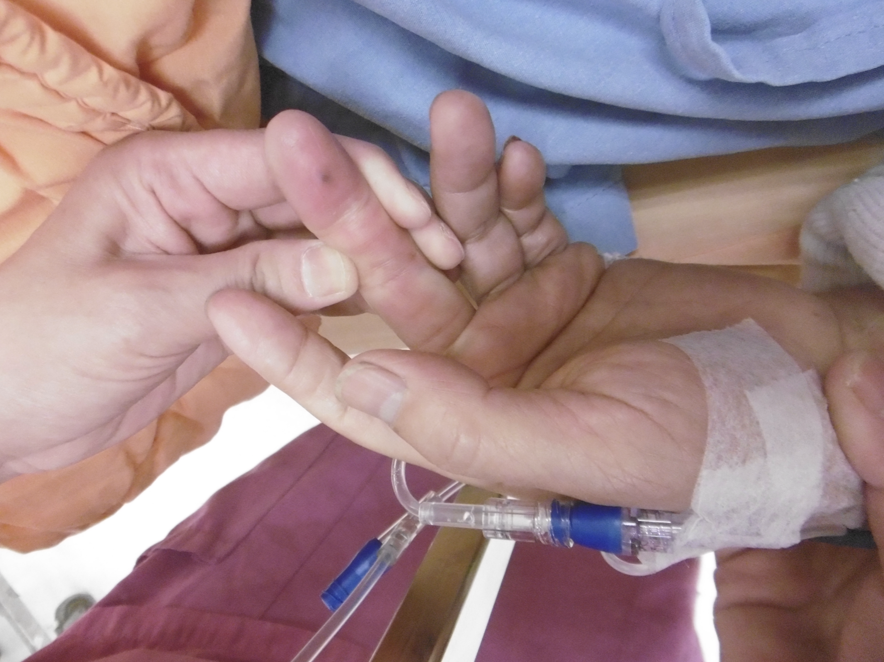

Immediately gave epinephrine 0.3 c.c IM, Hydrocortisone 200 mg, Anti-histamine

### **Time: 16:40**

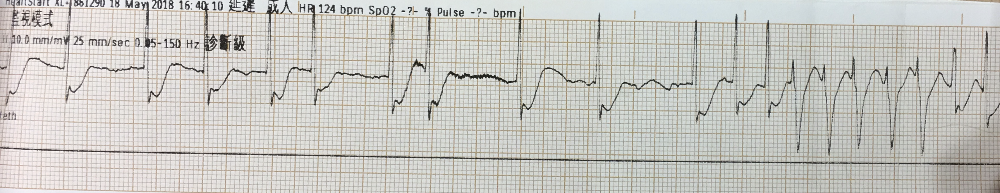

Less than a minute after arrival

No pulse➔PEA

Started CPR

### **Time: 16:40**

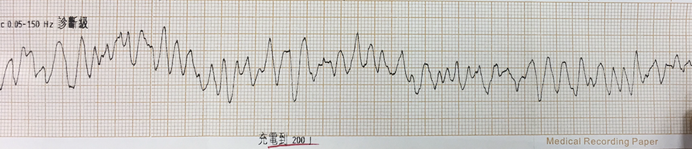

In under a minute, the rhythm changed to Vf

I yelled, get ready to shock. Set it to 200J for me

In the brief moment it took to charge to 200J, I was thinking about what to do next.

⚡️It charged fast, I pressed the shock button on the paddles. Continue CPR

The patient's body jolted from the shock.

### **Time: 16:42**

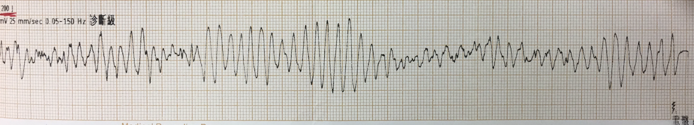

After two minutes of CPR, I took a look at the rhythm on the ECG monitor

Hmm...... kind of looks like TdP? Or Vf?

⚡️Either way the patient was still unstable, so shocked again at 200J, then CPR and drugs

### **Time: 16:44**

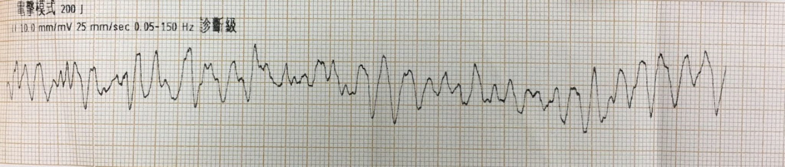

Another 2 minutes, still Vf

⚡️Shocked again at 200J

### **Time: 16:46**

I nearly fainted~~ still Vf

I asked another colleague to wheel over the second defibrillator for me, put on the TCP pads, and likewise set it to 200J

As I remember it, the pad placement for this case was the **right side of the figure below**, and for [the other case](https://agoodbear.com/post/ecg-post-8/) it was the **left side of the figure below**

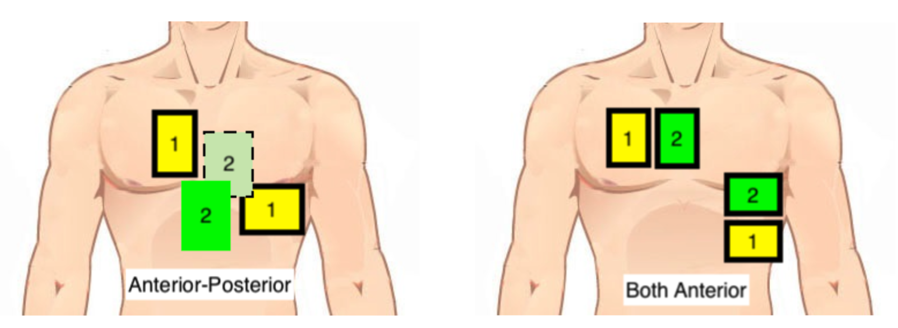

⚡️After the DSD shock, we got ROSC

But not long after, Vf again

⚡️Again used a DSD shock

Then PEA

### **Time: 17:01**

We kept resuscitating all the way to 17:01

**ROSC again, blood pressure no longer heading underground, 105/87 mmHg**

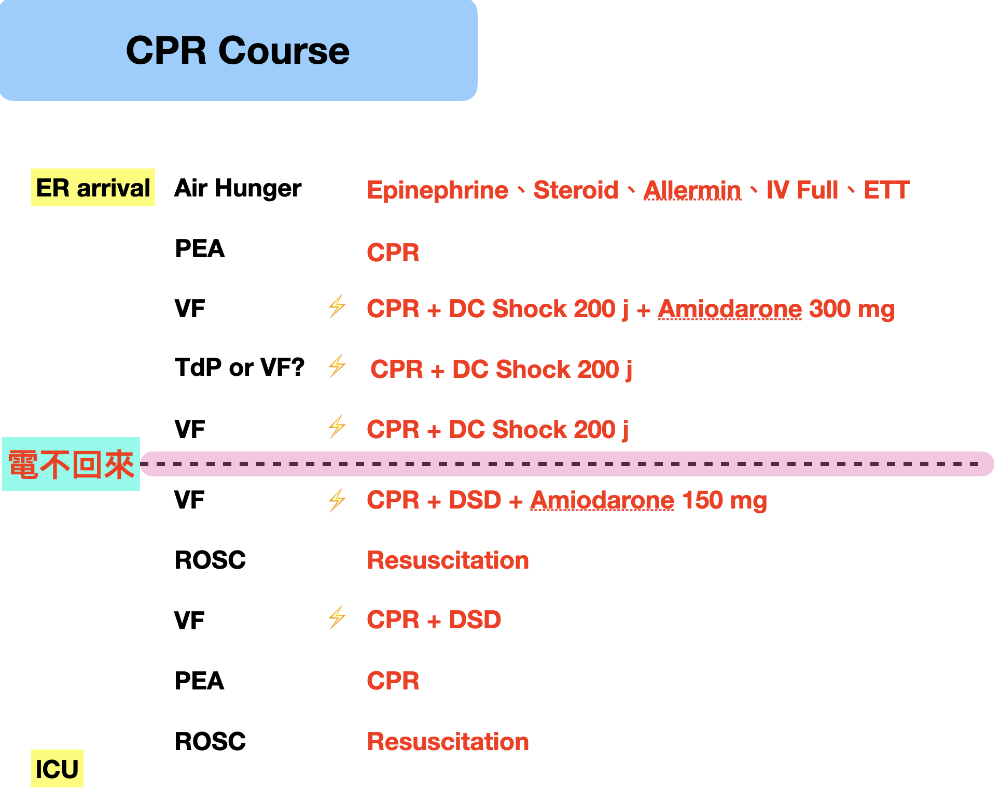

Over the whole ACLS course, we used **two DSD shocks**

After 17:01 there was no more Vf

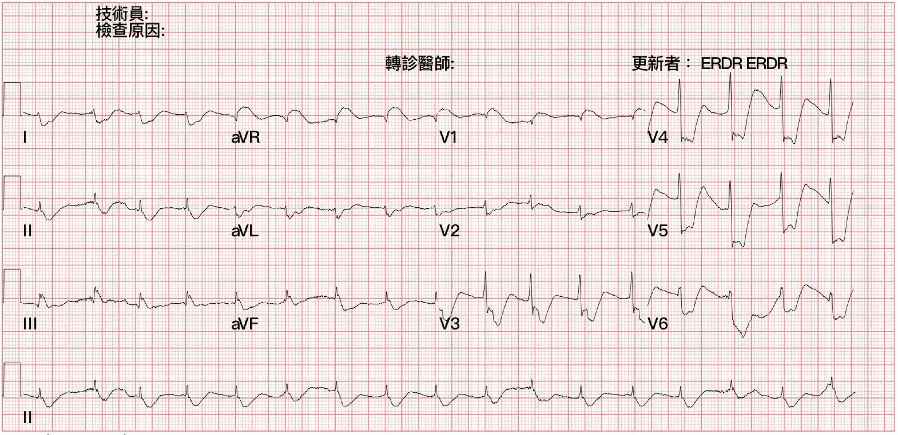

Rate: 102 bpm

Rhythm: can't see an obvious P wave anywhere

Axis: RAD

Interval: QTc calculates to 469 ms

Ischemia: looks like aVR STE with multiple leads STD, the subendocardial ischemia pattern

This isn't uncommon in a patient who was just resuscitated and got ROSC. The coronary arteries as a whole are in a state of hypoperfusion, and we also gave quite a bit of epinephrine, which also constricts the coronary arteries.

The reason this ECG pattern may show up is **diffuse subendocardial ischemia or oxygen supply/demand mismatch**➡this ECG is not specific for AMI; all it simply says is that **the heart is currently in a severe, widespread, global supply/demand imbalance, cause unknown**

Here's something to watch out for that Dr. Smith often says [^1].

- If you see diffuse STD but the Maximal STD is over V1~V4, that's a classic posterior OMI
- If you see diffuse STD but the Maximal STD is over V5-6 and II, that leans more toward diffuse subendocardial ischemia as the cause

The table below is my own go-to **DDx for aVR STE + multiple leads STD**

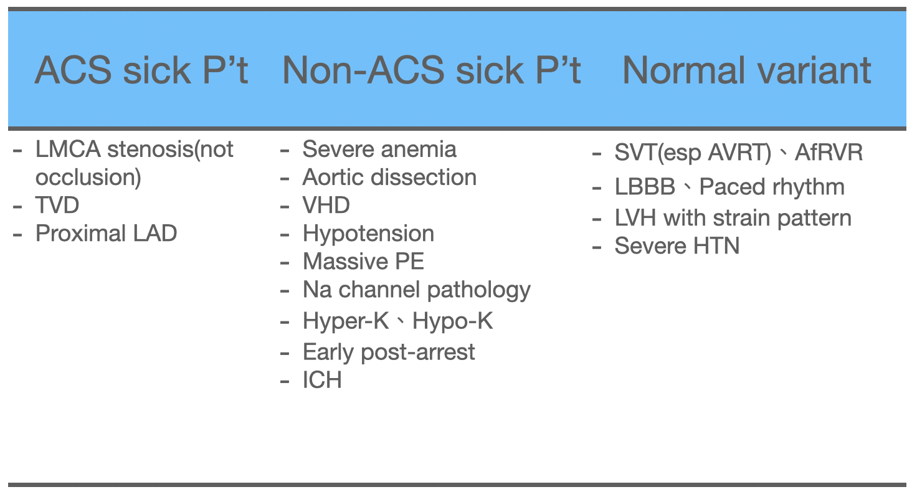

When the patient has ACS S/S and shows aVR STE + multiple leads STD, yes, you do need to consider LM, proximal LAD, TVD. But from this table we can also see that **there are many more causes—anything that creates an oxygen supply/demand mismatch can produce aVR STE + multiple leads STD**. Don't shoot at every shadow (don't call the CV man every time you see aVR STE😅)

The most common trap is the patient with tachycardia (SVT or AVRT, etc.), who will often look like this ECG pattern. Usually, before the rate has been brought down, someone consults CV saying they see aVR STE. And usually they get slapped in the face~~ Take good care of that pretty face of yours!!!

Also, one more concept: **AMI doesn't commonly present with tachycardia, unless cardiogenic shock has already set in**.

So when the heart rate is fast and you're about to say the patient has an AMI, you must first ask yourself: is this really AMI!!!

---

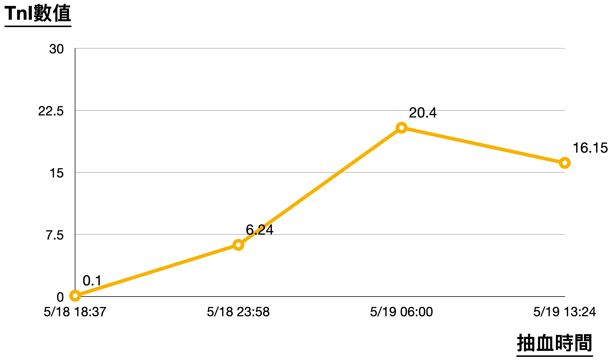

The table above shows the patient's TnI kept climbing during the admission～～

### **OK, let's refocus on the patient. What on earth happened?**

Was it an arrhythmia from the bee-sting allergy, or.......... the epinephrine? **What??????? What am I even saying????**

Actually there are quite a few case reports in the literature where a patient with anaphylaxis was given epinephrine, then developed STE, and went on to AMI

From these two papers [^2][^3] we know that anaphylaxis is a very serious allergic reaction. **Anaphylactic shock may lead to myocardial infarction, which may be caused by the anaphylactic shock itself (Kounis syndrome) or by the epinephrine used to treat it.** Although there have been past reports of large IV doses of epinephrine triggering MI, cases of MI triggered by therapeutic-dose IM epinephrine are rare. Rare as it is, **epinephrine can cause coronary vasospasm and thereby myocardial ischemia**. Despite this rare complication, **epinephrine remains extremely important in treating anaphylactic shock**, because **the risk of anaphylactic shock far outweighs the risk of epinephrine's side effects**.

That said, **most cases of epinephrine-induced MI occurred in patients who received high-dose IV epinephrine** [^2].

#### So can we tell from the clinical picture whether this anaphylaxis patient's cardiac problem came from the anaphylactic shock itself (Kounis syndrome), or only arose after epinephrine was given? [^4]

- The **difference between Kounis syndrome and epinephrine-induced MI lies in the timing of onset of cardiac symptoms and ECG changes. If cardiac symptoms occur during or after epinephrine administration, epinephrine is the more likely cause**. In Kounis syndrome, the onset of cardiac symptoms and ECG changes precedes any epinephrine administration. Likewise, with an epinephrine cause, the ECG changes only occur after epinephrine is given.

When this case arrived, she already had an air-hunger breathing pattern, low blood pressure, and low oxygen saturation. She went into Vf very quickly. The time we gave epinephrine 0.3 c.c IM and the time she went into Vf were very close, or the Vf came just a little later. So for this fatal arrhythmia, I'd lean toward Kounis syndrome as the cause.

**Kounis syndrome is also called Allergic acute coronary syndrome**

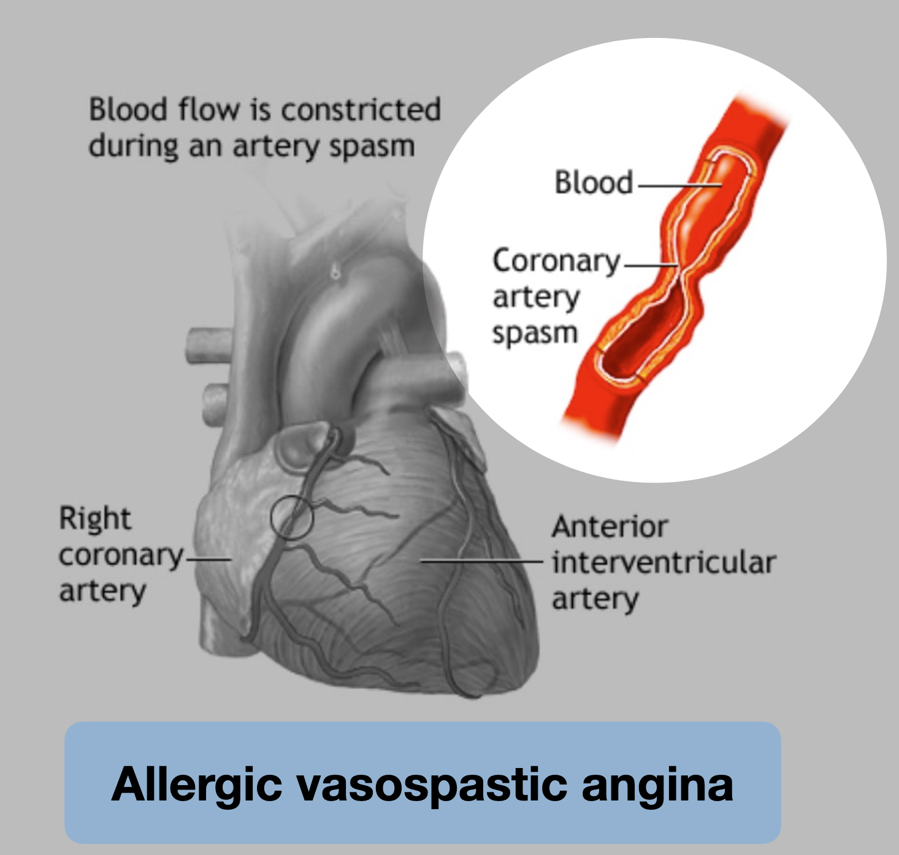

As the name says, an allergy causes coronary artery spasm, which leads to ischemia and ACS-like symptoms.

#### **Kounis syndrome can be divided into three types** [^5]:

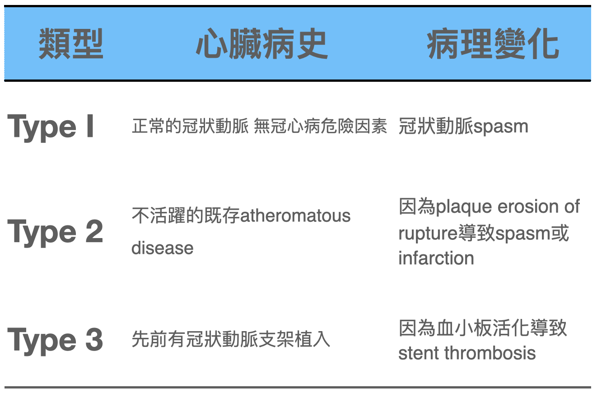

#### **The article also mentions several clinically important points** [^5]:

1. In **Kounis syndrome, morphine must be avoided, because it may stimulate histamine release and worsen mast cell–induced vasospasm**
2. **Some authors advocate using epinephrine with caution, because it may worsen coronary ischemia by aggravating vasospasm**
3. ECG changes usually resolve after treatment and removal of the underlying allergic trigger
4. In patients undergoing CAG, vasospasm improves after intracoronary NTG.

#### **So what kinds of situations cause Kounis syndrome?**

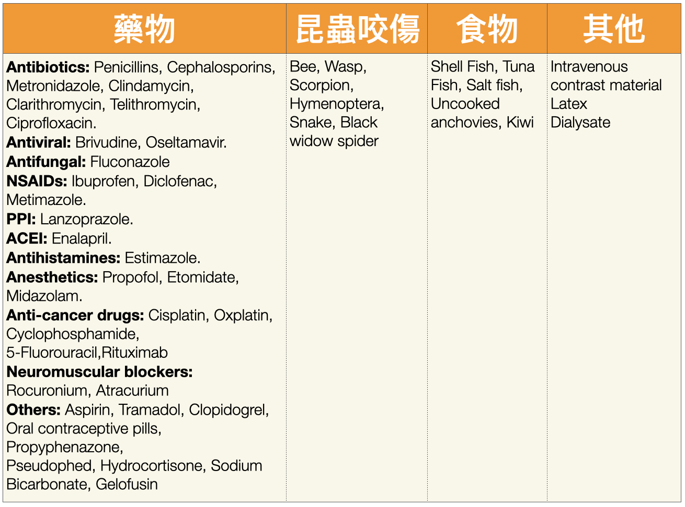

The **most common** known **triggers are antibiotics (28%) and insect stings (23%)**[^5]

But I figure anything that can cause an allergy can potentially cause Kounis syndrome~~

#### **And how are the ECG features of Kounis syndrome any different** [^6]?

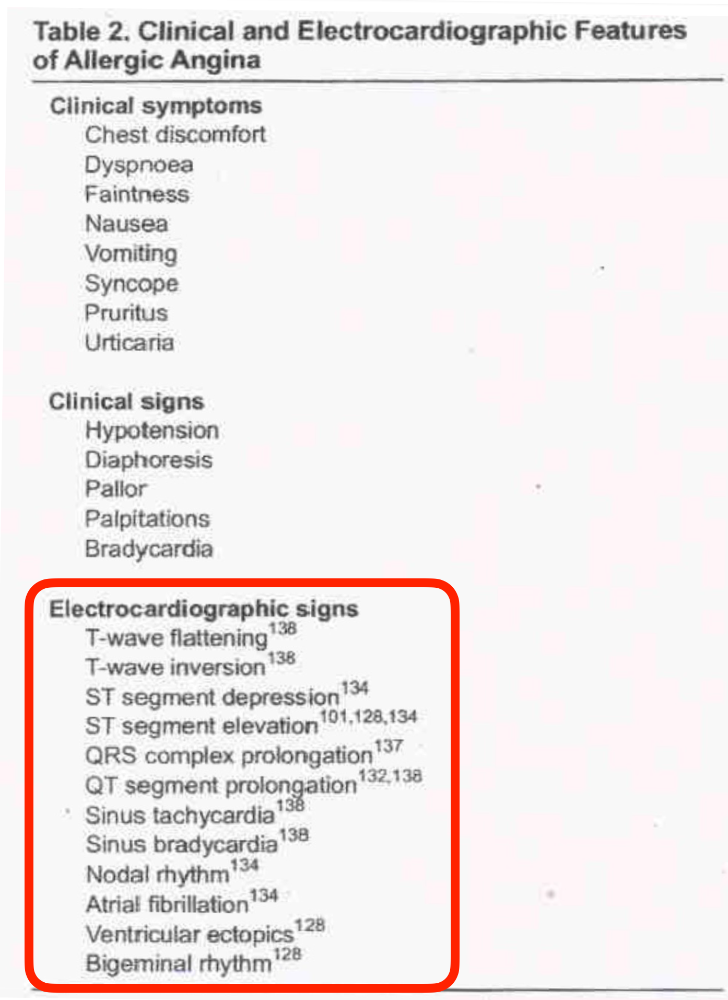

**Honestly....... I can't see any difference XD**(😅😅😅)

#### **Next, UpToDate on the diagnostic criteria, diagnostic evaluation, and treatment of Vasospastic angina** [^7]:

- ##### **Diagnostic criteria for Vasospastic angina include:**

  - **Angina that responds to NTG**, usually occurring at rest and often at night
  - Accompanied by **transient ischemic ST changes**, such as transient STE or STD
  - **Coronary artery spasm** showing **more than 90% constriction** on angiography

- ##### **Diagnostic evaluation➔obstructive coronary artery disease must be ruled out in all angina patients**

  - Recommend that all Kounis syndrome patients **be put on an ECG monitor**, to evaluate for symptomatic or asymptomatic ischemic ECG changes and arrhythmias
  - **Recommend arranging Coronary CTA or CAG**

- ##### **Treatment** (**treatment here refers to Kounis syndrome that hasn't gotten as bad as my case with Vf—i.e., how to handle it when angina shows up**)

  - Recommend **starting with a CCB**➔usually **diltiazem 240~360 mg/day**
  - **Sublingual NTG can be used to relieve angina and reduce the frequency of MI and of the fatal arrhythmias associated with these episodes**
  - Avoid Nonselective beta blockers (e.g., propranolol)➔Nonselective beta blockers block β2 receptors, which have a dilating effect on the coronary arteries. When these receptors are blocked, it can lead to further coronary constriction or spasm, making things worse. Therefore, **nonselective beta blockers should be avoided in patients with vasospastic angina**.

## The Case Continues

We got a Portable CXR: the CPR chest compressions had given the patient a pneumothorax

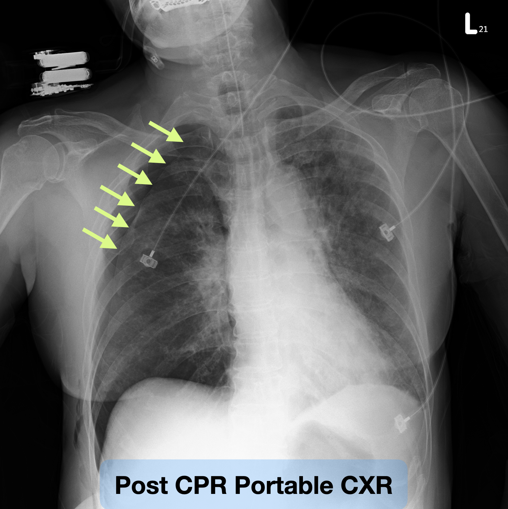

The patient then got a chest tube in the ED, and a CVC too

When we were 20-some minutes into CPR, I was just about ready to give up. Never expected that DSD would actually shock her back

Before going up to the ICU

The patient could already open her eyes. So moving! But she had three pumps running, and tubes everywhere (ET tube, Chest tube, CVC)⋯⋯⋯

She then stayed in hospital for 10-some days and was discharged alert, with no neurological deficits at all. Truly a miracle! The only pity is that she never got a CAG during the admission.

Thanks to our resuscitation team for not giving up on the patient, and thanks to the CU team who took over afterward for their hard work

### **Thank God almighty!**

## Learning Points:

1. When you run into electrical storm, consider DSD
2. What Kounis syndrome is
3. The DDx of aVR STE + multiple leads STD
4. Avoid morphine and nonselective beta blockers in Kounis syndrome

## References:

[^1]:  Dr. Smith's ECG Blog: A woman in her 70s with chest pain - [link](https://hqmeded-ecg.blogspot.com/2022/12/a-woman-in-her-70s-with-chest-pain.html)
[^2]: Shrestha, B., Kafle, P., Thapa, S., Dahal, S., Gayam, V., & Dufresne, A. (2018). Intramuscular Epinephrine-Induced Transient ST-Elevation Myocardial Infarction. __Journal of Investigative Medicine High Impact Case Reports__, __6__, 232470961878565. https://doi.org/10.1177/2324709618785651
[^3]:Jayamali, W. D., Herath, H. M. M. T. B., & Kulathunga, A. (2017). Myocardial infarction during anaphylaxis in a young healthy male with normal coronary arteries- is epinephrine the culprit? __BMC Cardiovascular Disorders__, __17__(1), 237. https://doi.org/10.1186/s12872-017-0670-7
[^4]:Tan, P. Z., Chew, N. W. S., Tay, S. H., & Chang, P. (2021). The allergic myocardial infarction dilemma: is it the anaphylaxis or the epinephrine? __Journal of Thrombosis and Thrombolysis__, __52__(3), 941–948. 
[^5]: Kounis Syndrome • LITFL • ECG Library - [link](https://litfl.com/kounis-syndrome/)
[^6]:Kounis, N. G., & Zavras, G. M. (1991). Histamine-induced coronary artery spasm: the concept of allergic angina. __The British Journal of Clinical Practice__, __45__(2), 121–128.
[^7]:Vasospastic angina - UpToDate - [link](https://www.uptodate.com/contents/vasospastic-angina?search=kounis syndrome&source=search_result&selectedTitle=1~4&usage_type=default&display_rank=1)
