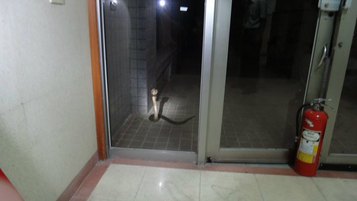

In my first year out in the countryside, at Zhudong Veterans Hospital (now Taipei Veterans General Hospital, Hsinchu Branch), something truly terrifying happened.

## `A cobra came to my house XD`

So the boss at home (my wife) cut a video to commemorate it😅😅😅

In the end, our EMT brothers caught it and sent it off to live somewhere else🥰

<iframe width="1000" height="600" src="https://www.youtube.com/embed/a87TfxR5vT8?si=RaXGlKItZLk8yITl" title="YouTube video player" frameborder="0" allow="accelerometer; autoplay; clipboard-write; encrypted-media; gyroscope; picture-in-picture; web-share" allowfullscreen></iframe>
