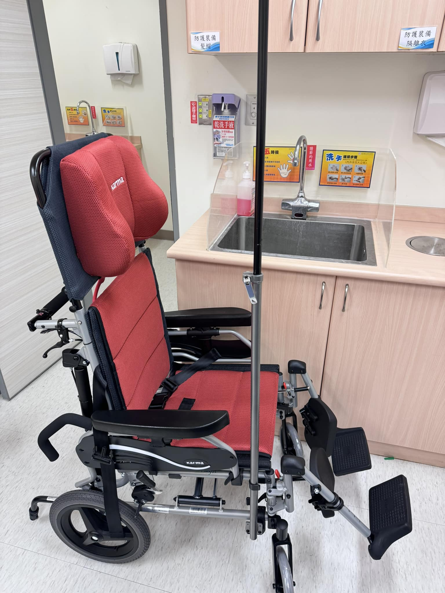

<iframe width="1000" height="500" src="https://youtube.com/embed/CQu4uK_8I1E?feature=share" title="YouTube video player" frameborder="0" allow="accelerometer; autoplay; clipboard-write; encrypted-media; gyroscope; picture-in-picture; web-share" allowfullscreen></iframe>

For the past two-plus months, the wards upstairs have been short-staffed, so every day the number of patients boarding downstairs in the ED explodes — they just can't get up to a ward. Waiting for a bed in the ED to get admitted starts at two days. The ED beds are all used up. So we often have 80- and 90-plus-year-olds sitting in wheelchairs getting IV fluids, and once they sit down, you start counting at 5 or 6 hours. They can't lie down. Young people can manage, but the elderly are often utterly miserable.

And so…….. the hospital got our ED some wheelchairs you can lie down in.

#### **Is it just me, or does something feel a little off🤨**

**<u>#Disclaimer: I'm still really grateful to hospital leadership for providing wheelchairs you can lie down in😵‍💫</u>**
