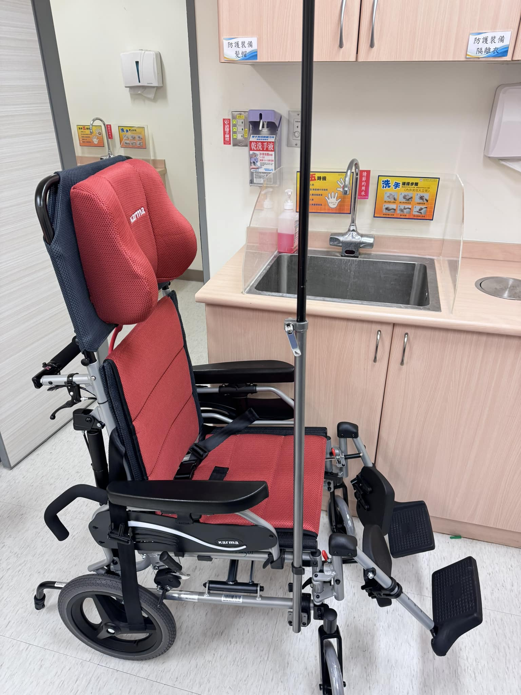

<iframe width="1000" height="500" src="https://youtube.com/embed/CQu4uK_8I1E?feature=share" title="YouTube video player" frameborder="0" allow="accelerometer; autoplay; clipboard-write; encrypted-media; gyroscope; picture-in-picture; web-share" allowfullscreen></iframe>

近二個多月，醫院樓上人力不足，所以每天樓下急診待床人數都爆炸多，無法住到病房。急診等床住院都要兩天起跳。急診床都被用光。所以常常會有8、90歲以上老人家坐著輪椅打點滴，而且一坐就是5、6小時開始計算。不能躺，年輕人還好，老人家常常苦不堪言。

於是……..醫院幫我們急診準備了，可以躺的輪椅。

#### **是不是只有我覺得哪裡怪怪的🤨**

**<u>#先聲明還是很感謝醫院高層提供可以躺的輪椅😵‍💫</u>**
