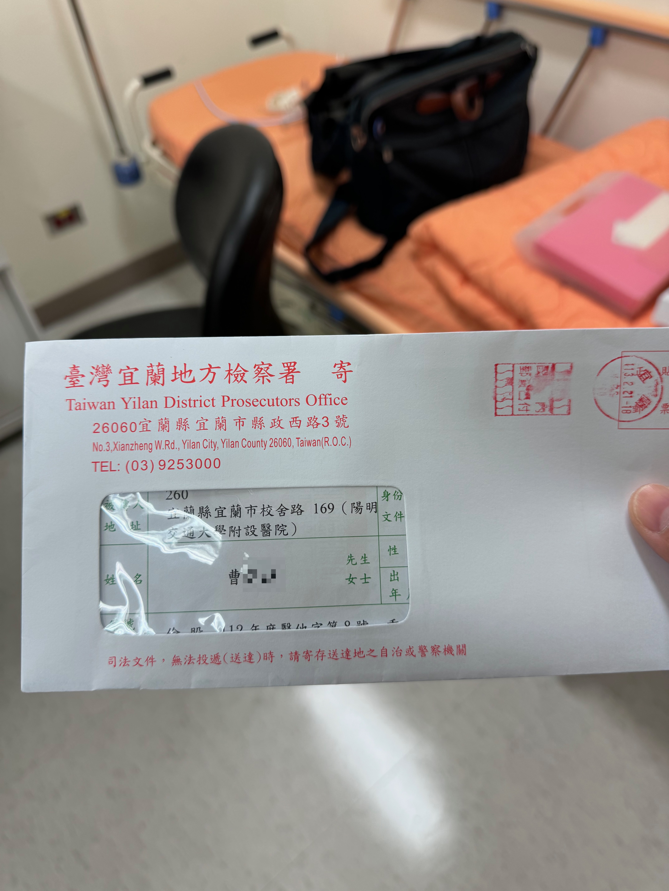
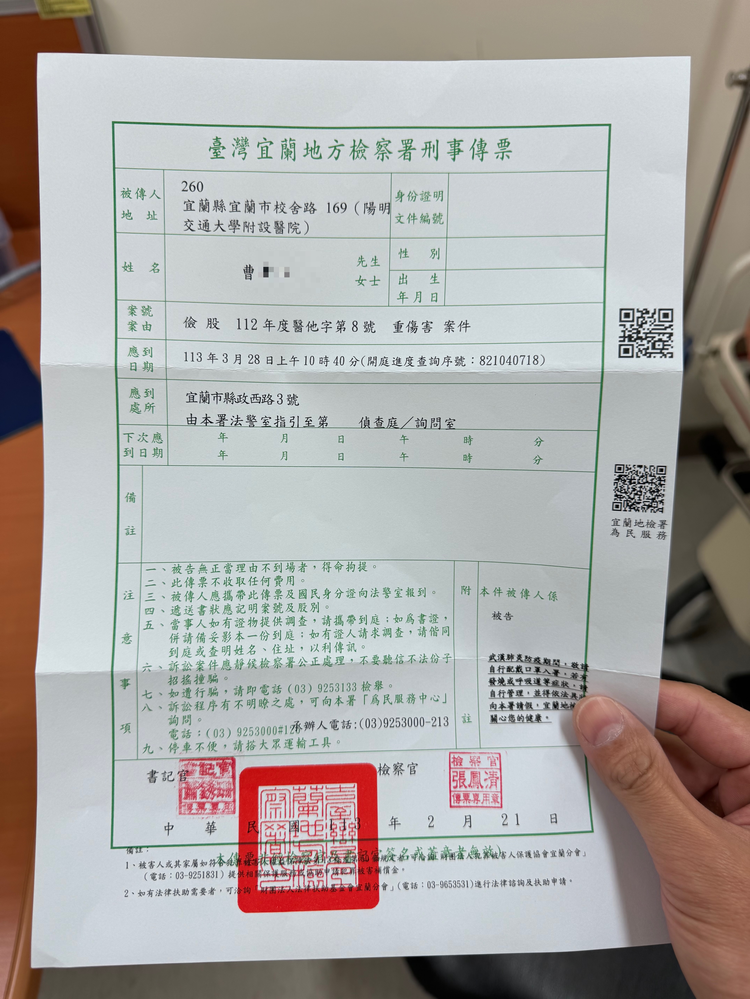
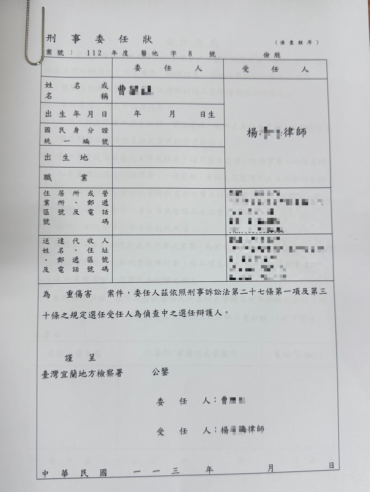
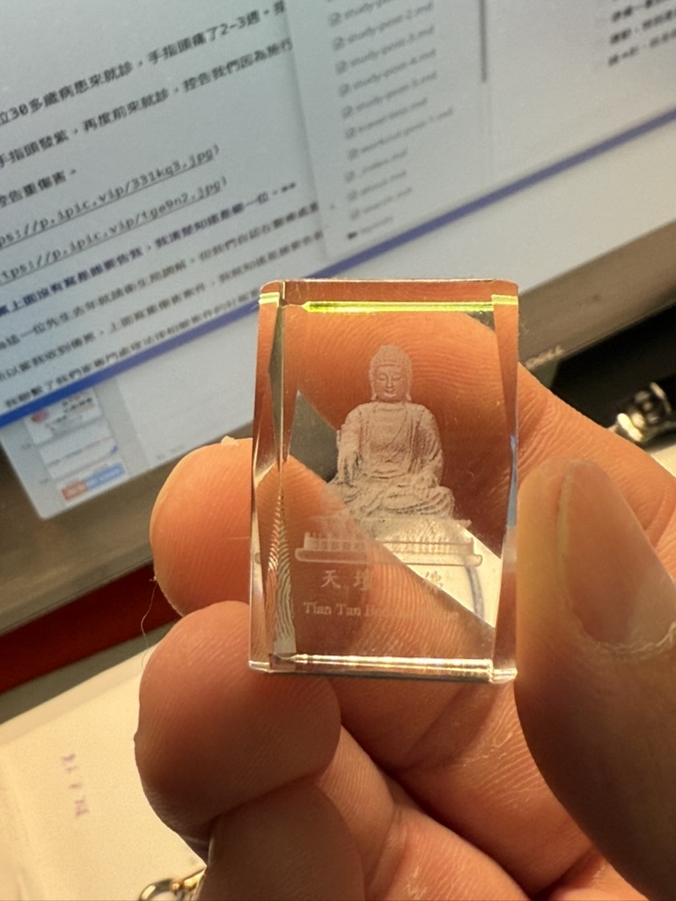
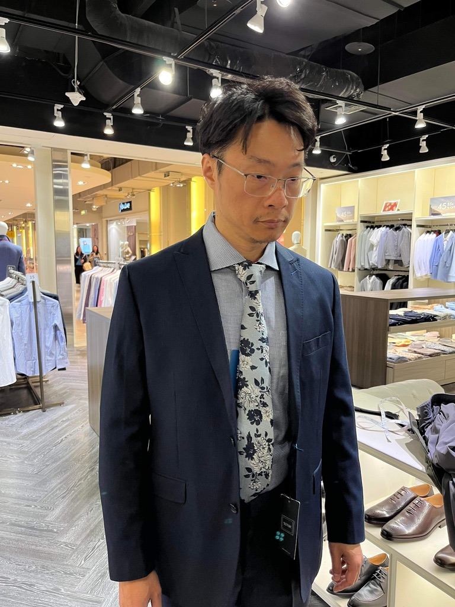
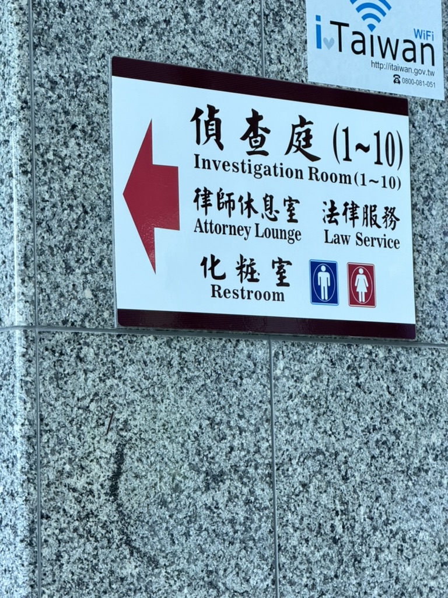
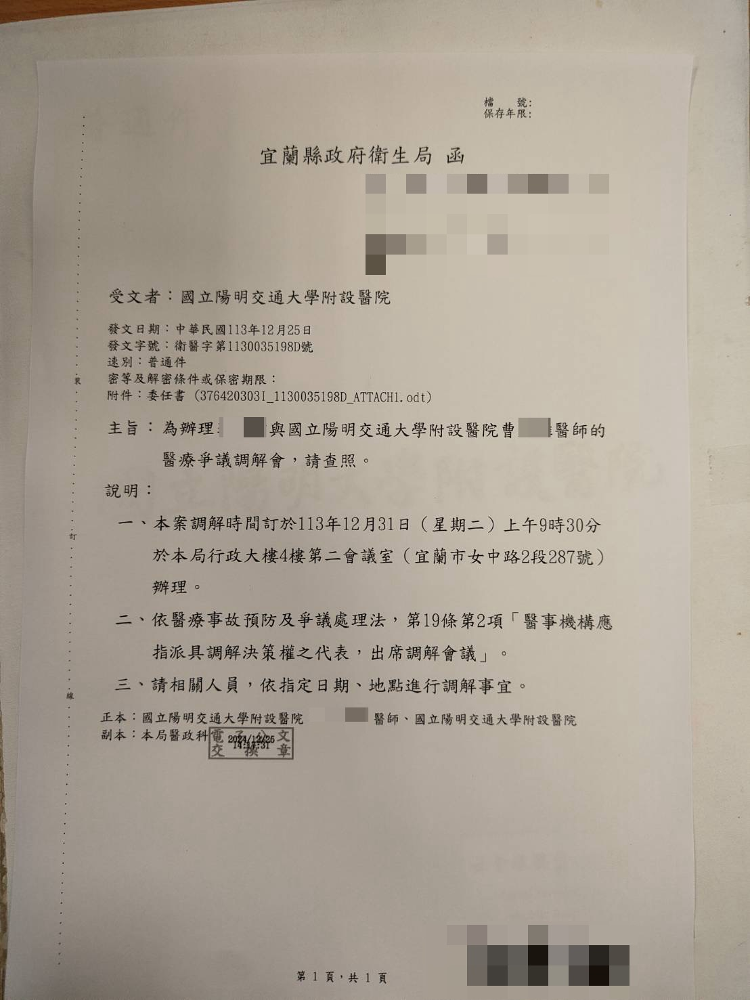
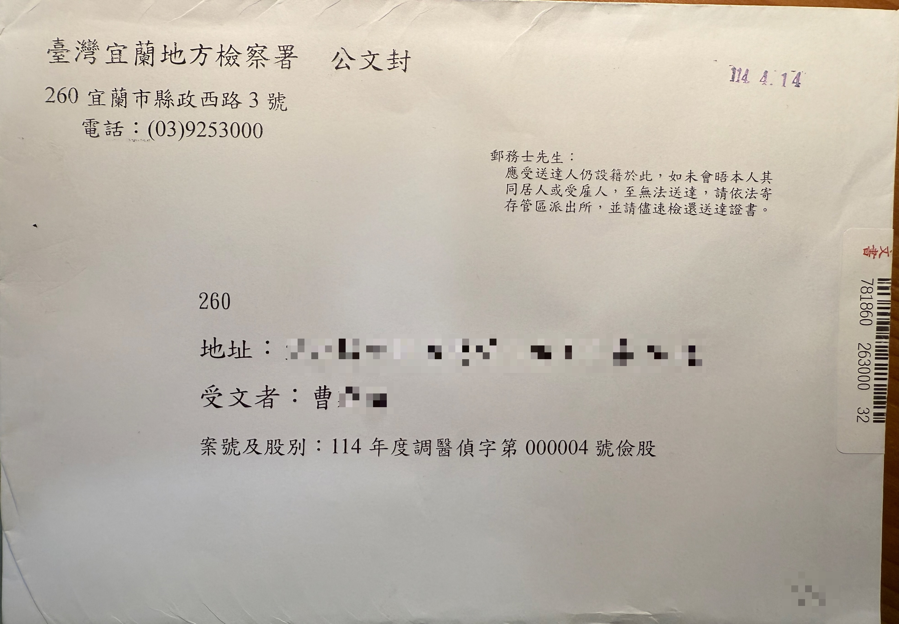
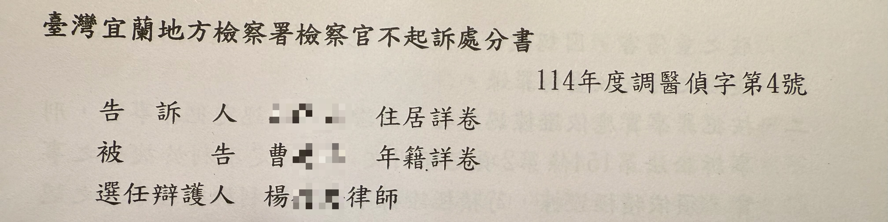
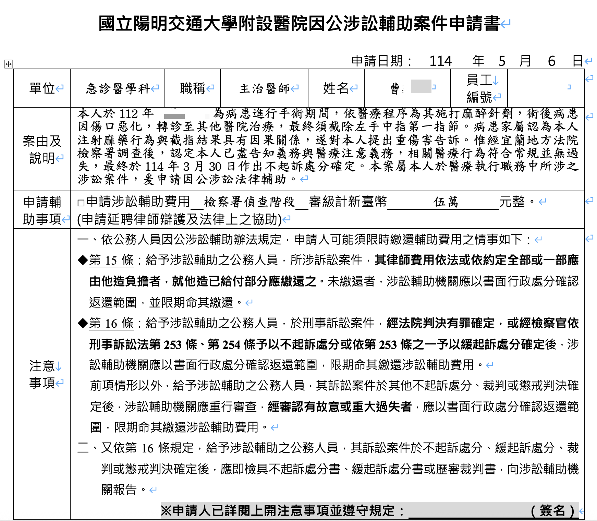

As the saying goes, if you want to work in the kitchen, don't be afraid of the heat.

Ever since I started my ED career in October 2005, I've felt that emergency medicine is a specialty that walks on thin ice.

You don't know, and you can hardly predict, whether your next step will crack the ice and drop you into the river.

---

### **Here's how it went~~**

One day in 2023 (ROC 112), a patient in his 30s came in with a finger that had hurt for 2-3 weeks. There was an obvious foreign body stuck under the nail. We gave a local anesthetic, removed part of the nail, cleared out the foreign body, prescribed oral antibiotics, and sent the patient home.

Three days later, the patient's finger turned purple and he came back to the ED, accusing us of making his wound worse and turning it purple by giving the local anesthetic. After that he went to a medical center, and about 5-6 days later, the finger was amputated.

And so I was accused of <mark>**aggravated bodily harm**<mark>.

### **The summons didn't say who was suing me, but I knew exactly who it was.**

Because of how this gentleman behaved on his second ED visit, and how hostile he was to my colleagues when he came back to the ED for a medical certificate after being treated at the medical center.

So when I got the summons saying it was an aggravated bodily harm case, I knew who was suing me.

I contacted our hospital's social services office, which handles legal matters.

The social services director set up a day for me to meet the hospital's legal-aid attorney, Attorney Yang.

That day I was coming off a night shift, and two hours after I got off, the social services director called me..

Dr. Tsao, are you free at 10?

I was up. OK.. 10 it is

When I got to the building where the attorney's office was, I looked up. I'd imagined a legal-aid attorney's office would be big and new.

But it looked kind of old. I took the elevator up and walked into the office.

I heard a hearty voice call out, Hello, Dr. Tsao, have a seat.

Then the social services director hurried in too.

I went over what had happened so the attorney could get a picture of it first.

Afterward, I drove the social services director back to the hospital.

On the way she told me story after story of cases that were truly frivolous lawsuits. **I listened with my jaw on the floor～～**

When we got to the ED entrance, I was about to drop her off so she could head back into the hospital.

I was really grateful she'd come along with me.

The social services director said, <mark>**"What we do is make sure you doctors don't get worn down by these petty things. We want to be able to protect you."**<mark>

All I felt inside was gratitude, and more gratitude.

---

I asked the hospital's legal-aid attorney to serve as my retained defense counsel.

I laid out what had happened that day and each point the other side was accusing me of, and submitted evidence to back up my innocence.

I remember that after I finished writing it all up that day, I was so angry — how can there be people who file frivolous suits like this.

### <mark>**Come on, let's go to battle for ourselves!!!**<mark>

I explained to the attorney in great detail what our clinical suspicion would be for a case like this.

A young man, a smoker, a finger turning so badly purple that it clinically needed amputation. That's definitely not infection. On the patient's second visit, according to the doctor who saw him, besides the original finger, even the two neighboring fingers had gone cold. The first thing that comes to mind is Buerger disease.

---

But later the attorney walked me through it. Even if I talked at length in court about how he might have Buerger disease, the prosecutor and the others might still not understand.

Attorney Yang said that **Article 82 of the Medical Care Act was amended on January 24, 2018 (ROC 107); Paragraph 2 now reads**: <mark>**"Only in the event that medical personnel cause harm to patients in conducting medical practices intentionally or breach of medical due care, which goes beyond reasonable exercise of professional clinical discretion, the medical personnel shall be bound to compensate for such harm."**<mark>

### <mark>**What we should focus on is whether, over the entire course of care, there was any negligence — something we should have paid attention to and could have paid attention to, but didn't.**<mark>

✔︎The patient had an obvious foreign body under the fingernail

✔︎We removed the foreign body from under the nail, giving lidocaine (without epi) as a digital block to do the removal

✔︎Before the procedure, we had a consent form for the foreign body removal, and also a surgical consent form

✔︎After the procedure, we gave oral antibiotics and documented in the chart that if anything changed, he needed to return to the ED immediately

Attorney Yang's analysis was that we'd done what we were medically supposed to do; how the patient's condition evolved afterward isn't something a doctor can control.

Whether or not the patient has Buerger disease, it's none of our business in the ED. He told me I didn't need to make a point of telling the prosecutor whether the patient did or didn't have Buerger disease. <mark>**I just needed to explain what we did**<mark>.

Because out of 10 doctors handling a patient like this, 9.9 would probably follow the same process we followed in the ED.

---

Later we picked another day, and Attorney Yang and I met again to discuss what to say at the investigation hearing. During the meeting, Attorney Yang had another attorney help with typing and ask me some questions.

Two days later, the attorney finished the criminal defense brief and got it ready to submit to the District Prosecutors Office so the prosecutor could look it over first.

I was originally scheduled to work on the day of the hearing. **I asked a colleague if they could swap shifts with me since I had to appear in court that day.**

They said OK. One day before the hearing, after a shift, they handed me something.

Colleague: **Senior, I hope you'll be fine. This Buddha statue is for you — it'll protect you.**

Let me say it again

The guy suing me — setting aside the frivolous lawsuit itself — his attitude was really something else.

On his second visit, the first thing out of his mouth to the doctor seeing him was that it was because we gave him a local anesthetic to clear out the foreign body on his first visit that his finger turned purple.

Then after he was treated at the medical center, he came back to the ED for a medical certificate. According to my colleagues, his attitude was terrible: he wouldn't let anyone look at the wound, and he kept saying we were the ones who'd done this to his finger. At triage he even threw his patient wristband straight onto the triage desk.

**Good heavens, why should we healthcare workers have to take this kind of humiliation!!!!!!**

I know that when your own disease gets worse, it's hard to say outright that it's your own problem, and it's very easy to drag out the last doctor in the course of treatment and flog the corpse.

And **I was that last doctor**.

I don't blame anyone else. I knew I had every confidence I could win this case. **Because I hadn't done anything to wrong this patient**.

All I can say is, <mark>**Doctors are just passersby in a patient's illness. Sometimes, by the end of an illness, the doctor can't stop it from getting worse, and the patient naturally starts to wonder whether it was the doctor's treatment that led to this result for me.**<mark>

### <mark>**Let me use an example, and you'll understand how I felt.**<mark>

Say the patient is an asymptomatic COVID carrier. One day he goes to a restaurant to eat, and two days after the meal, he starts running a fever.

Then he sues the restaurant owner for giving him COVID, because his fever started after he ate at the restaurant.

And I'm that restaurant owner.

Again, <mark>**Rationally, it really is hard to take the blame (getting sick / the disease worsening) onto yourself; it's easier to drag out someone from along the way — even someone who helped you — and flog the corpse.**<mark>

<mark>**I believe the law will clear my name.**<mark>

---

The week before the hearing, I made a point of going out and buying a suit. Because most of my clothes are gym clothes😅

I figured showing up to court in workout clothes wouldn't look much like a doctor.

In court, the prosecutor was in front of me, with a court clerk alongside making the written record.

Attorney Yang was on my right

The man suing me was on my left

He accused me of being the culprit who cost him his finger.

The prosecutor asked me what happened back then

Honestly, as I talked I was shaking with anger. I wanted so f***ing badly to beat the f***ing crap out of this jerk next to me, the one we'd helped.

Of course, I didn't, or it would've ended up on the news.

After that, we waited for word.

Later the case was sent to the **the MOHW medical review committee**. Its reply also stated there was no basis to find that we had committed injury or negligent injury.

At the end of last year, the Yilan County Public Health Bureau sent another letter asking us to go with the complainant to the Yilan Public Health Bureau's medical dispute mediation committee for another round of mediation.

I really didn't want to see this guy's face again, so I asked Attorney Yang to attend for me.

After the mediation session, Attorney Yang called me.

He said the other side wanted us to pay 2-3 million (I forget the exact number).

Attorney Yang told him straight out, <mark>**"We're not giving you a single cent."**<mark>

And that was the end of the mediation session.

 Nice~~ We did nothing wrong, so why should we pay millions.

Being physically injured doesn't automatically make you the underdog. If anything, it's the medical side that's the underdog.

In mid-April this year, I received an official letter from the District Prosecutors Office.

I received the non-prosecution decision, and the other side had 10 days to file for **reconsideration** with reasons for contesting it.

The day before yesterday I called the attorney, and he said the other side had gone past 10 days without filing for reconsideration.

**So my case is basically over.**

He told me mine wrapped up pretty quickly — plenty of people have the other side keep filing for reconsideration and taking it higher and higher.

Keeping your passion for medicine alive through this long legal process, without letting these people snuff it out — you really need tremendous inner strength.

To all of you still caught up in legal proceedings: hang in there to the end. **Come on, let's go to battle for ourselves!!!**

Once the case is over, our hospital lets you apply for reimbursement of the fee for the attorney you retained yourself, NT$50,000 flat.

Fill it out, send it in. I'll count it as extra money I made for my overseas trip this summer~~🥰🥰🥰

---

Many thanks to the social services director for her words: **What we do is make sure you doctors don't get worn down by these petty things. We want to be able to protect you**

Thanks to my colleague for the Buddha statue that watched over me

Thanks to the attorney who coolly said we wouldn't give this jerk a single cent, and who told me from the very beginning that we'd done nothing wrong, that we only needed to state what we'd done medically, and that I didn't need to worry. He gave me enormous confidence.

Thanks to the unknown patient who, out of nowhere, kept thanking me for months — at my lowest, when I wanted to quit, it gave me a bit of courage to keep going.

That's my fantastical journey through the courts. I've laid it out from the very beginning two years ago to the end this year. It also lets me look back, any time, and reflect carefully on what I've been through.

### Got sued — what should you prepare?

- [ ] **Hold on to your passion for medicine**➔Take a breath. There are many more good people who deserve our help. Don't let this crush you
- [ ] **Have the mental toughness for a long war**➔I know a lot of us in emergency medicine are used to being fast, decisive, and precise. But legal battles, especially over medical matters, take years just to get initial results. You can't rush it, and rushing won't help.
- [ ] **Find an attorney to go into battle with you**➔What we're good at is medicine. The law has a lot of ins and outs, so find an expert to help you get through this
- [ ] **Get a suit ready**➔Clothes make the man. Don't show up to court looking sloppy; let the prosecutor see the professional image we ought to have
- [ ] **Exercise, especially strength training**➔Many times when I felt the injustice of it, I got through by yelling it out during strength training
- [ ] **Money**➔Yes, money. Not to pay damages if you lose, but to hire an attorney and win the case.
