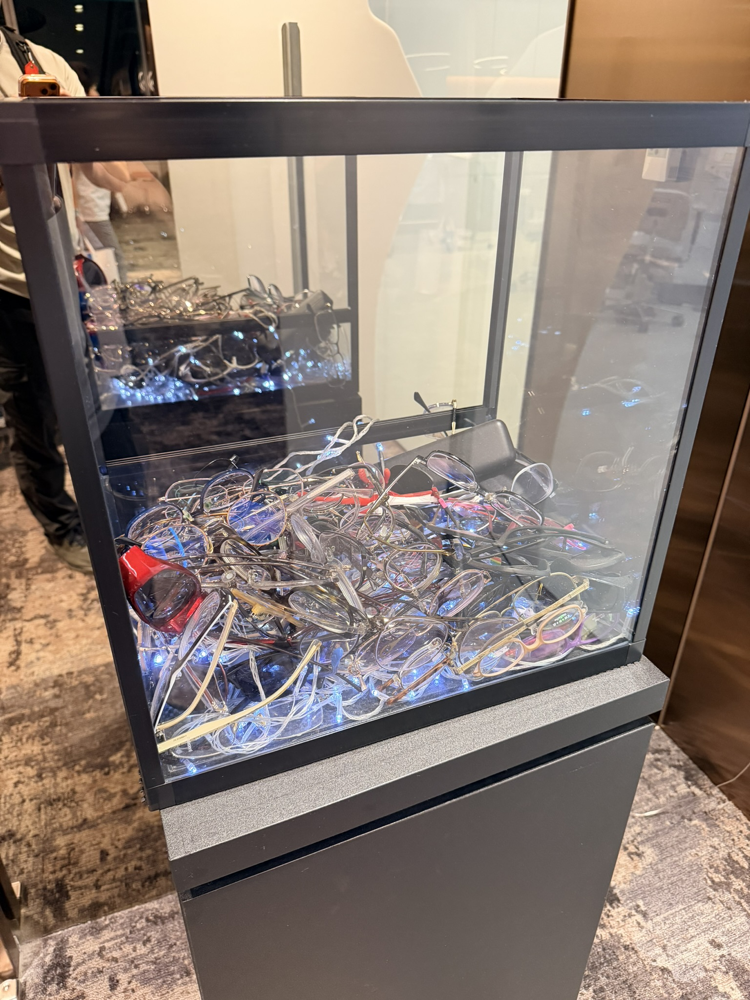
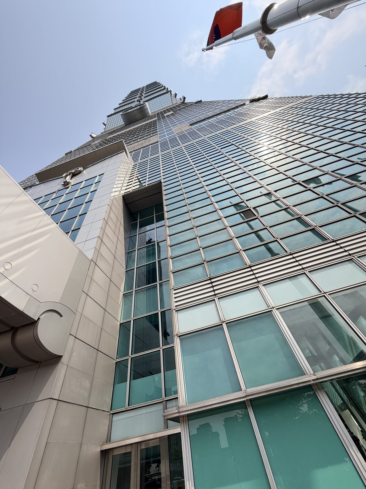
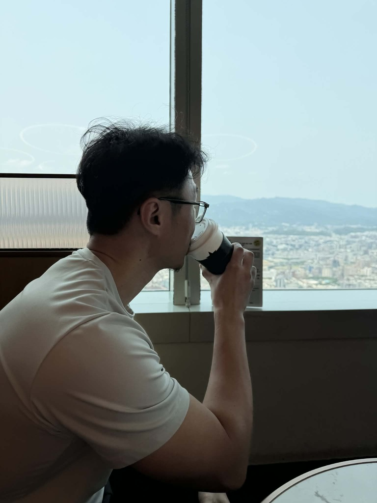
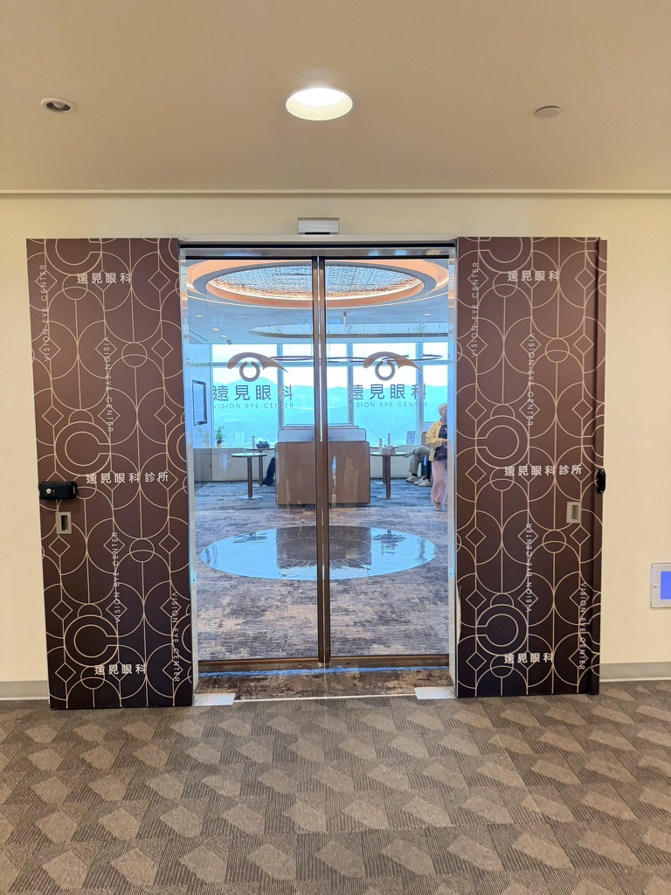
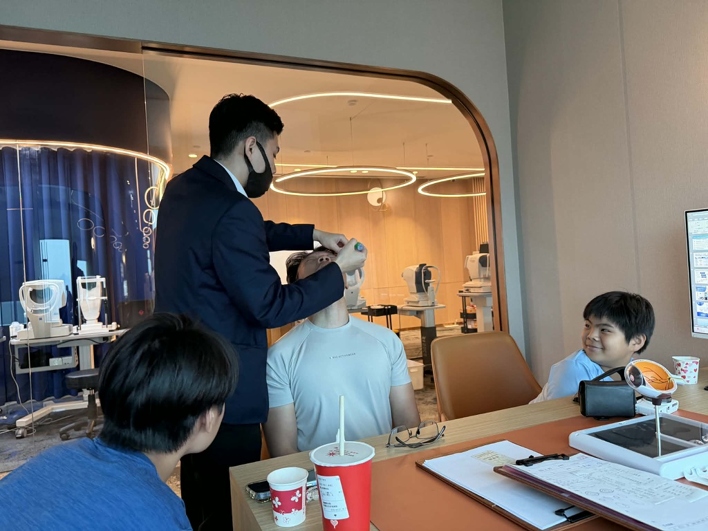
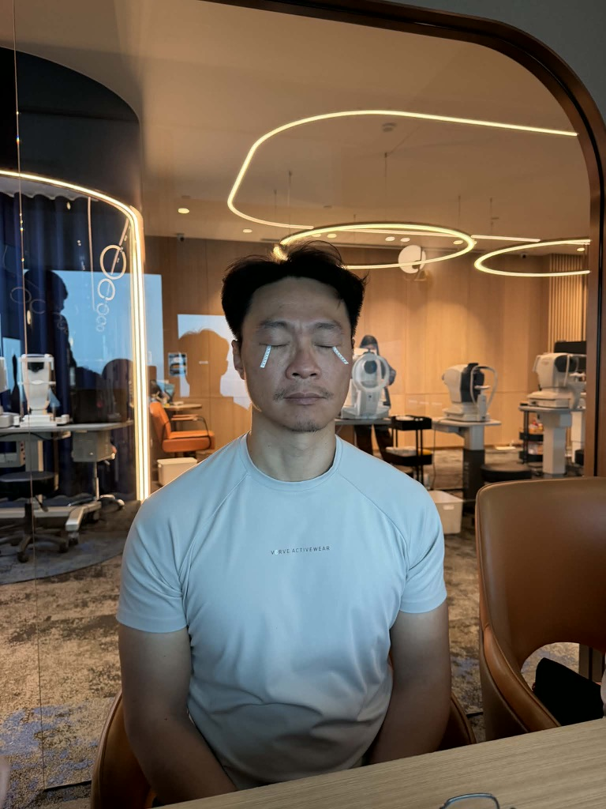
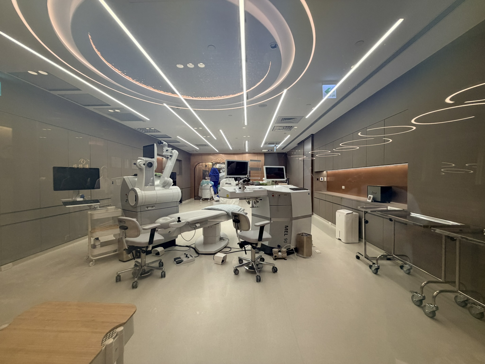
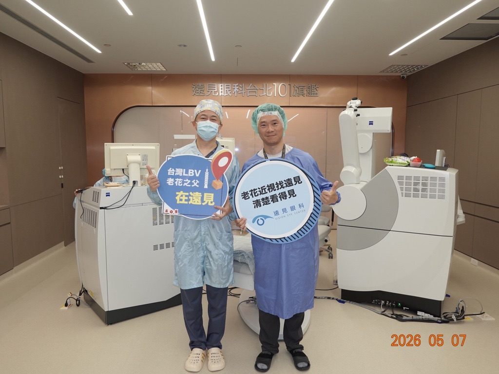
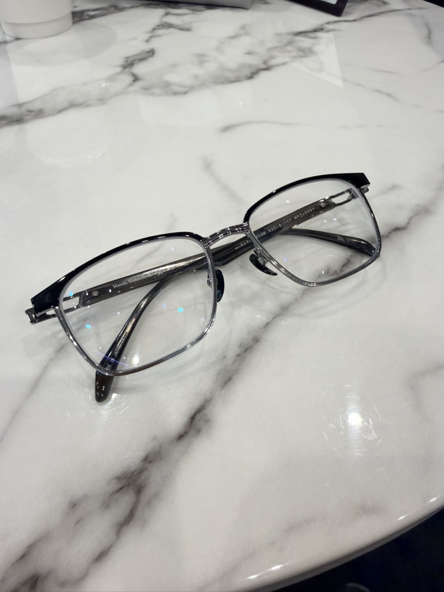

### **Here's how it started~~**

After I turned 45, presbyopia finally landed squarely on me.

When it's your turn, it's worse than you imagine. Especially in three situations where I absolutely did not want it getting in my way.

#### **1. Physique competitions: me, glaring on stage**

I've been training men's physique the past few years, and **you can't wear glasses in competition**, and I don't like contact lenses.

At my competitions the last two years, I'd watch the video afterward and get a shock. **On stage my eyes were bulging wide open and my whole face looked fierce**.

Only later did I realize it was because I couldn't see what was in front of me: **my eyes were habitually straining wide open, trying to make out the judges and the audience**.

For someone who put that much time into building lines and polishing poses, **losing in the end because of an ugly expression was really hard to swallow**.

#### **2. Skiing: the triple torture of glasses inside goggles**

Skiing means wearing goggles, but there are very few goggles with a myopia prescription, so I almost always wore regular glasses inside the goggles.

This combo has three pain points I've had enough of:

- **The goggles press on the glasses frame**, which presses on the scalp above both ears, and after a full day of skiing my scalp aches like crazy.
- The goggles sit too close to the glasses, and **it feels like they're pressing on my eyeballs**.
- If the glasses get knocked crooked inside the goggles, **it's really hard to reach in and fix them**. Especially below 0°C in thick gloves.

After every ski day the same thought popped up: *next time, it'd be great not to wear glasses inside the goggles.*

#### **3. Placing a CVP in the ED: the moment the guide wire wouldn't go into the central line**

This was the real straw that broke the camel's back.

A CVP (central venous catheter) is a routine ED procedure. When a patient's pressure drops and they need big-volume fluids, inotropes, or vasopressors, you have to put a large-bore central venous catheter in the neck or under the collarbone.

Placing a CVP has one key step: **using the Seldinger technique, you first feed a thin guide wire through the needle into the vein, then push the catheter in along the wire**.

That day in the ED I was placing a CVP and needed to thread the guide wire through the opening of the central line. I've done this countless times; it's muscle memory.

**And no matter what I did, I couldn't line it up.**

It wasn't shaky hands. **At that close distance my eyes just couldn't focus anymore.**

In that instant I knew it clearly: **this is not a state an ER doctor can live with.**

---

### **Why I ended up with LBV**

Let me be honest here: **I left the choice of procedure entirely to Dr. 張聰麒's evaluation.** <!-- keep-zh -->

Being a doctor, I'm clear on one thing. **My expertise is the ED and ECGs; eye surgery should be left to the people who actually do it**, not decided by looking things up online myself.

There are a lot of factors in the evaluation. Age alone directly changes the call.

For example, the recommended procedure for someone under 40 versus over 40 may be completely different. Young eyes don't have presbyopia yet and can go with single-focus myopia laser; past 40, once presbyopia starts, single-focus can only solve one end (distance or near), and the other end still depends on glasses.

After a full evaluation, the doctor recommended **LBV (Laser Blended Vision) presbyopia + myopia surgery**.

The core idea is simple, but clever:

> **The dominant eye's prescription goes to zero and handles distance; the non-dominant eye keeps some prescription and handles near.**
>
> **The human visual system can already fuse the different images the two eyes receive, combining these two images of different powers into one clear view, which gives the ideal result.**

In other words, **LBV doesn't make your eyes *perfect*. It splits the work between the two eyes and lets the brain put it together**.

#### **A clarification: LBV is not traditional monovision**

A lot of people hear one eye for distance, one eye for near, and immediately think of traditional monovision, but **LBV is different from traditional monovision**.

| Comparison | Traditional monovision | **LBV (Laser Blended Vision)** |
|---|---|---|
| Logic | One eye for distance, one eye for near | One eye mainly for distance, one eye mainly for near |
| Corneal shape | Spherical (standard myopia laser) | **Deliberately induces spherical aberration** to extend each eye's depth of field |
| Intermediate distance | **Has a blind zone** (hard cutoff between the two eyes' focus) | **Has a Blend Zone** (the two eyes' depth of field overlaps) |
| Brain fusion | More effortful | **Easier** (focal ranges overlap) |
| Non-adaptation rate | About 10-20% | **About 5%** |

> *The non-adaptation rates are commonly cited figures in the literature; actual rates vary with surgeon technique, patient factors, and length of post-op follow-up.*

Technically, LBV uses a Zeiss algorithm to **sculpt the shape of the cornea**, inducing **positive spherical aberration** so that each eye gets an extra stretch of depth of field beyond its main focal distance. **The two eyes' depth of field overlaps in the intermediate range**, and that's what the *Blended* in the name means.

So you can think of LBV as **an advanced version of monovision**. It keeps the logic of splitting work between the two eyes, but uses spherical aberration to fill in the intermediate range and lower the non-adaptation rate.

#### **Why the right eye to zero and 120-130 degrees left in the left eye?**

By now I'm sure many people have two questions:

> **Why not take both eyes to zero? Isn't seeing more clearly better?**
>
> **Why the right eye for distance and the left eye for near? Can't it be the other way around?**

These two questions are actually the core logic of presbyopia laser.

**Why not take both eyes to zero?**

Both eyes to zero = both eyes for distance. Sounds great, but the result is **crisp distance vision and total dependence on reading glasses for near**, no different from standard myopia laser.

Presbyopia is a problem of **declining accommodation of the lens**. **Laser can only change the shape of the cornea; it can't restore the lens's elasticity**.

So taking both eyes to zero just puts you back on the old road: can't see your phone without glasses, can't see the road with them on.

**LBV is designed to break exactly this deadlock**: one eye handles distance, one handles near, and the brain fuses them.

**Why the right eye to zero and 120-130 degrees left in the left eye?**

The split follows the **dominant eye**.

My right eye is dominant, so it handles distance, which I use most in daily life: driving, walking, looking at faces, reading signs far away.

The left eye is non-dominant, and **by the standard calculation it would keep 150 degrees for near** (100 degrees = 1.00 D). That's **the number I was told all the way through**, from the first exam, through the explanation in the consultation room, to trying on the simulation glasses on the day of surgery, my third visit.

**The twist came after I was already lying on the operating table.**

Dr. 張 looked at my type of work and said: <!-- keep-zh -->

> **"You're an ER doctor, you're constantly looking at patients and monitors at a distance. I'll take off another 20-30 degrees for you; that'll be more comfortable."**

The left eye was finally set at **120-130 degrees**, a last-minute customization for ER work.

If you swapped left and right, the brain could still adapt, but **pairing the dominant eye with distance usually feels more natural**, because most everyday activities put distance first anyway.

**Why 120-130 degrees? It's directly tied to ER work**

Power and focal distance are **inversely related**:

> **Focal distance (meters) ≈ 1 ÷ diopters**

It's easier to see as a table:

| Power left | Focal point lands at | Matching situation |
|---|---|---|
| 100 degrees | 100 cm | Standing and looking at the patient |
| **120 degrees** | **About 83 cm** | **Looking at the monitor, procedure distance** |
| **130 degrees** | **About 77 cm** | **Screen at a slightly outstretched arm** |
| 150 degrees | About 67 cm | Computer screen |
| 200 degrees | 50 cm | Reading, writing charts |
| 300 degrees | About 33 cm | Phone, fine work |

**Why would an ER doctor push the focus out to 80 cm?**

The visual demands of ER work are different from an office worker's:

| Work situation | My working distance |
|---|---|
| Looking at the patient (standing physical exam) | 70-100 cm |
| Monitor, nursing station screens | 80-120 cm |
| Procedures (suturing, placing a CVP, reading ECGs) | 50-80 cm |
| Charts, phone | 30-40 cm |

Leaving 120-130 degrees = **focal point pushed out to 80 cm** = **patients, monitors, and procedure distance all comfortable**.

The trade-off is that the phone and small print take a bit more effort, but in the ED that's secondary.

If it were set at the usual 150-200 degrees, **the focus would land at 50-67 cm**: books/screens clear, but patients and monitors farther away would be blurry.

**That's the spirit of customization**: not applying one formula to everyone, but looking at where your daily working distance actually is, and setting the focus at that distance.

Everyone's best split is different, which is why the pre-op evaluation matters so much.

#### **The concept of fusion actually goes back half a century**

A lot of people think LBV is a brand-new technology, but the idea of **using a power difference between the two eyes and letting the brain fuse them** has been in clinical use for a long time.

A quick timeline:

- **1950s-60s**: Ophthalmologists found they could fit contact lenses with **one eye for distance, one eye for near** to deal with presbyopia. That's where monovision started.
- **After the 1990s**: Cataract surgery with lens replacement (IOL) started applying the monovision concept: a distance lens in the dominant eye, a near lens in the non-dominant eye.
- **From the 1990s**: After LASIK myopia surgery took off, monovision was carried over to laser as a distance + near setup. But traditional laser monovision has an intermediate blind zone and a relatively high non-adaptation rate.
- **Around 2010** (the first LBV clinical studies were published around **2009-2011**): Dr. **Dan Reinstein** of the London Vision Clinic in the UK, working with Zeiss, brought the mechanism of **inducing positive spherical aberration** into monovision, extending each eye's depth of field and creating a blend zone in the intermediate range. That was **the birth of LBV (Laser Blended Vision)**.

In other words, LBV **isn't a new invention out of nowhere**. It's a refined version, built on 60-plus years of accumulated experience, that solves the pain point of the intermediate blind zone.

> Your brain already fuses the images from your two eyes (that's why we have stereo vision). LBV just takes this ability you already have and uses it as the basis of the surgical design.

---

It sounds abstract, but the result is very practical. **Without glasses I can read ECGs, look at screens, and see the road**, covering distance, intermediate, and near.

For a presbyopic ER doc like me, that's exactly what I wanted.

---

### **Why I chose Dr. 張聰麒** <!-- keep-zh -->

I treated picking a doctor as picking a colleague who's going to operate on me.

What finally made up my mind was **Dr. 張 saying in an ad that many doctors also come to him for their own surgery**. <!-- keep-zh -->

As a doctor, I know exactly how much weight that carries.

> **Doctors choosing doctors basically comes down to trust.**
>
> Every doctor has a shortlist in their head. When one doctor thinks another is good, there's usually a real sense of trust behind it: maybe they've seen the other one operate, heard good word at a class reunion, or handled each other's referred patients.

If that many colleagues are willing to put their own eyes in his hands, I figured he must be really good.

**This kind of insider's choice is more convincing than any ad copy**.

In the end I went with **Director 張聰麒 of 101遠見眼科 (an eye clinic in Taipei 101)**. <!-- keep-zh -->

---

### **Pre-op exams: three visits in total**

This was the part of the whole process that hit me most. **LBV really treats the pre-op evaluation as part of the surgery**, not the fast-paced come-in-for-exams, operate-the-next-day kind.

#### **First visit: full exam + retinal evaluation**

The first visit's exams were very thorough: visual acuity, refraction, corneal topography, aberrometry, pupil size, tear production, a questionnaire on how you use your eyes... item by item.

The point of the retinal exam: **are there any small holes?**

> Because LBV works on the cornea, the outer structure. If the retina inside already has a hole and you only find it after fixing the cornea outside, the result of the surgery takes a big hit. **Sort out the inside first, then work on the outside**.

To see the whole retina clearly, they **dilated my pupils twice** that day to confirm. The exam also included **a retinal CT**; for presbyopia laser at my age, that's what should be done.

Result: everything normal.

#### **Second visit: repeat exam + consultation room**

The second visit basically **repeated the first visit's tests to confirm**.

Your eyes won't change much in the short term, but LBV is an irreversible laser procedure, so **one more check is never too many**.

#### **A dry eye test too**

This time they added a **dry eye test**: a thin strip of paper tucked under the lower eyelid, then a few minutes' wait to measure tear production.

My **left eye was a little drier than the right**, but both were within normal range. If dry eye is too severe, it has to be treated before LBV can be done.

#### **Consultation room**

After the repeat exam + dry eye test, you go into the **consultation room**.

The counselor explains in detail on a computer:

- How the surgery will go
- How LBV's image fusion works
- The expected post-op result for my prescription
- What each eye will be adjusted to (right eye to zero / left eye keeping 150 degrees for near; this was the preliminary setup at the consultation stage)

The whole explanation isn't rushed, and you can keep asking questions.

#### **Third visit: final check on surgery day + simulation glasses**

On surgery day, after you go in, they **do one more final exam** to confirm everything.

But **the most crucial part this time is the simulation glasses**; I think this really is the essence of LBV.

> **They give you a pair of glasses that simulate your post-op vision: right side at zero, left side at 150 degrees**. That's the world your brain will see every day after surgery (in the actual surgery, Dr. 張 customized it further, taking off another 20-30 degrees). <!-- keep-zh -->

With them on you can walk around, look far and near, look at your phone, read signs: **let your brain try it once first**.

If they feel uncomfortable, you can't fuse, you get dizzy or nauseated, **then the procedure needs to be rediscussed, not forced**.

This simulation glasses step was done once at the first exam and once before surgery on the third visit. Both times they felt natural, and **only then did I really feel confident that I would adapt**.

---

### **Those 20 minutes on surgery day**

Simulation glasses OK, final check passed, and it's time to go into the OR.

I thought I'd be pretty chill. I've seen plenty of scenes in the ED, after all.

The second I lay down, **my heart rate shot straight past 100**.

**So this is what it feels like when a patient is in our hands.**

The whole thing is actually quick:

1. Anesthetic eye drops, numb within seconds.
2. A **speculum** holds the eyelids open; even though they're propped open, **it shouldn't hurt, as a rule**.
3. The machine counts down and tells me to fix my eyes on a red dot.
4. When the laser fires, **you hear a sizzling sound**; that's the laser burning corneal tissue.
5. **I didn't smell anything**, but **both eyes instantly went hazy, like looking out through a dirty pane of glass**.
6. Switch to the other eye, repeat.
7. The whole thing is done in about 20 minutes or less.

Walking out of the OR my vision was foggy, but by the time I got to the counter I could already read the word *Exit*.

It was a strange feeling.

---

### **What day 1 to day 3 after surgery really felt like**

I've been recording as I go. Today is post-op day 3, so this post only goes up to the day-3 edition. The one-month and three-month editions will come after my brain has fully adapted to LBV's two-eye fusion.

#### **Day 0 (evening of surgery day)**

- Vision like looking through a thin mist.
- Glare very obvious; streetlights have a big halo around them.
- Eyes sore and gritty, like I'd just been crying.
- Slept wearing eye shields (to keep from rubbing my eyes in my sleep).

#### **Day 1**

- Most of the haze cleared.
- **The right eye (the distance one) was already very clear**: reading signs and license plates outside was fine.
- **The left eye (the near one) was still foggy**; looking far, things felt *huh, a bit out of focus*.
- At this point the brain instinctively leans on the right eye, with the left as backup.
- Eye drops at their most frequent (antibiotic, steroid, and artificial tears, taking turns).

#### **Day 3 (today)**

- **Phone**: held at normal reading distance, the left eye takes over and it's clear.
- **Computer screen**: both eyes working together, no real problem.
- **Distance**: mainly the right eye; road signs, shop signs, faces all clear.
- **Night**: glare still there, but much less than Day 0.
- **Brain adaptation**: this is the most mysterious part. **For the first few minutes after waking up the two eyes feel like they're fighting, and after about 10 seconds the brain switches over on its own**. Over a whole day, this switch gets more and more automatic.

No lie: **for the first two days I wondered at one point whether I'd been too impulsive**.

But the moment I got up today, I suddenly realized I hadn't reached for my glasses.

That feeling was worth it.

---

### **A decision checklist for anyone considering it**

If you're 40+, presbyopia is starting to get in the way of your work, and you don't want to wear progressive lenses for the rest of your life, here's the checklist I'd give you after going through it myself.

#### **Step 1: Are you a candidate?**

- Is your cornea thick enough (the pre-op exam will tell you)
- No severe dry eye, keratoconus, glaucoma, or retinal disease
- Stable prescription (no big change in the past two years)
- Psychologically OK with LBV's concept of two eyes splitting the work and fusing (not both eyes set the same)

#### **Step 2: How to pick a surgeon and a clinic**

- The equipment has to match the procedure you want (LBV needs the Zeiss system)
- **Be careful if the pre-op exam is done only once**: the standard should be 2-3 visits, including retinal evaluation, a repeat exam, and a final check on surgery day
- **There should be simulation glasses so you can actually try it on**: this step can't be skipped with LBV
- The surgeon is willing to take time to clearly explain the pros and cons of each option, not just push the one they make the most on
- The enhancement policy (if the post-op prescription isn't on target and needs a touch-up, who pays?)

#### **Step 3: Questions you must ask before surgery**

1. Which procedures suit my eyes? Pros and cons of each?
2. How big a power difference between left and right will LBV be set to? Does it suit my type of work?
3. **Can I try simulation glasses first to experience the post-op vision?**
4. Will there be a retinal exam? Including dilation and retinal CT?
5. Expected residual myopia/presbyopia after surgery?
6. Chance of night glare and halos? How long until it stabilizes?
7. Enhancement policy? Cost? Timing?
8. Post-op follow-up checkpoints (next day, 1 week, 1 month)?

#### **Step 4: Mental preparation**

- **An adaptation period of 1-4 weeks is normal**, not a sign something's wrong.
- For the first 1-2 weeks, near vision takes effort, there's glare at night, and your eyes tire easily: all normal.
- Real severe pain, a sudden drop in vision, worsening redness and swelling: go back right away, don't tough it out.

---

### **Tentative conclusion (will be updated)**

**Would I recommend it to colleagues?**

If it's me on post-op day 3 answering: **yes, but find the right surgeon, get the right procedure, and be mentally prepared**.

Laser isn't a do-it-once-and-you're-set-forever thing. It's **trading a period of adaptation for a visual habit you've had for years**.

There's a cost, but for the right person the payoff is bigger.

At one month and three months post-op, I'll come back with another post. That's when LBV's two-eye fusion really settles in.

See you then.

---

### **Two months later**

Two full months post-op, back to add a quick note on how things really are.

These days, the blurriness when I wake up in the morning **lasts much shorter now**, and most of the time things are pretty clear.

The **night glare has improved a lot**, and **the dry eye has improved a lot** too.

---

> *This post is only a personal experience and does not constitute medical advice. Everyone's eyes are different; whether you're a candidate for surgery and which procedure suits you should be based on a formal eye exam and a professional ophthalmologist's evaluation.*
