平常我都是站在問診的那一邊。

「會不會痛？」「看不看得清楚？」「有沒有頭暈？」這幾句話我大概問過幾萬次。

這次換我躺在手術台上，被別的醫師問同一組問題。

---

### **事情是這樣開始的~~**

過了 45 歲之後，「老花」這兩個字終於穩穩落到我自己頭上。

輪到自己時，比想像中更難受。尤其是在三個我絕對不想被它干擾的場景裡。

#### **一、健體比賽：在臺上面目猙獰的我**

我這幾年在練健體，**比賽是不能戴眼鏡的**，我又不喜歡戴隱形眼鏡。

前兩年比賽，我下臺後看錄影都會嚇一跳。**我在臺上眼睛張得超大，整張臉看起來很猙獰**。

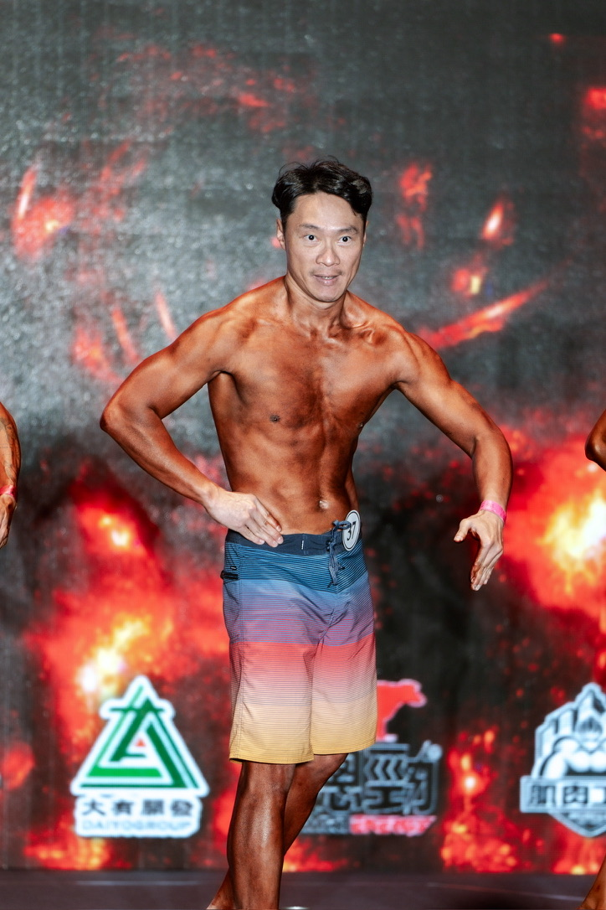

> 證物自首：這就是我在臺上的「猙獰眼睛」。線條練得再好都被這雙眼睛敗光。

後來才意識到，那是因為我看不到前面，**眼睛在習慣性地用力撐大、想看清楚評審跟觀眾**。

對一個花了那麼多時間練線條、修動作的人來說，**最後敗在表情難看，真的是很不甘心的事**。

#### **二、滑雪：雪鏡套眼鏡的三重折磨**

滑雪要戴雪鏡（Goggles），但有近視度數的雪鏡選擇非常少，所以幾乎都是雪鏡裡面再套一副普通眼鏡。

這個組合有三個我已經受夠的痛點：

- **雪鏡會壓到眼鏡架**，連帶壓到兩邊耳朵上方的頭皮，整天滑下來頭皮酸到不行。
- 雪鏡跟眼鏡距離太近，**有種壓迫眼球的感覺**。
- 眼鏡如果在雪鏡裡面歪掉，**很難伸手進去調整**。尤其是在攝氏零下、戴著厚手套的時候。

每次滑完雪都會冒出一個念頭：「下次能不戴眼鏡進雪鏡就好了。」

#### **三、急診放 CVP：guide wire 對不到 central line 的那一刻**

這個才是真正壓垮駱駝的那一根稻草。

CVP（中心靜脈導管）是急診常見的處置。病人血壓掉了、需要大量輸液、要打強心劑或升壓藥的時候，得在脖子或鎖骨下放一條粗的中央靜脈導管。

放 CVP 有一個關鍵步驟：**用 Seldinger technique，先把一根細細的導引鋼絲（guide wire）從穿刺針送進靜脈，再沿著鋼絲把導管推進去**。

那天我在急診放 CVP，要把 guide wire 穿過 central line 的開口送進去。這個動作我做過無數次，是肌肉記憶。

**結果我怎麼對都對不到。**

不是手不穩，是**眼睛在那麼近的距離已經對不到焦了**。

那一瞬間我心裡很清楚：**這不是一個急診醫師能跟自己交代的狀態。**

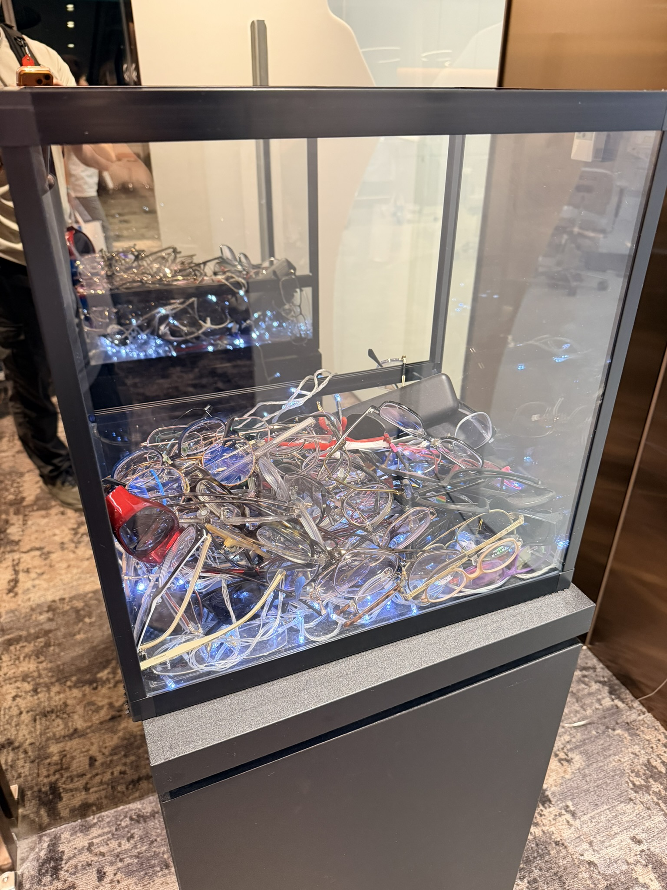

> 後來在診所看到這個——擺在門口的「大家丟掉的眼鏡」收集箱。我才意識到自己也快輪到了。

---

### **為什麼最後做的是 LBV**

這裡我要老實講：**術式怎麼選，我完全交給張聰麒醫師評估。**

身為醫師，我反而清楚一件事。**自己的專業在急診跟 ECG，眼科手術這件事該交給真正在做的人**，不是自己上網查一查就決定。

評估的考量因素其實很多。光是年紀就會直接影響判斷。

比方說 40 歲以下跟 40 歲以上適合的術式，建議可能就完全不一樣。年輕的眼睛還沒老花，可以走單焦的近視雷射；過了 40 之後開始有老花，單焦只能解決一邊（看遠或看近），另一邊還是得靠眼鏡。

我經過完整評估之後，醫師建議的是 **LBV（Laser Blended Vision，雷射融合視覺）老花近視手術**。

它的核心很單純，但很巧妙：

> **慣用眼的度數歸零，負責看遠；非慣用眼保留一定的度數，負責看近。**
>
> **人體在成像時本來就可以融合兩眼接收到的不同影像，把這兩個不同度數的畫面整合成一個清楚的視覺，進而達到理想的效果。**

換句話說，**LBV 不是讓你的眼睛變「完美」，而是讓兩隻眼睛分工，再交給大腦自己組合**。

#### **這裡要澄清一下：LBV 不是傳統的 monovision**

很多人聽到「一眼看遠、一眼看近」會直接聯想到傳統的 monovision（單眼視覺），其實 **LBV 跟傳統 monovision 不一樣**。

| 比較點 | 傳統 monovision | **LBV (Laser Blended Vision)** |
|---|---|---|
| 邏輯 | 一眼看遠、一眼看近 | 一眼看遠為主、一眼看近為主 |
| 角膜形狀 | 球面（一般近視雷射） | **刻意誘導球面像差**讓每眼景深擴大 |
| 中距離 | **有盲區**（兩眼焦距硬切） | **有融合帶 Blend Zone**（兩眼景深重疊） |
| 大腦融合 | 較費力 | **較容易**（焦距範圍有重疊） |
| 不適應率 | 約 10-20% | **約 5%** |

技術上 LBV 是用 Zeiss 的演算法**雕刻角膜形狀**，誘導出**正向球面像差**（positive spherical aberration），讓每隻眼睛在自己的主焦距外多一段景深。**兩眼景深在中距離這一段重疊**，這就是名字裡那個「Blended（融合）」的意思。

所以 LBV 可以理解成 **monovision 的進階版**。保留兩眼分工的邏輯，但用球面像差補上中距離、降低不適應率。

#### **為什麼是右眼歸零、左眼保留 150 度？**

寫到這裡我相信很多人會有兩個疑問：

> **「為什麼不兩眼都歸零？看更清楚不是更好嗎？」**
>
> **「為什麼是右眼看遠、左眼看近？不能反過來？」**

這兩題其實是整個老花雷射邏輯的核心。

**為什麼不兩眼都歸零？**

兩眼都歸零 = 兩眼都看遠。聽起來爽，但結果就是 **看遠很清楚、看近完全靠老花眼鏡**——跟一般近視雷射沒兩樣。

老花是**水晶體調節力下降**的問題。**雷射只能改變角膜形狀，沒辦法回復水晶體的彈性**。

所以兩眼都歸零，等於又走回老路：「沒戴眼鏡看不到手機、戴眼鏡又看不到馬路。」

**LBV 的設計就是要破這個困局**——讓兩眼一個負責遠、一個負責近，再交給大腦融合。

**為什麼是右眼歸零、左眼留 150 度？**

這是按「**慣用眼**（dominant eye）」分工。

我的右眼是慣用眼，所以負責日常最常用的「看遠」：開車、走路、看人臉、看遠處招牌。

左眼是非慣用眼，留 150 度負責看近：看手機、看病歷、放 CVP 時對 guide wire、寫處方時看螢幕細字。

如果左右反過來，大腦也能適應，但**慣用眼配看遠通常更自然**——因為日常大部分活動本來就是「看遠」優先。

**那為什麼是 150 度，不是 200 度或 100 度？**

這是張醫師根據我的**工作型態 + 年齡 + 角膜條件**客製化的。

- 留得太少（如 50 度）→ 近的看不清楚，意義不大
- 留得太多（如 300 度）→ 兩眼差距太大，大腦融合不過來、會頭暈

**150 度大約對應 30-40 公分的閱讀距離**——剛好是手機、病歷、手術視野的工作距離。

每個人的「最佳分工度數」會不一樣，這就是為什麼術前評估這麼重要。

#### **融像這個概念其實已經有半世紀歷史了**

很多人以為 LBV 是「最近才有的新技術」，其實「**用兩眼度數差讓大腦自己融合**」這個 idea 早就在臨床用了。

簡單時間軸：

- **1950-60 年代**：眼科醫師發現可以用「**一眼看遠、一眼看近**」的隱形眼鏡 fitting 解決老花，這就是 monovision 的起點。
- **1980 年代**：白內障手術換水晶體（IOL）開始套用 monovision——慣用眼換看遠的水晶體、非慣用眼換看近的。
- **1990 年代起**：LASIK 雷射近視手術普及之後，monovision 移植到雷射上做「看遠 + 看近」配置。但傳統雷射 monovision 中距離有盲區、不適應率偏高。
- **2010 年前後**：英國倫敦 Vision Clinic 的 **Dan Reinstein** 醫師跟 Zeiss 合作，把「**誘導正向球面像差**」這個機制引進 monovision，讓兩眼景深各自延伸、在中距離產生融合帶——這就是 **LBV（Laser Blended Vision）的誕生**。

也就是說，LBV **不是憑空冒出來的新發明**，而是 60 多年累積、針對「中距離盲區」這個痛點解出的精緻化版本。

> 你的大腦本來就會做兩眼影像融合（這也是為什麼我們有立體視覺）——LBV 只是把這個本來就有的能力，當成手術設計的基礎。

---

聽起來抽象，但結果很實際。**不戴眼鏡可以同時看 ECG、看螢幕、看馬路**，遠中近三個距離都涵蓋到。

對我這種急診老花族來說，這就是我要的。

---

### **為什麼選張聰麒醫師**

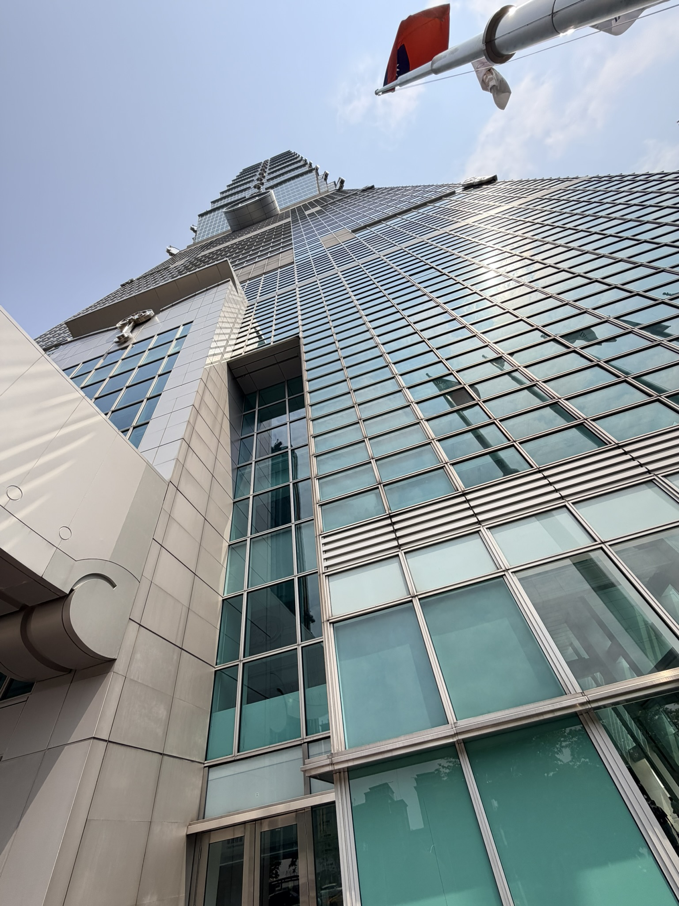

選醫師這件事，我把它當成自己在挑「會幫我自己開刀的同行」。

最後讓我下定決心的，是**廣告裡張醫師提到「許多醫師也都找他做手術」這句話**。

身為醫師，我太懂這句話背後的份量。

> **醫師選醫師，基本上是建立在「信賴關係」上的。**
>
> 每一個醫師心裡都有自己的口袋名單。當一個醫師覺得另一個醫師不錯，背後通常是有一定的信任感——可能是親眼看過他開刀、聽過同學聚會的口碑、或是處理過彼此轉介的病人。

既然有這麼多同行願意把自己的眼睛交到他手上，我想他應該真的非常不錯。

**這種內行人之間的選擇，比任何廣告詞都更有說服力**。

最後決定的就是 **101 遠見眼科的張聰麒院長**。

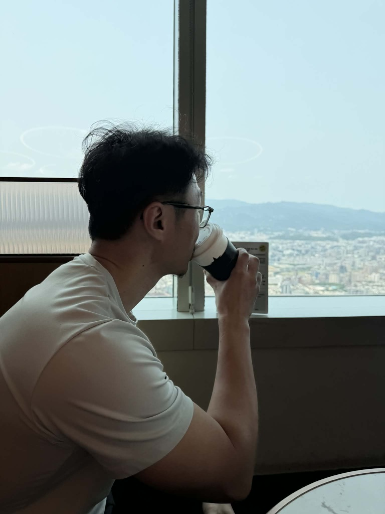

> 診所裡也有免費飲料。84 樓窗景配著等待時的咖啡——奇妙的組合。

---

### **術前檢查：總共去了三次**

這也是我整個流程裡最有感的部分。**LBV 真的把「術前評估」當成手術的一部分在做**，不是那種「進來檢查、隔天就開」的快節奏。

#### **第一次：完整檢查 + 視網膜評估**

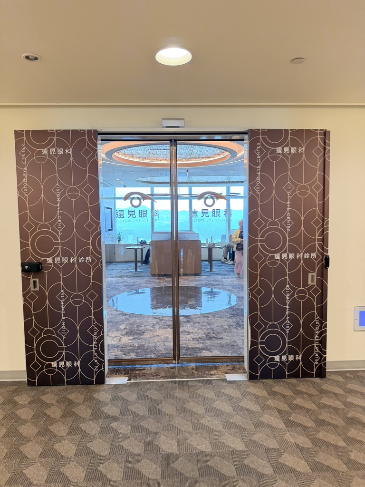

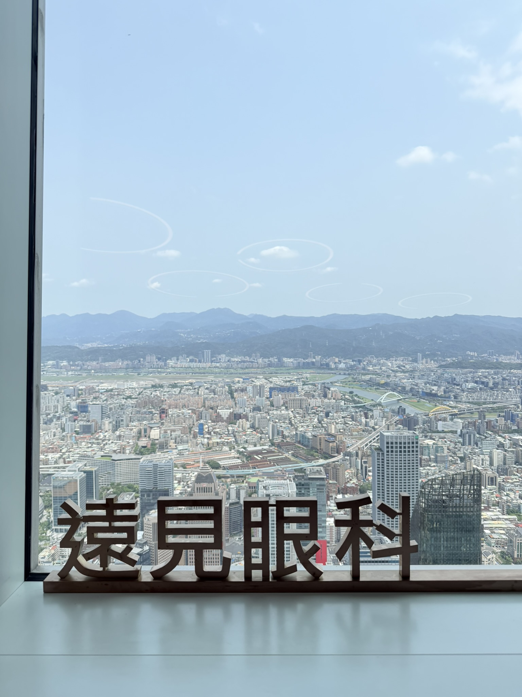

> 第一次踏進遠見眼科診所大門，跟 84 樓窗景：山、河、台北市，全部一覽無遺。

第一次的檢查項目非常完整：視力、屈光、角膜地形圖、像差圖、瞳孔大小、淚液分泌、用眼習慣問卷……一條一條問。

視網膜檢查的重點是：**有沒有小破洞？**

> 因為 LBV 是動「角膜」這個外層結構。如果裡面的視網膜本身有破洞，等到處理完外面的角膜才發現，手術效果會大打折扣。**先把裡面整理好，才能去動外面**。

為了看清楚整片視網膜，那天**點了兩次散瞳劑**確認。檢查還包括**視網膜 CT**——以我的年紀做老花雷射，這是該做的。

結果：一切正常。

#### **第二次回診：複檢 + 諮詢室**

第二次回診基本上是把第一次的項目**重做一次確認**。

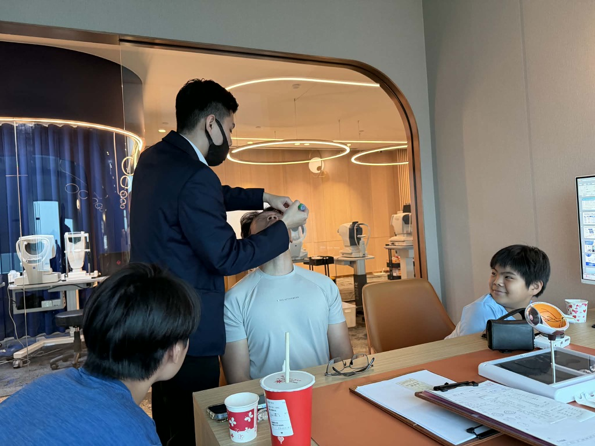

眼睛狀況短期不會大變，但 LBV 是不可逆的雷射，**多確認一次永遠不嫌多**。

#### **乾眼症測試也跑了一次**

這次還加做了**乾眼症測試**——把細細的試紙夾在下眼瞼，等幾分鐘看淚液產量。

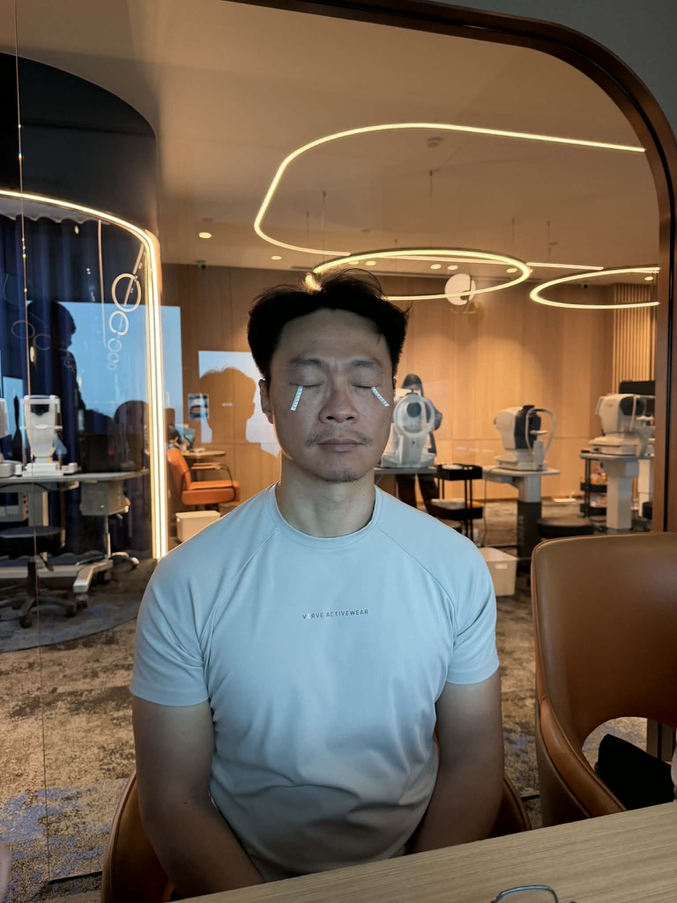

我**左眼比右眼乾一點**，但都還在正常範圍。如果乾眼太嚴重，LBV 是要先處理乾眼才能開的。

#### **諮詢室**

複檢 + 乾眼症檢查跑完之後，會進到**諮詢室**。

諮詢師會用電腦詳細解釋：

- 手術過程會怎麼進行
- LBV 的成像融合原理
- 我這個度數預期的術後效果
- 兩隻眼睛分別會調整成什麼狀態（右眼歸零 / 左眼留 150 度）

整個說明過程不趕，可以一直問。

#### **第三次：手術當天的最後確認 + 模擬眼鏡**

手術當天進去之後，會**再做一次最後檢查**確認狀況。

但**這次最關鍵的是「模擬眼鏡」這個環節**——我覺得這真的是 LBV 的精髓。

> **他們會給你一副「模擬手術後視力」的眼鏡：右邊歸零、左邊 150 度**。也就是你開完刀之後大腦每天看到的世界。

戴上去之後可以走來走去、看遠看近、看手機、看招牌——**先讓大腦試一次**。

如果你戴起來覺得不舒服、無法融合、頭暈想吐——**那就要重新討論術式，不是硬開**。

這個模擬眼鏡步驟在第一次檢查跟第三次手術前都各做一次。我兩次戴起來都很自然，**這時候才真的對自己「會適應」這件事有信心**。

---

### **手術當天那 20 分鐘**

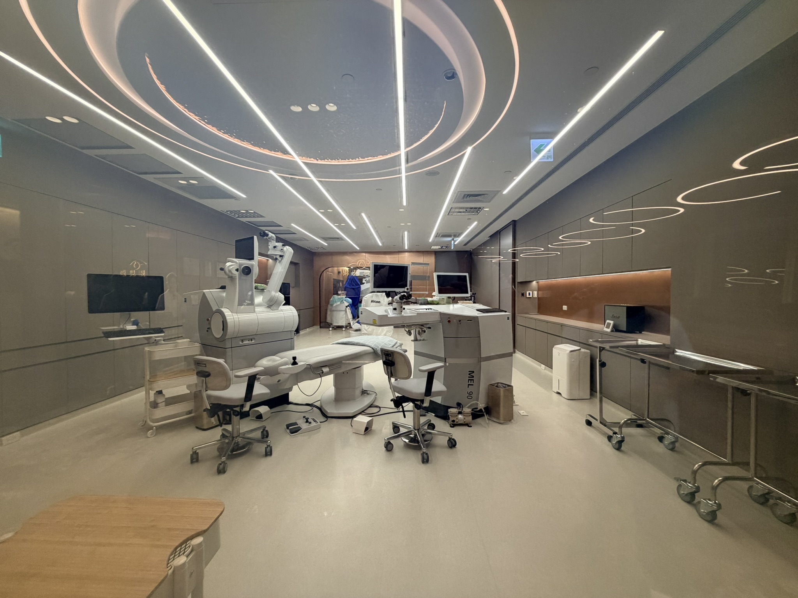

> 從手術室外面玻璃往內拍。最外層的玻璃應該是會自動變霧化的——平常透明、手術時霧化保護病人隱私。

模擬眼鏡確認 OK、最後檢查也都過了，就要進手術室。

我以為自己會很 chill。畢竟急診那麼多場面都見過。

結果躺上去那一秒，**心跳直接拉到 100 多**。

「**原來病人在我們手上的時候，是這個感覺。**」

整個過程其實很快：

1. 點麻藥眼藥水，幾秒就麻掉了。
2. 用**撐眼器**撐開眼皮——雖然有撐著，但**原則上不會痛**。
3. 機器倒數，叫我盯住一個紅點。
4. 雷射打下去，**會聽到一陣「滋滋滋」的聲音**——那是雷射在燒角膜組織。
5. **沒有聞到任何味道**，但**兩隻眼睛瞬間變得霧霧的，像是透過一片髒掉的玻璃看出去**。
6. 換另一隻眼，重複一次。
7. 整個過程大概 20 分鐘以內結束。

走出手術室的時候，視線是霧的，但走到櫃台已經可以看到「離開」兩個字。

那種感覺很奇妙。

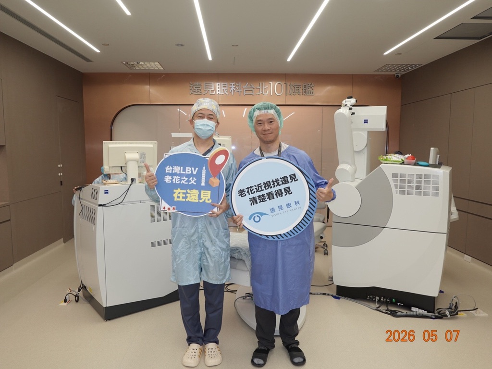

> 手術完跟張院長合照。**2026.05.07**——這天之後我跟眼鏡的關係正式改變了。

---

### **術後第 1 天到第 3 天的真實體感**

我自己邊做邊記錄，今天是術後第 3 天，所以這篇也只能寫到第 3 天版。一個月、三個月版會等大腦完整適應 LBV 的兩眼融合之後再補。

#### **Day 0（手術當天傍晚）**

- 視線像隔了一層薄霧。
- 眩光很明顯，看路燈會看到一圈很大的光暈。
- 眼睛酸澀，像剛哭完。
- 戴著護目鏡睡覺（防止睡著時揉眼）。

#### **Day 1**

- 霧氣退掉一大半。
- **右眼（看遠那隻）已經很清楚**——出門看招牌、看車牌都 OK。
- **左眼（看近那隻）還在霧**，看遠的時候會覺得「咦怎麼有點失焦」。
- 這時大腦會本能地用右眼為主，左眼為輔。
- 點藥水的頻率最高（抗生素、類固醇、人工淚液三種輪番上陣）。

#### **Day 3（今天）**

- **看手機**：拿到正常閱讀距離，左眼負責、看得清。
- **看電腦螢幕**：兩眼合力，沒太大問題。
- **看遠**：右眼為主，路標、招牌、人臉都清楚。
- **夜間**：眩光還在，但比 Day 0 少很多。
- **大腦適應感**：這是最玄的部分——**剛醒來幾分鐘會有兩眼「打架」的感覺，大概 10 秒之後大腦就自動切換**。一整天累積下來，這個切換越來越自動。

不騙人——**前兩天我有一度懷疑自己是不是太衝動了**。

但今天起床那一刻，我突然意識到「我沒有伸手去摸眼鏡」。

那個感覺，值得。

---

### **給考慮做的人的決策清單**

如果你是 40+、開始覺得老花干擾工作、又不想一輩子戴漸進多焦鏡——以下是我自己走過一遍之後會給你的清單。

#### **第一關：你適不適合？**

- 角膜厚度夠不夠（術前檢查會告訴你）
- 沒有嚴重乾眼、圓錐角膜、青光眼、視網膜病變
- 度數穩定（近兩年沒大幅變化）
- 心理上能接受 LBV 兩眼分工融合的概念（不是兩眼都調成一樣）

#### **第二關：怎麼挑醫師、挑機構**

- 儀器要對應你要做的術式（LBV 要 Zeiss 系統）
- **術前檢查只做一次的要小心**——標準應該是 2-3 次回診，包含視網膜評估、複檢、手術當天的最後確認
- **要有「模擬眼鏡」讓你實際試戴**——這是 LBV 不可省略的步驟
- 醫師願意花時間講清楚每個方案的優缺點，不是只推自己最賺的那個
- 補強雷射的政策（術後度數沒到位要再修，誰負擔？）

#### **第三關：術前一定要問的幾題**

1. 我這個眼睛條件適合哪幾種術式？各自的優缺點？
2. LBV 的左右眼度數差會配多少？我的工作型態適合嗎？
3. **可不可以先戴模擬眼鏡實際試試手術後的視覺？**
4. 視網膜檢查會做嗎？包含散瞳跟視網膜 CT？
5. 術後預期的近視/老花殘餘度數？
6. 夜間眩光、暈光的機率？多久會穩定？
7. 補強雷射的政策？費用？時程？
8. 術後追蹤節點（1 週、1 月、3 月、半年、1 年）？

#### **第四關：心理準備**

- **適應期 1-4 週是常態**，不是出問題。
- 前 1-2 週看近會吃力、晚上眩光、眼睛容易酸——這都是正常的。
- 真的劇痛、視力突然下降、紅腫加重——立刻回診，不要忍。

---

### **暫時的結論（還會更新）**

**會推薦同行做嗎？**

如果是術後第 3 天的我來回答——**會，但要找對的醫師、做對的術式、做好心理準備**。

雷射這件事不是「做了就一勞永逸」，它是「**用一段適應期換掉一個你已經習慣多年的視覺習慣**」。

代價有，但對的人收穫更大。

等到術後一個月、三個月之後，我會再回來補一篇。那才是 LBV 兩眼融合真正穩定的樣子。

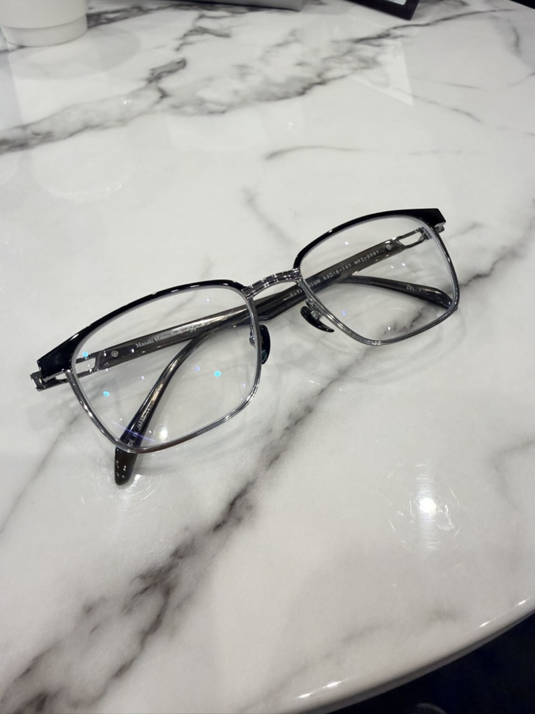

> 戴了大半輩子的眼鏡，這次換它退役。

到時候再見。

---

> *本文僅為個人經驗分享，不構成醫療建議。每個人的眼睛條件不同，是否適合手術、適合哪一種術式，請以正式眼科檢查與專業醫師評估為準。*
