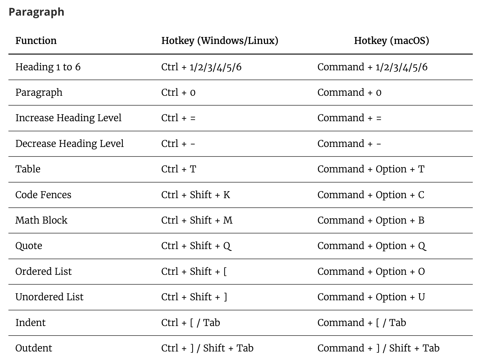
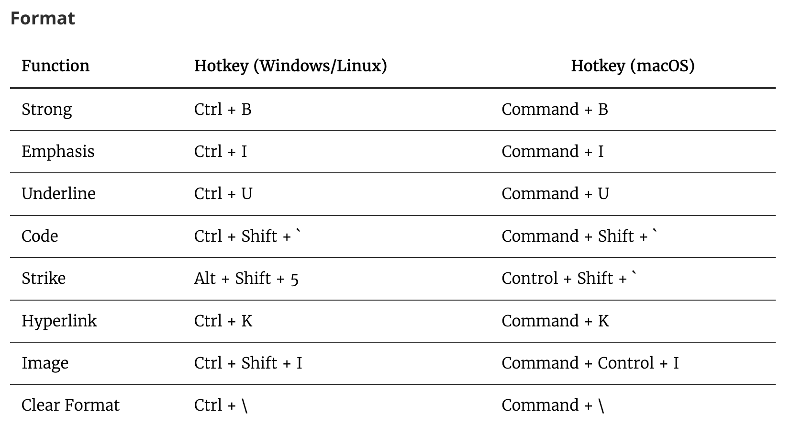
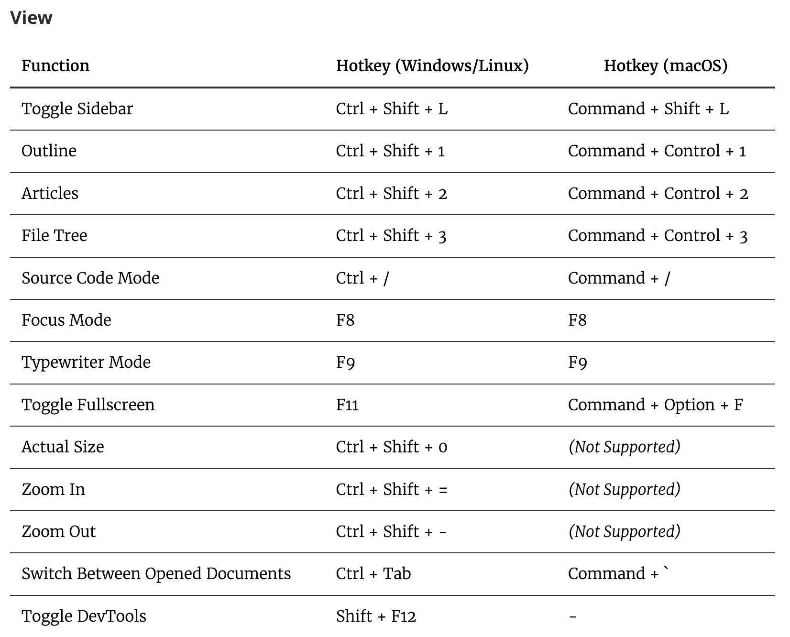

# How to Create Static Site Posts with Hugo

## Prerequisites

First, a few things need to be in place:

- Install [Xcode](https://apps.apple.com/tw/app/xcode/id497799835?mt=12) on your Mac (**Windows probably doesn't need it? I don't know about that**)
- Use Homebrew to install Hugo from the Mac Terminal
- Already have an account set up on [GitHub](https://github.com/)
- Install VS code and typora
  - [VS code](https://code.visualstudio.com/) lets you write markdown code directly
  - [Typora](https://typora.io/#feature) turns your writing straight into markdown format (**sort of a WYSIWYG concept**)➔writing posts in this is way more comfortable than in VS code😌
    - When you insert an image in Typora, **just right-click on the image to change its size**
- Already picked out, from the [Hugo theme](https://themes.gohugo.io/) gallery, the theme you want to use and modify
  - Download the theme so you can open and run it on your own computer

Once the above is done, you're mostly there～～～

Next, depending on each theme, customize it to your own needs!!!! (**Not required, but for someone with OCD like me, I'm definitely changing things**)

Here I have to strongly recommend teacher 古君葳's course [Free Site Building with Github! Easily Build Your Personal Brand](https://hahow.in/courses/5de8fec16117240026540b9c/discussions?item=5e6edc23024d690024e4086b) (in Chinese) <!-- keep-zh -->


---

## Basic Markdown Format for Posts

- My theme comes from [here](https://themes.gohugo.io/themes/hugo-clarity/) (**all the changes below are based on this theme**)

Create a markdown file (*.md) yourself in exampleSite/content/post

The format a normal post needs (as for **the very top of each Blog markdown post, use --- and --- as the top and bottom boundaries**)

### Markdown syntax every post must include:

```markdown
---
title: "Syntax for Building a Site with Hugo" # Enter this post's title
date: "2024-01-12" # Enter the date
description: "Hugo" # No idea at all when this ever shows up
featured: true # If set to true, the post is set as a featured post
draft: false # If false it's published right away, not run in draft mode
toc: true # Auto-generate a TOC
featureImage: "/images/HUGO.png" # Sets this post's featured image on the home page
thumbnail: "/images/HUGO.png" # Each post's thumbnail lives here (static/images/)
codeMaxLines: 10 # Override global value for how many lines within a code block before auto-collapsing.
codeLineNumbers: true # Override global value for showing of line numbers within code block.
figurePositionShow: true # Override global value for showing the figure label.
categories:
  - ECG
  - Ultrasound
  - ER Life
  - Weight Training
  - Self-Study
tags:
  - Hugo Tips
  - Coding
  - Hugo Site Building
---
```

Then just write the post content below that.

## Which Shortcodes Are Supported?

I've listed all the ones I use regularly~~~~

Youtube

Twitter(X)

Google Maps

Xmind Pro

Podcast

IG: **currently removed; it can only be used after a convoluted set of steps** (spent forever researching it, finally gave up😅)

---

**First, add one line of magic spell to config.toml under exampleSite/config/_default:**

```markdown
unsafe = true
```

Adding this line turns on Hugo's ability to run html written inside Markdown. After that, just paste in the embed html code and it runs directly!!!! Sweet~~~

---

### <u>Youtube</u>: **Click Share, then click Embed, and the embed code shows up**

<iframe width="1000" height="500" src="https://www.youtube.com/embed/tnFqEtjnZtc?si=63vM3e76jCOZ9n-4" title="YouTube video player" frameborder="0" allow="accelerometer; autoplay; clipboard-write; encrypted-media; gyroscope; picture-in-picture; web-share" allowfullscreen></iframe> 

To embed a Shorts video, just put the code at the end of the Shorts URL after embed/


### <u>Twitter</u>: **Take the one below as an example**

https://x.com/smithECGBlog/status/1745156040159559767?s=20

We have to enter

{ {< tweet user="smithECGBlog" id="1745156040159559767" >} } ➔only then does the twitter post show up




### <u>Google Maps</u>: Share, then click Embed a map

<iframe src="https://www.google.com/maps/embed?pb=!1m18!1m12!1m3!1d15137.161444341695!2d138.7588886404021!3d35.52442597487377!2m3!1f0!2f0!3f0!3m2!1i1024!2i768!4f13.1!3m3!1m2!1s0x60195e52526915f9%3A0x1a967cee111ec37d!2z5rKz5Y-j5rmW5qWT6JGJ6L-05buK!5e0!3m2!1szh-TW!2stw!4v1705064902034!5m2!1szh-TW!2stw" width="600" height="450" style="border:0;" allowfullscreen="" loading="lazy" referrerpolicy="no-referrer-when-downgrade"></iframe>


### <u>Xmind Pro</u>: Click Share to get the embed code

I'm sharing one of my own mind maps as an example.

<iframe src='https://www.xmind.app/embed/EDpQRw/' width='1200' height='600' frameborder='0' scrolling='no' allowfullscreen="true"></iframe>


### <u>Podcast</u>: Copy the link in Apple Podcasts, search it on the web, and it takes you to the episode's web page; then click Share and you'll see the embed link


<iframe allow="autoplay *; encrypted-media *; fullscreen *; clipboard-write" frameborder="0" height="175" style="width:100%;max-width:660px;overflow:hidden;border-radius:10px;" sandbox="allow-forms allow-popups allow-same-origin allow-scripts allow-storage-access-by-user-activation allow-top-navigation-by-user-activation" src="https://embed.podcasts.apple.com/tw/podcast/episode-92-marine-ingested-poisons-and-infections/id1514052567?i=1000641060189"></iframe>

---

### You can insert PDF files




---

## What Markdown Text Formats Are There?

### Changing font color

`Red text` ➔ press ``

**Bold text** ➔ press CMD+B 

<u>Underline </u>➔ press CMD+U 

*Italic text* ➔ press CMD+I 

[Hyperlink ](https://agoodbear.com/)➔ press CMD+K 

~~Strikethrough ~~➔ press Control+Shift+&#96; 

<mark>Color you can paint with</mark> ➔ pressing CMD+Shift+H in Typora doesn't work. = =text= = only highlights text successfully in html, but in markdown you have to type < mark >text < mark > to get the highlight

- **The fix➔first highlight the text in typora (CMD+shift+H), then go into VS code, search for the < mark > characters in that post, and replace them with < mark >, and you're done**

<span style="background-color: #b0b07d">Marked text</span>➔you can pick using a [color picker](https://g.co/kgs/ALoDQzd)

<mark style="background-color: lightblue">Marked text</mark>➔you can also pick from a [common color chart](https://www.ifreesite.com/color/web-color-code.htm)

You can [generate gradient colored text](https://www.ifreesite.com/colorfont/) : <font color="#BD2E1B" size="3">Generating</font><font color="#AA6334" size="6"> gradient</font><font color="#081B4D" size="3"> colored</font><font color="#6CD4EC" size="7"> text</font><font color="#323798" size="4"> is</font><font color="#584118" size="4"> very</font><font color="#276676" size="4"> easy</font><font color="#4A62B4" size="2"> to</font><font color="#D946CD" size="6"> do</font>

> Blockquote ➔ press ⌥+CMD+Q

```
Remember to set codeLineNumbers: false and it shows an all-black background ➔ type ``` above and below the text (then you can enter which language you want, e.g. markdown)
```

### Tables (filled background color)

{}

You can write some key points here

{}


{}

You can write some key points here

{}


{}

You can write some key points here

{}


{}

You can write some key points here

{}


{}

- You can write some key points here
  - You can write some key points here

```
You can write some key points here
```

{}


**You can type tables directly**

| Cell one | Cell two | Cell three |
| ------ | ------ | ------ |
| 1      | 2      | 3      |


### **You can cite articles**➔let's see how it looks with an example

Dr. Smith says the 4 variable formula can be applied to the DDx between Subtle Ant.STEMI and early repolarization [^1] 


### Ordered list (**after typing 1. you need a space**)➔`can be indented`

1. Test
2. Test
3. Test

### Unordered list (**after typing - add a space**)➔`can be indented`

- Test
- Test
- Test

### Other: superscript, subscript

H<sub>2</sub>O

X<sup>n</sup> + Y<sup>n</sup> = Z<sup>n</sup>

### Checkbox

- [ ] uncheck

- [x] check

### Typora's common keyboard shortcuts








[^1]: Dr. Smith's ECG Blog: 12 Example Cases of Use of 3- and 4-variable formulas, plus Simplified Formula, to differentiate normal STE from subtle LAD occlusion - [link](https://hqmeded-ecg.blogspot.com/2017/11/12-cases-of-use-of-3-and-4-variable.html)
