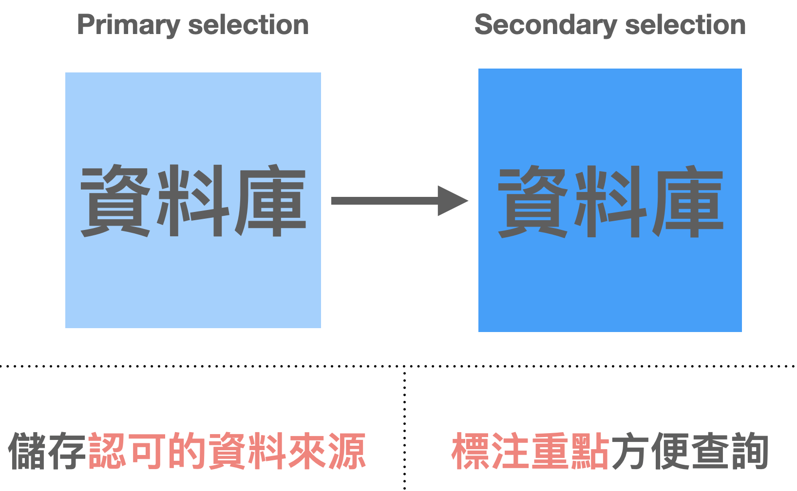
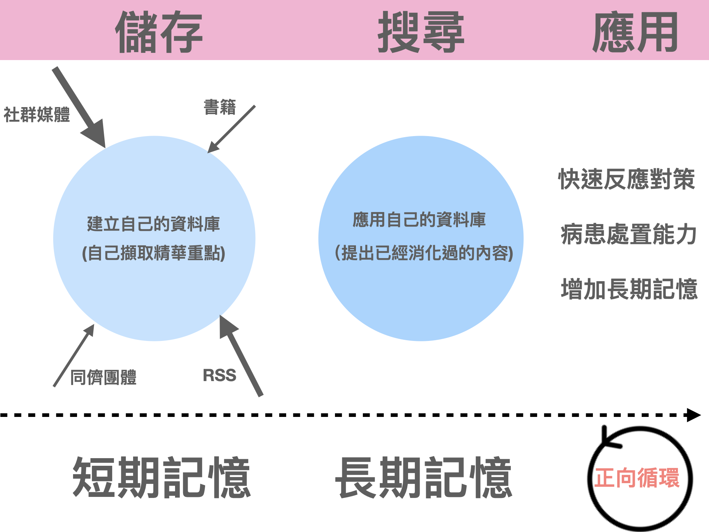
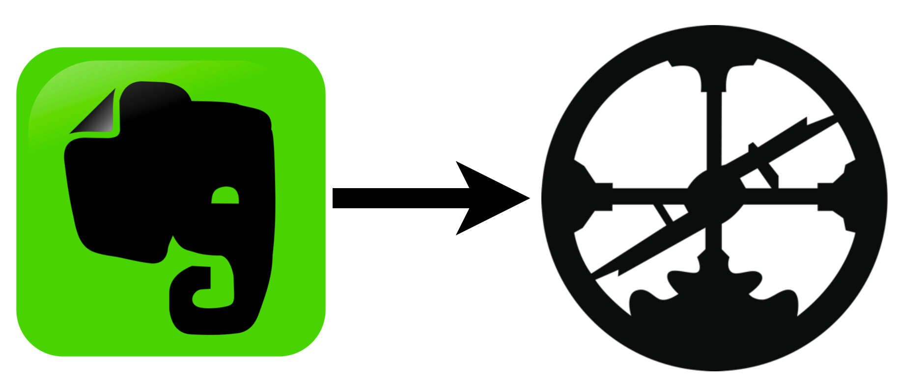

## My **note-taking knowledge base (second brain)**

A long time ago I used Evernote as my second brain. Later I realized I was using Evernote Clip to grab web pages and save them as read it later.

But all that did was turn a bigger garbage heap (Big data) into a smaller garbage heap (Small Big data)😅. Bottom line, it was all still garbage.

Why would I end up treating these articles — ones I considered important knowledge — as garbage? Because <mark>there were so many of them; if I don't sort through them and don't describe the article again in my own words after understanding it, then that article has no value to me whatsoever<mark>.

For the knowledge in a database, we usually run it through one round of primary selection first, then save it into the database.

What is primary selection? It means first pulling the information we trust into the database.

What counts as trusted information depends on whose giant shoulders we want to stand on!!!!

For example, I'm especially interested in ECG recognition, so the articles I collect should come from the world's recognized masters.

For example, **Smith ECG's Blog**, **Amal mattu's ECG Weekly**, and so on.

When we save content from these trusted websites, videos, and tweets into our database (read it later), that's doing primary selection.

<mark>Then you close-read these articles, pull out the key points, and write them into the database in your own words. That's secondary selection, and it's the most important step<mark>.

Once you've reached secondary selection, it means material you've digested yourself is now in the database. At that point, use the database program's search to pull up the content you've already digested and put it to use.

Storage is short-term memory. When we keep finding content we digested before through search, it deepens the impression and forms long-term memory. When we apply that long-term memory to whatever we want to work on — writing a Blog post, say, or caring for patients clinically — it creates a positive feedback loop.

---

Starting around 2020, I moved my database from Evernote to [Roam research](https://roamresearch.com/)

Right now almost all my primary selection sources can be dumped into Roam research.

During primary selection, sometimes inspiration strikes out of nowhere.

瓦基's online course, [Zettelkasten Note-Taking in Practice](https://www.pressplay.cc/project/148B74E70523C7A7E260484F9B6825CB/about#act=auto-follow) (in Chinese), covers the concept of inspiration notes. <!-- keep-zh -->

Inspiration is often a split-second thought. In my experience, if I don't write it down right away, by the time I look back (maybe 10 minutes later, maybe 1 hour)...... I've already forgotten what I was thinking.

So <mark>recording is a really important step<mark>.

## **Here are the methods I use to record inspiration:**

1. The Readwise mobile App
2. The Roam mobile App
3. Speak to Roam

---

<figure>
<video autoplay muted loop playsinline preload="metadata" poster="/videos/study-post-2/jvb083-poster.jpg" aria-label="Readwise mobile App" style="max-width:100%;border-radius:8px"><source src="/videos/study-post-2/jvb083.mp4" type="video/mp4"></video>
</figure>

The nice thing about the Readwise mobile App is that it can OCR printed books you're looking at directly. Take a photo, OCR the important text, and then you can Export it into Roam.

<figure>
<video autoplay muted loop playsinline preload="metadata" poster="/videos/study-post-2/i44dqg-poster.jpg" aria-label="Roam mobile App" style="max-width:100%;border-radius:8px"><source src="/videos/study-post-2/i44dqg.mp4" type="video/mp4"></video>
</figure>

One of the features at the very bottom of the Roam mobile App is Quickcapture: you just type, and it goes straight into the Roam graph you specify.

<figure>
<video autoplay muted loop playsinline preload="metadata" poster="/videos/study-post-2/cps50r-poster.jpg" aria-label="Speak to Roam" style="max-width:100%;border-radius:8px"><source src="/videos/study-post-2/cps50r.mp4" type="video/mp4"></video>
</figure>

Speak to Roam is, in my opinion, the best inspiration-capture tool to come along recently. It was developed by one of the programmers at the company that makes Roam.

[The file is here](https://www.icloud.com/shortcuts/9280597747c543eab39dd65d4aebd992)

**iOS only**. The tool runs through an iOS Shortcut: just tap the shortcut on your Mac or iPhone or Apple watch and start talking. It then converts what you say from speech to text and saves it straight into Roam.

The way I use it: when I'm strength training with AirPods in and some inspiration suddenly hits, I tap the shortcut on my Apple watch and just start talking.

If what I say runs more than 50 characters, Speak to Roam produces two blocks of text in Roam.

The first is the raw data: the full speech-to-text transcript of what I said.

The second: for long text, Speak to roam calls ChatGPT to give a precise summary of what I said (you can set the Prompt yourself)

Speak to Roam is a huge help for capturing inspiration.

If you're interested, give it a try~~
