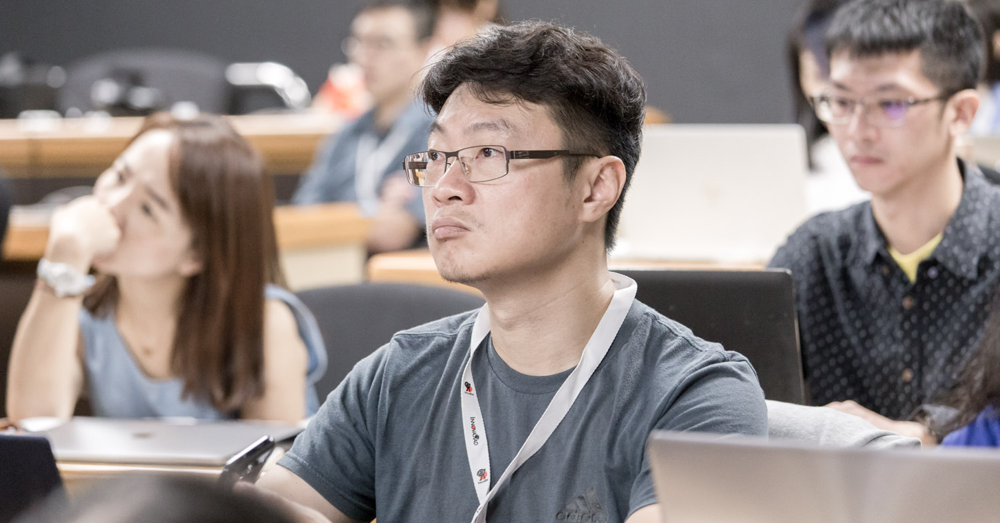

This is the write-up I did after attending InnovaRad's Figures and Figure Legends Workshop in September 2019 ([originally posted on their official site](https://figure.innovarad.tw/jhtsao/)).

---

**<u>Author: Dr. Tsao Jian-hsiung, Department of Emergency Medicine, NYCU Hospital (National Yang Ming Chiao Tung University Hospital)</u>**

# **The landmine maker tells you how to dodge the landmines.**

 

Whatever field you're in, there's one way to make huge leaps: follow the right teacher, walk behind someone strong. A strong person can tell you straight up about every landmine they've stepped on — whether it's square or round, how much explosive is inside, how high it can blow you — every last detail.

 

What makes the strong strong is not only that they've been hit hard themselves, but that they're now landmine makers too (reviewers). Principal Tsai (Dr. I-Chen Tsai, founder of InnovaRad) is a heavyweight in medical imaging and a reviewer for international journals. So he walked us through every little nook and cranny you might run into, first-person, from a reviewer's point of view: which imprecisions can make a reviewer "unhappy" and end up getting you rejected.

  

# **You think reviewers savor every word. Actually, they flip through it in their spare moments.**

 

Before the workshop, I really thought reviewers read submissions carefully, savoring them word by word. That's not how it works. The main-force reviewers who handle the biggest review loads mostly use the "most useless" spare time in their lives — they absent-mindedly pull your paper out of their pocket and give it a 5-minute taste.

 

With so many submissions, in those 5 short minutes of a short life, unless your paper truly has extraordinary flavor and wins the reviewer's stomach, you have to use your figures and tables to catch their eye, so the reviewer accepts that your figures were made by an insider. Only once they accept you as an insider does your paper stand a chance of surviving instead of getting rejected.

 

# **Why figures and figure legends matter**

 

Why does figure and table formatting matter so much? The course explained this too: from a reviewer's point of view, suggestions about images are hard to put into words, while text is relatively easy to comment on. So if your figures don't cut it, in principle you go straight to the losers' bracket.

 

Principal Tsai also gave some direction on the order of producing something like a case report. We used to always write the text first, then lay the images on top. Principal Tsai recommends making the figures first, telling yourself what kind of story they tell, and then laying the text on top.

 

# **Let the reviewer tell you what matters**

 

The most anticipated part of the workshop was Principal Tsai, from his perspective as a reviewer, pointing out what to watch for so that medical imaging submissions meet academic standards.

 

Right at the start he made it clear: don't do what you shouldn't do (deception, fabrication), and don't bury your academic career for short-sighted gains. The class also demonstrated which kinds of image edits meet academic standards — adjusting brightness or contrast is acceptable, but "local" additions / removals are not allowed.

 

The class taught a lot of key points, including choosing the image in the first place, full-frame adjustment, optimizing the key area, and telling the story based on the labels. You can't skip any of them; only by doing all four do you get images that truly catch a reviewer's eye.

 

# **Follow the strong one and learn every checkpoint.**

 

Picking up from the previous session, the course went on to the finishing touches that make an image pop, and explained what arrowheads, arrows, text, and labels mean visually. These details seem trivial, but they really are the first stage a reviewer uses as the reject boss.

 

Honestly, without taking Principal Tsai's class, I think very few people would ever be actively taught this part in clinical academia. Afterwards, Principal Tsai gave us his all-purpose template — which is basically him telling us to follow the strong one.

 

# Polishing every detail one by one

 

The afternoon sessions moved into hands-on practice, and Principal Tsai provided two practice templates. Following the workshop's interactive hands-on martial-arts manual, we started training.

 

Take the image, crop it, enlarge it proportionally, and align comparison images. Then correct the image. For text boxes, choose Arial bold at an appropriate size. Use arrowheads, arrows, and asterisks on the image; arrowheads and arrows should look the same size, and the arrow needs its width adjusted (arrow : arrowhead is about 2 : 3), and there are plenty more secrets I haven't written here!

 

This is Principal Tsai's winning formula that gives him an accept rate as high as 80% at *AJR*, where the accept rate is 10% — all we can do is hold the martial-arts manual and worship and practice it a few more times. The class taught many more key points about images that I haven't fully written up here. I think getting blessed in person by Principal Tsai, who has had more than 500 images accepted in SCI journals, is way more fun than reading my notes!