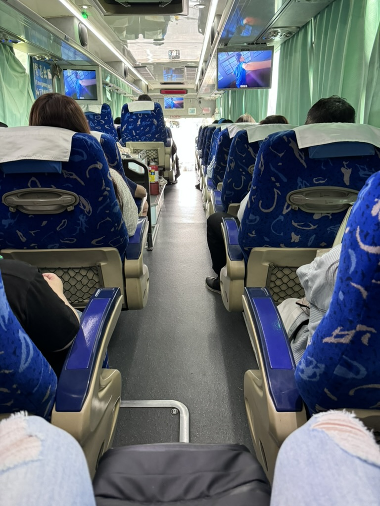
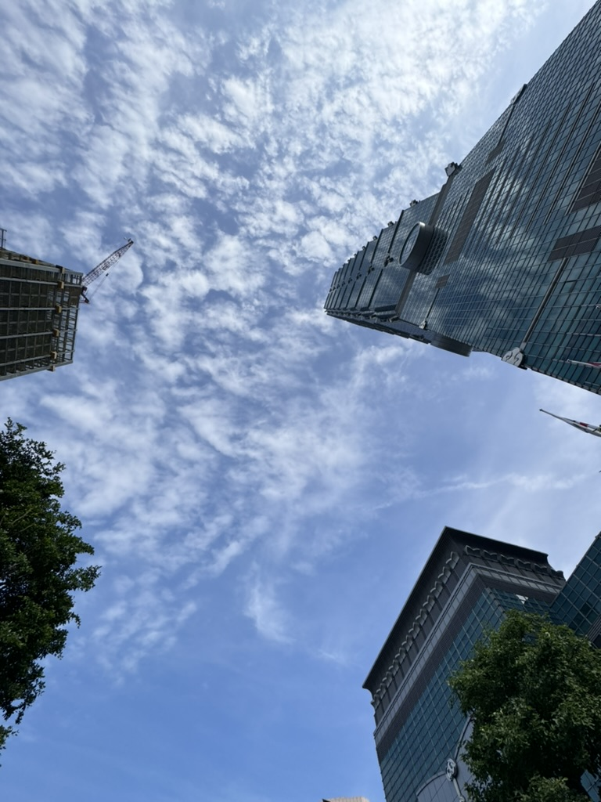
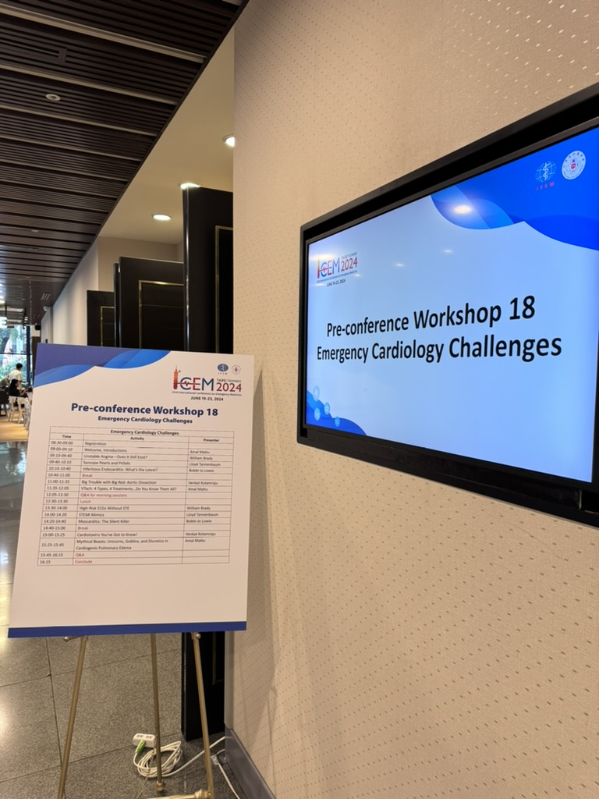
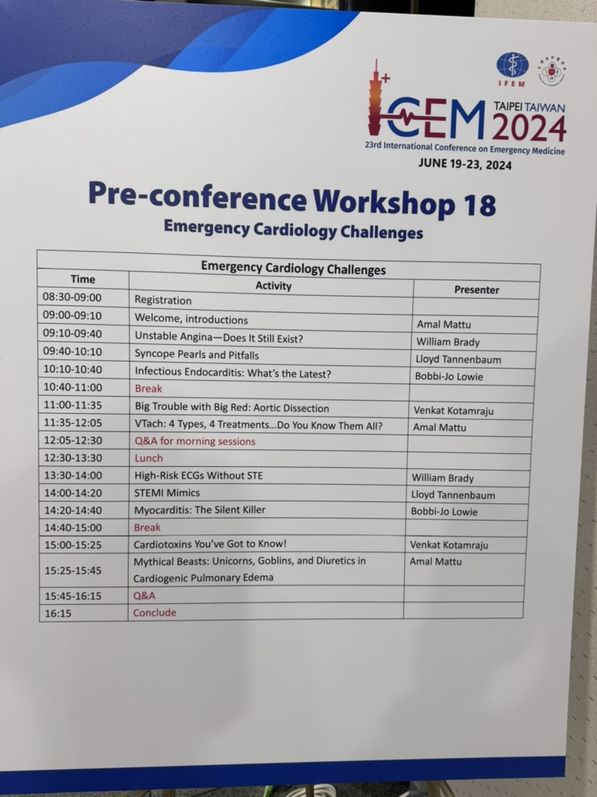
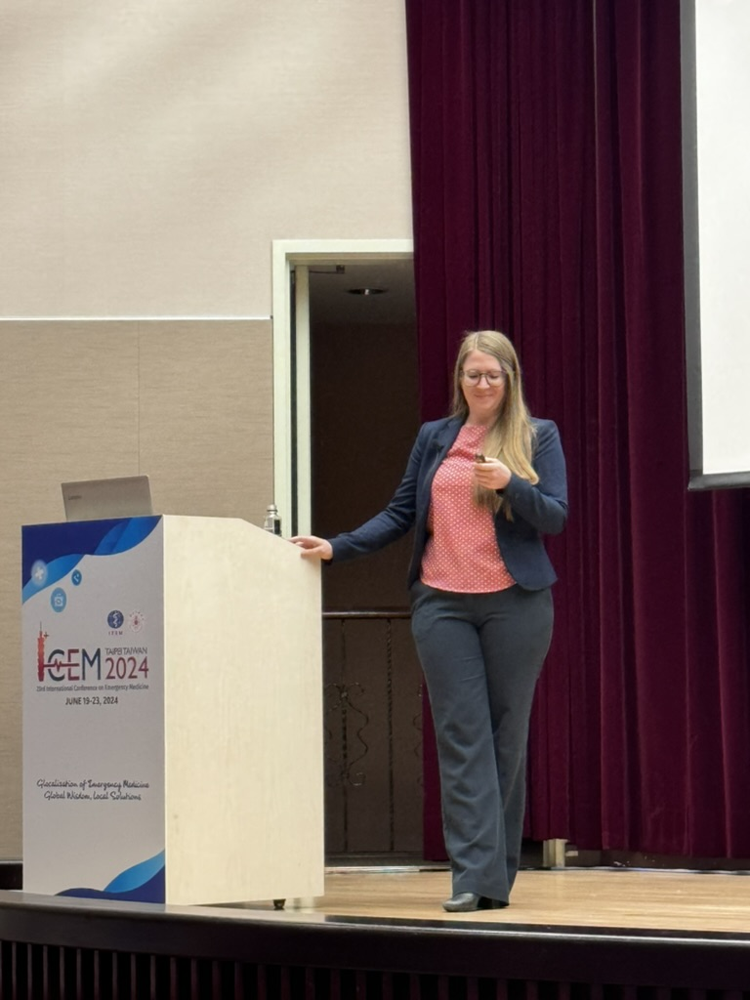
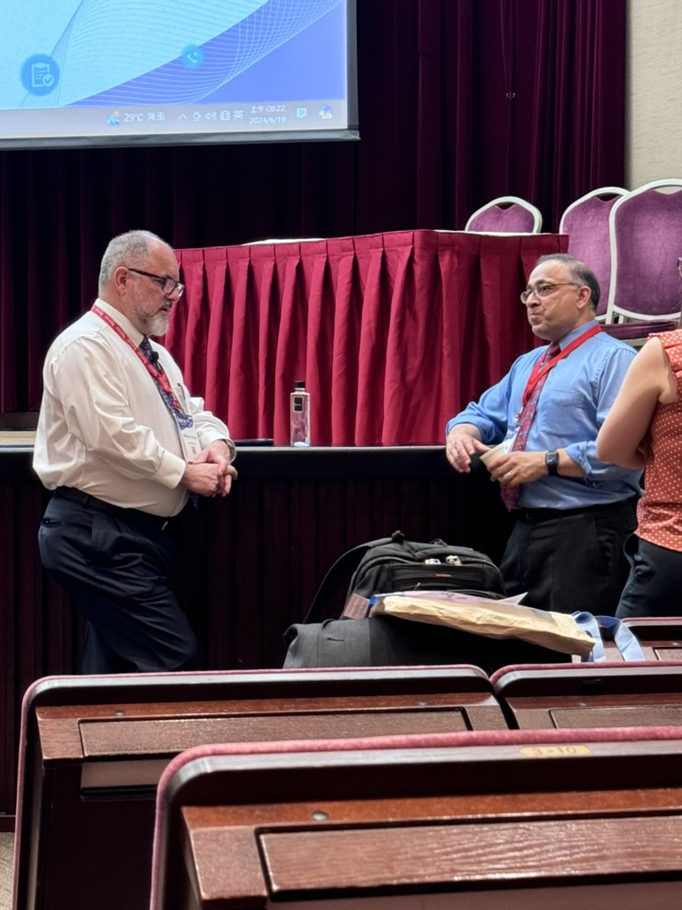
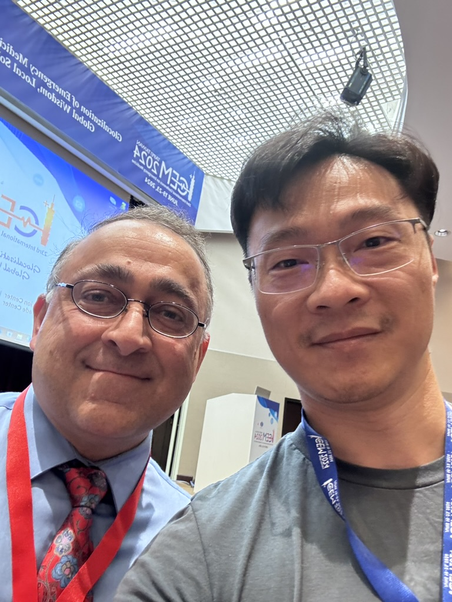
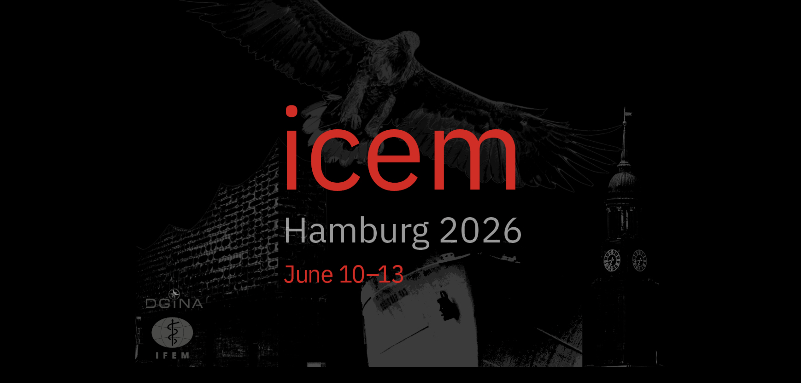

Early on June 19, 2024, I hopped on the Kamalan bus across the street from my hospital and headed to the Taipei International Convention Center for class

A blazing sunny day~so hot 

The moment I stepped into the convention center, pure relief~so cool in here!!

Before ICEM2024 officially kicked off, I went to a pre-conference workshop, specifically on Emergency Cardiology.

They brought in the ECG master I've admired for so long: **Amal mattu**

The master Amal handled both the moderating and the opening~~

Amal chatting with William Brady before the session

After the first half of the first session, I went up and took a selfie with my big idol❤️❤️❤️

And while I was at it, I grabbed two of Amal's books off my bookshelf for him to sign

---

### Where's the next ICEM2026?

There's also an interview video with Amal mattu at ICEM2024 here:

<iframe width="560" height="315" src="https://www.youtube.com/embed/S9PBZAlU7P8?si=sueva1WwhUutt0og" title="YouTube video player" frameborder="0" allow="accelerometer; autoplay; clipboard-write; encrypted-media; gyroscope; picture-in-picture; web-share" referrerpolicy="strict-origin-when-cross-origin" allowfullscreen></iframe>

### **Bear's photo album**


















